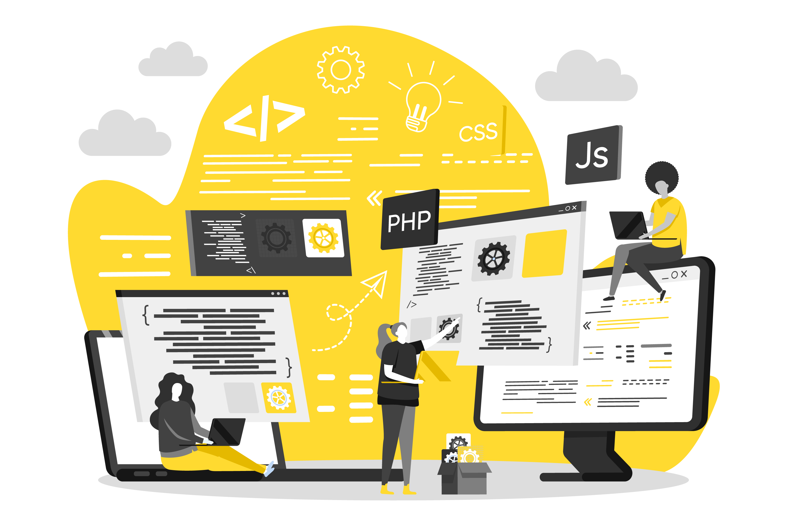
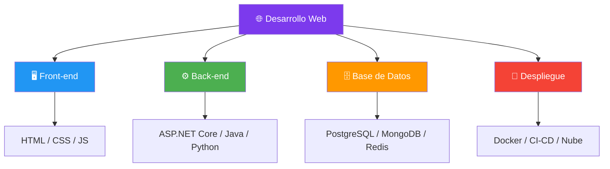
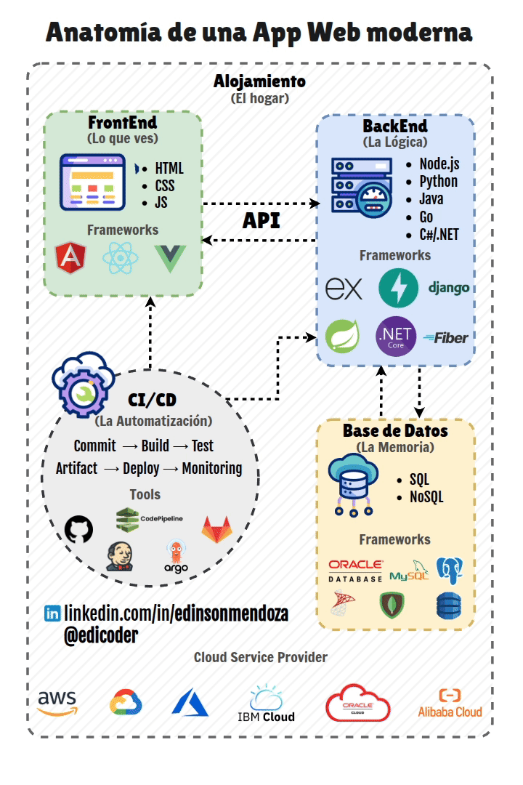
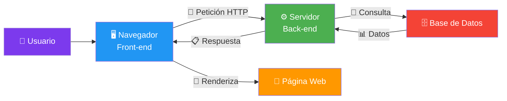
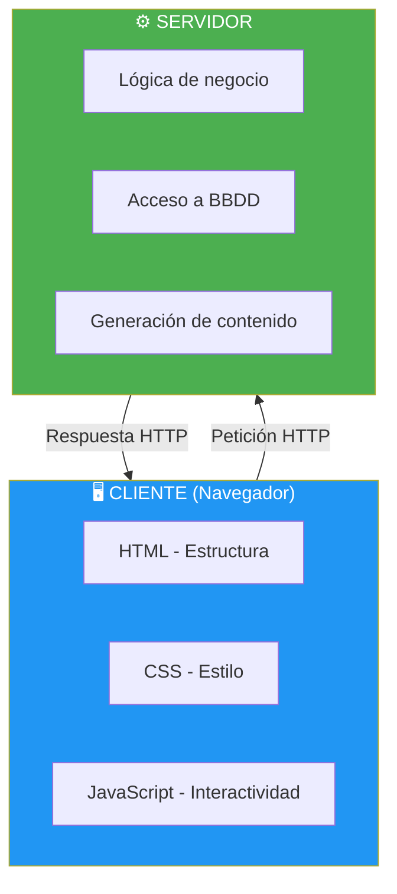
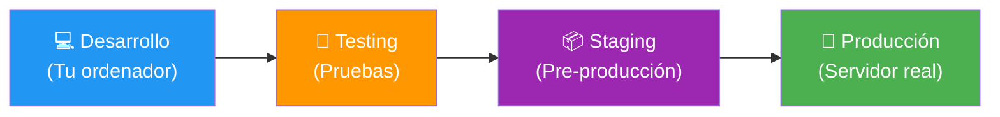

- [1. Introducción al Desarrollo Web en Entorno Servidor](#1-introducción-al-desarrollo-web-en-entorno-servidor)
  - [1.1. El Desarrollo Web Actual](#11-el-desarrollo-web-actual)
  - [1.2. Front-end y Back-end: Los Dos Lados de la Moneda](#12-front-end-y-back-end-los-dos-lados-de-la-moneda)
  - [1.3. Modelos de Ejecución de Código](#13-modelos-de-ejecución-de-código)
  - [1.4. El Despliegue: Del Desarrollo a la Producción](#14-el-despliegue-del-desarrollo-a-la-producción)


# 1. Introducción al Desarrollo Web en Entorno Servidor

> 💡 **Punto de partida:** ¿Alguna vez has pensado lo que pasa cuando le das al botón de "Enviar" en un formulario web? ¿O cómo es posible que puedas ver tu perfil en Instagram, comprar en Amazon o ver una película en Netflix desde cualquier dispositivo? Detrás de estas acciones aparentemente simples, hay un complejo ecosistema de tecnologías que hacen posible la experiencia web moderna. Este módulo es el que te enseña a construir esa parte "invisible" que hace que todo funcione.

En este tema aprenderás qué es el desarrollo web en entorno servidor, cómo se estructura una aplicación web y cuáles son las tecnologías que lo hacen posible.

**Objetivos de aprendizaje:**

- Comprender qué es el desarrollo web en entorno servidor
- Distinguir entre Front-end y Back-end
- Entender los modelos de ejecución de código en cliente y servidor
- Conocer qué es el despliegue y por qué es importante

## 1.1. El Desarrollo Web Actual

El desarrollo web moderno es un campo en constante evolución que abarca la creación y mantenimiento de sitios web y aplicaciones que operan a través de Internet. Pero no es solo cuestión de funcionalidad: hay que pensar en **despliegue**, **escalabilidad**, **seguridad** y **rendimiento**.





📌 **Ejemplo real:** Cuando abres Netflix y seleccionas una película, tu navegador envía una petición a los servidores de Netflix. El servidor consulta bases de datos con millones de registros de usuarios, catálogos y preferencias. Genera una respuesta personalizada y te la devuelve en milisegundos. Todo esto ocurre en el **entorno servidor**.

Los principales objetivos del despliegue son garantizar la **accesibilidad**, la **estabilidad**, la **escalabilidad** y la **seguridad** de las aplicaciones:

| Objetivo | Descripción | Ejemplo |
|----------|-------------|---------|
| **Accesibilidad** | La app está disponible para todos los usuarios | Netflix funciona en 190 países |
| **Estabilidad** | La app no cae ni tiene errores graves | Amazon tiene 99.99% de uptime |
| **Escalabilidad** | La app crece con la demanda | Black Friday: Amazon triplica tráfico |
| **Seguridad** | Los datos de los usuarios están protegidos | HTTPS, encriptación de contraseñas |

> 📝 **Nota:** El despliegue no es solo "subir" la aplicación a un servidor. Es un proceso estratégico que incluye configuración, pruebas, monitorización y documentación. Un buen despliegue puede marcar la diferencia entre el éxito y el fracaso de una aplicación.

> 💡 **Consejo:** Para el examen, recuerda que el **despliegue** es el puente entre el desarrollo y la producción. Conoce bien sus objetivos: accesibilidad, estabilidad, escalabilidad y seguridad.

> ⚠️ **Advertencia:** Nunca despliegues a producción sin pasar por entornos de prueba (staging, testing). Los errores en producción pueden ser costosos.

> 💡 **Analogía — La Mudanza:** Imagina que el **desarrollo** es como construir muebles a medida en tu taller. El **despliegue** es el proceso de empaquetar esos muebles, transportarlos a la nueva casa, montarlos y dejarlos listos para que la familia los use. De nada sirve un mueble precioso si se rompe en el camión o si no cabe por la puerta.

## 1.2. Front-end y Back-end: Los Dos Lados de la Moneda

La lógica de una aplicación web se divide en dos entornos principales, cada uno con responsabilidades específicas:

| Aspecto | **Front-end (Cliente)** | **Back-end (Servidor)** |
|---------|------------------------|------------------------|
| **Dónde se ejecuta** | En el navegador del usuario | En el servidor web |
| **Tecnologías** | HTML, CSS, JavaScript | C#, Java, Python, PHP |
| **Responsabilidad** | Interfaz visual, interactividad | Lógica de negocio, datos |
| **Ejemplo** | Validar que un campo no esté vacío | Guardar un usuario en la BBDD |





📌 **Ejemplo real:** Cuando abres Instagram:
1. Tu navegador (Front-end) descarga HTML, CSS y JavaScript
2. JavaScript hace peticiones asíncronas al servidor de Instagram (Back-end)
3. El servidor consulta la base de datos con tus fotos, likes y seguidores
4. Devuelve los datos en formato JSON
5. JavaScript los renderiza en tu pantalla sin recargar la página

> 📝 **Nota:** La división Front-end / Back-end es fundamental. El Front-end se ejecuta en el navegador del cliente, el Back-end en el servidor. JavaScript es el puente entre ambos mundos.

> 💡 **Consejo:** Distingue claramente:
> - **Front-end**: HTML, CSS, JavaScript → Se ejecuta en el navegador
> - **Back-end**: C# / ASP.NET Core, Java, Python → Se ejecuta en el servidor

> ⚠️ **Advertencia:** Las validaciones en el cliente son para mejorar la experiencia de usuario (UX), **NO** para seguridad. Siempre valida también en el servidor. Un atacante puede desactivar JavaScript y enviar datos maliciosos directamente al servidor.

> 💡 **Analogía — El Restaurante:**
> - **Cliente (Tú)**: Eres el usuario. Miras el menú (Front-end) y pides un plato.
> - **Camarero (Navegador/Red)**: Toma tu nota y la lleva a la cocina. No cocina, solo transporta mensajes.
> - **Cocina (Servidor/Back-end)**: Recibe la orden. El chef comprueba si hay ingredientes en la despensa (Base de Datos), cocina el plato y lo entrega al camarero.
> - **Plato (Web)**: Lo que recibes listo para consumir. No ves cómo se cocinó, solo ves el resultado.

## 1.3. Modelos de Ejecución de Código

El código de una aplicación web se ejecuta en dos entornos con responsabilidades diferentes. Es fundamental entender qué se ejecuta dónde.



**Código del cliente (Front-end):**
- **HTML**: Estructura de la página (títulos, párrafos, formularios)
- **CSS**: Estilos y diseño visual (colores, fuentes, márgenes)
- **JavaScript**: Interactividad, validaciones, animaciones
- Se ejecuta en el navegador del usuario

**Código del servidor (Back-end):**
- **Lógica de negocio**: Reglas de la aplicación (calcular nota media, verificar stock)
- **Acceso a bases de datos**: Leer, escribir, modificar datos
- **Generación de contenido dinámico**: Páginas personalizadas para cada usuario
- Se ejecuta en el servidor web

📌 **Ejemplo real:** En una aplicación de correo web (Gmail), el servidor obtiene los mensajes de una base de datos y los entrega a tu navegador. Pero la validación de "campo obligatorio" en el formulario se ejecuta en tu navegador con JavaScript, sin necesidad de ir al servidor.

```csharp
// ✅ BUENO: Ejemplo de código Back-end en C# (ASP.NET Core Minimal API)
// Este código se ejecuta en el SERVIDOR, no en el navegador

var builder = WebApplication.CreateBuilder(args);
var app = builder.Build();

// Endpoint que devuelve un saludo personalizado
app.MapGet("/saludo/{nombre}", (string nombre) =>
{
    return $"¡Hola {nombre}! Bienvenido al Desarrollo Web en Entorno Servidor.";
});

// Endpoint que simula obtener datos de una base de datos
app.MapGet("/usuarios", () =>
{
    var usuarios = new[]
    {
        new { Id = 1, Nombre = "Ana", Email = "ana@email.com" },
        new { Id = 2, Nombre = "Carlos", Email = "carlos@email.com" }
    };
    return usuarios;
});

app.Run();
```

> 📝 **Nota:** Este código es un ejemplo de **Minimal API** en ASP.NET Core. Cuando un usuario accede a `/saludo/Ana`, el servidor ejecuta ese código y devuelve `"¡Hola Ana! Bienvenido..."`. Todo esto ocurre en el **entorno servidor**, no en el navegador.

> 💡 **Consejo:** Para el examen, recuerda que el Front-end se comunica con el Back-end a través de **peticiones HTTP**. El servidor procesa la petición y devuelve una **respuesta HTTP** con los datos solicitados.

## 1.4. El Despliegue: Del Desarrollo a la Producción

El **despliegue** es el proceso de llevar una aplicación desde el entorno de desarrollo (tu ordenador) hasta el entorno de producción (un servidor accesible por Internet).



📌 **Ejemplo real:** Cuando Netflix despliega una nueva versión de su aplicación, no lo hace directamente a todos los usuarios. Primero lo prueba con un 1% de usuarios ( Canary Release), si funciona bien, lo amplía al 10%, luego al 50% y finalmente al 100%. Así minimiza el riesgo de errores.

| Fase | Descripción | Herramientas |
|------|-------------|--------------|
| **Desarrollo** | Código en tu ordenador | Rider, VS Code, Git |
| **Testing** | Pruebas automatizadas | NUnit, Moq, Selenium |
| **Staging** | Entorno igual al de producción | Docker, Docker Compose |
| **Producción** | Servidor real accesible | Azure, AWS, Docker |

> 📝 **Nota:** El despliegue continuo (CI-CD) permite que cada cambio de código se pruebe y despliegue automáticamente. Esto reduce errores y acelera las entregas.

> 💡 **Consejo:** En el tema 09 profundizaremos en despliegue con Docker y CI-CD. Ahora solo necesitas entender el concepto.

---

**Resumen del punto:**

| Concepto | Descripción |
|----------|-------------|
| **Front-end** | Código que se ejecuta en el navegador (HTML, CSS, JS) |
| **Back-end** | Código que se ejecuta en el servidor (C#, Java, Python) |
| **Despliegue** | Proceso de llevar la app de desarrollo a producción |
| **Escalabilidad** | Capacidad de crecer con la demanda |
| **Seguridad** | Protección de datos y servicios |
| **HTTP** | Protocolo de comunicación entre cliente y servidor |

En el siguiente punto veremos los componentes que forman una aplicación web: cliente, servidor, protocolos y bases de datos.
