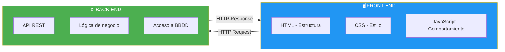
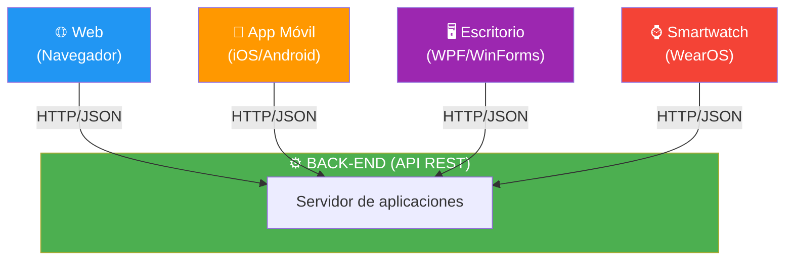

- [2. Componentes de una Aplicación Web](#2-componentes-de-una-aplicación-web)
  - [2.1. Front-end y Back-end: La División del Trabajo](#21-front-end-y-back-end-la-división-del-trabajo)
  - [2.2. El Back-end es Universal](#22-el-back-end-es-universal)
  - [2.3. Página Web vs. Aplicación Web](#23-página-web-vs-aplicación-web)

# 2. Componentes de una Aplicación Web

> 💡 **Punto de partida:** Has visto que una aplicación web tiene dos partes: lo que se ve en el navegador y lo que ocurre en el servidor. Pero, ¿qué componentes concretos forman cada parte? ¿Y por qué el mismo Back-end puede alimentar una web, una app móvil y un escritorio?

En este tema aprenderás los componentes que forman una aplicación web, cómo se comunican entre sí y por qué el Back-end es universal.

**Objetivos de aprendizaje:**

- Identificar los componentes de Front-end y Back-end
- Comprender por qué el Back-end es agnóstico (sirve a cualquier cliente)
- Distinguir entre una página web estática y una aplicación web dinámica
- Conocer las tecnologías más usadas en cada lado

## 2.1. Front-end y Back-end: La División del Trabajo

Una aplicación web se compone de dos partes fundamentales que trabajan juntas pero tienen responsabilidades diferentes:

| Componente | Qué hace | Tecnologías | Se ejecuta en |
|------------|----------|-------------|---------------|
| **Front-end** | Muestra la interfaz al usuario | HTML, CSS, JavaScript | Navegador |
| **Back-end** | Procesa la lógica y gestiona los datos | C#, Java, Python, PHP | Servidor |

> 📝 **Nota:** El Front-end es lo que el usuario ve y toca. El Back-end es todo lo que ocurre "detrás de la cortina". Ambos se comunican a través de **peticiones HTTP** y respuestas en formato **JSON** o **XML**.

## 2.2. El Back-end es Universal

Uno de los conceptos más importantes es que **el Back-end no es solo para la web**. Un mismo Back-end puede servir datos a múltiples clientes:

📌 **Ejemplo real:** Netflix tiene un único Back-end escrito en Java. Ese mismo Back-end alimenta:
- La web de Netflix (navegador)
- La app de Netflix para móvil (iOS/Android)
- La app de Netflix para Smart TVs
- La app de Netflix para consolas (PlayStation, Xbox)

El Back-end **no sabe ni le importa** qué cliente le está pidiendo datos. Solo recibe una petición HTTP y devuelve una respuesta JSON.

| Cliente | Tecnología | Cómo consume el Back-end |
|---------|------------|-------------------------|
| **Web** | JavaScript (fetch/axios) | Llamadas HTTP al navegador |
| **Móvil** | Swift (iOS) / Kotlin (Android) | Llamadas HTTP desde la app |
| **Escritorio** | C# / WPF | Llamadas HTTP desde la app |
| **API pública** | Cualquier lenguaje | Cualquier cliente HTTP |

> 💡 **Analogía:** El Back-end es como un restaurante con servicio a domicilio. No le importa si el cliente come allí (web), si pide para llevar (móvil) o si alguien recoge por él (escritorio). Cocina el plato y lo entrega. El plato es el mismo, lo que cambia es quién lo recibe.

> 📝 **Nota:** Esta es la razón por la que decimos que el Back-end es **agnóstico al cliente**. Puede servir a una web, una app móvil, un smartwatch o incluso un coche conectado. Todos hablan el mismo idioma: **HTTP + JSON**.

## 2.3. Página Web vs. Aplicación Web

No es lo mismo una página web que una aplicación web. Es una diferencia fundamental:

| Característica | **Página Web** | **Aplicación Web** |
|----------------|----------------|-------------------|
| **¿Qué es?** | Un documento HTML que se muestra en el navegador | Una herramienta interactiva que procesa datos |
| **Ejemplo** | Blog, web corporativa, portfolio | Gmail, Instagram, Amazon |
| **Interactividad** | Baja o nula (solo leer) | Alta (escribir, buscar, comprar) |
| **Datos** | Contenido estático o con poca dinámica | Datos dinámicos, personalizados |
| **Backend** | No siempre necesita | Siempre necesita |

📌 **Ejemplo real:** La web de "InfoJobs" es una **página web** con información estática de ofertas. Pero cuando te registras, subes tu CV y aplicas a ofertas, estás usando una **aplicación web**. La diferencia es la **interacción** y el **procesamiento de datos**.

> 💡 **Consejo:** En el ámbito profesional, casi todo son **aplicaciones web**. Las páginas web estáticas son poco comunes hoy en día. Incluso una web corporativa tiene un panel de administración (Back-end) para gestionar contenido.

> ⚠️ **Advertencia:** No confundas "página web" con "sitio web". Un sitio web es un conjunto de páginas web. Un blog puede ser un sitio web de páginas web estáticas, pero un foro es un sitio web con una aplicación web.

---

**Resumen del punto:**

| Concepto | Descripción |
|----------|-------------|
| **Front-end** | Interfaz visual que se ejecuta en el navegador |
| **Back-end** | Lógica de negocio que se ejecuta en el servidor |
| **Back-end agnóstico** | Un mismo Back-end sirve a web, móvil, escritorio |
| **Página web** | Documento HTML con contenido estático |
| **Aplicación web** | Herramienta interactiva que procesa datos |
| **API REST** | Forma en que Front-end y Back-end se comunican |

En el siguiente punto veremos las arquitecturas web: desde la arquitectura Cliente-Servidor hasta los microservicios, pasando por MVC y los principios SOLID.
