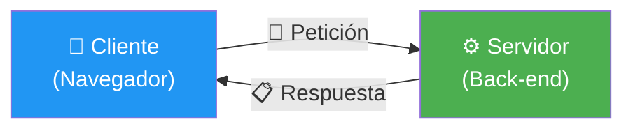
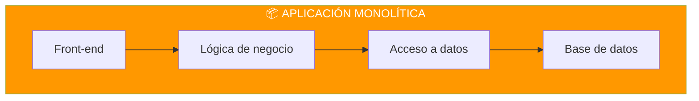
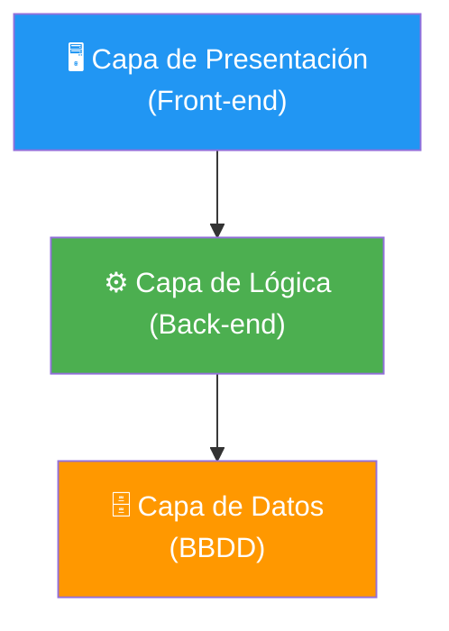
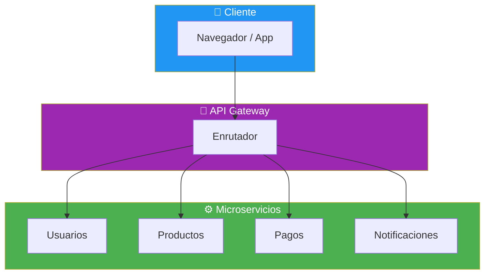
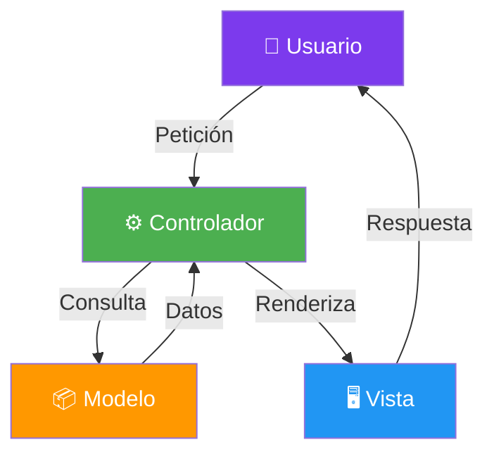

- [3. Arquitecturas Web](#3-arquitecturas-web)
  - [3.1. Arquitectura Cliente-Servidor](#31-arquitectura-cliente-servidor)
  - [3.2. Modelos de Arquitectura Software](#32-modelos-de-arquitectura-software)
  - [3.3. Patrón MVC (Modelo-Vista-Controlador)](#33-patrón-mvc-modelo-vista-controlador)
  - [3.4. Principios SOLID](#34-principios-solid)
  - [3.5. Resumen](#35-resumen)


# 3. Arquitecturas Web

> 💡 **Punto de partida:** Si construyes una casa, no empiezas a poner ladrillos sin un plano. Lo mismo ocurre con el software: necesitas una **arquitectura**, un plan que determine cómo se organizan las piezas, cómo se comunican y cómo escalará en el futuro.

En este tema aprenderás las arquitecturas más utilizadas en desarrollo web, desde la arquitectura Cliente-Servidor hasta los microservicios, pasando por el patrón MVC y los principios SOLID.

**Objetivos de aprendizaje:**

- Comprender la arquitectura Cliente-Servidor y sus ventajas
- Conocer los modelos de arquitectura: monolítica, capas, microservicios, serverless
- Entender el patrón MVC y cómo se aplica en ASP.NET Core
- Conocer los principios SOLID y por qué son importantes

## 3.1. Arquitectura Cliente-Servidor

La arquitectura **Cliente-Servidor** es la base de todas las aplicaciones web modernas. Un cliente (navegador, app) envía peticiones a un servidor que procesa y devuelve respuestas.



| Ventaja | Descripción |
|---------|-------------|
| **Centralización** | Los datos y la lógica están en un solo lugar |
| **Mantenimiento** | Se actualiza el servidor, no todos los clientes |
| **Seguridad** | Los datos no salen del servidor |
| **Escalabilidad** | Se pueden añadir más servidores según la demanda |

> 💡 **Analogía:** El modelo Cliente-Servidor es como una biblioteca. Tú (el cliente) vas al mostrador y pides un libro. El bibliotecario (el servidor) busca el libro, te lo da y lo registra. Tú no vas directamente a los estantes a buscarlo.

## 3.2. Modelos de Arquitectura Software

### 3.2.1. Arquitectura Monolítica

En una arquitectura **monolítica**, toda la aplicación (Front-end, Back-end, base de datos) está en un solo paquete desplegable.



📌 **Ejemplo real:** Many startups empiezan con monolitos porque es rápido de desarrollar y desplegar. Etsy (tienda online de artesanías) sigue usando un monolito PHP bien estructurado.

### 3.2.2. Arquitectura por Capas

La arquitectura por **capas** separa la aplicación en niveles con responsabilidades diferentes:



| Capa | Responsabilidad | Tecnologías |
|------|----------------|-------------|
| **Presentación** | Interfaz de usuario | HTML, CSS, JS, Razor |
| **Lógica de negocio** | Reglas y procesamiento | C#, Servicios |
| **Acceso a datos** | Comunicación con BBDD | EF Core, Dapper |
| **Datos** | Almacenamiento | PostgreSQL, MongoDB |

### 3.2.3. Microservicios

En **microservicios**, la aplicación se divide en servicios pequeños e independientes que se comunican entre sí:



📌 **Ejemplo real:** Netflix usa microservicios. Cada función (recomendaciones, búsquedas, pagos, streaming) es un servicio independiente. Si falla el servicio de pagos, el de recomendaciones sigue funcionando.

### 3.2.4. Serverless

Con **serverless**, el servidor existe pero tú no lo gestionas. La nube se encarga de escalar automáticamente.

📌 **Ejemplo real:** Si usas Azure Functions o AWS Lambda, pagas por cada ejecución de código, no por un servidor encendido 24/7. Es ideal para picos de tráfico (Black Friday, rebajas).

### Comparativa de arquitecturas

| Arquitectura | Complejidad | Escalabilidad | Ideal para |
|-------------|-------------|---------------|------------|
| **Monolítica** | Baja | Limitada | Startups, prototipos |
| **Capas** | Media | Media | Aplicaciones medianas |
| **Microservicios** | Alta | Alta | Empresas grandes, Netflix |
| **Serverless** | Baja (dev) | Automática | Eventos, picos de tráfico |

## 3.3. Patrón MVC (Modelo-Vista-Controlador)

MVC es el patrón más usado en desarrollo web. Separa la aplicación en tres partes:

| Componente | Responsabilidad | Ejemplo en ASP.NET Core |
|------------|----------------|------------------------|
| **Modelo** | Datos y lógica de negocio | `Persona.cs`, `Producto.cs` |
| **Vista** | Interfaz visual (HTML) | `Index.cshtml`, `Create.cshtml` |
| **Controlador** | Recibe peticiones y coordina | `PersonasController.cs` |



📌 **Ejemplo real:** Cuando haces login en una web:
1. El **Controlador** recibe el usuario y contraseña
2. Consulta al **Modelo** si son correctos
3. Si son correctos, muestra la **Vista** de bienvenida
4. Si son incorrectos, muestra la **Vista** de error

> 📝 **Nota:** En ASP.NET Core, el patrón MVC está integrado. Creamos controladores, modelos y vistas que trabajan juntos automáticamente.

## 3.4. Principios SOLID

SOLID son cinco principios de diseño que hacen que el código sea más mantenible y escalable:

| Principio | Significado | Ejemplo |
|-----------|-------------|---------|
| **S** — Single Responsibility | Una clase, una responsabilidad | `PersonaService` solo gestiona personas |
| **O** — Open/Closed | Abierto a extensión, cerrado a modificación | Usar interfaces para añadir funcionalidad |
| **L** — Liskov Substitution | Las subtipos deben ser sustituibles por sus padres | `Estudiante` puede usarse donde se espere `Persona` |
| **I** — Interface Segregation | Interfaces pequeñas y específicas | `IReadOnlyRepository` separado de `IWriteRepository` |
| **D** — Dependency Inversion | Depender de abstracciones, no de implementaciones | Inyectar `IPersonaRepository`, no `PersonaRepository` |

```csharp
// ✅ BUENO: Single Responsibility — cada servicio tiene una función
public class PersonaService
{
    private readonly IPersonaRepository _repository;

    public PersonaService(IPersonaRepository repository)
    {
        _repository = repository;
    }

    public Persona? GetById(int id) => _repository.GetById(id);
}

// ❌ MALO: Una clase que hace todo (violación de SRP)
public class MiClase
{
    public void GuardarPersona() { ... }
    public void EnviarEmail() { ... }
    public void GenerarPdf() { ... }
}
```

> 💡 **Consejo:** No memorices SOLID de memoria. Entiende el sentido: **un código limpio es fácil de cambiar**. Si para añadir una funcionalidad tienes que tocar 10 archivos, algo está mal diseñado.

> 💡 **Analogía — SOLID como una empresa:** Imagina una empresa donde:
> - Cada empleado tiene **una función clara** (SRP)
> - Los procesos se pueden **mejorar sin romper** los existentes (OCP)
> - Un empleado puede **sustituir a otro** del mismo departamento (LSP)
> - Cada departamento tiene **sus propias herramientas** (ISP)
> - Los empleados dependen de **instrucciones claras**, no de saber todo (DIP)

---

**Resumen del punto:**

| Concepto | Descripción |
|----------|-------------|
| **Cliente-Servidor** | Arquitectura base: cliente pide, servidor responde |
| **Monolítica** | Todo en un solo paquete (rápido de empezar, difícil de escalar) |
| **Por Capas** | Separación en niveles: presentación, lógica, datos |
| **Microservicios** | Servicios independientes que se comunican entre sí |
| **Serverless** | El servidor existe pero tú no lo gestionas |
| **MVC** | Patrón: Modelo (datos) + Vista (interfaz) + Controlador (lógica) |
| **SOLID** | 5 principios para código mantenible y escalable |

En el siguiente punto veremos el protocolo HTTP: cómo se comunican cliente y servidor, qué son las peticiones y respuestas, los verbos HTTP y los códigos de estado.
