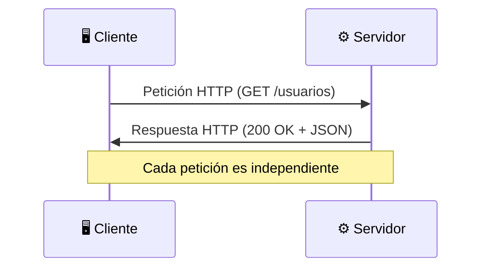
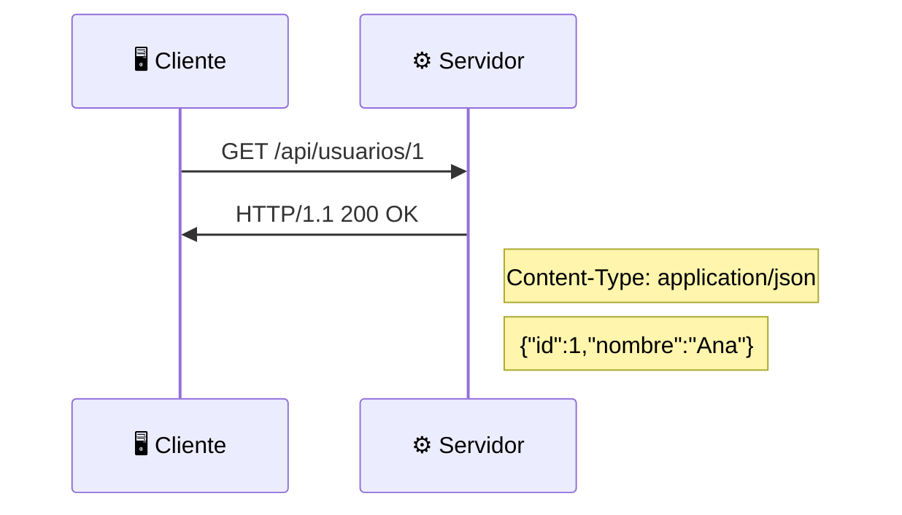
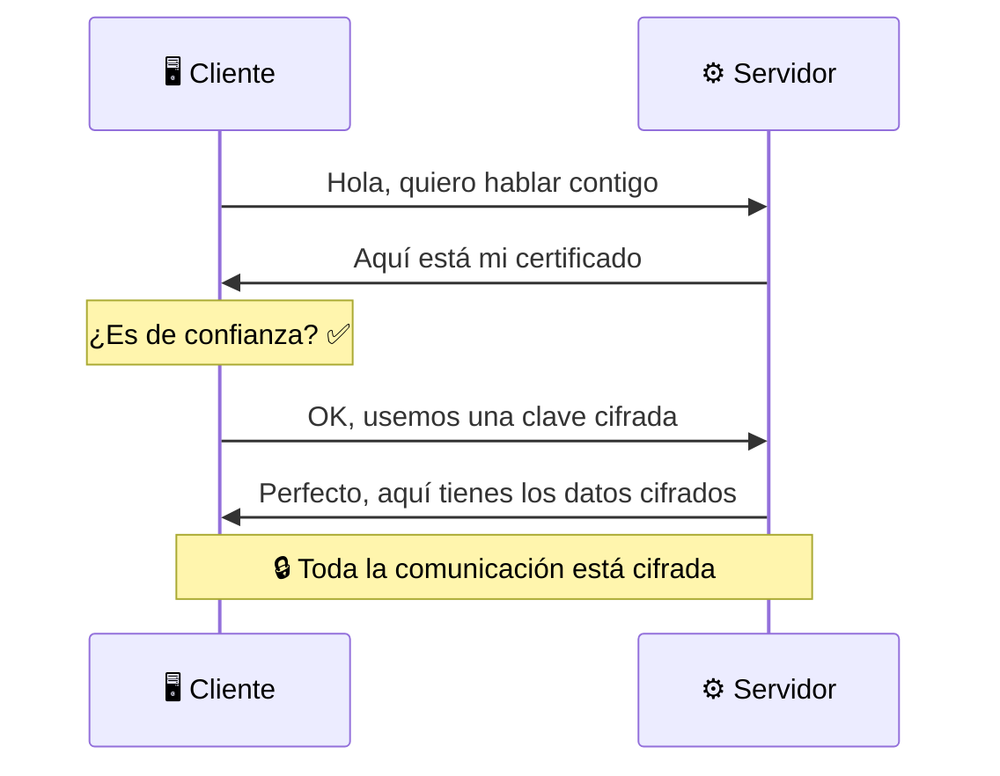

- [4. El Protocolo HTTP](#4-el-protocolo-http)
  - [4.1. ¿Qué es HTTP?](#41-qué-es-http)
  - [4.2. Formato de una Petición HTTP](#42-formato-de-una-petición-http)
  - [4.3. Formato de una Respuesta HTTP](#43-formato-de-una-respuesta-http)
  - [4.4. Métodos o Verbos HTTP](#44-métodos-o-verbos-http)
  - [4.5. Códigos de Estado HTTP](#45-códigos-de-estado-http)
  - [4.6. Cabeceras HTTP](#46-cabeceras-http)
  - [4.7. HTTPS: HTTP Seguro](#47-https-http-seguro)
  - [4.8. Resumen](#48-resumen)


# 4. El Protocolo HTTP

> 💡 **Punto de partida:** Cada vez que escribes una URL en el navegador, estás usando HTTP. Pero, ¿qué es exactamente? ¿Cómo se estructura una petición? ¿Qué significan esos códigos que aparecen (404, 500, 200)? HTTP es el idioma que usan cliente y servidor para comunicarse.

En este tema aprenderás cómo funciona HTTP a nivel técnico: peticiones, respuestas, verbos, códigos de estado y por qué es la base de todas las aplicaciones web modernas.

**Objetivos de aprendizaje:**

- Comprender qué es HTTP y sus características principales
- Conocer el formato de una petición y una respuesta HTTP
- Dominar los verbos HTTP (GET, POST, PUT, DELETE) y su relación con CRUD
- Entender los códigos de estado y cuándo se usan
- Conocer la diferencia entre HTTP y HTTPS

## 4.1. ¿Qué es HTTP?

**HTTP** (HyperText Transfer Protocol) es el protocolo de comunicación que utiliza el navegador para solicitar páginas web a un servidor y recibirlas.

| Característica | Descripción |
|----------------|-------------|
| **Sin estado** | Cada petición es independiente, el servidor no recuerda peticiones anteriores |
| **Basado en peticiones-respuestas** | El cliente envía una petición, el servidor devuelve una respuesta |
| **Extensible** | Se puede añadir información mediante cabeceras |
| **Funciona sobre TCP/IP** | Usa conexiones fiables de bajo nivel |



> 📝 **Nota:** HTTP es **sin estado**. Esto significa que cada petición es independiente. Si haces clic en "Login" y luego en "Perfil", el servidor no sabe que ambas peticiones vienen del mismo usuario. Por eso usamos **cookies** y **tokens JWT** para mantener la sesión.

> 💡 **Analogía:** HTTP es como mandar cartas por correo. Cada carta es independiente. Si mandas dos cartas, el cartero no sabe que vienen de la misma persona a menos que pongas tu nombre en la carta (cookie/header).

## 4.2. Formato de una Petición HTTP

Una petición HTTP tiene tres partes: línea de petición, cabeceras y cuerpo.

```
GET /api/usuarios HTTP/1.1        ← Línea de petición (método, ruta, versión)
Host: api.ejemplo.com             ← Cabeceras
Accept: application/json
Authorization: Bearer eyJhbGci...
                                   ← Línea en blanco
{ "nombre": "Ana" }               ← Cuerpo (solo en POST/PUT)
```

| Parte | Descripción | Ejemplo |
|-------|-------------|---------|
| **Método** | Qué acción quieres hacer | `GET`, `POST`, `PUT`, `DELETE` |
| **Ruta** | Qué recurso solicitas | `/api/usuarios` |
| **Versión** | Versión del protocolo | `HTTP/1.1` o `HTTP/2` |
| **Cabeceras** | Información adicional | `Host`, `Accept`, `Authorization` |
| **Cuerpo** | Datos que envías (opcional) | JSON, XML, formulario |

📌 **Ejemplo real:** Cuando haces login en Instagram:
1. Tu navegador envía `POST /api/auth/login` con usuario y contraseña en el cuerpo
2. El servidor verifica y devuelve un token JWT
3. En las siguientes peticiones, envías ese token en la cabecera `Authorization`

## 4.3. Formato de una Respuesta HTTP

Una respuesta HTTP también tiene tres partes: línea de estado, cabeceras y cuerpo.

```
HTTP/1.1 200 OK                   ← Línea de estado (versión, código, mensaje)
Content-Type: application/json    ← Cabeceras
Cache-Control: no-cache
                                 ← Línea en blanco
{ "id": 1, "nombre": "Ana" }     ← Cuerpo (los datos solicitados)
```

| Parte | Descripción | Ejemplo |
|-------|-------------|---------|
| **Versión** | Versión del protocolo | `HTTP/1.1` |
| **Código** | Resultado de la petición | `200`, `404`, `500` |
| **Mensaje** | Descripción del código | `OK`, `Not Found` |
| **Cabeceras** | Información adicional | `Content-Type`, `Cache-Control` |
| **Cuerpo** | Los datos solicitados | JSON, HTML, imagen |



## 4.4. Métodos o Verbos HTTP

Cada petición HTTP lleva un **método** (o verbo) que indica qué acción quieres realizar sobre el recurso:

| Método | Acción | Ejemplo | Equivale a |
|--------|--------|---------|------------|
| **GET** | Leer/Obtener | `GET /api/usuarios` | SELECT |
| **POST** | Crear | `POST /api/usuarios` | INSERT |
| **PUT** | Actualizar completo | `PUT /api/usuarios/1` | UPDATE |
| **PATCH** | Actualizar parcial | `PATCH /api/usuarios/1` | UPDATE parcial |
| **DELETE** | Eliminar | `DELETE /api/usuarios/1` | DELETE |

📌 **Ejemplo real:** En una app de e-commerce:
- `GET /api/productos` → Ver el catálogo (SELECT)
- `POST /api/pedidos` → Crear un pedido nuevo (INSERT)
- `PUT /api/usuarios/5` → Actualizar todos los datos de un usuario (UPDATE)
- `DELETE /api/carrito/3` → Eliminar un producto del carrito (DELETE)

> 📝 **Nota:** La relación entre verbos HTTP y operaciones CRUD es fundamental. **C**reate = POST, **R**ead = GET, **U**pdate = PUT/PATCH, **D**elete = DELETE.

```csharp
// Ejemplo de API REST en ASP.NET Core Minimal API
// Cada verbo HTTP corresponde a una operación CRUD

var builder = WebApplication.CreateBuilder(args);
var app = builder.Build();

// GET: Obtener todos los usuarios
app.MapGet("/api/usuarios", () =>
{
    var usuarios = new[]
    {
        new { Id = 1, Nombre = "Ana" },
        new { Id = 2, Nombre = "Carlos" }
    };
    return Results.Ok(usuarios);
});

// GET: Obtener un usuario por ID
app.MapGet("/api/usuarios/{id}", (int id) =>
{
    var usuario = new { Id = id, Nombre = "Ana" };
    return Results.Ok(usuario);
});

// POST: Crear un usuario nuevo
app.MapPost("/api/usuarios", (Usuario usuario) =>
{
    // Guardar en base de datos
    return Results.Created($"/api/usuarios/{usuario.Id}", usuario);
});

// PUT: Actualizar un usuario
app.MapPut("/api/usuarios/{id}", (int id, Usuario usuario) =>
{
    // Actualizar en base de datos
    return Results.Ok(usuario);
});

// DELETE: Eliminar un usuario
app.MapDelete("/api/usuarios/{id}", (int id) =>
{
    // Eliminar de la base de datos
    return Results.NoContent();
});

app.Run();

// Modelo de datos
record Usuario(int Id, string Nombre, string Email);
```

> 💡 **Consejo:** Cuando diseñes una API, piensa en los verbos HTTP como operaciones CRUD. Si no sabes qué verbo usar, pregúntate: "¿Estoy leyendo, creando, actualizando o eliminando?"

## 4.5. Códigos de Estado HTTP

Los códigos de estado indican el resultado de la petición. Se organizan en 5 categorías:

| Categoría | Significado | Ejemplos |
|-----------|-------------|----------|
| **1xx** | Informativo | `100 Continue` |
| **2xx** | Éxito | `200 OK`, `201 Created`, `204 No Content` |
| **3xx** | Redirección | `301 Moved Permanently`, `304 Not Modified` |
| **4xx** | Error del cliente | `400 Bad Request`, `401 Unauthorized`, `404 Not Found` |
| **5xx** | Error del servidor | `500 Internal Server Error`, `503 Service Unavailable` |

📌 **Ejemplo real:** Cuando ves una página de "404 Not Found" en Google, es porque la URL que escribiste no existe. El servidor te está diciendo: "No tengo esa página".

| Código | Significado | Cuándo ocurre |
|--------|-------------|---------------|
| **200** | OK | La petición fue exitosa |
| **201** | Created | Se creó un recurso nuevo (POST exitoso) |
| **204** | No Content | Éxito pero sin contenido (DELETE exitoso) |
| **301** | Moved Permanently | La URL cambió permanentemente |
| **304** | Not Modified | El recurso no ha cambiado (caché) |
| **400** | Bad Request | Datos inválidos en la petición |
| **401** | Unauthorized | No estás autenticado (falta login) |
| **403** | Forbidden | Estás autenticado pero no tienes permiso |
| **404** | Not Found | El recurso no existe |
| **409** | Conflict | Conflicto (ej: usuario ya existe) |
| **422** | Unprocessable Entity | Datos correctos pero lógicamente inválidos |
| **429** | Too Many Requests | Rate limiting (demasiadas peticiones) |
| **500** | Internal Server Error | Error interno del servidor |
| **502** | Bad Gateway | El servidor recibió una respuesta inválida |
| **503** | Service Unavailable | El servidor está sobrecargado o en mantenimiento |

> 🔧 **Truco nemotécnico:**
> - **2xx** = "Todo bien" ✅
> - **3xx** = "Mira allí" ↪️
> - **4xx** = "Tú te equivocaste" 🤦
> - **5xx** = "Yo me equivoqué" 💥

## 4.6. Cabeceras HTTP

Las cabeceras añaden información adicional a peticiones y respuestas:

| Cabecera | Dirección | Descripción | Ejemplo |
|----------|-----------|-------------|---------|
| `Content-Type` | Req/Res | Tipo de contenido | `application/json` |
| `Accept` | Req | Formato que acepta el cliente | `application/json` |
| `Authorization` | Req | Token de autenticación | `Bearer eyJhbG...` |
| `Host` | Req | Dominio del servidor | `api.ejemplo.com` |
| `Cache-Control` | Res | Políticas de caché | `no-cache`, `max-age=3600` |
| `Set-Cookie` | Res | Guardar cookie en el cliente | `session=abc123` |

## 4.7. HTTPS: HTTP Seguro

**HTTPS** es HTTP con cifrado SSL/TLS. La "S" significa **Secure** (seguro).



| HTTP | HTTPS |
|------|-------|
| Puerto 80 | Puerto 443 |
| Datos en texto plano | Datos cifrados (SSL/TLS) |
| No autentica al servidor | Autentica al servidor (certificado) |
| Vulnerable a ataques | Protegido contra interceptación |

> ⚠️ **Advertencia:** Hoy en día, **todas** las aplicaciones web deben usar HTTPS. Google Chrome marca como "No seguro" las webs sin HTTPS. Los certificados SSL son gratuitos con Let's Encrypt.

> 💡 **Consejo:** Para el examen, recuerda que HTTP es la base de las APIs REST. Cada petición HTTP lleva un verbo (GET, POST...) y devuelve un código de estado (200, 404...). Esto es fundamental para entender cómo funcionan las aplicaciones web modernas.

---

**Resumen del punto:**

| Concepto | Descripción |
|----------|-------------|
| **HTTP** | Protocolo de comunicación cliente-servidor, sin estado |
| **Petición** | Línea de método + ruta + cabeceras + cuerpo |
| **Respuesta** | Línea de estado + cabeceras + cuerpo |
| **Verbos** | GET (leer), POST (crear), PUT (actualizar), DELETE (eliminar) |
| **Códigos** | 2xx (éxito), 4xx (error cliente), 5xx (error servidor) |
| **HTTPS** | HTTP con cifrado SSL/TLS, seguro |

En el siguiente punto veremos los servicios web y las APIs: qué son, cómo funcionan los protocolos REST, GraphQL, WebSocket y por qué son importantes en el ámbito empresarial.
