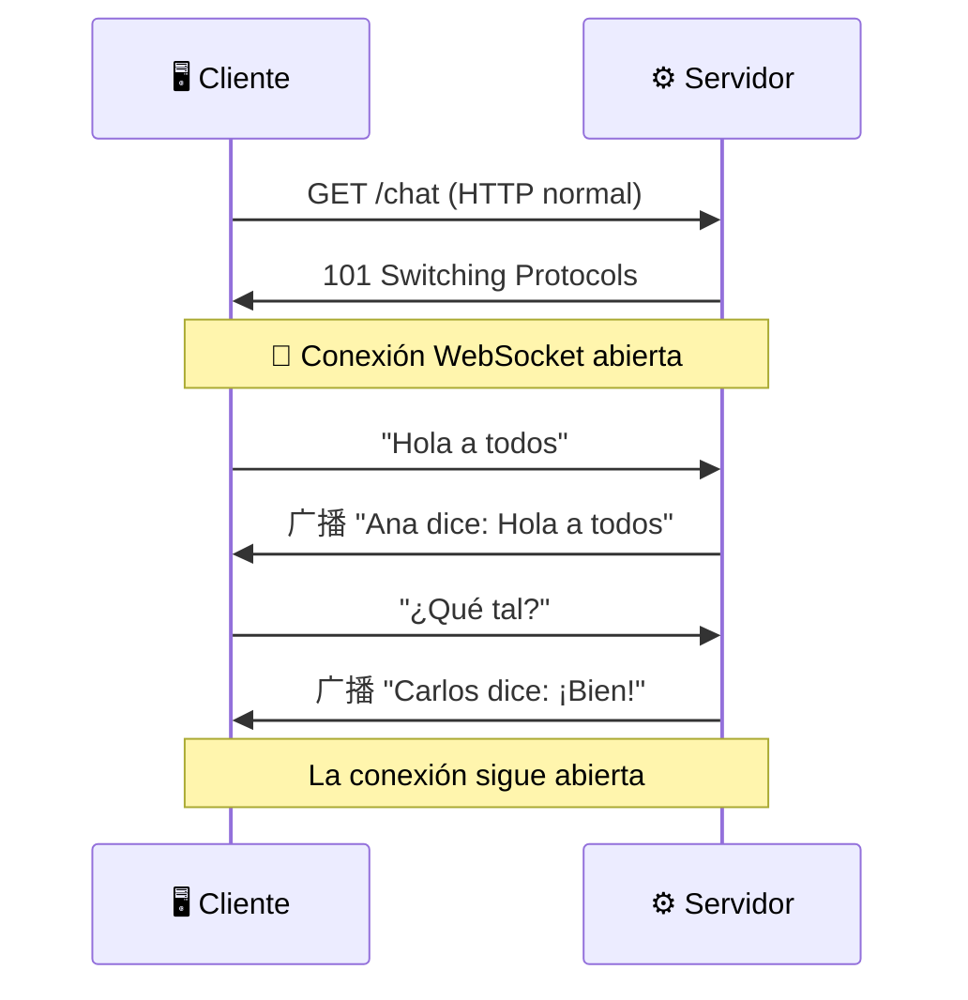

- [5. Servicios Web y Comunicación con APIs](#5-servicios-web-y-comunicación-con-apis)
  - [5.1. ¿Qué es un Servicio Web?](#51-qué-es-un-servicio-web)
  - [5.2. REST: El Estándar de la Industria](#52-rest-el-estándar-de-la-industria)
  - [5.3. GraphQL: La Alternativa Flexible](#53-graphql-la-alternativa-flexible)
  - [5.4. WebSocket: Comunicación en Tiempo Real](#54-websocket-comunicación-en-tiempo-real)
  - [5.5. Otros Protocolos](#55-otros-protocolos)
  - [5.6. Comparativa de Protocolos](#56-comparativa-de-protocolos)


# 5. Servicios Web y Comunicación con APIs

> 💡 **Punto de partida:** Has visto que HTTP es el idioma que usan cliente y servidor. Pero, ¿cómo se estructuran esos servicios? ¿Por qué Netflix usa REST y no GraphQL? ¿Cómo funciona un chat en tiempo real como WhatsApp Web? Todo se reduce a **cómo se diseñan las APIs**.

En este aprenderás qué es un servicio web, cómo funciona REST (el estándar de la industria), cuándo usar GraphQL, cómo funciona WebSocket para comunicación en tiempo real, y compararás los principales protocolos.

**Objetivos de aprendizaje:**

- Definir qué es un servicio web y una API REST
- Conocer los principios de REST y cómo diseñar una API RESTful
- Entender cuándo usar GraphQL en vez de REST
- Comprender cómo funciona WebSocket para comunicación en tiempo real
- Comparar los principales protocolos de comunicación (REST, GraphQL, gRPC, WebSocket, SOAP)

## 5.1. ¿Qué es un Servicio Web?

Un **servicio web** es una aplicación que se comunica con otras aplicaciones a través de Internet usando protocolos estándar como HTTP. Es la forma en que diferentes sistemas intercambian datos.

```
📱 App Móvil  ──HTTP/JSON──▶  ⚙️ API REST  ──SQL──▶  🗄️ Base de Datos
```

📌 **Ejemplo real:** Cuando abres Spotify en el navegador y ves tu música, estás consumiendo un servicio web. El navegador hace peticiones HTTP a la API de Spotify, que devuelve los datos de tus canciones en formato JSON.

| Concepto | Descripción |
|----------|-------------|
| **Servicio web** | Aplicación que se comunica vía HTTP |
| **API** | Interfaz de Programación de Aplicaciones (cómo se piden los datos) |
| **Endpoint** | URL específica de un servicio (ej: `/api/usuarios`) |
| **Recurso** | Cada "cosa" que se puede consultar (usuarios, productos, pedidos) |

> 📝 **Nota:** Un servicio web no es lo mismo que una API REST. Un servicio web es un concepto general (cualquier servicio que se comunique vía HTTP). Una API REST es un **estilo específico** de diseñar servicios web.

## 5.2. REST: El Estándar de la Industria

**REST** (Representational State Transfer) es un estilo arquitectónico para diseñar APIs. No es un protocolo, sino un **conjunto de principios** que hacen que las APIs sean consistentes y fáciles de usar.

### Los 6 principios de REST

| Principio | Descripción | Ejemplo |
|-----------|-------------|---------|
| **Cliente-Servidor** | Separación de responsabilidades | Front-end pide, Back-end sirve |
| **Sin estado** | Cada petición lleva toda la información | No se guarda sesión en el servidor |
| **Cacheable** | Las respuestas pueden cachearse | `Cache-Control: max-age=3600` |
| **Uniforme** | Interfaz consistente (verbos + rutas) | `GET /api/usuarios` siempre lee |
| **Sistema en capas** | Arquitectura escalable | Proxy, balanceador de carga |
| **Código bajo demanda** | El servidor puede enviar código ejecutable | JavaScript en el navegador |

📌 **Ejemplo real:** La API de Twitter (ahora X) sigue principios REST:
- `GET /api/tweets` → Lista de tweets
- `POST /api/tweets` → Crear un tweet nuevo
- `DELETE /api/tweets/123` → Eliminar un tweet
- `GET /api/users/456/tweets` → Tweets de un usuario específico

### Diseño de una API RESTful

Una API RESTful sigue convenciones en las rutas:

```
GET    /api/productos          → Listar todos los productos
GET    /api/productos/1        → Obtener un producto por ID
POST   /api/productos          → Crear un producto nuevo
PUT    /api/productos/1        → Actualizar un producto
DELETE /api/productos/1        → Eliminar un producto
GET    /api/productos?categoria=libros → Filtrar por categoría
```

```csharp
// API REST completa en ASP.NET Core Minimal API
var builder = WebApplication.CreateBuilder(args);
var app = builder.Build();

// Simulación de base de datos en memoria
var productos = new List<Producto>
{
    new(1, "C# en Acción", 39.99m, "Programación"),
    new(2, "ASP.NET Core", 44.99m, "Web")
};

// GET: Listar todos los productos
app.MapGet("/api/productos", () => Results.Ok(productos));

// GET: Obtener un producto por ID
app.MapGet("/api/productos/{id}", (int id) =>
{
    var producto = productos.FirstOrDefault(p => p.Id == id);
    return producto is not null ? Results.Ok(producto) : Results.NotFound();
});

// POST: Crear un producto nuevo
app.MapPost("/api/productos", (Producto producto) =>
{
    var nuevo = producto with { Id = productos.Max(p => p.Id) + 1 };
    productos.Add(nuevo);
    return Results.Created($"/api/productos/{nuevo.Id}", nuevo);
});

// PUT: Actualizar un producto
app.MapPut("/api/productos/{id}", (int id, Producto producto) =>
{
    var existente = productos.FirstOrDefault(p => p.Id == id);
    if (existente is null) return Results.NotFound();

    var index = productos.IndexOf(existente);
    productos[index] = producto with { Id = id };
    return Results.Ok(productos[index]);
});

// DELETE: Eliminar un producto
app.MapDelete("/api/productos/{id}", (int id) =>
{
    var producto = productos.FirstOrDefault(p => p.Id == id);
    if (producto is null) return Results.NotFound();
    productos.Remove(producto);
    return Results.NoContent();
});

app.Run();

record Producto(int Id, string Nombre, decimal Precio, string Categoria);
```

> 💡 **Consejo:** Cuando diseñes una API REST, usa sustantivos en plural para las rutas (`/api/productos`, no `/api/getProduct`). Los verbos van en el método HTTP (`GET`, `POST`, `PUT`, `DELETE`).

## 5.3. GraphQL: La Alternativa Flexible

**GraphQL** es un lenguaje de consultas creado por Facebook que permite al cliente pedir **exactamente** lo que necesita, ni más ni menos.

| REST | GraphQL |
|------|---------|
| `GET /api/usuarios/1` → Devuelve todo el usuario | `query { usuario(id:1) { nombre, email } }` → Solo nombre y email |
| Múltiples endpoints | Un solo endpoint (`/graphql`) |
| Over-fetching (datos de más) | Exactamente lo que pides |
| Under-fetching (faltan datos) | Una sola query con todo |

📌 **Ejemplo real:** Facebook y Instagram usan GraphQL. Cuando abres tu perfil, la app pide solo los datos que necesita para esa pantalla: nombre, foto, últimos posts. No descarga todos tus posts, todos tus amigos y toda tu historia.

```graphql
# Ejemplo de query GraphQL
query {
  usuario(id: 1) {
    nombre
    email
    posts(limit: 5) {
      titulo
      fecha
      likes
    }
  }
}
```

> 📝 **Nota:** GraphQL es ideal cuando el cliente necesita flexibilidad (apps móviles con diferentes pantallas). REST es ideal cuando la estructura es predecible (APIs públicas).

## 5.4. WebSocket: Comunicación en Tiempo Real

**WebSocket** es un protocolo que permite **comunicación bidireccional en tiempo real** entre cliente y servidor. A diferencia de HTTP, la conexión se mantiene abierta.



📌 **Ejemplo real:** WhatsApp Web usa WebSocket. Cuando envías un mensaje, no recargas la página. El mensaje se envía por la conexión WebSocket abierta y el servidor lo reenvía a todos los participantes del chat en tiempo real.

| HTTP | WebSocket |
|------|-----------|
| Petición-respuesta | Bidireccional |
| Sin estado | Conexión persistente |
| Unidireccional (cliente pide) | Cualquiera puede enviar |
| Ideal para APIs REST | Ideal para chat, gaming, tiempo real |

> 📝 **Nota:** WebSocket no reemplaza a HTTP. Son complementarios. HTTP se usa para peticiones normales (cargar datos), WebSocket para comunicación en tiempo real (chat, notificaciones).

## 5.5. Otros Protocolos

| Protocolo | Descripción | Cuándo usarlo |
|-----------|-------------|---------------|
| **gRPC** | RPC de alto rendimiento con Protocol Buffers | Microservicios internos, baja latencia |
| **SOAP** | Protocolo basado en XML, muy estricto | Banca, entornos empresariales legacy |
| **Webhook** | El servidor avisa al cliente cuando ocurre algo | Notificaciones de pago (Stripe), GitHub |
| **SSE** | Server-Sent Events, unidireccional en tiempo real | Notificaciones en tiempo real (simpler que WebSocket) |

> 💡 **Consejo:** Para el examen, recuerda que REST es el estándar de la industria. GraphQL es la alternativa cuando necesitas flexibilidad. WebSocket es para comunicación en tiempo real. gRPC es para alto rendimiento entre microservicios.

## 5.6. Comparativa de Protocolos

| Característica | REST | GraphQL | WebSocket | gRPC | SOAP |
|----------------|------|---------|-----------|------|------|
| **Estilo** | Recursos | Consultas | Bidireccional | RPC | Mensajes |
| **Formato** | JSON | JSON | Binario | Protobuf | XML |
| **Endpoints** | Múltiples | Uno solo | Uno solo | Múltiples | Múltiples |
| **Tiempo real** | No | No | Sí | No | No |
| **Rendimiento** | Medio | Medio | Alto | Muy alto | Bajo |
| **Complejidad** | Baja | Media | Media | Alta | Alta |
| **Uso principal** | APIs públicas | Apps flexibles | Chat, gaming | Microservicios | Banca |

📌 **Ejemplo real de comparativa:**
- **REST**: API pública de Twitter (simple, predecible)
- **GraphQL**: App de Instagram (flexible, diferentes pantallas)
- **WebSocket**: Chat de WhatsApp (tiempo real, bidireccional)
- **gRPC**: Comunicación entre microservicios de Netflix (alto rendimiento)
- **SOAP**: Sistemas bancarios legacy (estRICTO, XML)

---

**Resumen del punto:**

| Concepto | Descripción |
|----------|-------------|
| **Servicio web** | Aplicación que se comunica vía HTTP |
| **REST** | Estilo arquitectónico: recursos + verbos HTTP + JSON |
| **GraphQL** | Lenguaje de consultas: el cliente pide exactamente lo que necesita |
| **WebSocket** | Comunicación bidireccional en tiempo real |
| **gRPC** | RPC de alto rendimiento con Protocol Buffers |
| **SOAP** | Protocolo basado en XML, usado en banca |

En el siguiente punto veremos las páginas web dinámicas: qué son, cómo funcionan y las tecnologías que las hacen posibles (PHP, Java, ASP.NET Core, Python).
