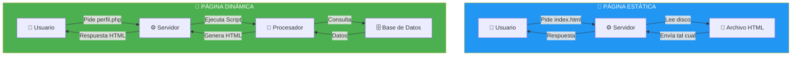
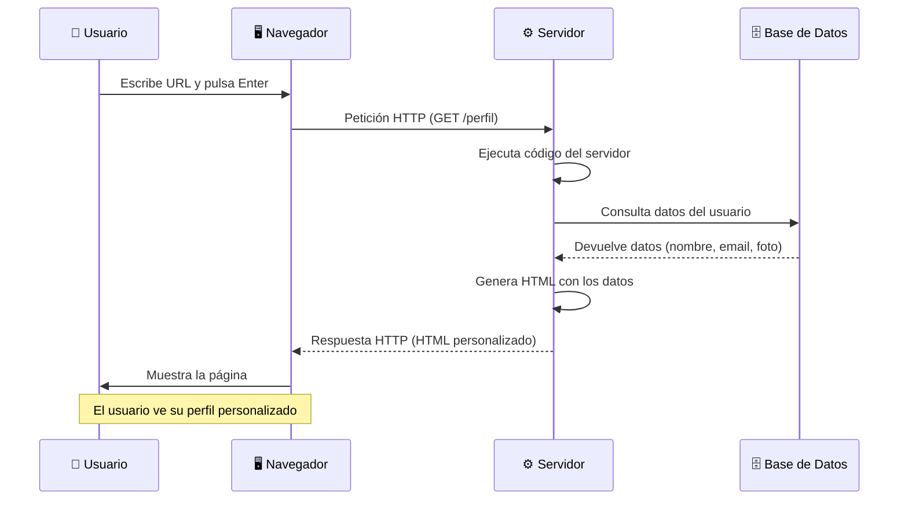

- [6. Páginas Web Dinámicas y Generación de Contenido](#6-páginas-web-dinámicas-y-generación-de-contenido)
  - [6.1. Páginas Estáticas vs. Páginas Dinámicas](#61-páginas-estáticas-vs-páginas-dinámicas)
  - [6.2. Cómo Funciona una Página Web Dinámica (SSR)](#62-cómo-funciona-una-página-web-dinámica-ssr)
  - [6.3. Tecnologías de Generación de Contenido Dinámico](#63-tecnologías-de-generación-de-contenido-dinámico)
  - [6.4. Ejemplo "Hola Mundo" en ASP.NET Core](#64-ejemplo-hola-mundo-en-aspnet-core)
  - [6.5. Comparativa de Tecnologías](#65-comparativa-de-tecnologías)


# 6. Páginas Web Dinámicas y Generación de Contenido

> 💡 **Punto de partida:** ¿Alguna vez te has preguntado por qué cuando abres Instagram ves tus fotos y no las de otro usuario? O por qué Amazon te muestra productos "recomendados para ti"? Todo isso se debe a que las páginas web no son documentos fijos: se **generan en tiempo real** para cada visitante. Vamos a descubrir cómo funciona eso.

En este tema aprenderás la diferencia entre páginas estáticas y dinámicas, cómo el servidor genera contenido personalizado y cuáles son las tecnologías que lo hacen posible.

**Objetivos de aprendizaje:**

- Distinguir entre páginas web estáticas y dinámicas
- Comprender el proceso de Server-Side Rendering (SSR)
- Conocer las principales tecnologías de generación de contenido dinámico
- Analizar ejemplos "Hola Mundo" en diferentes tecnologías
- Comparar ventajas e inconvenientes de cada tecnología

## 6.1. Páginas Estáticas vs. Páginas Dinámicas

La diferencia fundamental radica en **cómo y cuándo se genera el contenido** que ve el usuario.

| Característica | **Página Estática** | **Página Dinámica** |
|----------------|--------------------|--------------------|
| **Contenido** | Fijo, el mismo para todos | Variable, personalizado por usuario |
| **Generación** | Archivos predefinidos en disco | Se genera en tiempo real en el servidor |
| **Velocidad** | Muy rápida (solo lectura) | Más lenta (requiere procesamiento) |
| **Interactividad** | Baja o nula | Alta (login, búsquedas, formularios) |
| **Tecnologías** | HTML, CSS, JavaScript | PHP, Java, C#, Python, Node.js + BBDD |
| **Ejemplo** | Landing page, portfolio | Gmail, Instagram, Amazon |



📌 **Ejemplo real:** La web de "InfoJobs" muestra ofertas de trabajo. Cuando buscas ofertas en Madrid, la página se genera **en ese momento** con los resultados que coinciden con tu búsqueda. No hay un archivo HTML con todas las búsquedas posibles pregeneradas.

> 💡 **Analogía — El Periódico vs Twitter:**
> - **Página Estática (Periódico de Papel):** Se imprime por la mañana. Si compras uno a las 9:00 y otro a las 18:00, dice exactamente lo mismo. Todos los lectores ven las mismas noticias.
> - **Página Dinámica (Twitter/X):** Se genera al momento. Si entras a las 9:00 ves unas cosas, y a las 18:00 ves otras. Además, tu *timeline* es diferente al de tu amigo. Se construye "a medida" para ti en ese instante.

## 6.2. Cómo Funciona una Página Web Dinámica (SSR)

El proceso de generación de contenido dinámico se conoce como **SSR (Server-Side Rendering)**. El servidor "cocina" el HTML y se lo da "comido" al navegador.



El proceso detallado es:

1. **El cliente (navegador) solicita una página** al servidor web
2. **El servidor recibe la petición HTTP** y detecta que es contenido dinámico
3. **El servidor delega al módulo de ejecución** (PHP, motor de plantillas, etc.)
4. **El módulo ejecuta el código** y consulta la base de datos si es necesario
5. **Se genera el HTML final** con los datos obtenidos
6. **El servidor envía el HTML** al navegador, que lo renderiza

📌 **Ejemplo real:** Cuando haces login en Netflix:
1. Introduces tu email y contraseña
2. Netflix verifica credenciales en su base de datos (millones de usuarios)
3. Genera una página **personalizada** con tus preferencias, historial y recomendaciones
4. Esa misma URL (`/browse`) muestra contenido diferente para cada usuario

> 📝 **Nota:** SSR no es la única forma de generar contenido dinámico. Las **SPA (Single Page Application)** usan **CSR (Client-Side Rendering)**: el navegador recibe datos JSON y genera el HTML en el cliente con JavaScript. Es lo que hacen React, Angular y Vue.js. Veremos esto más adelante en el módulo de Front-end.

> 💡 **Consejo:** Para el examen, recuerda que SSR significa que el servidor genera el HTML. CSR significa que el navegador genera el HTML. Ambos son válidos, pero tienen diferentes ventajas e inconvenientes.

## 6.3. Tecnologías de Generación de Contenido Dinámico

Las principales tecnologías para generar páginas web dinámicas utilizan la integración de lenguajes de programación del lado del servidor con lenguajes de marcado como HTML.

| Tecnología | Lenguaje | Características principales |
|------------|----------|----------------------------|
| **PHP / Laravel** | PHP | Fácil aprendizaje, rey del hosting barato |
| **Java / Spring** | Java | Robusto, empresarial, tipado estático |
| **ASP.NET Core** | C# | Alto rendimiento, ecosistema Microsoft |
| **Django / Flask** | Python | Sintaxis limpia, potente en datos/IA |
| **Node.js** | JavaScript | Mismo lenguaje en cliente y servidor, asíncrono |

### Ejemplos "Hola Mundo" en Diferentes Tecnologías

**PHP (código embebido en HTML):**

```php
<!DOCTYPE html>
<html>
<body>
    <?php
        // El código PHP se ejecuta en el servidor
        echo "<h1>Hola Mundo desde PHP</h1>";
        $nombre = "Alumno";
        echo "<p>Bienvenido, " . $nombre . "!</p>";
    ?>
</body>
</html>
```

**Java con Spring Boot (Controlador):**

```java
@RestController
public class HelloController {
    @GetMapping("/hello")
    public String hello() {
        return "<h1>Hola Mundo desde Spring Boot</h1>";
    }
}
```

**Python con Django (Template):**

```html
<h1>Hola, Mundo desde Django</h1>

    <p>¡Hola, {{ nombre }}!</p>

```

> 📝 **Nota:** Fíjate cómo en PHP mezclamos código lógico con HTML. Esto se llama "código espagueti" si no se controla bien. Los frameworks modernos (Spring, Laravel, Django, ASP.NET Core) separan esto usando el patrón MVC.

## 6.4. Ejemplo "Hola Mundo" en ASP.NET Core

ASP.NET Core es el framework web de Microsoft para C#. Veamos cómo crear una aplicación web dinámica paso a paso.

### Opción 1: Minimal API (la más simple)

```csharp
// Program.cs - Punto de entrada con Top Level Statements
var builder = WebApplication.CreateBuilder(args);
var app = builder.Build();

// Endpoint que genera HTML dinámico
app.MapGet("/", () =>
{
    var hora = DateTime.Now.Hour;
    var saludo = hora switch
    {
        < 12 => "Buenos días",
        < 20 => "Buenas tardes",
        _ => "Buenas noches"
    };

    return $"""
        <!DOCTYPE html>
        <html>
        <head><title>Mi Primera Web Dinámica</title></head>
        <body>
            <h1>{saludo} desde ASP.NET Core</h1>
            <p>Son las {DateTime.Now:HH:mm} del {DateTime.Now:dd/MM/yyyy}</p>
            <p>Esta página se genera en tiempo real en el servidor.</p>
        </body>
        </html>
        """;
});

app.Run();
```

📌 **Ejemplo real:** Este código genera una página que cambia según la hora del día. Si accedes por la mañana ves "Buenos días", por la tarde "Buenas tardes" y por la noche "Buenas noches". Es contenido **dinámico**: no hay un archivo HTML fijo.

### Opción 2: API REST con datos dinámicos

```csharp
// API que devuelve datos en formato JSON
var builder = WebApplication.CreateBuilder(args);
var app = builder.Build();

// Lista de usuarios en memoria (simula una base de datos)
var usuarios = new List<Usuario>
{
    new(1, "Ana García", "ana@email.com", 28),
    new(2, "Carlos López", "carlos@email.com", 35),
    new(3, "María Rodríguez", "maria@email.com", 22)
};

// GET: Listar todos los usuarios
app.MapGet("/api/usuarios", () => Results.Ok(usuarios));

// GET: Obtener un usuario por ID
app.MapGet("/api/usuarios/{id}", (int id) =>
{
    var usuario = usuarios.FirstOrDefault(u => u.Id == id);
    return usuario is not null
        ? Results.Ok(usuario)
        : Results.NotFound(new { Error = $"Usuario {id} no encontrado" });
});

// POST: Crear un usuario nuevo
app.MapPost("/api/usuarios", (Usuario nuevoUsuario) =>
{
    var usuario = nuevoUsuario with { Id = usuarios.Max(u => u.Id) + 1 };
    usuarios.Add(usuario);
    return Results.Created($"/api/usuarios/{usuario.Id}", usuario);
});

app.Run();

// Modelo de datos
record Usuario(int Id, string Nombre, string Email, int Edad);
```

> 💡 **Consejo:** En ASP.NET Core, `Minimal API` es ideal para APIs pequeñas y prototipos rápidos. Para aplicaciones más complejas, se usa el patrón MVC completo con controladores, modelos y vistas.

> ⚠️ **Advertencia:** Este código almacena datos en memoria (una lista). Cuando el servidor se reinicia, **se pierden todos los datos**. En producción, se usaría una base de datos (PostgreSQL, SQL Server, etc.).

## 6.5. Comparativa de Tecnologías

| Característica | PHP | Java | C# (ASP.NET Core) | Python | Node.js |
|----------------|-----|------|-------------------|--------|---------|
| **Curva aprendizaje** | Baja | Alta | Media | Baja | Media |
| **Rendimiento** | Bajo | Alto | Muy alto | Medio | Alto |
| **Uso principal** | CMS, webs | Enterprise | Enterprise, Cloud | IA, Data | APIs, Realtime |
| **Hosting barato** | Sí | No | No | Parcial | No |
| **Empresas que lo usan** | Wikipedia, WordPress | Netflix, LinkedIn | Microsoft, Stack Overflow | Instagram, Spotify | Netflix, Uber |

📌 **Ejemplo real:** Netflix usa Java para su Back-end, Spotify usa Python para recomendaciones y Microsoft usa ASP.NET Core para Azure. No hay un lenguaje "mejor": cada uno tiene su nicho.

---

**Resumen del punto:**

| Concepto | Descripción |
|----------|-------------|
| **Página estática** | Contenido fijo, archivos HTML predefinidos |
| **Página dinámica** | Contenido generado en tiempo real según el usuario |
| **SSR** | Server-Side Rendering: el servidor genera el HTML |
| **CSR** | Client-Side Rendering: el navegador genera el HTML |
| **PHP** | Lenguaje scripting, fácil aprendizaje, hosting barato |
| **Java** | Bytecode + JVM, robusto, empresarial |
| **ASP.NET Core** | C#, alto rendimiento, ecosistema Microsoft |
| **Python** | Sintaxis limpia, potente en IA y datos |
| **Node.js** | JavaScript en servidor, asíncrono, no-bloqueante |

En el siguiente punto veremos los lenguajes y frameworks de programación en entorno servidor: tipos de ejecución (scripting, compilado, bytecode), plataformas web (LAMP, MEAN, WISA) y comparativa de tecnologías.
