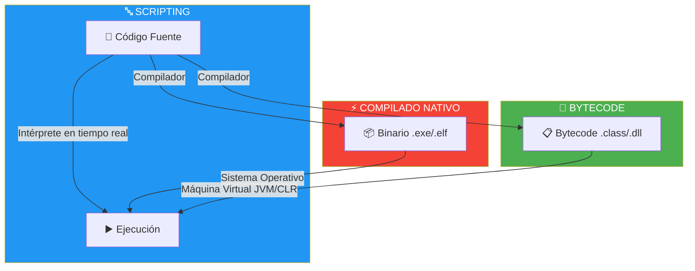

- [7. Lenguajes y Frameworks de Programación en Entorno Servidor](#7-lenguajes-y-frameworks-de-programación-en-entorno-servidor)
  - [7.1. Tipos de Ejecución de Lenguajes](#71-tipos-de-ejecución-de-lenguajes)
  - [7.2. Plataformas Web: LAMP, MEAN, WISA](#72-plataformas-web-lamp-mean-wisa)
  - [7.3. Tecnologías para el Desarrollo de Servicios](#73-tecnologías-para-el-desarrollo-de-servicios)
  - [7.4. Integración del Código con Lenguajes de Marcas](#74-integración-del-código-con-lenguajes-de-marcas)
  - [7.5. Comparativa de Tecnologías](#75-comparativa-de-tecnologías)


# 7. Lenguajes y Frameworks de Programación en Entorno Servidor

> 💡 **Punto de partida:** Has visto que existen varias tecnologías para crear páginas web dinámicas: PHP, Java, C#, Python, Node.js. Pero, ¿por qué hay tantas? ¿Cuál es la diferencia entre que PHP "interprete" el código y que Java lo "compile"? ¿Qué significa que Python sea "scripting"? Todo esto afecta al rendimiento, la portabilidad y la forma en que desplegamos nuestras aplicaciones.

En este tema aprenderás los tipos de ejecución de lenguajes, las plataformas web más utilizadas y cómo elegir la tecnología adecuada para cada proyecto.

**Objetivos de aprendizaje:**

- Distinguir entre lenguajes interpretados, compilados y compilados a bytecode
- Conocer las plataformas web principales (LAMP, MEAN, WISA)
- Analizar las tecnologías más usadas para el desarrollo de servicios
- Entender cómo se integra el código del servidor con HTML
- Comparar ventajas e inconvenientes de cada tecnología

## 7.1. Tipos de Ejecución de Lenguajes

Los lenguajes de programación del lado del servidor se ejecutan de formas muy diferentes. Es fundamental entender estas diferencias porque afectan directamente al rendimiento y a la forma de trabajar.

| Tipo | Cómo funciona | Ejemplos | Ventaja |
|------|--------------|----------|---------|
| **Scripting (Interpretado)** | Un intérprete lee y ejecuta el código línea por línea en tiempo real | PHP, Python, JavaScript | Desarrollo rápido, sin compilación previa |
| **Compilado a código nativo** | Un compilador traduce TODO el código a código máquina antes de ejecutar | C++, Go, Rust | Máximo rendimiento |
| **Compilado a bytecode** | Se compila a código intermedio que ejecuta una Máquina Virtual (JVM/CLR) | Java (JVM), C# (.NET CLR) | Portabilidad + buen rendimiento |



📌 **Ejemplo real:** PHP es como un **traductor simultáneo**: hablas (escribes código) y él traduce frase a frase al momento. Java es como **traducir un libro entero e imprimirlo**: tardas al principio (compilación), pero una vez lo tienes, lo lees rapidísimo sin traductores.

> 💡 **Analogía — Interpretado vs Compilado:**
> - **Interpretado (PHP/Python):** Es como cocinar con una receta que vas leyendo paso a paso. Si te equivocas en el último paso, te das cuenta al final. Flexible pero más lento.
> - **Compilado (C++/Go):** Es como memorizar la receta entera antes de cocinar. Tardas más en prepararte, pero una vez memorizada, cocinas rapidísimo. Si hay un error en la receta, no empiezas a cocinar hasta corregirlo.

> 📝 **Nota:** C# y Java son lenguajes compilados a bytecode. Su código se compila a un formato intermedio que luego ejecuta una máquina virtual (CLR para C#, JVM para Java). Esto les da portabilidad: "Write Once, Run Anywhere".

## 7.2. Plataformas Web: LAMP, MEAN, WISA

Una **plataforma web** (o **stack**) es el conjunto de tecnologías que se usan juntas para desarrollar y desplegar una aplicación web. La combinación más habitual es: **Sistema Operativo + Servidor Web + Base de Datos + Lenguaje de Programación**.

| Stack | Componentes | Tipo | Ejemplos de uso |
|-------|-------------|------|-----------------|
| **LAMP** | **L**inux + **A**pache + **M**ySQL + **P**HP | Open Source | WordPress, Wikipedia, Facebook (al inicio) |
| **MEAN** | **M**ongoDB + **E**xpress + **A**ngular + **N**ode.js | Full JavaScript | Apps real-time, prototipos rápidos |
| **MERN** | **M**ongoDB + **E**xpress + **R**eact + **N**ode.js | Full JavaScript | SPAs modernas, e-commerce |
| **WISA** | **W**indows + **I**IS + **S**QL Server + **A**SP.NET | Microsoft | Enterprise, aplicaciones corporativas |
| **XAMPP/WAMP** | Versión local de LAMP | Desarrollo | Aprender en local, prototipos |

```mermaid
graph TD
    subgraph LAMP["🐧 LAMP (Open Source)"]
        L1["Linux"]
        L2["Apache"]
        L3["MySQL"]
        L4["PHP"]
    end

    subgraph MEAN["📦 MEAN (Full JavaScript)"]
        M1["MongoDB"]
        M2["Express"]
        M3["Angular"]
        M4["Node.js"]
    end

    subgraph WISA["🪟 WISA (Microsoft)"]
        W1["Windows"]
        W2["IIS"]
        W3["SQL Server"]
        W4["ASP.NET"]
    end

    L1 --> L2 --> L3 --> L4
    M1 --> M2 --> M3 --> M4
    W1 --> W2 --> W3 --> W4

    style LAMP fill:#4CAF50,color:#fff
    style MEAN fill:#2196F3,color:#fff
    style WISA fill:#FF9800,color:#fff
```



📌 **Ejemplo real:** WordPress (que usa el 43% de las webs del mundo) funciona sobre LAMP. Netflix usa Java sobre Linux. Microsoft Teams usa ASP.NET Core sobre Windows/Azure.

> 💡 **Consejo:** En este ciclo formativo nos centraremos en **LAMP** (Linux + Apache + PHP) y en **ASP.NET Core** (C#). Son estándares industriales abiertos que te servirán para entender cualquier otra tecnología.

> ⚠️ **Advertencia:** No confundas **XAMPP/WAMP** con un entorno de producción. Son herramientas de desarrollo local. En producción, se usan servidores reales con configuración específica.

## 7.3. Tecnologías para el Desarrollo de Servicios

El desarrollo de servicios se centra en la creación de APIs para que las aplicaciones se comuniquen. Cada tecnología tiene un framework principal:

| Tecnología | Lenguaje | Framework principal | Uso principal |
|------------|----------|-------------------|---------------|
| **Java** | Java | **Spring Boot** | Enterprise, Microservicios |
| **C#** | C# | **ASP.NET Core** | Enterprise, Cloud Azure |
| **PHP** | PHP | **Laravel**, Symfony | Webs rápidas, CMS |
| **JavaScript** | JavaScript | **Express**, NestJS | I/O intensivo, Realtime |
| **Python** | Python | **Django**, FastAPI | Data Science, IA, Backend |
| **Go** | Go | **Gin**, Echo | Microservicios de alto rendimiento |

```csharp
// Ejemplo de servicio en ASP.NET Core Minimal API
// Un servicio web completo en apenas 10 líneas de código

var builder = WebApplication.CreateBuilder(args);
var app = builder.Build();

// Servicio que calcula la nota media de un alumno
app.MapGet("/api/notas/{notas}", (string notas) =>
{
    // Convertir "7,8,9,6" a lista de números
    var listaNotas = notas.Split(',')
                          .Select(n => double.Parse(n))
                          .ToList();

    var media = listaNotas.Average();
    var estado = media >= 5 ? "Aprobado" : "Suspenso";

    return new
    {
        Notas = listaNotas,
        Media = Math.Round(media, 2),
        Estado = estado,
        FechaCalculo = DateTime.Now
    };
});

app.Run();
```

📌 **Ejemplo real:** Si accedes a `/api/notas/7,8,9,6`, el servidor devuelve: `{"Notas":[7,8,9,6], "Media":7.5, "Estado":"Aprobado"}`. Es un servicio web dinámico que procesa datos en tiempo real.

> 📝 **Nota:** La tendencia actual es crear APIs REST que devuelvan datos en formato JSON, y que el Front-end (React, Angular, Vue) se encargue de mostrarlos. Esta separación se llama **arquitectura decoupled** o **headless**.

## 7.4. Integración del Código con Lenguajes de Marcas

Una técnica fundamental para crear páginas web dinámicas es integrar código de programación directamente dentro de lenguajes de marcado como HTML.

| Modelo | Descripción | Tecnologías | Ejemplo |
|--------|-------------|-------------|---------|
| **Server-Side MVC** | El lenguaje se incrusta en HTML. El servidor procesa y genera HTML limpio | PHP, JSP, Razor | Laravel, JSP, ASP.NET MVC |
| **Client-Side (SPA)** | HTML mínimo. JavaScript construye el HTML dinámicamente en el navegador | React, Angular, Vue | Instagram, Gmail |
| **API + Frontend** | Backend solo sirve datos JSON. Frontend separado consume la API | ASP.NET Core + React | Netflix, Spotify |

```csharp
// Ejemplo de integración con Razor (ASP.NET Core MVC)
// El código C# se mezcla con HTML en un archivo .cshtml

@{
    var titulo = "Mi Lista de Tareas";
    var tareas = new[] { "Estudiar C#", "Hacer ejercicios", "Descansar" };
}

<!DOCTYPE html>
<html>
<head>
    <title>@titulo</title>
</head>
<body>
    <h1>@titulo</h1>
    <ul>
        @foreach (var tarea in tareas)
        {
            <li>@tarea</li>
        }
    </ul>
    <p>Fecha: @DateTime.Now.ToString("dd/MM/yyyy HH:mm")</p>
</body>
</html>
```

> 💡 **Consejo:** Aunque empezamos viendo código incrustado (como PHP dentro de HTML), la tendencia profesional es **separar completamente** el Backend (API JSON) del Frontend (HTML/JS generado por React/Angular). Esto facilita el mantenimiento y permite que diferentes equipos trabajen en cada parte.

## 7.5. Comparativa de Tecnologías

| Característica | PHP | Java | C# | Python | JavaScript (Node.js) |
|----------------|-----|------|----|--------|---------------------|
| **Curva aprendizaje** | Baja | Alta | Media | Baja | Media |
| **Rendimiento** | Bajo | Alto | Muy alto | Medio | Alto |
| **Portabilidad** | Alta | Alta | Alta | Alta | Alta |
| **Empresas que usan** | Wikipedia, WordPress | Netflix, LinkedIn | Microsoft, Stack Overflow | Instagram, Spotify | Netflix, Uber |
| **Ideal para** | CMS, webs sencillas | Enterprise, gran escala | Enterprise, Azure | IA, Data Science | APIs, Realtime |
| **Hosting disponible** | Casi todos | Especializado | Azure, especializado | Especializado | Especializado |

📌 **Ejemplo real de comparativa:**
- **PHP** es como un **multiherramienta**: fácil de empezar, rápido, pero con límites de rendimiento.
- **Java** es como una **grúa de construcción**: potente, robusta, pero más compleja de manejar.
- **C#** es como un **coche de alta gama**: rendimiento excelente, ecosistema premium, ideal para empresas grandes.
- **Python** es como una **herramienta de laboratorio**: flexible, potente para análisis, pero más lento para producción masiva.
- **Node.js** es como una **moto**: ágil, rápida para I/O, ideal para APIs y tiempo real.

> 💡 **Consejo:** No existe el lenguaje "mejor". Para elegir, pregúntate:
> - ¿El proyecto es empresarial y usas Azure? → **C# / ASP.NET Core**
> - ¿Necesitas máximo rendimiento y portabilidad? → **Java / Spring Boot**
> - ¿Es un CMS o web sencilla con hosting barato? → **PHP / Laravel**
> - ¿Tratas datos, IA o machine learning? → **Python / Django**
> - ¿Necesitas tiempo real y APIs rápidas? → **Node.js / Express**

---

**Resumen del punto:**

| Concepto | Descripción |
|----------|-------------|
| **Scripting** | Código interpretado línea por línea (PHP, Python, JS) |
| **Compilado nativo** | Código traducido a máquina antes de ejecutar (C++, Go) |
| **Bytecode** | Código compilado a intermedio + Máquina Virtual (Java, C#) |
| **LAMP** | Linux + Apache + MySQL + PHP (stack Open Source clásico) |
| **MEAN** | MongoDB + Express + Angular + Node.js (Full JavaScript) |
| **WISA** | Windows + IIS + SQL Server + ASP.NET (stack Microsoft) |
| **Spring Boot** | Framework Java para servicios web y microservicios |
| **ASP.NET Core** | Framework C# para servicios web de alto rendimiento |
| **Laravel** | Framework PHP moderno y elegante |

En el siguiente punto veremos los servidores web y de aplicaciones: Apache, Nginx, Tomcat, Kestrel y los gestores de bases de datos.
