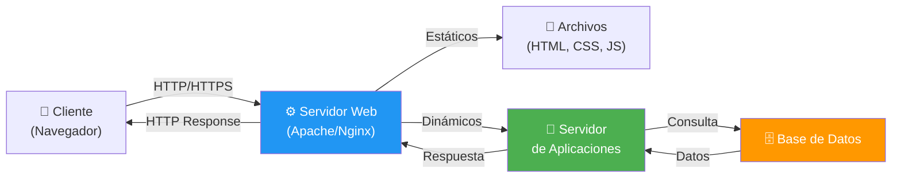
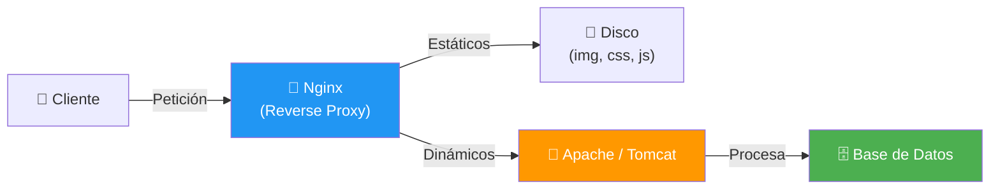
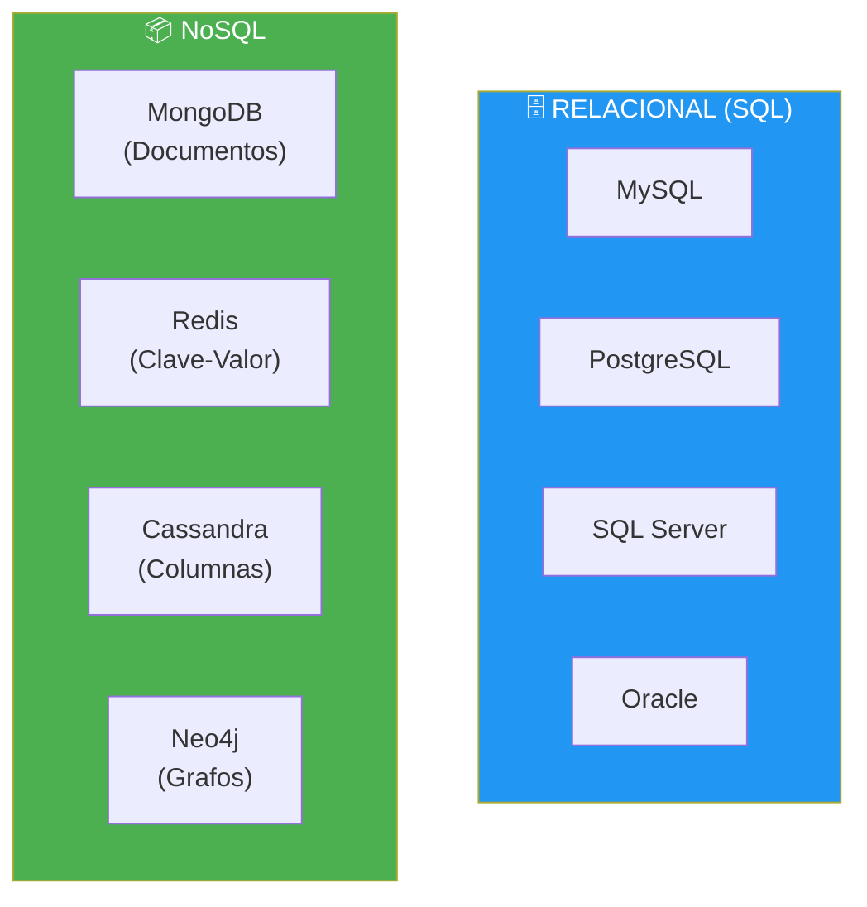
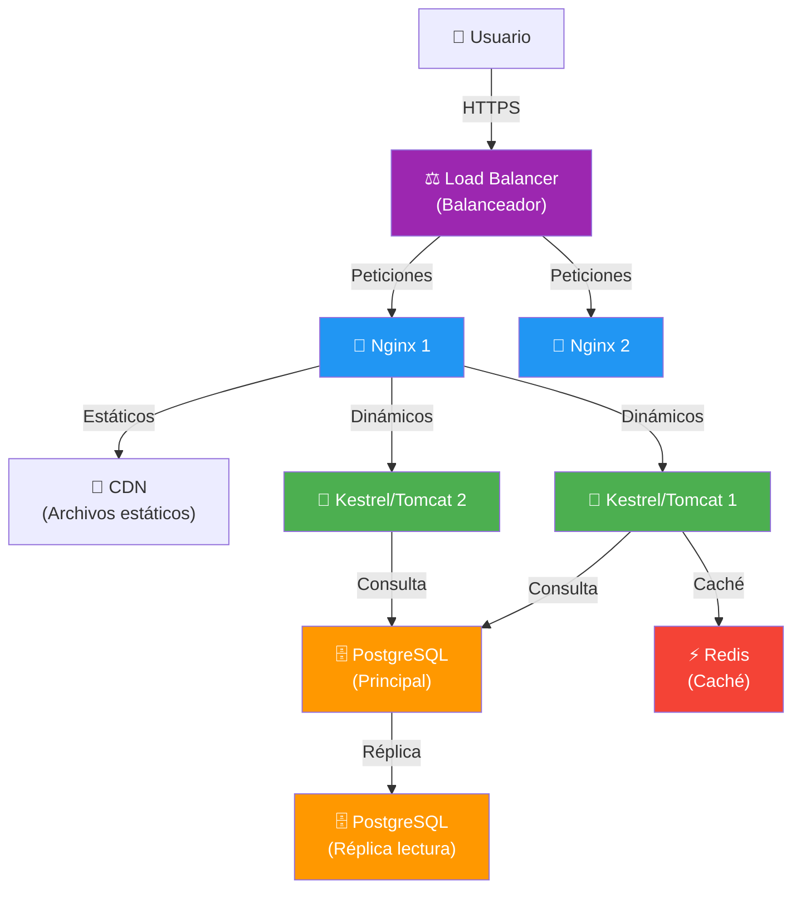

- [8. Servidores Web y de Aplicaciones](#8-servidores-web-y-de-aplicaciones)
  - [8.1. ¿Qué es un Servidor Web?](#81-qué-es-un-servidor-web)
  - [8.2. Apache HTTP Server](#82-apache-http-server)
  - [8.3. Nginx](#83-nginx)
  - [8.4. Comparativa: Apache vs Nginx](#84-comparativa-apache-vs-nginx)
  - [8.5. Servidores de Aplicaciones](#85-servidores-de-aplicaciones)
  - [8.6. Kestrel: El Servidor de ASP.NET Core](#86-kestrel-el-servidor-de-aspnet-core)
  - [8.7. Gestores de Bases de Datos](#87-gestores-de-bases-de-datos)
  - [8.8. Arquitectura Completa de un Servidor Web](#88-arquitectura-completa-de-un-servidor-web)


# 8. Servidores Web y de Aplicaciones

> 💡 **Punto de partida:** Cuando escribes una URL en el navegador, ¿quién te devuelve la página web? No es solo "un servidor": hay un **servidor web** que recibe la petición, y si es contenido dinámico, la pasa a un **servidor de aplicaciones** que ejecuta el código. Y detrás de todo esto hay una **base de datos** que almacena la información. Vamos a desgranar cada pieza.

En este tema aprenderás qué son los servidores web (Apache, Nginx), los servidores de aplicaciones (Tomcat, Kestrel) y los gestores de bases de datos, y cómo encajan todos en la arquitectura completa.

**Objetivos de aprendizaje:**

- Comprender la función de un servidor web en la arquitectura cliente-servidor
- Conocer las características principales de Apache y Nginx
- Entender la diferencia entre servidor web y servidor de aplicaciones
- Conocer los servidores de aplicaciones más utilizados (Tomcat, Kestrel)
- Analizar los gestores de bases de datos más importantes
- Visualizar la arquitectura completa de un servidor web en producción

## 8.1. ¿Qué es un Servidor Web?

Un **servidor web** es el programa que "escucha" en un puerto (80 para HTTP, 443 para HTTPS) y responde a las peticiones de los navegadores. Su función principal es:

- **Servir archivos estáticos**: HTML, CSS, JavaScript, imágenes, vídeos
- **Gestionar conexiones HTTPS**: cifrar y descifrar la comunicación
- **Redirigir peticiones dinámicas**: pasar el trabajo al servidor de aplicaciones
- **Balancear carga**: repartir peticiones entre varios servidores

| Función | Descripción | Ejemplo |
|---------|-------------|---------|
| **Archivos estáticos** | Sirve HTML, CSS, JS, imágenes directamente del disco | `GET /style.css` → devuelve el archivo |
| **HTTPS/SSL** | Gestiona certificados y cifrado | Certificado de Let's Encrypt |
| **Proxy inverso** | Redirige peticiones a servidores de aplicaciones | Nginx → Tomcat |
| **Balanceo de carga** | Reparte tráfico entre varios servidores | Equilibrar entre 3 servidores Node.js |



> 💡 **Analogía — El Recepcionista y la Cocina:**
> - **Servidor Web (Apache/Nginx)**: Es el **recepcionista**. Te saluda, te da la carta (HTML estático), te sirve las bebidas (imágenes). Si pides algo complicado, se lo pasa a la cocina.
> - **Servidor de Aplicaciones (Tomcat/Kestrel)**: Es la **cocina**. Allí se procesan los ingredientes, se cocina el plato (ejecuta el código) y se lo da al recepcionista para que te lo lleve a la mesa.

## 8.2. Apache HTTP Server

Apache es el veterano de los servidores web. Lanzado en 1995, ha sido el servidor más popular del mundo durante décadas.

| Característica | Descripción |
|----------------|-------------|
| **Año de lanzamiento** | 1995 |
| **Licencia** | Open Source (Apache License 2.0) |
| **Arquitectura** | Multi-proceso/hilo (model worker) |
| **Configuración** | Flexible, mediante `.htaccess` |
| **Modular** | Se activa/desactiva funcionalidad con módulos |
| **Cuota de mercado** | ~30% de las webs mundiales |

### Instalación y Configuración Básica (Linux)

```bash
# Instalación en Ubuntu/Debian
sudo apt update
sudo apt install apache2

# Iniciar el servicio
sudo service apache2 start

# Verificar estado
sudo systemctl status apache2

# Directorio web por defecto
# /var/www/html/ → Aquí van tus archivos HTML
```

### Hosts Virtuales (VirtualHosts)

Los VirtualHosts permiten tener **varias webs en un mismo servidor** (misma IP). El servidor sabe cuál servir mirando la cabecera `Host` de la petición HTTP.

```apache
# Configuración de VirtualHost
<VirtualHost *:80>
    ServerName www.miweb.com
    DocumentRoot /var/www/miweb
    ErrorLog ${APACHE_LOG_DIR}/error.log
    CustomLog ${APACHE_LOG_DIR}/access.log combined
</VirtualHost>
```

```bash
# Habilitar el VirtualHost
sudo a2ensite miweb.conf
sudo service apache2 restart
```

> ⚠️ **Advertencia:** Para que un VirtualHost funcione, no basta con crear el fichero. Debes habilitarlo con `sudo a2ensite miweb.conf` y recargar Apache.

## 8.3. Nginx

Nginx (pronunciado "engine-x") es el servidor web moderno por excelencia. Su arquitectura orientada a eventos lo hace extremadamente eficiente con poco consumo de memoria.

| Característica | Descripción |
|----------------|-------------|
| **Año de lanzamiento** | 2004 |
| **Licencia** | Open Source (2-clause BSD) |
| **Arquitectura** | Asíncrona, orientada a eventos (event-driven) |
| **Configuración** | Centralizada (no usa `.htaccess`) |
| **Uso principal** | Proxy inverso, balanceador de carga, estáticos |
| **Cuota de mercado** | ~35% de las webs mundiales (y creciendo) |

### Ventajas de Nginx

- **Rendimiento**: Arquitectura asíncrona. Aguanta mucha más carga concurrente con menos RAM
- **Proxy inverso**: Ideal para dirigir tráfico a servidores de aplicaciones
- **Balanceador de carga**: Reparte peticiones entre varios servidores
- **Compresión GZIP**: Reduce el tamaño de las respuestas HTTP
- **Caché**: Almacena respuestas frecuentes para servirlas más rápido

```nginx
# Configuración básica de Nginx como proxy inverso
server {
    listen 80;
    server_name www.miweb.com;

    # Archivos estáticos (Nginx sirve directamente)
    location /static/ {
        root /var/www/miweb;
    }

    # Peticiones dinámicas (las pasa a ASP.NET Core)
    location / {
        proxy_pass http://localhost:5000;
        proxy_http_version 1.1;
        proxy_set_header Upgrade $http_upgrade;
        proxy_set_header Connection keep-alive;
    }
}
```

> 📝 **Nota:** En producción, no solemos exponer el servidor de aplicaciones directamente a Internet. Ponemos un Nginx o Apache delante haciendo de "proxy" por seguridad y rendimiento.

## 8.4. Comparativa: Apache vs Nginx

| Característica | Apache | Nginx |
|----------------|--------|-------|
| **Arquitectura** | Multi-hilo/proceso | Asíncrono, orientado a eventos |
| **Rendimiento estáticos** | Bueno | Excelente |
| **Rendimiento dinámicos** | Bueno (con módulos) | Excelente (con proxy) |
| **Consumo memoria** | Alto | Muy bajo |
| **Configuración** | `.htaccess` (flexible) | Centralizada (más rápida) |
| **Proxy inverso** | Limitado | Excelente |
| **Ideal para** | Hosting compartido, PHP | APIs, microservicios, alto tráfico |



📌 **Ejemplo real:** En una arquitectura típica:
- **Nginx** recibe todas las peticiones (puerto 80/443)
- Si es un archivo estático (imagen, CSS), Nginx lo sirve directamente
- Si es dinámico, lo redirige a Apache/PHP o a Tomcat/Java
- Esto maximiza rendimiento y seguridad

> 💡 **Consejo:** Para el examen, recuerda que Apache es más flexible (`.htaccess`) y Nginx es más rápido (asíncrono). En producción moderna, Nginx se usa como proxy inverso delante de cualquier servidor de aplicaciones.

## 8.5. Servidores de Aplicaciones

Un **servidor de aplicaciones** va más allá de servir archivos estáticos. Proporciona un entorno completo para ejecutar lógica de negocio compleja, transacciones, colas de mensajes, etc.

| Servidor | Tecnología | Puerto por defecto | Uso principal |
|----------|-----------|-------------------|---------------|
| **Apache Tomcat** | Java (Servlets/JSP) | 8080 | Aplicaciones Java web |
| **Jetty** | Java (Servlets) | 8080 | Embedded, microservicios |
| **Kestrel** | C# (.NET) | 5000 | ASP.NET Core |
| **Gunicorn** | Python (WSGI) | 8000 | Django, Flask |
| **uWSGI** | Python (WSGI) | 5000 | Django, Flask |
| **PHP-FPM** | PHP (FastCGI) | 9000 | Laravel, WordPress |

### Apache Tomcat

Tomcat es el contenedor de **Servlets y JSP** por excelencia. Implementación de referencia de Java EE (ahora Jakarta EE) para la parte web.

```bash
# Instalación en Ubuntu/Debian
sudo apt update
sudo apt install tomcat9

# Iniciar el servicio
sudo service tomcat9 start

# Las aplicaciones se despliegan copiando el fichero .war en:
# /var/lib/tomcat9/webapps/
```

> 📝 **Nota:** En producción, no exponemos Tomcat directamente a Internet (puerto 8080). Ponemos un Nginx o Apache delante (puerto 80/443) haciendo de "proxy" por seguridad y rendimiento.

## 8.6. Kestrel: El Servidor de ASP.NET Core

**Kestrel** es el servidor web que viene integrado en ASP.NET Core. Es ligero, rápido y está optimizado para .NET.

| Característica | Descripción |
|----------------|-------------|
| **Rendimiento** | Muy alto, comparable a Nginx |
| **HTTPS** | Soporte nativo con certificados |
| **HTTP/2** | Soporte completo |
| **HTTP/3** | Soporte en .NET 7+ |
| **Configuración** | En `appsettings.json` o `Program.cs` |

```csharp
// Configuración de Kestrel en ASP.NET Core
var builder = WebApplication.CreateBuilder(args);

// Configurar Kestrel
builder.WebHost.ConfigureKestrel(options =>
{
    options.ListenAnyIP(5000);  // Escuchar en todas las interfaces
    options.ListenAnyIP(5001, listenOptions =>
    {
        listenOptions.UseHttps();  // Habilitar HTTPS
    });
});

var app = builder.Build();

app.MapGet("/", () => "Hola Mundo desde Kestrel!");

app.Run();
```

```json
// Configuración en appsettings.json
{
  "Kestrel": {
    "Endpoints": {
      "Http": {
        "Url": "http://0.0.0.0:5000"
      },
      "Https": {
        "Url": "https://0.0.0.0:5001",
        "Certificate": {
          "Path": "certificado.pfx",
          "Password": "contraseña"
        }
      }
    }
  }
}
```

> 💡 **Consejo:** Para el examen, recuerda que Kestrel es el servidor web que viene con ASP.NET Core. En producción, se usa Nginx o IIS como proxy inverso delante de Kestrel.

## 8.7. Gestores de Bases de Datos

Las bases de datos son donde se almacenan los datos de las aplicaciones. Existen dos grandes familias:

| Tipo | Características | Ejemplos | Ideal para |
|------|----------------|----------|------------|
| **Relacional (SQL)** | Datos en tablas, relaciones, lenguaje SQL, ACID | MySQL, PostgreSQL, SQL Server, Oracle | Datos estructurados, transacciones |
| **NoSQL** | Datos en documentos, claves, grafos, flexible | MongoDB, Redis, Cassandra | Datos no estructurados, escalabilidad |

### Bases de Datos Relacionales (SQL)

| BD | Características | Ideal para |
|----|----------------|------------|
| **MySQL / MariaDB** | Rápido, sencillo, Open Source | CMS, blogs, e-commerce sencillo |
| **PostgreSQL** | Potente, estricto, "el Oracle Open Source" | Apps complejas, GIS, datos científicos |
| **SQL Server** | Microsoft, integración con .NET | Enterprise, entornos Microsoft |
| **Oracle** | El más potente, licencia cara | Grandes empresas, banca |

### Bases de Datos NoSQL

| BD | Tipo | Características | Ideal para |
|----|------|----------------|------------|
| **MongoDB** | Documentos JSON | Flexible, escalable horizontalmente | Apps con datos cambiantes |
| **Redis** | Clave-Valor | En memoria, ultra rápido | Caché, sesiones, colas |
| **Cassandra** | Columnas | Escalable masivamente | Grandes volúmenes de datos |
| **Neo4j** | Grafos | Relaciones entre datos | Redes sociales, recomendaciones |



📌 **Ejemplo real:** Instagram usa **Redis** para caché y sesiones, **PostgreSQL** para datos relacionales y **Cassandra** para almacenar fotos y vídeos a gran escala.

> ⚠️ **Advertencia:** Nunca expongas el puerto de la base de datos (ej. 3306 para MySQL, 5432 para PostgreSQL) directamente a Internet. Solo debe ser accesible desde tu servidor de aplicaciones (localhost o red privada).

> 💡 **Consejo:** Para el examen, recuerda que MySQL es el más usado en hosting barato, PostgreSQL es más potente y estricto, Redis es para caché en memoria y MongoDB es para datos no estructurados.

## 8.8. Arquitectura Completa de un Servidor Web

En producción, una aplicación web típica tiene esta arquitectura:



📌 **Ejemplo real:** Netflix tiene más de 100.000 servidores en todo el mundo. Cuando abres Netflix, tu petición pasa por un balanceador de carga que la dirige al servidor más cercano y menos cargado. Ese servidor usa Nginx como proxy, y detrás tiene microservicios en Java que consultan bases de datos y caché Redis.

| Componente | Función | Tecnologías típicas |
|------------|---------|---------------------|
| **Balanceador de carga** | Reparte tráfico | HAProxy, AWS ELB, Nginx |
| **Servidor web/proxy** | Sirve estáticos, redirige dinámicos | Nginx, Apache |
| **Servidor de aplicaciones** | Ejecuta código de negocio | Kestrel, Tomcat, Node.js |
| **Caché** | Almacena datos frecuentes | Redis, Memcached |
| **Base de datos** | Persiste datos | PostgreSQL, MySQL, MongoDB |
| **CDN** | Archivos estáticos cercanos al usuario | Cloudflare, AWS CloudFront |

---

**Resumen del punto:**

| Concepto | Descripción |
|----------|-------------|
| **Servidor web** | Recibe peticiones HTTP, sirve estáticos, redirige dinámicos |
| **Apache** | Veterano, flexible, `.htaccess`, ideal para hosting compartido |
| **Nginx** | Moderno, asíncrono, rápido, ideal como proxy inverso |
| **Servidor de aplicaciones** | Ejecuta código de negocio complejo |
| **Tomcat** | Contenedor Java (Servlets/JSP), puerto 8080 |
| **Kestrel** | Servidor integrado en ASP.NET Core, puerto 5000 |
| **MySQL** | BD relacional Open Source, hosting barato |
| **PostgreSQL** | BD relacional potente, "el Oracle Open Source" |
| **Redis** | BD en memoria para caché y sesiones |
| **MongoDB** | BD NoSQL por documentos JSON flexible |

En el siguiente punto veremos el despliegue de aplicaciones web: escalabilidad, Docker, Kubernetes, la nube y CI/CD.
