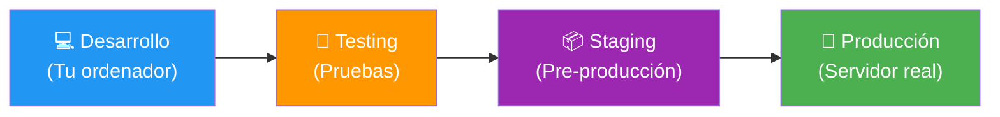
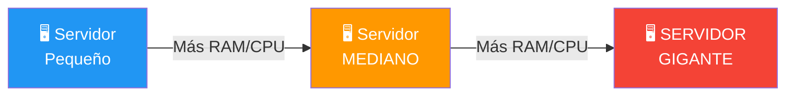
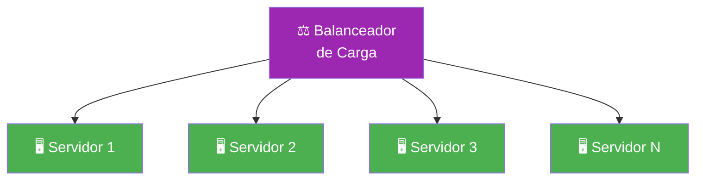
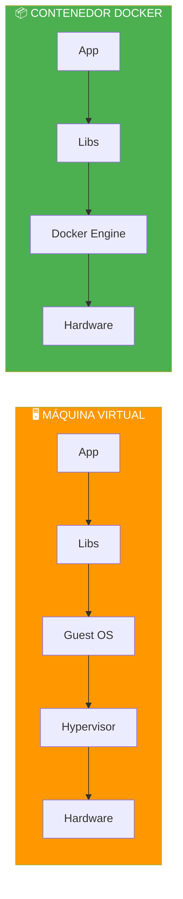
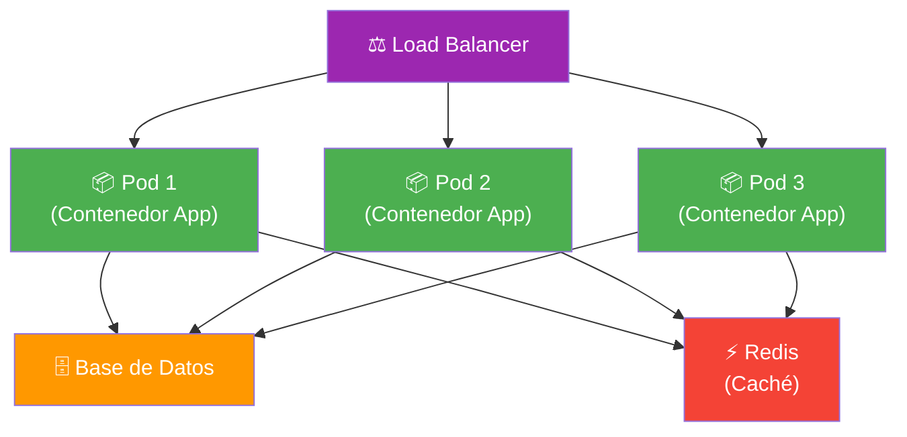
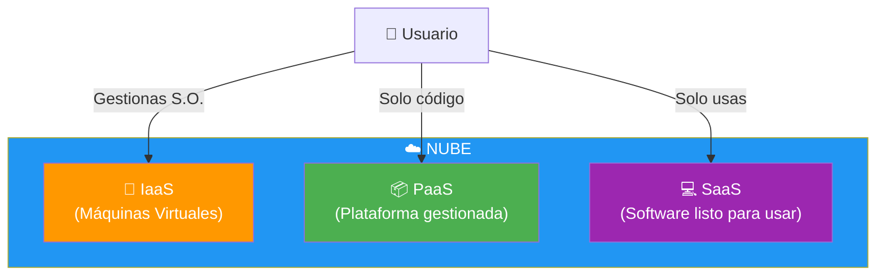
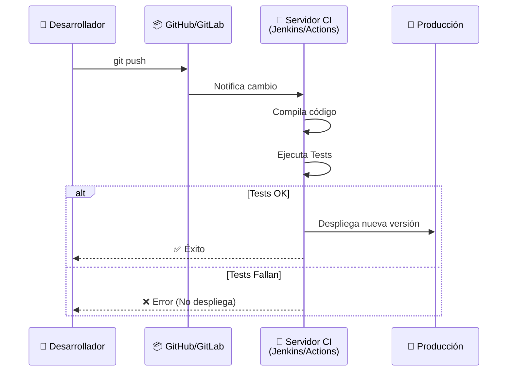

- [9. Despliegue de Aplicaciones Web](#9-despliegue-de-aplicaciones-web)
  - [9.1. ¿Qué es el Despliegue?](#91-qué-es-el-despliegue)
  - [9.2. Escalabilidad: Vertical y Horizontal](#92-escalabilidad-vertical-y-horizontal)
  - [9.3. Contenedores: Docker](#93-contenedores-docker)
  - [9.4. Orquestación: Kubernetes](#94-orquestación-kubernetes)
  - [9.5. Despliegue en la Nube](#95-despliegue-en-la-nube)
  - [9.6. Integración Continua y Despliegue Continuo (CI/CD)](#96-integración-continua-y-despliegue-continuo-cicd)


# 9. Despliegue de Aplicaciones Web

> 💡 **Punto de partida:** Has creado una aplicación web increíble en tu ordenador. Pero, ¿cómo la haces accesible para que todo el mundo la use? ¿Qué pasa cuando llegan 10.000 usuarios al mismo tiempo? ¿Cómo actualizas la aplicación sin que los usuarios noten interrupciones? Todo esto es el **despliegue**, y es donde la teoría se encuentra con la realidad.

En este tema aprenderás los conceptos de despliegue, escalabilidad, contenedores (Docker), orquestación (Kubernetes), la nube y CI/CD.

**Objetivos de aprendizaje:**

- Comprender qué es el despliegue y sus fases
- Distinguir entre escalabilidad vertical y horizontal
- Conocer Docker y cómo empaqueta aplicaciones
- Entender Kubernetes y la orquestación de contenedores
- Analizar los servicios de la nube (AWS, Azure, Google Cloud)
- Comprender qué es CI/CD y por qué es importante

## 9.1. ¿Qué es el Despliegue?

El **despliegue** es el proceso de llevar una aplicación desde el entorno de desarrollo (tu ordenador, "localhost") hasta el entorno de producción (un servidor accesible por Internet).



| Fase | Descripción | Herramientas típicas |
|------|-------------|---------------------|
| **Desarrollo** | Código en tu ordenador | Rider, VS Code, Git |
| **Testing** | Pruebas automatizadas | NUnit, Moq, Selenium |
| **Staging** | Entorno igual al de producción | Docker, Docker Compose |
| **Producción** | Servidor real accesible por usuarios | Azure, AWS, Nginx |

📌 **Ejemplo real:** Cuando Netflix despliega una nueva versión, no lo hace directamente a todos los usuarios. Primero lo prueba con un 1% de usuarios (Canary Release), si funciona bien, lo amplía al 10%, luego al 50% y finalmente al 100%. Así minimiza el riesgo de errores.

Para desplegar una aplicación web necesitas varios elementos:

| Elemento | Descripción | Ejemplo |
|----------|-------------|---------|
| **Software** | S.O., servidores, runtimes | Linux, Nginx, .NET Runtime |
| **Hardware** | CPU, RAM, disco, red | Servidor virtual en Azure |
| **Dependencias** | Librerías y paquetes | Entity Framework Core, Dapper |
| **Configuración** | Variables de entorno, secrets | Connection strings, API keys |

> 💡 **Consejo:** En el tema 01 ya vimos el despliegue. Ahora profundizaremos en cómo hacerlo de forma profesional: con contenedores, orquestación y automatización.

## 9.2. Escalabilidad: Vertical y Horizontal

La **escalabilidad** es la capacidad de una aplicación para crecer y manejar más tráfico sin perder rendimiento.

### Escalabilidad Vertical ("Scale Up")

Consiste en **aumentar los recursos** del servidor: más RAM, mejor CPU, más disco.



| Ventaja | Inconveniente |
|---------|---------------|
| Simple de implementar | Límite físico y de coste |
| No requiere cambios en la app | Si el servidor falla, todo falla |
| Ideal para poco tráfico | No es escalable indefinidamente |

### Escalabilidad Horizontal ("Scale Out")

Consiste en **añadir más servidores** que trabajen juntos.



| Ventaja | Inconveniente |
|---------|---------------|
| Escalable indefinidamente | Más complejo de configurar |
| Si un servidor falla, los demás siguen | Requiere balanceador de carga |
| Ideal para alto tráfico | Los datos deben estar sincronizados |

📌 **Ejemplo real:** Amazon en Black Friday recibe millones de peticiones. No usa un solo servidor gigante (vertical), sino miles de servidores pequeños (horizontal) con un balanceador de carga que reparte el tráfico.

> 💡 **Analogía — Mascotas vs Ganado (Pets vs Cattle):**
> - **Servidores Clásicos (Mascotas):** Les pones nombre (ej. "Zeus"), los cuidas mucho. Si "Zeus" enferma, llamas al veterinario (sysadmin) y pasas la noche en vela para arreglarlo.
> - **Contenedores/Nube (Ganado):** Tienes el número 1045. Si enferma, no lo curas. Lo eliminas y creas uno nuevo idéntico en 1 segundo. No hay apego emocional, solo eficiencia.

> ⚠️ **Advertencia:** La escalabilidad horizontal requiere que la aplicación sea **stateless** (sin estado). Si guardas sesiones en memoria del servidor, cuando el usuario sea redirigido a otro servidor, perderá la sesión. Usa Redis o una base de datos para las sesiones.

## 9.3. Contenedores: Docker

**Docker** es el estándar actual para empaquetar aplicaciones con todas sus dependencias en un "contenedor" ligero y portable.

| Concepto | Descripción |
|----------|-------------|
| **Contenedor** | Unidad de software que incluye código + dependencias + runtime |
| **Imagen** | Plantilla inmutable del contenedor (como una foto) |
| **Dockerfile** | Receta para crear la imagen (instrucciones) |
| **Docker Compose** | Orquestación sencilla de varios contenedores |

### ¿Por qué Docker?

> "En mi máquina funcionaba" → **Se acabó el problema.**

Si funciona en tu Docker, funciona en el servidor, en la nube, en tu compañero's ordenador. Docker elimina los problemas de "dependencias" y "versiones".



📌 **Ejemplo real:** Docker no tiene "Guest OS" como una Máquina Virtual. Por eso es mucho más ligero y arranca en milisegundos. Un contenedor de Node.js pesa 50MB, una VM completa puede pesar 2GB.

### Ejemplo de Dockerfile para ASP.NET Core

```dockerfile
# Dockerfile - Receta para crear la imagen
FROM mcr.microsoft.com/dotnet/sdk:10.0 AS build
WORKDIR /src
COPY *.csproj .
RUN dotnet restore
COPY . .
RUN dotnet publish -c Release -o /app

FROM mcr.microsoft.com/dotnet/aspnet:10.0
WORKDIR /app
COPY --from=build /app .
EXPOSE 5000
ENTRYPOINT ["dotnet", "MiAplicacion.dll"]
```

### Docker Compose para desarrollo local

```yaml
# docker-compose.yml - Orquestación de contenedores
services:
  app:
    build: .
    ports:
      - "5000:5000"
    depends_on:
      - db
      - cache

  db:
    image: postgres:16
    environment:
      POSTGRES_DB: miapp
      POSTGRES_USER: admin
      POSTGRES_PASSWORD: password123
    ports:
      - "5432:5432"

  cache:
    image: redis:7
    ports:
      - "6379:6379"
```

> 📝 **Nota:** Docker Compose es ideal para desarrollo local. En producción, se usa Kubernetes para gestionar miles de contenedores.

## 9.4. Orquestación: Kubernetes

**Kubernetes** (K8s) es el sistema de orquestación de contenedores. Gestiona miles de contenedores, autoescalado, recuperación de fallos y despliegues.

| Función | Descripción |
|---------|-------------|
| **Autoescalado** | Añade o elimina contenedores según la demanda |
| **Auto-recuperación** | Si un contenedor falla, lo reinicia automáticamente |
| **Balanceo de carga** | Distribuye tráfico entre contenedores |
| **Despliegues** | Actualizaciones sin tiempo de inactividad (rolling updates) |



📌 **Ejemplo real:** Netflix usa Kubernetes para gestionar más de 100.000 contenedores. Cuando hay un pico de tráfico (estreno de una serie popular), Kubernetes añade automáticamente más contenedores para manejar la carga.

> 💡 **Consejo:** Para el examen, recuerda la diferencia:
> - **Docker** = Empaqueta la aplicación en un contenedor
> - **Kubernetes** = Gestiona miles de contenedores (orquestación)
> - **CI/CD** = Automatiza la creación y envío de esos contenedores

## 9.5. Despliegue en la Nube

Ya no compramos servidores físicos ("On-premise"), los alquilamos por segundos. Esto se conoce como **Cloud Computing**.

| Modelo | Descripción | Tú gestionas | El proveedor gestiona | Ejemplos |
|--------|-------------|-------------|----------------------|----------|
| **IaaS** | Infraestructura como Servicio | S.O., middleware, datos | Hardware, red, virtualización | AWS EC2, Azure VM |
| **PaaS** | Plataforma como Servicio | Solo tu código y datos | Todo lo demás | Azure App Service, Heroku |
| **SaaS** | Software como Servicio | Solo lo usas | Todo | Gmail, Drive, Salesforce |

### Principales Proveedores de Nube

| Proveedor | Servicios principales | Ventaja |
|-----------|----------------------|---------|
| **AWS** | EC2, S3, Lambda, RDS | El más grande, más servicios |
| **Azure** | App Service, Functions, SQL | Integración con Microsoft/.NET |
| **Google Cloud** | Compute Engine, Cloud Run | Kubernetes, IA/ML |



📌 **Ejemplo real:** Cuando usas Gmail, estás usando **SaaS** (Software as a Service). Cuando despliegas una app en Azure App Service, estás usando **PaaS**. Cuando alquilas un servidor virtual en AWS EC2, estás usando **IaaS**.

> 💡 **Consejo:** Para empezar, **PaaS** es lo más fácil: subes tu código y el proveedor se encarga del resto. Para más control, **IaaS** te da libertad total pero más responsabilidad.

## 9.6. Integración Continua y Despliegue Continuo (CI/CD)

**CI/CD** es la automatización de todo el proceso: desde que el desarrollador guarda código hasta que llega a producción.

| Concepto | Significado | Ejemplo |
|----------|-------------|---------|
| **CI (Continuous Integration)** | Cada commit ejecuta tests automáticamente | `git push` → tests se ejecutan |
| **CD (Continuous Delivery)** | Si los tests pasan, la app está lista para desplegar | Tests OK → build OK → listo |
| **CD (Continuous Deployment)** | Si los tests pasan, se despliega automáticamente a producción | Tests OK → build → despliegue |



### Herramientas CI/CD

| Herramienta | Tipo | Descripción |
|-------------|------|-------------|
| **GitHub Actions** | Cloud | Integrado con GitHub, gratis para repos públicos |
| **GitLab CI/CD** | Cloud | Integrado con GitLab |
| **Jenkins** | On-premise | El más popular, open source |
| **Azure DevOps** | Cloud | Suite completa de Microsoft |
| **Docker Hub** | Cloud | Almacena imágenes Docker |

📌 **Ejemplo real:** Cuando haces `git push` a GitHub, GitHub Actions ejecuta automáticamente los tests del proyecto. Si pasan, builda una imagen Docker y la publica. Si falla, te envía un email con el error. Todo esto sin intervención manual.

> ⚠️ **Advertencia:** Nunca despliegues a producción sin pasar por entornos de prueba. El flujo correcto es: **Desarrollo → Tests → Staging → Producción**. Saltarse pasos es la causa principal de errores en producción.

> 💡 **Consejo:** Para el examen, recuerda que CI/CD automatiza el proceso de "código → tests → build → despliegue". Es fundamental para trabajar en equipo y mantener la calidad del código.

---

**Resumen del punto:**

| Concepto | Descripción |
|----------|-------------|
| **Despliegue** | Proceso de llevar la app de desarrollo a producción |
| **Escalabilidad vertical** | Aumentar recursos de un servidor (más RAM, CPU) |
| **Escalabilidad horizontal** | Añadir más servidores con balanceador de carga |
| **Docker** | Empaqueta la app con dependencias en un contenedor |
| **Docker Compose** | Orquestación sencilla de varios contenedores |
| **Kubernetes** | Orquestación masiva de contenedores (autoescalado, recuperación) |
| **IaaS** | Alquilar máquinas virtuales (AWS EC2, Azure VM) |
| **PaaS** | Subir código, el proveedor gestiona todo (Azure App Service) |
| **SaaS** | Usar software listo (Gmail, Drive) |
| **CI/CD** | Automatizar: commit → tests → build → despliegue |

En el siguiente punto veremos los conceptos clave de seguridad y monitorización: autenticación, autorización, JWT, HTTPS y gestión de logs.
