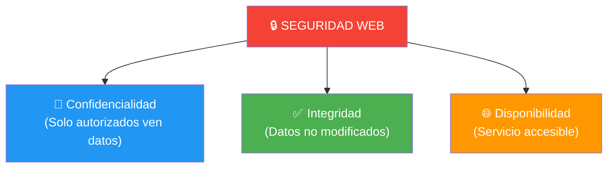
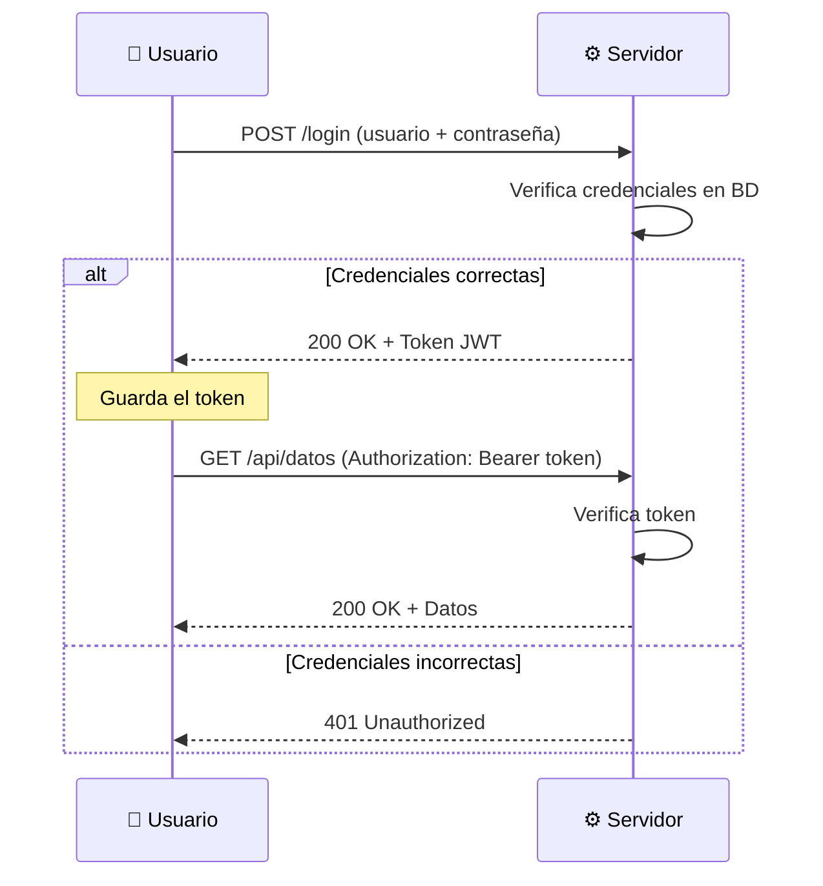
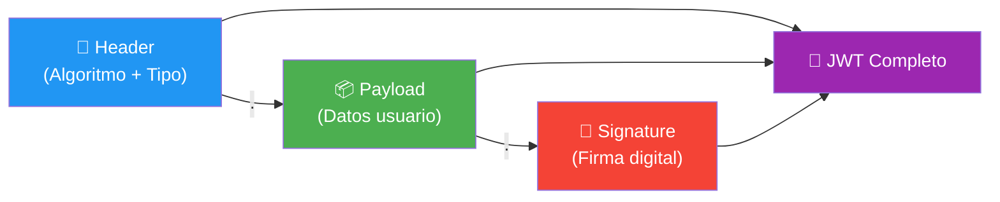
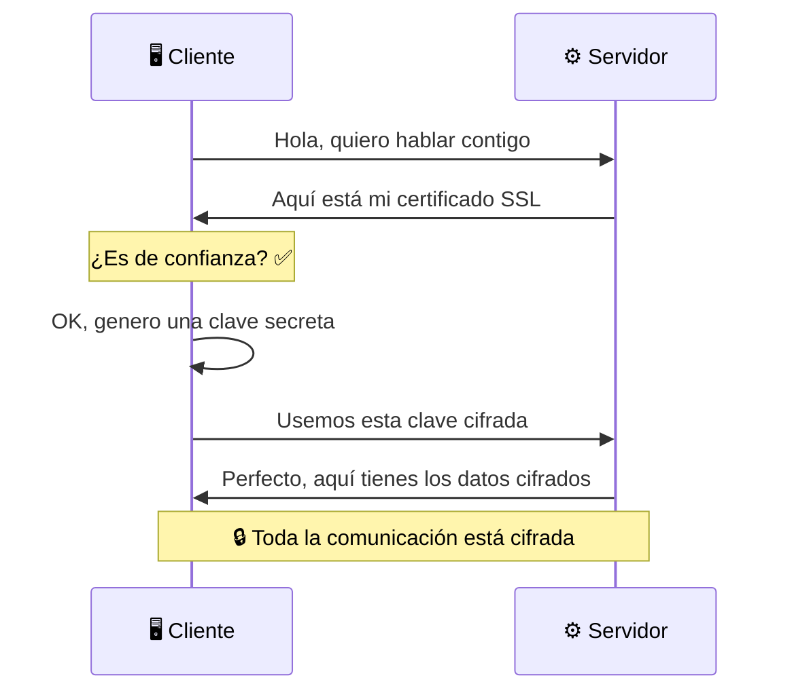
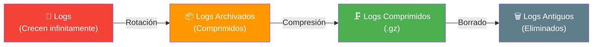

- [10. Seguridad y Monitorización en Aplicaciones Web](#10-seguridad-y-monitorización-en-aplicaciones-web)
  - [10.1. Conceptos Básicos de Seguridad](#101-conceptos-básicos-de-seguridad)
  - [10.2. Autenticación: ¿Quién Eres?](#102-autenticación-quién-eres)
  - [10.3. Autorización: ¿Qué Puedes Hacer?](#103-autorización-qué-puedes-hacer)
  - [10.4. JWT: JSON Web Tokens](#104-jwt-json-web-tokens)
  - [10.5. HTTPS: Comunicación Segura](#105-https-comunicación-segura)
  - [10.6. Otras Amenazas y Buenas Prácticas](#106-otras-amenazas-y-buenas-prácticas)
  - [10.7. Monitorización: Logs y Herramientas](#107-monitorización-logs-y-herramientas)
  - [10.8. Rotación de Logs](#108-rotación-de-logs)


# 10. Seguridad y Monitorización en Aplicaciones Web

> 💡 **Punto de partida:** Tu aplicación funciona genial, pero... ¿es segura? ¿Qué pasa si alguien intenta entrar con una contraseña falsa? ¿Y si envía datos maliciosos en un formulario? ¿Cómo sabes si alguien está intentando atacar tu servidor? La seguridad no es opcional: es un requisito básico. Y para detectar problemas, necesitas **monitorización**. Vamos a ver cómo proteger nuestras aplicaciones y cómo detectar fallos.

En este tema aprenderás los conceptos clave de seguridad web (autenticación, autorización, JWT, HTTPS) y cómo monitorizar aplicaciones con logs y herramientas especializadas.

**Objetivos de aprendizaje:**

- Comprender los conceptos de autenticación y autorización
- Entender cómo funciona JWT (JSON Web Tokens)
- Conocer la importancia de HTTPS y los certificados SSL/TLS
- Identificar las principales amenazas de seguridad web
- Aprender a monitorizar aplicaciones con logs
- Conocer herramientas de monitorización y gestión de logs

## 10.1. Conceptos Básicos de Seguridad

La seguridad web se basa en tres pilares fundamentales conocidos como **triada CIA**:

| Pilar | Significado | Ejemplo |
|-------|-------------|---------|
| **Confidencialidad** | Solo los autorizados ven los datos | Contraseñas cifradas, HTTPS |
| **Integridad** | Los datos no se han modificado maliciosamente | Checksums, firmas digitales |
| **Disponibilidad** | El servicio está accesible cuando se necesita | Backup, redundancia, CDN |



📌 **Ejemplo real:** Cuando introduces tu contraseña en Gmail, se envía cifrada (confidencialidad), no puede ser alterada en el camino (integridad) y el servicio está disponible 24/7 (disponibilidad).

> 💡 **Analogía — El Pasaporte y la Pulsera del Hotel:**
> - **Autenticación (Pasaporte):** Demuestras quién eres en el mostrador del hotel. Te validan y te dan acceso.
> - **Autorización (Pulsera TI):** Una vez dentro, la pulsera dice qué puedes hacer. ¿Tienes la pulsera "Todo Incluido" (Admin) o la "Solo Desayuno" (User)? Puedes ser Obama (Autenticado), pero si no tienes la pulsera VIP (Autorizado), no entras a la zona VIP.

## 10.2. Autenticación: ¿Quién Eres?

La **autenticación** es el proceso de verificar la identidad de un usuario. "¿Quién eres?"

### Métodos de Autenticación

| Método | Descripción | Seguridad | Cuándo usarlo |
|--------|-------------|-----------|---------------|
| **HTTP Basic** | Usuario/Contraseña en Base64 | ⚠️ Baja (solo con HTTPS) | APIs internas, desarrollo |
| **HTTP Digest** | Envía hash, no la contraseña | Media | Sistemas legacy |
| **Cookies/Session** | Cookie con ID de sesión en servidor | Alta | Web apps tradicionales |
| **Token (JWT)** | Token firmado con datos del usuario | Alta | APIs REST, SPA, móviles |
| **OAuth 2.0** | Login con Google, GitHub, etc. | Muy alta | SSO, apps de terceros |



📌 **Ejemplo real:** Cuando haces login en Instagram con tu email y contraseña, Instagram verifica esas credenciales en su base de datos. Si son correctas, te devuelve un token JWT que usas en todas las peticiones siguientes.

> ⚠️ **Advertencia:** HTTP Basic envía la contraseña en Base64 (que se decodifica fácilmente). **NUNCA** uses HTTP Basic sin HTTPS. Incluso con HTTPS, es mejor usar JWT para APIs.

### Ejemplo de autenticación básica en ASP.NET Core

```csharp
// Autenticación básica con JWT en ASP.NET Core
var builder = WebApplication.CreateBuilder(args);

// Configurar JWT
builder.Services.AddAuthentication("Bearer")
    .AddJwtBearer(options =>
    {
        options.TokenValidationParameters = new()
        {
            ValidateIssuer = true,
            ValidateAudience = true,
            ValidateLifetime = true,
            ValidateIssuerSigningKey = true,
            ValidIssuer = "https://miapp.com",
            ValidAudience = "https://miapp.com",
            IssuerSigningKey = new SymmetricSecurityKey(
                Encoding.UTF8.GetBytes("MiClaveSecretaSuperSegura123!"))
        };
    });

builder.Services.AddAuthorization();

var app = builder.Build();

app.UseAuthentication();
app.UseAuthorization();

// Endpoint público
app.MapGet("/", () => "¡Bienvenido!");

// Endpoint protegido (requiere autenticación)
app.MapGet("/api/datos-privados", () =>
{
    return new { Mensaje = "Estos son datos privados", Fecha = DateTime.Now };
}).RequireAuthorization();

app.Run();
```

## 10.3. Autorización: ¿Qué Puedes Hacer?

La **autorización** determina qué puede hacer un usuario una vez autenticado. "¿Qué permisos tienes?"

| Concepto | Descripción | Ejemplo |
|----------|-------------|---------|
| **RBAC** | Role-Based Access Control (por roles) | Admin, User, Moderator |
| **ABAC** | Attribute-Based Access Control (por atributos) | Solo usuarios de Madrid |
| **ACL** | Access Control List (listas de acceso) | Archivos con permisos específicos |

```csharp
// Autorización por roles en ASP.NET Core
var app = builder.Build();

app.UseAuthentication();
app.UseAuthorization();

// Solo administradores pueden ver todos los usuarios
app.MapGet("/api/admin/usuarios", () =>
{
    return new { Lista = "Todos los usuarios" };
}).RequireAuthorization("AdminPolicy");

// Cualquier usuario autenticado puede ver su perfil
app.MapGet("/api/perfil", () =>
{
    return new { Perfil = "Datos del usuario" };
}).RequireAuthorization();

// Endpoint público (sin autenticación)
app.MapGet("/api/publico", () =>
{
    return new { Info = "Información pública" };
});
```

> 📝 **Nota:** Recuerda la diferencia fundamental:
> - **Autenticación**: ¿Quién eres? (identidad)
> - **Autorización**: ¿Qué puedes hacer? (permisos)
>
> Primero te autenticas, luego el sistema comprueba qué estás autorizado a hacer.

## 10.4. JWT: JSON Web Tokens

**JWT** (JSON Web Tokens) es el estándar actual para autenticación en APIs. Un JWT es un token firmado que contiene datos del usuario.

### Estructura de un JWT

Un JWT tiene tres partes separadas por puntos: `HEADER.PAYLOAD.SIGNATURE`

| Parte | Contenido | Ejemplo |
|-------|-----------|---------|
| **Header** | Algoritmo de firma y tipo de token | `{"alg":"HS256","typ":"JWT"}` |
| **Payload** | Datos del usuario (claims) | `{"sub":1,"name":"Ana","role":"admin"}` |
| **Signature** | Firma digital para verificar integridad | `HMACSHA256(base64(header)+"."+base64(payload), secret)` |



📌 **Ejemplo real:** Cuando haces login en una SPA (Single Page Application) con React:
1. El servidor verifica tu usuario y contraseña
2. Devuelve un JWT como: `eyJhbGciOiJIUzI1NiJ9.eyJzdWIiOjEsIm5hbWUiOiJBbmEifQ.firma`
3. React guarda ese token en `localStorage`
4. En cada petición, React envía el token en la cabecera `Authorization: Bearer eyJhbGci...`
5. El servidor verifica la firma y confía en los datos del token

> 💡 **Consejo:** JWT es ideal para APIs REST porque es **stateless** (sin estado). El servidor no necesita guardar la sesión: el token contiene toda la información. Esto facilita la escalabilidad horizontal.

> ⚠️ **Advertencia:** **NUNCA** guardes datos sensibles en el payload de un JWT (como contraseñas o datos bancarios). El payload se puede leer (aunque no modificar sin la firma). Guarda solo datos no sensibles como ID, nombre y rol.

## 10.5. HTTPS: Comunicación Segura

**HTTPS** es HTTP con cifrado SSL/TLS. La "S" significa **Secure** (seguro).



| HTTP | HTTPS |
|------|-------|
| Puerto 80 | Puerto 443 |
| Datos en texto plano | Datos cifrados (SSL/TLS) |
| No autentica al servidor | Autentica al servidor (certificado) |
| Vulnerable a interceptación | Protegido contra ataques Man-in-the-Middle |
| Google lo marca "No seguro" | Google lo marca "Seguro" |

### Certificados SSL/TLS

| Tipo | Descripción | Coste |
|------|-------------|-------|
| **Let's Encrypt** | Certificado gratuito, automático | Gratis |
| **Certificado comercial** | Más opciones, soporte | 10-200€/año |
| **Wildcard** | Cubre todos los subdominios | 50-300€/año |
| **EV (Extended Validation)** | Máxima verificación, barra verde | 100-500€/año |

> ⚠️ **Advertencia:** Hoy en día, **todas** las aplicaciones web deben usar HTTPS. Google Chrome marca como "No seguro" las webs sin HTTPS. Los certificados SSL son gratuitos con Let's Encrypt.

> 💡 **Consejo:** Para el examen, recuerda que HTTPS = HTTP + cifrado SSL/TLS. Usa siempre HTTPS en producción. Let's Encrypt ofrece certificados gratuitos.

## 10.6. Otras Amenazas y Buenas Prácticas

### Principales Amenazas de Seguridad

| Amenaza | Descripción | Cómo prevenirla |
|---------|-------------|-----------------|
| **SQL Injection** | Inyectar código SQL en formularios | Usar parámetros (nunca concatenar strings) |
| **XSS** | Inyectar JavaScript malicioso | Sanitizar entradas, Content Security Policy |
| **CSRF** | Forzar acciones no deseadas | Tokens CSRF, SameSite cookies |
| **Brute Force** | Probar contraseñas automáticamente | Rate limiting, bloqueo de cuenta |
| **Man-in-the-Middle** | Interceptación de comunicaciones | HTTPS, certificados SSL |

```csharp
// ❌ MALO: SQL Injection - NUNCA concatenar strings
var query = $"SELECT * FROM Usuarios WHERE Email = '{email}'";
// Un atacante podría enviar: email = "'; DROP TABLE Usuarios; --"

// ✅ BUENO: Usar parámetros
var query = "SELECT * FROM Usuarios WHERE Email = @Email";
command.Parameters.AddWithValue("@Email", email);
```

### Buenas Prácticas de Seguridad

| Práctica | Descripción |
|----------|-------------|
| **Hash de contraseñas** | Usar bcrypt, scrypt o Argon2 (NUNCA MD5/SHA1) |
| **Rate limiting** | Limitar peticiones por IP/timeframe |
| **Validación de entradas** | Sanitizar todos los datos que llegan del usuario |
| **CORS** | Configurar orígenes permitidos |
| **Headers de seguridad** | Content-Security-Policy, X-Frame-Options |
| **Actualizaciones** | Mantener dependencias actualizadas |

> 📝 **Nota:** La regla de oro de la seguridad: **NUNCA confíes en el cliente**. Siempre valida los datos en el servidor. Un atacante puede desactivar JavaScript, modificar formularios y enviar cualquier cosa al servidor.

## 10.7. Monitorización: Logs y Herramientas

Los **logs** son la "caja negra" del servidor. Si algo falla, lo primero que se mira es el log.

### Tipos de Logs

| Tipo | Contenido | Ejemplo de uso |
|------|-----------|----------------|
| **Access Log** | Quién entra, qué pide, código de estado | Analizar tráfico, detectar ataques |
| **Error Log** | Errores del servidor, excepciones | Diagnosticar fallos |
| **Application Log** | Logs de la aplicación (custom) | Seguimiento de procesos de negocio |
| **Security Log** | Intentos de login, accesos no autorizados | Detectar intrusiones |

### Formato de Log CLF (Common Log Format)

```
192.168.1.100 - ana@email.com [06/Sep/2026:10:30:00 +0100] "GET /api/usuarios HTTP/1.1" 200 1234
│             │            │                │                          │         │    │
│             │            │                │                          │         │    └─ Tamaño (bytes)
│             │            │                │                          │         └─ Código de estado
│             │            │                │                          └─ Petición
│             │            │                └─ Fecha y hora
│             │            └─ Usuario
│             └─ IP del cliente
└─ IP del proxy
```

### Logging en ASP.NET Core

```csharp
// Logging con ASP.NET Core (Microsoft.Extensions.Logging)
var builder = WebApplication.CreateBuilder(args);

// Configurar logging
builder.Logging.ClearProviders();
builder.Logging.AddConsole();
builder.Logging.AddFile("logs/app-{Date}.txt");

var app = builder.Build();

app.MapGet("/api/usuarios", (ILogger<Program> logger) =>
{
    logger.LogInformation("Consultando lista de usuarios");

    try
    {
        var usuarios = new[] { "Ana", "Carlos", "María" };
        logger.LogDebug("Se encontraron {Count} usuarios", usuarios.Length);
        return Results.Ok(usuarios);
    }
    catch (Exception ex)
    {
        logger.LogError(ex, "Error al consultar usuarios");
        return Results.StatusCode(500);
    }
});

app.Run();
```

📌 **Ejemplo real:** Cuando algo falla en producción, el primer paso es mirar los logs. Si ves `ERROR: Connection refused to database`, sabes que el problema es la conexión a la BD. Si ves `WARNING: Rate limit exceeded`, sabes que alguien está haciendo demasiadas peticiones.

> 💡 **Consejo:** Cuando algo no funcione, lo primero que te diré es: **"¿Qué dice el log?"**. Acostúmbrate a leer `/var/log/apache2/error.log` o equivalente. Los logs son tu mejor amigo para diagnosticar problemas.

## 10.8. Rotación de Logs

Los logs ocupan espacio. Si no se gestionan, el disco duro se llena y el servidor se cae. La **rotación de logs** consiste en:

1. **Archivar** el log actual (`access.log` → `access.log.1`)
2. **Comprimir** los antiguos (`access.log.2.gz`)
3. **Borrar** los muy antiguos

### Configuración con logrotate

```bash
# /etc/logrotate.d/miapp
/var/log/miapp/*.log {
    daily           # Rotar cada día
    missingok       # No error si el log no existe
    rotate 14       # Guardar 14 días
    compress        # Comprimir antiguos
    delaycompress   # Comprimir después de 2 días
    notifempty      # No rotar si está vacío
    create 0644 root root  # Crear nuevo log con permisos
}
```

| Herramienta | Descripción | Uso típico |
|-------------|-------------|------------|
| **logrotate** | Rotación de logs en Linux | Sistemas Unix/Linux |
| **Serilog** | Logging estructurado en .NET | ASP.NET Core |
| **ELK Stack** | Elasticsearch + Logstash + Kibana | Análisis de logs a gran escala |
| **Splunk** | Plataforma de monitorización | Enterprise |



> ⚠️ **Advertencia:** Si no rotas los logs, el disco duro se llena y el servidor se cae. Siempre configura logrotate o una herramienta equivalente.

> 💡 **Consejo:** Para el examen, recuerda que los logs son fundamentales para diagnosticar problemas. Los tres tipos principales son: Access Log (quién entra), Error Log (qué falla) y Application Log (procesos de negocio). La rotación de logs evita que el disco se llene.

---

**Resumen del punto:**

| Concepto | Descripción |
|----------|-------------|
| **Confidencialidad** | Solo los autorizados ven los datos |
| **Integridad** | Los datos no se modifican maliciosamente |
| **Disponibilidad** | El servicio está accesible cuando se necesita |
| **Autenticación** | Verificar la identidad del usuario (¿quién eres?) |
| **Autorización** | Determinar qué puede hacer (¿qué permisos tienes?) |
| **JWT** | Token firmado con datos del usuario para APIs |
| **HTTPS** | HTTP con cifrado SSL/TLS, seguro |
| **SQL Injection** | Inyectar código SQL, se previene con parámetros |
| **XSS** | Inyectar JavaScript malicioso, se previene sanitizando |
| **Logs** | Registros de actividad del servidor y la aplicación |
| **Access Log** | Quién entra, qué pide, código de estado |
| **Error Log** | Errores y excepciones del servidor |
| **Rotación de logs** | Archivar, comprimir y borrar logs antiguos |

---

¡Enhorabuena! Has completado la primera unidad didáctica del módulo de Desarrollo Web en Entorno Servidor. Ahora tienes una visión completa de cómo funciona una aplicación web: desde la arquitectura cliente-servidor hasta la seguridad y monitorización, pasando por los protocolos, tecnologías y despliegue.

En la siguiente unidad profundizaremos en **ASP.NET Core**, el framework que usaremos durante todo el curso para desarrollar aplicaciones web en C#.
