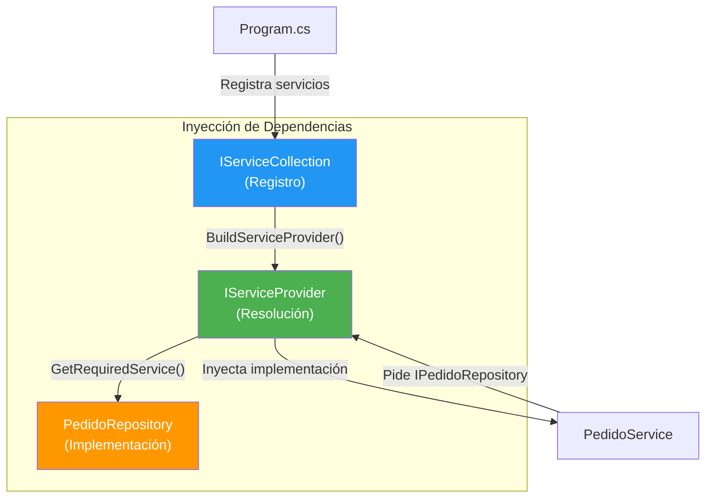
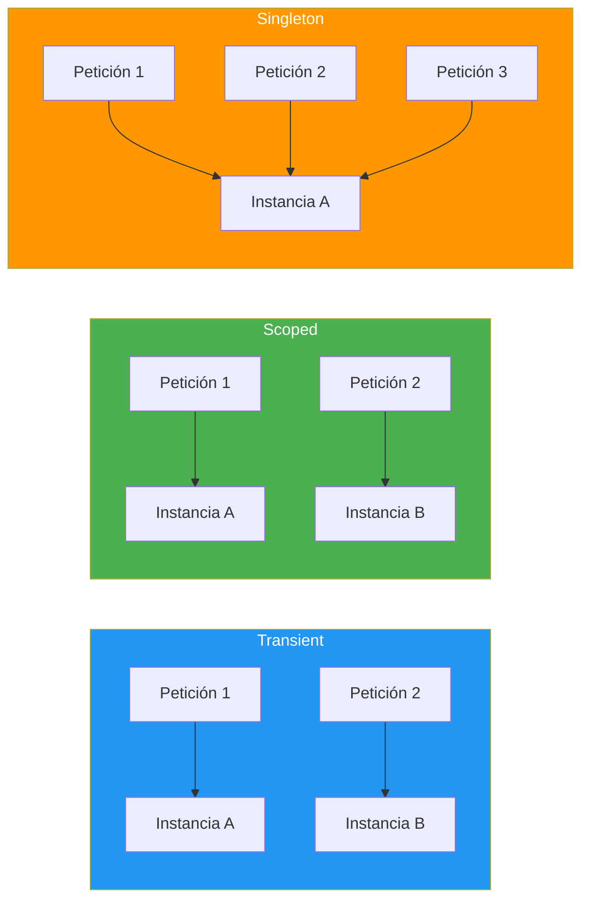
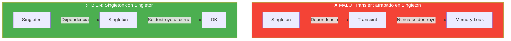
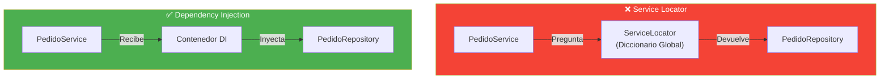

- [11. Inyección de Dependencias](#11-inyección-de-dependencias)
  - [11.1. El Problema: Acoplamiento Duro](#111-el-problema-acoplamiento-duro)
  - [11.2. Principio SOLID de Inversión de Dependencias](#112-principio-solid-de-inversión-de-dependencias)
  - [11.3. Inyección de Dependencias en C#](#113-inyección-de-dependencias-en-c)
  - [11.4. Ciclo de Vida de los Servicios](#114-ciclo-de-vida-de-los-servicios)
  - [11.5. Service Locator: El Anti-Patrón](#115-service-locator-el-anti-patrón)
  - [11.6. Métodos de Inyección](#116-métodos-de-inyección)
  - [11.7. DI en Aplicaciones de Consola](#117-di-en-aplicaciones-de-consola)
    - [11.7.1. Estructura de Carpetas de un Proyecto C#](#1171-estructura-de-carpetas-de-un-proyecto-c)
  - [11.8. Scrutor: Assembly Scanning Automático](#118-scrutor-assembly-scanning-automático)
  - [11.9. Patrones de Diseño con DI](#119-patrones-de-diseño-con-di)


# 11. Inyección de Dependencias

> 💡 **Punto de partida:** Imagina que cada vez que necesitas un café, tuvieses que construir la cafetera, moler el café y prepararlo todo desde cero. Absurdo, ¿verdad? Pues eso es lo que hacemos cuando una clase crea sus propias dependencias en vez de recibirlas "de fuera". La Inyección de Dependencias es como ir a una cafetería: tú pides el café, alguien más se encarga de prepararlo.

En este tema aprenderás qué es la Inyección de Dependencias, por qué es fundamental en ASP.NET Core y cómo aplicarla incluso en aplicaciones de consola.

**Objetivos de aprendizaje:**

- Comprender el problema del acoplamiento duro y cómo resolverlo
- Entender el Principio de Inversión de Dependencias (D de SOLID)
- Conocer los ciclos de vida: Transient, Scoped, Singleton
- Aplicar DI en aplicaciones de consola con `Microsoft.Extensions.DependencyInjection`
- Usar Scrutor para evitar registros manuales

## 11.1. El Problema: Acoplamiento Duro

Cuando una clase crea directamente sus dependencias, queda **acoplada** a esas implementaciones. Esto hace que el código sea difícil de cambiar, probar y mantener.

```csharp
// ❌ MALO: Acoplamiento duro — la clase crea sus propias dependencias
public class PedidoService
{
    private readonly PedidoRepository _repository = new(); // ¡Depende de la implementación!
    private readonly EmailService _email = new();          // ¡Otra dependencia directa!

    public void CrearPedido(Pedido pedido)
    {
        _repository.Guardar(pedido);
        _email.EnviarConfirmacion(pedido.Cliente.Email);
    }
}
```

📌 **Ejemplo real:** En una tienda online, si `PedidoService` crea directamente `PedidoRepository`, no puedes cambiar de PostgreSQL a MongoDB sin modificar `PedidoService`. Y no puedes hacer tests unitarios porque siempre intenta conectar a la base de datos real.

> 💡 **Analogía:** Es como si cada vez que fueras al cine, tuvieses que construir tu propia butaca. Si cambias de cine, tienes que construir otra butaca. La DI es como sentarte en la butaca que el cine te ofrece.

## 11.2. Principio SOLID de Inversión de Dependencias

El **principio D de SOLID** dice: "Depende de abstracciones, no de implementaciones".

```csharp
// ✅ BUENO: Depende de una interfaz (abstracción), no de una clase concreta
public class PedidoService(IPedidoRepository repository, IEmailService email)
{
    public void CrearPedido(Pedido pedido)
    {
        repository.Guardar(pedido);
        email.EnviarConfirmacion(pedido.Cliente.Email);
    }
}
```

| Concepto | Acoplamiento Duro | DI (Inversión) |
|----------|-------------------|----------------|
| **Dependencia** | Clase concreta (`new PedidoRepository()`) | Interfaz (`IPedidoRepository`) |
| **Creación** | La clase crea sus dependencias | Las recibe por constructor |
| **Testeo** | Difícil (depende de BBDD real) | Fácil (se puede inyectar un mock) |
| **Cambio** | Hay que modificar la clase | Solo cambia la configuración DI |

## 11.3. Inyección de Dependencias en C#

En .NET, la DI está integrada en el framework. Se usa `IServiceCollection` para registrar servicios y `IServiceProvider` para resolverlos.



```csharp
// Registro de servicios
var services = new ServiceCollection();
services.AddTransient<IPedidoRepository, PedidoRepository>(); // Nueva instancia cada vez
services.AddScoped<IPedidoService, PedidoService>();          // Una por petición HTTP
services.AddSingleton<ICacheService, CacheService>();         // Una sola para toda la app

// Resolución de servicios
var provider = services.BuildServiceProvider();
var service = provider.GetRequiredService<IPedidoService>();
```

> 📝 **Nota:** En ASP.NET Core, la DI está configurada automáticamente en `Program.cs`. No necesitas crear `ServiceCollection` manualmente, pero entender cómo funciona es fundamental.

### Flujo de resolución DI

Cuando pides un servicio, el contenedor resuelve **recursivamente** todas sus dependencias:

```mermaid
sequenceDiagram
    participant C as 🧵 Cliente
    participant P as 📦 IServiceProvider
    participant S as ⚙️ PedidoService
    participant R as 🗄️ PedidoRepository
    participant D as 🐘 DbContext

    C->>P: GetRequiredService<IPedidoService>()
    P->>P: ¿PedidoService tiene dependencias?
    P->>P: Sí: IPedidoRepository + IEmailService
    P->>P: ¿PedidoRepository tiene dependencias?
    P->>P: Sí: AppDbContext
    P->>D: new AppDbContext(options)
    P->>R: new PedidoRepository(context)
    P->>S: new PedidoService(repository, email)
    P-->>C: PedidoService listo ✅

    style P fill:#4CAF50,color:#fff
```

## 11.4. Ciclo de Vida de los Servicios

Cada servicio registrado tiene un **ciclo de vida** que determina cuánto tiempo vive la instancia:

| Ciclo | Cuándo se crea | Cuándo se destruye | Ejemplo |
|-------|---------------|-------------------|---------|
| **Transient** | Cada vez que se pide | Al finalizar la petición | Repositorios, servicios ligeros |
| **Scoped** | Una vez por petición HTTP | Al finalizar la petición | DbContext, servicios de negocio |
| **Singleton** | Una vez al inicio de la app | Cuando la app se cierra | Cache, configuración, logs |



```csharp
// Transient: nueva instancia cada vez
services.AddTransient<IPedidoRepository, PedidoRepository>();

// Scoped: una por petición HTTP (misma instancia en la misma request)
services.AddScoped<IPedidoService, PedidoService>();

// Singleton: una sola instancia para toda la app
services.AddSingleton<ICacheService, CacheService>();
```

> ⚠️ **Advertencia — Captive Dependency:** No inyectes un servicio **Transient** dentro de uno **Singleton**. El servicio Transiente quedará "atrapado" y nunca se destruirá, causando memory leaks.



## 11.5. Service Locator: El Anti-Patrón

El **Service Locator** es un patrón que se usa como alternativa a la DI, pero es considerado un **anti-patrón** porque oculta las dependencias y dificulta el testing.

```csharp
// ❌ MALO: Service Locator (anti-patrón)
public class PedidoService
{
    private readonly IPedidoRepository _repository;

    public PedidoService()
    {
        // Busca la dependencia en un "diccionario global"
        _repository = ServiceLocator.Get<IPedidoRepository>();
    }
}
```



> 💡 **Analogía — Service Locator:**
> Es como ir al supermercado y preguntar en cada pasillo "¿quién me da leche?", "¿quién me da pan?", "¿quién me da huevos?". Tienes que recorrer todo el supermercado preguntando. Con **DI**, la compra te llega a casa empaquetada: tú pides una bolsa y contiene todo lo que necesitas.

| Característica | DI (Inyección) | Service Locator |
|----------------|----------------|-----------------|
| **Dependencias** | Explícitas (constructor) | Ocultas (buscar en runtime) |
| **Testing** | Fácil (inyectar mock) | Difícil (mockear el locator) |
| **Mantenibilidad** | Alta (se ve en el constructor) | Baja (dependencias ocultas) |
| **Acoplamiento** | Bajo | Alto (al locator) |

> ⚠️ **Regla:** **NUNCA** uses Service Locator en C#. Siempre usa Inyección de Dependencias por constructor. ASP.NET Core no usa Service Locator — todo se resuelve por constructor.

## 11.6. Métodos de Inyección

Hay varias formas de inyectar dependencias. La más recomendada es por **constructor**:

| Método | Sintaxis | Ventajas | Desventajas |
|--------|----------|----------|-------------|
| **Constructor** | `Service(IRepo repo)` | Explícito, testeable, inmutable | Muchos parámetros |
| **Propiedad** | `[Inject] IRepo Repo { get; set; }` | Opcional | Oculto, mutable |
| **Método** | `[Inject] void Init(IRepo repo)` | Post-construcción | Poco claro |

```csharp
// ✅ RECOMENDADO: Inyección por constructor
public class PedidoService(IPedidoRepository repository, IEmailService email) : IPedidoService
{
    public void CrearPedido(Pedido pedido)
    {
        repository.Guardar(pedido);
        email.EnviarConfirmacion(pedido.Cliente.Email);
    }
}

// ❌ EVITAR: Inyección por propiedad
public class PedidoService
{
    [Inject] public IPedidoRepository Repository { get; set; } // Oculto, mutable
}
```

> 💡 **Consejo:** Usa **inyección por constructor** siempre. Si una clase tiene demasiados parámetros (más de 5), es una señal de que necesita ser refactorizada (SRP — Single Responsibility Principle).

## 11.7. DI en Aplicaciones de Consola

En una app de consola no hay `Program.cs` de ASP.NET Core, pero podemos configurar DI manualmente:

```csharp
using Microsoft.Extensions.DependencyInjection;

// Crear el contenedor de servicios
var services = new ServiceCollection();

// Registrar servicios
services.AddTransient<IAcademiaService, AcademiaService>();
services.AddSingleton<IPersonasRepository, PersonasMemoryRepository>();
services.AddSingleton<ICache<int, Persona>>(sp => new LruCache<int, Persona>(100));

// Construir el provider
var provider = services.BuildServiceProvider();

// Resolver servicios
using var scope = provider.CreateScope();
var service = scope.ServiceProvider.GetRequiredService<IAcademiaService>();

// Usar el servicio
var personas = service.GetAll();
```

📌 **Ejemplo real:** El proyecto de Gestión Académica que viste en 1º usa este patrón. La carpeta `Infrastructure/DependenciesProvider.cs` centraliza todos los registros de DI.

> 📝 **Nota:** En apps de consola, usa `CreateScope()` para que los servicios Scoped se comporten correctamente. Cuando el scope se dispose, todos los servicios Scoped se limpian.

### 11.7.1. Estructura de Carpetas de un Proyecto C#

Cuando montas un proyecto con DI, es vital organizar bien las carpetas. No es solo estética — es **arquitectura**. Cada carpeta tiene una responsabilidad clara:

```
MiProyecto/
├── Program.cs                  # Punto de entrada (Top Level Statements)
├── Models/                     # Modelos de dominio (records, clases)
│   └── Personas/               # Subcarpetas por dominio
├── Entity/                     # Entidades de persistencia (EF Core, etc.)
│   └── AppDbContext.cs         # DbContext SIEMPRE en Entity/, NUNCA en Repositories/
├── Repositories/               # Acceso a datos (patrón Repository)
│   ├── Personas/               # Implementaciones por tipo
│   │   ├── Base/               # Interfaz base
│   │   ├── Memory/             # Implementación en memoria
│   │   ├── Json/               # Implementación JSON
│   │   └── EfCore/             # Implementación EF Core
│   └── Dapper/                 # Implementaciones con Dapper
├── Services/                   # Lógica de negocio
├── Factories/                  # Creación de objetos
├── Config/                     # Configuración (AppConfig.cs)
├── Enums/                      # Enumeraciones
├── Exceptions/                 # Excepciones personalizadas
├── Extensions/                 # Métodos de extensión
├── Validators/                 # Validaciones
├── Cache/                      # Caché (ICache, LruCache)
└── Infrastructure/             # Infraestructura técnica
    └── DependenciesProvider.cs # Configuración de DI
```

> 💡 **Regla de oro:** Si no sabes dónde poner un archivo, pregúntate: *"¿Qué hace esta clase?"*
> - **Guarda datos** → `Repositories/`
> - **Ejecuta lógica de negocio** → `Services/`
> - **Representa un concepto del dominio** → `Models/`
> - **Se conecta a una BD** → `Entity/` (si es EF Core) o `Repositories/` (si es Dapper)
> - **Configura la app** → `Config/`
> - **Orquesta todo** → `Infrastructure/`

📌 **Ejemplo real:** El proyecto de Gestión Académica de 1º sigue esta estructura. `DependenciesProvider.cs` centraliza todos los registros de DI, y cada repositorio va en su subcarpeta según la implementación (Memory, Json, EfCore...).

> ⚠️ **Advertencia común:** Muchos alumnos meten el `AppDbContext` dentro de `Repositories/`. **NUNCA** hagas eso. El DbContext es una entidad de persistencia, no un repositorio. Va en `Entity/`.

## 11.8. Scrutor: Assembly Scanning Automático

### Instalación

```bash
dotnet add package Scrutor
```

Con **Scrutor**, puedes registrar servicios automáticamente escaneando ensamblados, evitando escribir `services.AddTransient<IFoo, Foo>()` uno por uno.

```csharp
using Scrutor;

var services = new ServiceCollection();

// Escanear el ensamblado actual y registrar automáticamente
services.Scan(scan => scan
    .FromAssemblyOf<Program>()
        // Registrar todas las clases que implementan ITransientService
        .AddClasses(classes => classes.AssignableTo<ITransientService>())
            .AsImplementedInterfaces()
            .WithTransientLifetime()
        // Registrar todas las clases que implementan IScopedService
        .AddClasses(classes => classes.AssignableTo<IScopedService>())
            .AsImplementedInterfaces()
            .WithScopedLifetime()
        // Registrar todas las clases que implementan ISingletonService
        .AddClasses(classes => classes.AssignableTo<ISingletonService>())
            .AsImplementedInterfaces()
            .WithSingletonLifetime()
);

// Decorar un servicio existente (patrón decorator)
services.Decorate<IPedidoService, PedidoServiceConLog>();
```

| Sin Scrutor | Con Scrutor |
|-------------|-------------|
| `services.AddTransient<IPedidoRepo, PedidoRepo>();` | Escanea y registra automáticamente |
| `services.AddTransient<IClienteRepo, ClienteRepo>();` | Un solo `services.Scan(...)` |
| `services.AddTransient<IEmailService, EmailService>();` | Convierte más de 50 registros en uno solo |

> 💡 **Consejo:** Usa interfaces auxiliares como `ITransientService`, `IScopedService` e `ISingletonService` como marcadores. Scrutor las usa para filtrar qué clases registrar.

### Infrastructure/DependenciesProvider.cs

El patrón `Infrastructure/DependenciesProvider.cs` centraliza toda la configuración de DI. Primero veamos la versión **sin Scrutor** (manual), luego la versión **con Scrutor**.

#### Sin Scrutor (manual)

```csharp
using Microsoft.Extensions.DependencyInjection;

namespace Academia.Infrastructure;

public static class DependenciesProvider
{
    public static IServiceProvider BuildServiceProvider()
    {
        var services = new ServiceCollection();

        // Repositories — Transient
        services.AddTransient<IPedidoRepository, PedidoRepository>();
        services.AddTransient<IEmailService, EmailService>();

        // Services — Scoped
        services.AddScoped<IPedidoService, PedidoService>();

        // Cache — Singleton
        services.AddSingleton<ICacheService, CacheService>();

        return services.BuildServiceProvider();
    }
}
```

#### Con Scrutor (automático)

```csharp
using Microsoft.Extensions.DependencyInjection;
using Scrutor;

namespace Academia.Infrastructure;

public static class DependenciesProvider
{
    public static IServiceProvider BuildServiceProvider()
    {
        var services = new ServiceCollection();

        // Escanear y registrar automáticamente según marcador
        services.Scan(scan => scan
            .FromAssemblyOf<Program>()
                .AddClasses(classes => classes.AssignableTo<ITransientService>())
                    .AsImplementedInterfaces()
                    .WithTransientLifetime()
                .AddClasses(classes => classes.AssignableTo<IScopedService>())
                    .AsImplementedInterfaces()
                    .WithScopedLifetime()
                .AddClasses(classes => classes.AssignableTo<ISingletonService>())
                    .AsImplementedInterfaces()
                    .WithSingletonLifetime()
        );

        // Lo que no se puede escanear (configuración condicional)
        services.AddSingleton<ICacheService>(sp =>
            new CacheService(AppConfig.CacheSize));

        return services.BuildServiceProvider();
    }
}
```

#### Interfaces marcadoras

```csharp
public interface ITransientService { }
public interface IScopedService { }
public interface ISingletonService { }
```

#### Clases con marcadores (las mismas que antes)

```csharp
// ❌ SIN Scrutor: registro manual
services.AddTransient<IPedidoRepository, PedidoRepository>();
services.AddTransient<IEmailService, EmailService>();
services.AddScoped<IPedidoService, PedidoService>();
services.AddSingleton<ICacheService, CacheService>();

// ✅ CON Scrutor: las clases llevan el marcador y Scrutor las registra
public class PedidoRepository : IPedidoRepository, ITransientService { }
public class EmailService : IEmailService, ITransientService { }
public class PedidoService : IPedidoService, IScopedService { }
public class CacheService : ICacheService, ISingletonService { }
```

**Comparativa:**

| Sin Scrutor | Con Scrutor |
|-------------|-------------|
| `services.AddTransient<IPedidoRepository, PedidoRepository>();` | `class PedidoRepository : IPedidoRepository, ITransientService` |
| `services.AddTransient<IEmailService, EmailService>();` | `class EmailService : IEmailService, ITransientService` |
| `services.AddScoped<IPedidoService, PedidoService>();` | `class PedidoService : IPedidoService, IScopedService` |
| `services.AddSingleton<ICacheService, CacheService>();` | `class CacheService : ICacheService, ISingletonService` |
| 4+ líneas de registro manual | 0 líneas (Scrutor lo hace) |

> 💡 **Consejo:** Lo que no se pueda escanear (configuración condicional, cache con tamaño, factory) se registra manualmente después del `Scan`.

## 11.9. Patrones de Diseño con DI

La DI es la base de muchos patrones de diseño:

| Patrón | Cómo usa DI | Ejemplo |
|--------|-------------|---------|
| **Repository** | Inyecta `IRepository<T>` en el servicio | `PedidoService` recibe `IPedidoRepository` |
| **Service** | Inyecta servicios de negocio en controladores | `PedidosController` recibe `IPedidoService` |
| **Factory** | Inyecta `IFactory<T>` para crear objetos | `IRepoFactory` crea repos según config |
| **Decorator** | Encapa un servicio para añadir funcionalidad | `PedidoServiceConLog` envuelve a `PedidoService` |

```csharp
// Patrón Repository: abstracción del acceso a datos
public interface IPedidoRepository
{
    void Guardar(Pedido pedido);
    Pedido? ObtenerPorId(int id);
}

public class PedidoRepository : IPedidoRepository
{
    public void Guardar(Pedido pedido) { /* Guarda en BD */ }
    public Pedido? ObtenerPorId(int id) { /* Consulta BD */ }
}

// Patrón Service: lógica de negocio
public class PedidoService(IPedidoRepository repository) : IPedidoService
{
    public void CrearPedido(Pedido pedido)
    {
        repository.Guardar(pedido);
    }
}
```

> 📝 **Nota:** En el tema 12 profundizaremos en los patrones Repository y Service. Ahora solo necesitas entender que la DI es el mecanismo que los hace posibles.

---

**Resumen del punto:**

| Concepto | Descripción |
|----------|-------------|
| **Acoplamiento duro** | La clase crea sus dependencias (dificulta cambio y testeo) |
| **DI** | Las dependencias se inyectan por constructor, no se crean |
| **Transient** | Nueva instancia cada vez que se pide |
| **Scoped** | Una instancia por petición HTTP |
| **Singleton** | Una sola instancia para toda la app |
| **Scrutor** | Escanea ensamblados y registra servicios automáticamente |

En el siguiente punto veremos los patrones de diseño más usados en ASP.NET Core: Repository, Service y Factory, y cómo se aplican en la arquitectura de una aplicación real.
