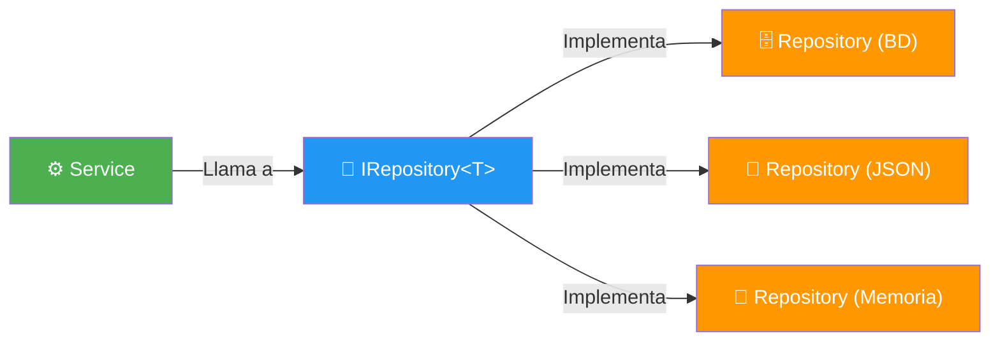
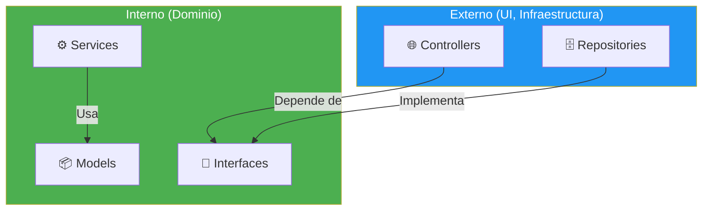

- [12. Patrones y Arquitecturas en ASP.NET Core](#12-patrones-y-arquitecturas-en-aspnet-core)
  - [12.1. Patrón Repository](#121-patrón-repository)
  - [12.2. Patrón Service](#122-patrón-service)
  - [12.3. Patrón Factory](#123-patrón-factory)
  - [12.4. Patrón Decorator](#124-patrón-decorator)
  - [12.5. Clean Architecture](#125-clean-architecture)
  - [12.6. Organización de Carpetas](#126-organización-de-carpetas)


# 12. Patrones y Arquitecturas en ASP.NET Core

> 💡 **Punto de partida:** Si construyes una casa, no ponemos tuberías de agua por donde nos da la gana. Hay reglas: las tuberías de agua van juntas, las eléctricas van por otro sitio, y las dos nunca se cruzan. Lo mismo ocurre con el software: hay **patrones** que organizan el código de forma que sea manteniable, testeable y escalable.

En este tema aprenderás los patrones más usados en ASP.NET Core (Repository, Service, Factory, Decorator) y cómo se organizan en una arquitectura limpia.

**Objetivos de aprendizaje:**

- Conocer el patrón Repository y por qué abstrae el acceso a datos
- Entender el patrón Service y cómo separa lógica de negocio
- Comprender el patrón Factory y cuándo usarlo
- Aplicar Clean Architecture en proyectos reales

## 12.1. Patrón Repository

El patrón **Repository** abstrae el acceso a datos. El servicio no sabe si los datos vienen de una base de datos, un JSON o memoria. Solo sabe que existe una interfaz `IRepository<T>`.



```csharp
// Interfaz del Repository
public interface IPersonasRepository
{
    IEnumerable<Persona> GetAll();
    Persona? GetById(int id);
    Persona Add(Persona persona);
    void Update(Persona persona);
    void Delete(int id);
}

// Implementación en memoria (para tests)
public class PersonasMemoryRepository : IPersonasRepository
{
    private readonly List<Persona> _personas = new();

    public IEnumerable<Persona> GetAll() => _personas;
    public Persona? GetById(int id) => _personas.FirstOrDefault(p => p.Id == id);
    public Persona Add(Persona persona) { _personas.Add(persona); return persona; }
    public void Update(Persona persona) { /* ... */ }
    public void Delete(int id) { _personas.RemoveAll(p => p.Id == id); }
}

// Implementación con EF Core (producción)
public class PersonasEfRepository(AppDbContext context) : IPersonasRepository
{
    public IEnumerable<Persona> GetAll() => context.Personas.ToList();
    public Persona? GetById(int id) => context.Personas.Find(id);
    // ...
}
```

📌 **Ejemplo real:** En el proyecto de Gestión Académica, `IPersonasRepository` tiene implementaciones en `Memory`, `Json`, `Binary`, `Dapper` y `EFCore`. Según la configuración de `appsettings.json`, se usa una u otra. El servicio nunca sabe cuál es.

> 💡 **Consejo:** Un Repository **solo** accede a datos. No contiene lógica de negocio. Si necesitas validar, filtrar o transformar datos, eso va en el **Service**.

## 12.2. Patrón Service

El patrón **Service** encapsula la **lógica de negocio**. Un servicio usa uno o más repositorios para realizar operaciones complejas.

```csharp
// Interfaz del Service
public interface IAcademiaService
{
    Result<Persona> GetByDni(string dni);
    Result<Persona> Save(Persona persona);
    Result<Persona> Update(int id, Persona persona);
    Result<Persona> Delete(int id);
}

// Implementación del Service
public class AcademiaService(IPersonasRepository repository, IValidador<Persona> validador) : IAcademiaService
{
    public Result<Persona> Save(Persona persona)
    {
        // 1. Validar
        var error = validador.Validar(persona);
        if (error is not null) return Result.Failure<Persona>(error);

        // 2. Verificar duplicados
        var existente = repository.GetAll().FirstOrDefault(p => p.Dni == persona.Dni);
        if (existente is not null) return Result.Failure<Persona>("DNI ya existe");

        // 3. Guardar
        var creado = repository.Add(persona);
        return Result.Success(creado);
    }
}
```

> 📝 **Nota:** El Service **no sabe** cómo se guardan los datos. Solo llama al Repository. Si mañana cambias de PostgreSQL a MongoDB, el Service **no se modifica**.

## 12.3. Patrón Factory

El patrón **Factory** crea objetos sin especificar la clase exacta. Es útil cuando la creación depende de una configuración o condición.

```csharp
// Factory que crea el repositorio según la configuración
public static class RepositoryFactory
{
    public static IPersonasRepository Create(string repositoryType)
    {
        return repositoryType.ToLower() switch
        {
            "memory" => new PersonasMemoryRepository(),
            "json" => new PersonasJsonRepository(),
            "efcore" => new PersonasEfRepository(),
            _ => new PersonasMemoryRepository()
        };
    }
}

// Uso
var repo = RepositoryFactory.Create(AppConfig.RepositoryType);
```

> 📝 **Nota:** En la práctica, el Factory lo reemplaza la DI. En vez de crear un Factory manual, registras múltiples implementaciones en el contenedor de DI y resolves según la configuración.

## 12.4. Patrón Decorator

El patrón **Decorator** añade funcionalidad a un servicio existente sin modificarlo. Como poner una capa extra a un regalo.

```csharp
// Servicio base
public class PedidoService : IPedidoService
{
    public void CrearPedido(Pedido pedido) { /* ... */ }
}

// Decorador que añade logging
public class PedidoServiceConLog(IPedidoService inner, ILogger<PedidoServiceConLog> logger) : IPedidoService
{
    public void CrearPedido(Pedido pedido)
    {
        logger.LogInformation("Creando pedido {Id}", pedido.Id);
        inner.CrearPedido(pedido);
        logger.LogInformation("Pedido {Id} creado", pedido.Id);
    }
}
```

📌 **Ejemplo real:** `Polly` usa el patrón Decorator para añadir reintentos y circuit breakers a las llamadas HTTP. Envuelve a `HttpClient` con lógica de resiliencia.

## 12.5. Clean Architecture

**Clean Architecture** organiza el código en capas con dependencias hacia adentro:



| Capa | Contenido | Dependencias |
|------|-----------|--------------|
| **Domain** | Models, Interfaces, Enums | Ninguna |
| **Application** | Services, Validators, DTOs | Solo Domain |
| **Infrastructure** | Repositories, Config, External APIs | Application + Domain |
| **Presentation** | Controllers, Views | Todas las anteriores |

> 💡 **Consejo:** La regla clave de Clean Architecture es que las dependencias **nunca** van hacia afuera. La capa interna (Domain) no puede depender de la externa (Infrastructure).

## 12.6. Organización de Carpetas

En ASP.NET Core, la organización típica es:

```
MiProyecto/
├── Program.cs
├── Models/          # Entidades y records
├── Repositories/    # Acceso a datos (IPersonaRepository, PersonaRepository)
├── Services/        # Lógica de negocio (IAcademiaService, AcademiaService)
├── Config/          # Configuración (AppConfig.cs)
├── Enums/           # Enumeraciones
├── Exceptions/      # Excepciones personalizadas
├── Extensions/      # Métodos de extensión
├── Dto/             # Data Transfer Objects
├── Mappers/         # Mapeo de datos
├── Validators/      # Validaciones
├── Errors/          # Tipos de error
├── Cache/           # Caché
├── Infrastructure/  # DI (DependenciesProvider.cs)
└── Storage/         # Almacenamiento de persistencia
```

> 📝 **Nota:** No hay una estructura "correcta" universal. Lo importante es que sea **consistente** en todo el proyecto. Si usas `Repositories/`, no mezcles con `Repository/`.

---

**Resumen del punto:**

| Concepto | Descripción |
|----------|-------------|
| **Repository** | Abstrae el acceso a datos (interfaz + implementaciones) |
| **Service** | Contiene la lógica de negocio |
| **Factory** | Crea objetos según configuración |
| **Decorator** | Añade funcionalidad sin modificar el servicio original |
| **Clean Architecture** | Organización en capas con dependencias hacia adentro |

En el siguiente punto veremos LINQ: consultas declarativas en colecciones y bases de datos, Parallel LINQ y operaciones avanzadas.
