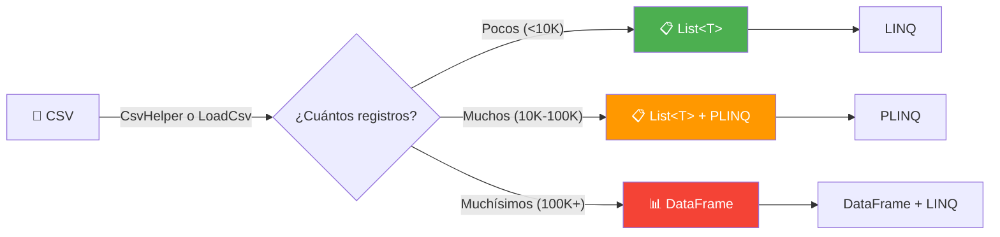
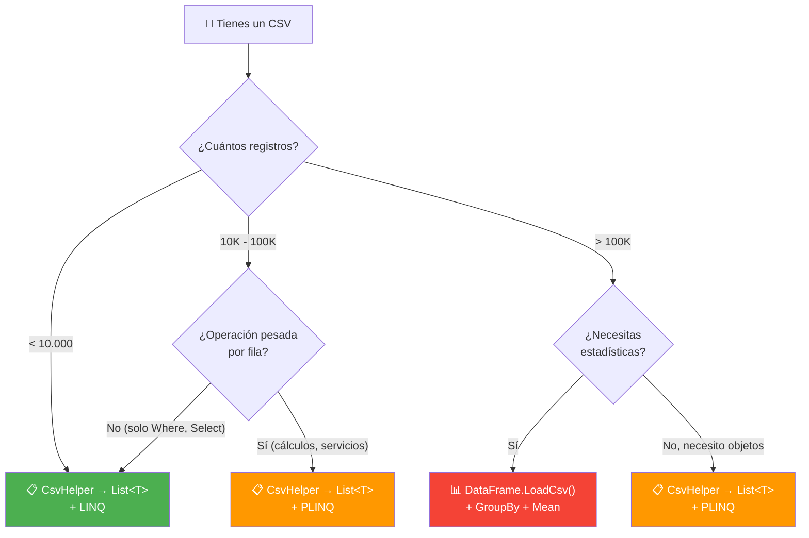

- [13. LINQ en Colecciones y Base de Datos](#13-linq-en-colecciones-y-base-de-datos)
  - [13.1. LINQ como Lenguaje Declarativo](#131-linq-como-lenguaje-declarativo)
  - [13.2. Operaciones Fundamentales](#132-operaciones-fundamentales)
  - [13.3. GroupBy: La Operación Más Poderosa](#133-groupby-la-operación-más-poderosa)
  - [13.4. JOINs en LINQ](#134-joins-en-linq)
  - [13.5. LINQ en Base de Datos (Entity Framework Core)](#135-linq-en-base-de-datos-entity-framework-core)
  - [13.6. Parallel LINQ (PLINQ)](#136-parallel-linq-plinq)
  - [13.7. LINQ Avanzado](#137-linq-avanzado)
  - [13.8. DataFrames en C# con Microsoft.Data.Analysis](#138-dataframes-en-c-con-microsoftdataanalysis)
  - [13.9. LINQ vs PLINQ vs DataFrame: ¿Cuándo usar cada uno?](#139-linq-vs-plinq-vs-dataframe-cuándo-usar-cada-uno)


# 13. LINQ en Colecciones y Base de Datos

> 💡 **Punto de partida:** Sin LINQ, para filtrar una lista de clientes tendrías que escribir un `foreach`, crear una lista nueva, añadir elementos que cumplan la condición... Con LINQ, lo haces en una línea. Pero LINQ no es solo comodidad: es un lenguaje declarativo que transforma la forma en que piensas sobre datos.

En este tema aprenderás a usar LINQ en colecciones y bases de datos, las operaciones más importantes, cómo hacer JOINs, cuándo usar PLINQ y por qué `GroupBy + ToDictionary` es más eficiente que `GroupBy + Select + ToList`.

**Objetivos de aprendizaje:**

- Entender la diferencia entre programación imperativa y declarativa
- Dominar las operaciones fundamentales: Where, Select, OrderBy, GroupBy
- Conocer la eficiencia de GroupBy + ToDictionary vs GroupBy + Select + ToList
- Hacer JOINs entre colecciones
- Usar PLINQ para procesamiento paralelo

## 13.1. LINQ como Lenguaje Declarativo

**LINQ** (Language Integrated Query) permite escribir consultas sobre datos de forma declarativa: describes **qué** quieres, no **cómo** obtenerlo.

```csharp
// IMPERATIVO: CÓMO hacerlo paso a paso
var resultados = new List<Cliente>();
foreach (var cliente in clientes)
{
    if (cliente.Ciudad == "Madrid" && cliente.Activo)
    {
        resultados.Add(cliente);
    }
}
resultados.Sort((a, b) => a.Nombre.CompareTo(b.Nombre));

// DECLARATIVO: QUÉ quieres
var resultados = clientes
    .Where(c => c.Ciudad == "Madrid" && c.Activo)
    .OrderBy(c => c.Nombre)
    .ToList();
```

| Imperativo | Declarativo (LINQ) |
|------------|-------------------|
| Describe **cómo** hacerlo | Describe **qué** quieres |
| Bucles `for/while` | Pipeline de operaciones |
| Modifica estado | Inmutable (nuevas colecciones) |
| Más verboso | Más conciso y legible |

> 💡 **Analogía:** Imperativo es como dar instrucciones paso a paso a alguien que va al supermercado: "Entra, gira a la derecha, coge una cesta, ve al pasillo 3, coge leche...". Declarativo es como decir: "Trae leche, pan y huevos". No te importa el camino, solo el resultado.

## 13.2. Operaciones Fundamentales

### Filtrado: Where

```csharp
var caros = productos.Where(p => p.Precio > 100);
var madrid = clientes.Where(c => c.Ciudad == "Madrid");
```

### Proyección: Select

```csharp
var nombres = productos.Select(p => p.Nombre);
var resumen = productos.Select(p => new { p.Nombre, p.Precio });
```

### Ordenación: OrderBy / ThenBy

```csharp
var ordenados = clientes
    .OrderBy(c => c.Apellidos)      // Primero por apellidos
    .ThenBy(c => c.Nombre);         // Luego por nombre
```

### Agregación: Count, Sum, Average, Max, Min

```csharp
int total = productos.Count();
decimal suma = productos.Sum(p => p.Precio);
double media = productos.Average(p => p.Precio);
decimal maximo = productos.Max(p => p.Precio);
```

### Partitionado: Take, Skip

```csharp
var primeraPagina = productos.Take(10);     // Primeros 10
var segundaPagina = productos.Skip(10).Take(10); // Siguientes 10
```

### Búsqueda: First, Single, Any, All

```csharp
var primero = productos.First(p => p.Precio > 100);      // Primer elemento o excepción
var alguno = productos.Any(p => p.Precio > 100);          // true/false
var todos = productos.All(p => p.Precio > 0);             // true/false
```

> 📝 **Nota:** `First()` lanza excepción si no hay elementos. `FirstOrDefault()` devuelve `null`. Usa `FirstOrDefault()` cuando el elemento puede no existir.

## 13.3. GroupBy: La Operación Más Poderosa

`GroupBy` agrupa elementos por una clave. Es muy potente pero hay que saber usarlo bien.

### GroupBy + Select + ToList (menos eficiente)

```csharp
// Agrupar por categoría y obtener lista de productos
var porCategoria = productos
    .GroupBy(p => p.Categoria)                    // Agrupa
    .Select(g => new                              // Transforma
    {
        Categoria = g.Key,
        Productos = g.ToList(),                   // Materializa cada grupo
        Total = g.Count()
    })
    .ToList();                                    // Materializa todo
```

### GroupBy + ToDictionary (más eficiente)

```csharp
// Lo mismo pero más eficiente: acceso directo por clave
var porCategoria = productos
    .GroupBy(p => p.Categoria)
    .ToDictionary(
        g => g.Key,                               // Clave del diccionario
        g => g.ToList()                           // Valor del diccionario
    );

// Ahora puedes acceder directamente:
var electronicos = porCategoria["Electrónica"];   // O(1) en vez de O(n)
```

### Comparativa de rendimiento

| Operación | Memoria | Tiempo acceso | Cuándo usar |
|-----------|---------|---------------|-------------|
| `GroupBy + Select + ToList` | Lista de listas | O(n) buscar | Cuando necesitas iterar todos |
| `GroupBy + ToDictionary` | Diccionario | O(1) buscar | Cuando buscas por clave |
| `GroupBy + ToLookup` | Lookup (hash) | O(1) buscar | Claves duplicadas permitidas |

```csharp
// ToLookup: como ToDictionary pero permite claves duplicadas
var lookup = productos.ToLookup(p => p.Categoria);
var electronicos = lookup["Electrónica"]; // Puede tener múltiples elementos
```

> 💡 **Consejo:** Si vas a buscar por clave después de agrupar, usa `ToDictionary` o `ToLookup`. Si solo vas a iterar todos los grupos, `GroupBy + Select + ToList` está bien.

📌 **Ejemplo real:** En una app de e-commerce, para mostrar el catálogo agrupado por categoría en la web, `ToDictionary` es más eficiente porque el usuario puede hacer clic en una categoría específica y necesitas acceso rápido.

## 13.4. JOINs en LINQ

Los JOINs combinan datos de dos o más colecciones basándose en una relación:

```csharp
// Datos
var clientes = new[]
{
    new { Id = 1, Nombre = "Ana", CiudadId = 1 },
    new { Id = 2, Nombre = "Carlos", CiudadId = 2 },
    new { Id = 3, Nombre = "María", CiudadId = 1 }
};

var ciudades = new[]
{
    new { Id = 1, Nombre = "Madrid" },
    new { Id = 2, Nombre = "Barcelona" }
};

// Inner Join: solo coincidencias
var resultado = clientes
    .Join(ciudades,
        cliente => cliente.CiudadId,     // Clave del primer conjunto
        ciudad => ciudad.Id,             // Clave del segundo conjunto
        (cliente, ciudad) => new         // Resultado
        {
            cliente.Nombre,
            Ciudad = ciudad.Nombre
        });
// Ana → Madrid, Carlos → Barcelona, María → Madrid
```

### Tipos de JOIN

| Tipo | Descripción | SQL equivalente |
|------|-------------|-----------------|
| **Inner Join** | Solo coincidencias en ambas colecciones | `INNER JOIN` |
| **Left Join** | Todos los de la izquierda, con coincidencias o null | `LEFT JOIN` |
| **Group Join** | Agrupa los elementos de la derecha por la izquierda | `GROUP BY` |

```csharp
// Left Join: todos los clientes, tengan o no ciudad
var resultado = clientes
    .GroupJoin(ciudades,
        cliente => cliente.CiudadId,
        ciudad => ciudad.Id,
        (cliente, ciudadesGrupo) => new { cliente, ciudadesGrupo })
    .SelectMany(
        x => x.ciudadesGrupo.DefaultIfEmpty(),
        (x, ciudad) => new
        {
            x.cliente.Nombre,
            Ciudad = ciudad?.Nombre ?? "Sin ciudad"
        });
```

> 📝 **Nota:** En Entity Framework Core, los JOINs se escriben con `Join()` o `GroupJoin()`, pero también puedes usar `Include()` para cargar relaciones de forma más sencilla.

## 13.5. LINQ en Base de Datos (Entity Framework Core)

Cuando usas LINQ con Entity Framework Core, las consultas se traducen a SQL automáticamente:

```csharp
// LINQ se traduce a SQL
var resultado = context.Productos
    .Where(p => p.Precio > 100)           // WHERE Precio > 100
    .OrderBy(p => p.Nombre)               // ORDER BY Nombre
    .Select(p => new                       // SELECT Nombre, Precio
    {
        p.Nombre,
        p.Precio
    })
    .ToList();                             // Ejecuta la consulta SQL
```

> ⚠️ **Advertencia:** No todas las operaciones LINQ se traducen a SQL. Por ejemplo, métodos C# como `.ToString()` o `.Contains()` con expresiones complejas pueden dar error en runtime. Usa `EF.Functions` para funciones SQL específicas.

## 13.6. Parallel LINQ (PLINQ)

**PLINQ** ejecuta consultas LINQ en paralelo usando múltiples núcleos de CPU:

```csharp
// LINQ secuencial (un núcleo)
var resultado = productos
    .Where(p => p.Precio > 100)
    .Select(p => ProcesarProducto(p))  // Procesamiento pesado
    .ToList();

// PLINQ (múltiples núcleos)
var resultado = productos
    .AsParallel()
    .Where(p => p.Precio > 100)
    .Select(p => ProcesarProducto(p))  // Se ejecuta en paralelo
    .ToList();
```

| LINQ | PLINQ |
|------|-------|
| Un núcleo de CPU | Múltiples núcleos |
| Orden garantizado | Orden NO garantizado (usa `.AsOrdered()` si lo necesitas) |
| Sin overhead | Overhead de sincronización |
| Para colecciones pequeñas | Para colecciones grandes + procesamiento pesado |

> 💡 **Consejo:** Usa PLINQ solo cuando el procesamiento de cada elemento es **pesado** (cálculos complejos, llamadas a servicios externos). Para operaciones simples, el overhead de PLINQ puede hacer que sea más lento que LINQ secuencial.

## 13.7. LINQ Avanzado

### SelectMany: Aplanar colecciones anidadas

```csharp
var pedidos = new[]
{
    new { Cliente = "Ana", Productos = new[] { "Laptop", "Ratón" } },
    new { Cliente = "Carlos", Productos = new[] { "Teclado" } }
};

// Sin SelectMany: colección de colecciones
var productosAnidados = pedidos.Select(p => p.Productos);

// Con SelectMany: lista plana
var todosLosProductos = pedidos.SelectMany(p => p.Productos);
// ["Laptop", "Ratón", "Teclado"]
```

### Zip: Combinar secuencias

```csharp
var nombres = new[] { "Ana", "Carlos", "María" };
var edades = new[] { 25, 30, 28 };

var combinado = nombres.Zip(edades, (nombre, edad) => new { nombre, edad });
// [{Ana, 25}, {Carlos, 30}, {María, 28}]
```

### Distinct / Except / Intersect: Operaciones de conjuntos

```csharp
var lista1 = new[] { 1, 2, 3, 4, 5 };
var lista2 = new[] { 4, 5, 6, 7, 8 };

var sinDuplicados = lista1.Distinct();           // [1, 2, 3, 4, 5]
var soloEn1 = lista1.Except(lista2);             // [1, 2, 3]
var comunes = lista1.Intersect(lista2);          // [4, 5]
var todos = lista1.Union(lista2);                // [1, 2, 3, 4, 5, 6, 7, 8]
```

### Chunk: Dividir en trozos

```csharp
var numeros = Enumerable.Range(1, 100);
var porciones = numeros.Chunk(10); // 10 grupos de 10 elementos

foreach (var porcion in porciones)
{
    Console.WriteLine($"Grupo: {string.Join(", ", porcion)}");
}
```

## 13.8. DataFrames en C# con Microsoft.Data.Analysis

Un **DataFrame** es una estructura de datos tabular, similar a una tabla SQL o un Excel. Microsoft提供 `Microsoft.Data.Analysis` para trabajar con datos tabulares en C#.

### Instalación

```bash
dotnet add package Microsoft.Data.Analysis
```

### Crear un DataFrame

```csharp
using Microsoft.Data.Analysis;

// Crear columnas
var nombres = new PrimitiveDataFrameColumn<string>("Nombre", new[] { "Ana", "Carlos", "María", "Pedro" });
var edades = new PrimitiveDataFrameColumn<int>("Edad", new[] { 25, 30, 28, 35 });
var ciudades = new PrimitiveDataFrameColumn<string>("Ciudad", new[] { "Madrid", "Barcelona", "Madrid", "Sevilla" });

// Crear DataFrame
var df = new DataFrame();
df.Columns.Add(nombres);
df.Columns.Add(edades);
df.Columns.Add(ciudades);

// Mostrar
Console.WriteLine(df);
//  Nombre  Edad  Ciudad
//  Ana     25    Madrid
//  Carlos  30    Barcelona
//  María   28    Madrid
//  Pedro   35    Sevilla
```

### Filtrar con Where

```csharp
// Filtrar personas de Madrid
var madrid = df.Filter(df.Columns["Ciudad"].Cast<string>().EqualTo("Madrid"));
Console.WriteLine(madrid);
//  Nombre  Edad  Ciudad
//  Ana     25    Madrid
//  María   28    Madrid
```

### Seleccionar columnas

```csharp
// Seleccionar solo nombres y edades
var seleccion = df.Columns["Nombre"].Join(df.Columns["Edad"]);
```

### Ordenar

```csharp
// Ordenar por edad descendente
var ordenado = df.Sort(df.Columns["Edad"], SortOrder.Descending);
```

### Agrupar y agregar

```csharp
// Contar por ciudad
var porCiudad = df.GroupBy("Ciudad");
foreach (var grupo in porCiudad)
{
    Console.WriteLine($"{grupo.Key}: {grupo.RowCount} registros");
}
// Madrid: 2
// Barcelona: 1
// Sevilla: 1
```

### Leer CSV con DataFrame

```csharp
using Microsoft.Data.Analysis;

// Leer fichero CSV
var df = DataFrame.LoadCsv("datos.csv");

// Consultas
var mujeres = df.Filter(df.Columns["Sexo"].Cast<string>().EqualTo("Mujer"));
var hombres = df.Filter(df.Columns["Sexo"].Cast<string>().EqualTo("Hombre"));

// Estadísticas
var mediaEdad = df.Columns["Edad"].Cast<double>().Mean();
var maxEdad = df.Columns["Edad"].Cast<double>().Max();
var minEdad = df.Columns["Edad"].Cast<double>().Min();
```

### DataFrame vs colecciones LINQ

| Característica | DataFrame | Colecciones LINQ |
|----------------|-----------|------------------|
| **Tipo de datos** | Tabular (filas y columnas) | Colección de objetos |
| **Esquema** | Cada columna tiene un tipo | Cada objeto tiene propiedades |
| **Filtrado** | `df.Filter(column.EqualTo(value))` | `lista.Where(x => x.Prop == value)` |
| **Agrupación** | `df.GroupBy("columna")` | `lista.GroupBy(x => x.Prop)` |
| **Estadísticas** | `.Mean()`, `.Max()`, `.Min()` | `.Average()`, `.Max()`, `.Min()` |
| **Lectura CSV** | `DataFrame.LoadCsv()` | CsvHelper |
| **Rendimiento** | Mejor para datos tabulares grandes | Mejor para objetos complejos |
| **Usar cuando** | Datos tabulares, CSV, análisis | Objetos de dominio, BD |

📌 **Ejemplo real:** Un análisis de accidentes de tráfico en Madrid. Tienes un CSV con 20.000 registros. Con un DataFrame puedes filtrar por distrito, agrupar por tipo de accidente, calcular estadísticas por sexo y edad, todo en pocas líneas de código.

```csharp
// Ejemplo: Análisis de accidentes de Madrid
var accidentes = DataFrame.LoadCsv("2025_Accidentalidad.csv");

// Accidentes con alcohol
var conAlcohol = accidentes.Filter(
    accidentes.Columns["PositivoAlcohol"].Cast<bool>().EqualTo(true));

// Por distrito
var porDistrito = accidentes.GroupBy("Distrito");
foreach (var grupo in porDistrito)
{
    Console.WriteLine($"{grupo.Key}: {grupo.RowCount} accidentes");
}

// Stats por edad
var mediaEdad = accidentes.Columns["Edad"].Cast<double>().Mean();
```

> 📝 **Nota:** `Microsoft.Data.Analysis` es ideal para análisis de datos, ETL y procesamiento de CSV. Para objetos de dominio complejos con relaciones, usa colecciones LINQ o EF Core.

> 💡 **Consejo:** Si necesitas análisis estadístico avanzado, combina DataFrame con LINQ. Carga los datos en un DataFrame, filtra y agrupa, y luego convierte a objetos para lógica de negocio.

## 13.9. LINQ vs PLINQ vs DataFrame: ¿Cuándo usar cada uno?

Imagina que tienes un **fichero CSV** con datos de accidentes de tráfico en Madrid. ¿Qué herramienta usas? Depende del **tamaño** y del **tipo de operación**.

### Flujo de datos: del CSV a la colección



> 💡 **Punto clave:** Cuando lees un CSV con CsvHelper, los datos van a una `List<T>` (colección de objetos). Ahí LINQ y PLINQ son naturales. DataFrame NO convierte a objetos — trabaja directamente con columnas tipo tabla, como SQL en memoria.

### Ejemplo real: Procesar CSV de accidentes

**Escenario:** Fichero con 200.000 registros. Queremos filtrar accidentes con alcohol, agrupar por distrito y calcular la media de edad.

#### Opción 1: LINQ (simple, secuencial)

```csharp
using CsvHelper;

// Leer CSV → List<Accidente>
var registros = new StreamReader("accidentes.csv")
    .Then rdr => new CsvReader(rdr, CultureInfo.InvariantCulture)
    .GetRecords<Accidente>().ToList();

// Procesar con LINQ
var resultado = registros
    .Where(a => a.PositivoAlcohol)
    .GroupBy(a => a.Distrito)
    .Select(g => new
    {
        Distrito = g.Key,
        Total = g.Count(),
        MediaEdad = g.Average(a => a.Edad)
    })
    .OrderByDescending(x => x.Total)
    .ToList();
```

| Ventaja | Desventaja |
|---------|------------|
| ✅ Código claro y legible | ❌ Un solo núcleo de CPU |
| ✅ Sin overhead | ❌ Lento con millones de filas |
| ✅ Tipo-safe en tiempo de compilación | ❌ Memoria: toda la lista en RAM |

**Cuándo usarlo:** CSV con < 10.000 registros, operaciones simples (Where, Select, GroupBy básico).

#### Opción 2: PLINQ (paralelo, rápido)

```csharp
using CsvHelper;

// Leer CSV → List<Accidente>
var registros = new StreamReader("accidentes.csv")
    .Then rdr => new CsvReader(rdr, CultureInfo.InvariantCulture)
    .GetRecords<Accidente>().ToList();

// Procesar con PLINQ
var resultado = registros
    .AsParallel()                            // ← Paralelizar
    .WithDegreeOfParallelism(Environment.ProcessorCount)
    .Where(a => a.PositivoAlcohol)
    .GroupBy(a => a.Distrito)
    .Select(g => new
    {
        Distrito = g.Key,
        Total = g.Count(),
        MediaEdad = g.Average(a => a.Edad)
    })
    .AsOrdered()                             // ← Mantener orden
    .ToList();
```

| Ventaja | Desventaja |
|---------|------------|
| ✅ Aprovecha todos los núcleos de CPU | ❌ Overhead de sincronización |
| ✅ 2x-8x más rápido con millones de filas | ❌ Orden NO garantizado (sin `.AsOrdered()`) |
| ✅ Mismo código que LINQ, solo `.AsParallel()` | ❌ No sirve para operaciones con estado |

**Cuándo usarlo:** CSV con 10.000-500.000 registros Y operación pesada por fila (cálculos complejos, llamadas a servicios).

> ⚠️ **Advertencia:** Si la operación por fila es ligera (solo un Where), PLINQ puede ser más LENTO que LINQ por el overhead de sincronización. Solo usa PLINQ cuando el procesamiento de cada fila es pesado.

#### Opción 3: DataFrame (tabular, estadístico)

```csharp
using Microsoft.Data.Analysis;

// Leer CSV directamente en DataFrame
var df = DataFrame.LoadCsv("accidentes.csv");

// Filtrar
var conAlcohol = df.Filter(df.Columns["PositivoAlcohol"].Cast<bool>().EqualTo(true));

// Agrupar y contar
var porDistrito = conAlcohol.GroupBy("Distrito");
foreach (var grupo in porDistrito)
{
    Console.WriteLine($"{grupo.Key}: {grupo.RowCount} accidentes");
}

// Estadísticas
var mediaEdad = conAlcohol.Columns["Edad"].Cast<double>().Mean();
var maxEdad = conAlcohol.Columns["Edad"].Cast<double>().Max();
```

| Ventaja | Desventaja |
|---------|------------|
| ✅ Optimizado para datos tabulares | ❌ No es tipo-safe (errores en runtime) |
| ✅ Estadísticas integradas (Mean, Max, Min) | ❌ Menos flexible que LINQ para objetos |
| ✅ No necesita definir una clase Accidente | ❌ API menos conocida, menos documentación |
| ✅ Mejor rendimiento con 100K+ filas | ❌ Conversión a objetos es manual |

**Cuándo usarlo:** CSV con 100.000+ registros, análisis estadístico, ETL, o cuando no quieres definir una clase para los datos.

### Tabla comparativa: Los tres en un vistazo

| Criterio | LINQ | PLINQ | DataFrame |
|----------|------|-------|-----------|
| **Tipo de datos** | `List<T>` (objetos) | `List<T>` (objetos) | Tabular (columnas) |
| **Definir modelo** | Sí (`record Accidente`) | Sí (`record Accidente`) | No (columnas dinámicas) |
| **Rendimiento (pocos datos)** | ⭐⭐⭐⭐⭐ | ⭐⭐⭐ (overhead) | ⭐⭐⭐ |
| **Rendimiento (muchos datos)** | ⭐⭐ | ⭐⭐⭐⭐ | ⭐⭐⭐⭐⭐ |
| **Estadísticas** | Manual (Average, Count) | Manual | Integradas (Mean, Max) |
| **Type-safe** | ✅ Compile-time | ✅ Compile-time | ❌ Runtime |
| **Legibilidad** | ⭐⭐⭐⭐⭐ | ⭐⭐⭐⭐ | ⭐⭐⭐ |
| **Para CSV < 10K** | ✅ **Mejor** | ⚠️ Innecesario | ⚠️ Sobredimensionado |
| **Para CSV 10K-100K** | ⚠️ Puede ser lento | ✅ **Mejor** | ⚠️ Posible |
| **Para CSV > 100K** | ❌ Lento | ⚠️ Posible | ✅ **Mejor** |

### Flujo de decisión



📌 **Ejemplo real:** Netflix procesa logs de visualización (millones de registros). Usa algo similar a DataFrames para análisis de datos (qué series se ven, cuándo, en qué países). Pero para la lógica de "recomendar series similares", usa objetos con LINQ porque necesita relaciones complejas.

> 💡 **Consejo para el examen:** Si te preguntan "¿qué usas para procesar un CSV?", la respuesta correcta es: "Depende. Si son pocos datos, LINQ. Si son muchos y necesito paralelismo, PLINQ. Si son muchísimos y necesito estadísticas, DataFrame."

---

**Resumen del punto:**

| Concepto | Descripción |
|----------|-------------|
| **LINQ** | Lenguaje declarativo para consultas sobre datos |
| **Where** | Filtra elementos que cumplen una condición |
| **Select** | Transforma cada elemento |
| **GroupBy** | Agrupa por una clave |
| **GroupBy + ToDictionary** | Más eficiente que GroupBy + Select + ToList |
| **Join** | Combina datos de dos colecciones |
| **PLINQ** | LINQ en paralelo con múltiples núcleos |
| **IQueryable** | Consultas que se traducen a SQL |
| **DataFrame** | Datos tabulares, CSV, análisis estadístico |
| **Decisión** | LINQ (<10K) → PLINQ (10K-100K, pesado) → DataFrame (>100K, stats) |

En el siguiente punto veremos cómo trabajar con ficheros y formatos de intercambio: IDisposable, System.IO, CSV con CsvHelper y JSON con System.Text.Json.
