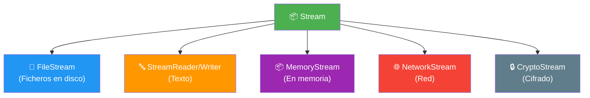
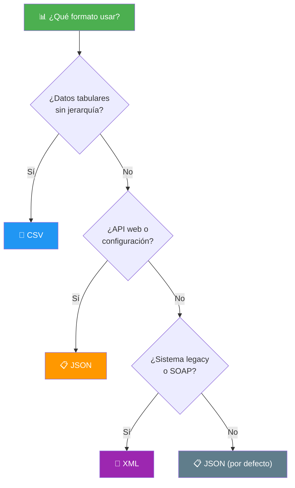

- [14. Ficheros y Formatos de Intercambio](#14-ficheros-y-formatos-de-intercambio)
  - [14.1. IDisposable y Gestión de Recursos](#141-idisposable-y-gestión-de-recursos)
  - [14.2. System.IO: Lectura y Escritura de Ficheros](#142-systemio-lectura-y-escritura-de-ficheros)
  - [14.3. Streams: La Abstracción Fundamental](#143-streams-la-abstracción-fundamental)
  - [14.4. CSV con CsvHelper](#144-csv-con-csvhelper)
  - [14.5. JSON con System.Text.Json](#145-json-con-systemtextjson)
  - [14.6. Comparativa de Formatos](#146-comparativa-de-formatos)


# 14. Ficheros y Formatos de Intercambio

> 💡 **Punto de partida:** Tu aplicación guarda datos en memoria, pero cuando se cierra... ¡todo se pierde! Necesitas guardar información en ficheros. Pero no es tan sencillo como "escribir texto": hay que gestionar recursos del sistema operativo, elegir el formato correcto (CSV, JSON, XML) y asegurarse de que los ficheros se cierren correctamente. ¿Y si el programa falla a mitad de escritura? Podrías perder datos. Aquí entra `IDisposable` y los streams.

En este tema aprenderás a trabajar con ficheros en C#: la interfaz `IDisposable`, `System.IO`, streams, y los formatos de intercambio más usados (CSV con CsvHelper y JSON con System.Text.Json).

**Objetivos de aprendizaje:**

- Comprender `IDisposable` y por qué es fundamental para la gestión de recursos
- Dominar `System.IO`: `File`, `StreamReader`, `StreamWriter`, `Path`
- Entender los streams y su jerarquía
- Leer y escribir CSV con CsvHelper
- Serializar y deserializar JSON con System.Text.Json
- Comparar formatos y elegir el adecuado según el caso de uso

## 14.1. IDisposable y Gestión de Recursos

Cuando abres un fichero, una conexión a base de datos o un socket de red, estás usando un **recurso del sistema operativo**. Estos recursos son limitados y deben liberarse cuando ya no se necesitan.

### El problema: recursos que se fugan

```csharp
// ❌ MALO: Si ocurre una excepción, el fichero nunca se cierra
var writer = new StreamWriter("datos.txt");
writer.WriteLine("Hola Mundo");
writer.Close(); // Si hay excepción antes de esta línea, el fichero queda abierto
```

### La solución: IDisposable

```csharp
// ✅ BUENO: using garantiza que Dispose() se ejecute SIEMPRE
using var writer = new StreamWriter("datos.txt");
writer.WriteLine("Hola Mundo");
// Dispose() se ejecuta automáticamente al salir del scope
```

La interfaz `IDisposable` tiene un solo método: `Dispose()`. Cuando usas `using`, C# lo convierte en algo así:

```csharp
// Lo que C# hace internamente con using
StreamWriter writer = null;
try
{
    writer = new StreamWriter("datos.txt");
    writer.WriteLine("Hola Mundo");
}
finally
{
    writer?.Dispose(); // Se ejecuta SIEMPRE, haya excepción o no
}
```

| Enfoque | Recursos liberados | Excepciones seguras | Código limpio |
|---------|-------------------|--------------------|---------------| 
| `Close()` manual | Sí, solo si no hay excepción | ❌ No | Verboso |
| `Dispose()` manual | Sí, pero hay que recordar | ⚠️ Con try/finally | Verboso |
| `using` | Sí, SIEMPRE | ✅ Sí | Conciso |

> 💡 **Consejo:** Usa `using` SIEMPRE que trabajes con `IDisposable`. Es como el cinturón de seguridad del código: no lo necesitas hasta que lo necesitas, y cuando lo necesitas, es demasiado tarde para ponértelo.

📌 **Ejemplo real:** Cuando Visual Studio o Rider abren un proyecto, abren cientos de ficheros. Si no usaran `IDisposable`, después de cerrar el proyecto, muchos ficheros seguirían abiertos y no podrías borrarlos o moverlos.

### Patrón Dispose con campo de disposed

```csharp
public class ConexionBD : IDisposable
{
    private bool _disposed = false;
    private readonly SqlConnection _connection;

    public ConexionBD(string connectionString)
    {
        _connection = new SqlConnection(connectionString);
        _connection.Open();
    }

    public void Dispose()
    {
        Dispose(disposing: true);
        GC.SuppressFinalize(this);
    }

    protected virtual void Dispose(bool disposing)
    {
        if (!_disposed)
        {
            if (disposing)
            {
                // Liberar recursos manejados (streams, conexiones)
                _connection?.Close();
                _connection?.Dispose();
            }
            // Liberar recursos no manejados si los hubiera
            _disposed = true;
        }
    }
}
```

## 14.2. System.IO: Lectura y Escritura de Ficheros

`System.IO` es el namespace que contiene todas las clases para trabajar con ficheros y directorios en C#.

### Clases principales

| Clase | Descripción | Uso típico |
|-------|-------------|------------|
| `File` | Métodos estáticos para operaciones rápidas | Leer/escribir todo el fichero de golpe |
| `FileInfo` | Información sobre un fichero | Tamaño, fecha, nombre |
| `Directory` | Métodos estáticos para directorios | Crear, borrar, listar |
| `StreamReader` | Leer texto línea a línea | Ficheros grandes, streaming |
| `StreamWriter` | Escribir texto línea a línea | Logs, exportaciones |
| `FileStream` | Acceso raw a bytes | Ficheros binarios |
| `Path` | Utilidades para rutas | Combinar, obtener extensión |

### Operaciones rápidas con File

```csharp
// Leer todo el fichero de golpe (适合 ficheros pequeños)
string contenido = File.ReadAllText("datos.txt");

// Leer todas las líneas
string[] lineas = File.ReadAllLines("datos.txt");

// Escribir todo el fichero (sobrescribe)
File.WriteAllText("output.txt", "Hola Mundo\nLínea 2");

// Añadir al final del fichero
File.AppendAllText("log.txt", $"[{DateTime.Now}] Evento registrado\n");

// Comprobar si existe
if (File.Exists("datos.txt"))
{
    File.Delete("datos.txt");
}
```

> ⚠️ **Advertencia:** `File.ReadAllText` carga todo el fichero en memoria. Si el fichero tiene 2GB, tu aplicación consumirá 2GB de RAM. Para ficheros grandes, usa `StreamReader`.

### StreamReader y StreamWriter

```csharp
// StreamWriter: escribir línea a línea
using var writer = new StreamWriter("personas.csv");
writer.WriteLine("Nombre,Edad,Ciudad");
writer.WriteLine("Ana,25,Madrid");
writer.WriteLine("Carlos,30,Barcelona");

// StreamReader: leer línea a línea
using var reader = new StreamReader("personas.csv");
string? linea;
while ((linea = reader.ReadLine()) is not null)
{
    Console.WriteLine(linea);
}
```

### Trabajo con binarios

```csharp
// Escribir bytes
byte[] datos = [0x48, 0x65, 0x6C, 0x6C, 0x6F]; // "Hello"
File.WriteAllBytes("datos.bin", datos);

// Leer bytes
byte[] leidos = File.ReadAllBytes("datos.bin");

// Usando FileStream para escritura parcial
using var stream = new FileStream("datos.bin", FileMode.Create);
stream.Write(datos, 0, datos.Length);
```

### Clase Path: utilidades para rutas

```csharp
string ruta = @"C:\Datos\personas.csv";

Path.GetFileName(ruta);        // "personas.csv"
Path.GetFileNameWithoutExtension(ruta); // "personas"
Path.GetExtension(ruta);       // ".csv"
Path.GetDirectoryName(ruta);   // @"C:\Datos"
Path.Combine("C:\\Datos", "personas.csv"); // Ruta combinada
Path.GetTempPath();            // Carpeta temporal del sistema
Path.GetRandomFileName();      // Nombre aleatorio para fichero temporal
```

📌 **Ejemplo real:** En una app de gestión, cuando el usuario exporta datos a CSV, se usa `StreamWriter` para escribir línea a línea sin cargar todo el fichero en memoria. Si el usuario exporta 100.000 registros, el programa no se queda sin memoria.

## 14.3. Streams: La Abstracción Fundamental

Un **stream** es una secuencia de bytes que fluye desde un origen (fichero, red, memoria) hacia un destino. Es como una tubería por la que pasan datos.

### Jerarquía de streams



| Stream | Origen/Destino | Ejemplo |
|--------|---------------|---------|
| `FileStream` | Fichero en disco | Leer/escribir un `.txt` |
| `MemoryStream` | Memoria RAM | Procesamiento intermedio |
| `NetworkStream` | Red (TCP/IP) | Comunicación cliente-servidor |
| `CryptoStream` | Cifrado/descifrado | Encriptar datos |

### Composición de streams (Patrón Decorator)

Los streams se pueden **componer** unos sobre otros, como muñecas rusas:

```csharp
// FileStream → StreamReader (texto desde fichero)
using var fileStream = new FileStream("datos.txt", FileMode.Open);
using var reader = new StreamReader(fileStream);
string contenido = reader.ReadToEnd();

// Composición equivalente (más concisa)
using var reader = new StreamReader("datos.txt");
string contenido = reader.ReadToEnd();

// FileStream → CryptoStream → StreamWriter (texto cifrado)
using var fileStream = new FileStream("datos.enc", FileMode.Create);
using var cryptoStream = new CryptoStream(fileStream, encryptor, CryptoStreamMode.Write);
using var writer = new StreamWriter(cryptoStream);
writer.WriteLine("Datos sensibles cifrados");
```

> 💡 **Analogía:** Un stream es como una cadena de montaje. En una fábrica de coches, cada estación añade algo: el chasis, luego la pintura, luego los cristales. Con los streams, cada "estación" transforma los bytes: uno los lee, otro los cifra, otro los comprime.

### MemoryStream: streams en memoria

```csharp
// Usar memoria como stream (útil para tests o procesamiento intermedio)
using var memoria = new MemoryStream();
using var writer = new StreamWriter(memoria);
writer.WriteLine("Datos en memoria");
writer.Flush(); // Importante: vaciar el buffer al stream

// Ahora leer lo que escribimos
memoria.Position = 0; // Volver al inicio
using var reader = new StreamReader(memoria);
string contenido = reader.ReadToEnd();
Console.WriteLine(contenido); // "Datos en memoria"
```

## 14.4. CSV con CsvHelper

**CSV** (Comma-Separated Values) es el formato más sencillo para datos tabulares. Pero parsear CSV manualmente es un infierno (comillas, comas dentro de campos, saltos de línea...). Por eso usamos **CsvHelper**.

### Instalación

```bash
dotnet add package CsvHelper
```

### Modelo de datos

```csharp
public record PersonaCsv(
    [Name("nombre")] string Nombre,
    [Name("edad")] int Edad,
    [Name("ciudad")] string Ciudad,
    [Name("fecha_nacimiento")] DateTime FechaNacimiento
);
```

### Escritura CSV

```csharp
using CsvHelper;
using CsvHelper.Configuration;
using System.Globalization;

// Configuración del escritor
var config = new CsvConfiguration(CultureInfo.InvariantCulture)
{
    HasHeaderRecord = true,    // Escribir cabecera
    Delimiter = ",",           // Separador
    Encoding = Encoding.UTF8   // Codificación
};

// Escribir a fichero
using var writer = new StreamWriter("personas.csv");
using var csv = new CsvWriter(writer, config);

var personas = new[]
{
    new PersonaCsv("Ana", 25, "Madrid", new DateTime(2001, 5, 15)),
    new PersonaCsv("Carlos", 30, "Barcelona", new DateTime(1996, 10, 20)),
    new PersonaCsv("María", 28, "Valencia", new DateTime(1998, 3, 8))
};

csv.WriteRecords(personas);
```

### Lectura CSV

```csharp
using CsvHelper;
using CsvHelper.Configuration;
using System.Globalization;

var config = new CsvConfiguration(CultureInfo.InvariantCulture)
{
    HasHeaderRecord = true,
    MissingFieldFound = null,  // No lanzar excepción si falta un campo
    HeaderValidated = null     // No validar cabeceras
};

using var reader = new StreamReader("personas.csv");
using var csv = new CsvReader(reader, config);

// Lectura como lista
var personas = csv.GetRecords<PersonaCsv>().ToList();

foreach (var persona in personas)
{
    Console.WriteLine($"{persona.Nombre}, {persona.Edad} años, {persona.Ciudad}");
}
```

### CSV con delimitador personalizado (punto y coma)

```csharp
// En España, muchos ficheros CSV usan ";" como delimitador
var config = new CsvConfiguration(CultureInfo.InvariantCulture)
{
    Delimiter = ";"
};
```

> 📝 **Nota:** CsvHelper maneja automáticamente los casos complejos: campos con comas dentro, campos entre comillas, saltos de línea en campos, etc. No intentes parsear CSV con `Split(',')`: es un error clásico que causa bugs difíciles de encontrar.

📌 **Ejemplo real:** Cuando una empresa exporta datos de su ERP a Excel, el formato más común es CSV. CsvHelper genera ficheros CSV que Excel puede abrir directamente, con codificación UTF-8 y separador correcto.

## 14.5. JSON con System.Text.Json

**JSON** (JavaScript Object Notation) es el formato estándar para APIs web y configuración. `System.Text.Json` es la librería oficial de .NET (rápida, moderna, sin dependencias externas).

### Serialización (objeto → JSON)

```csharp
using System.Text.Json;
using System.Text.Json.Serialization;

public class Persona
{
    [JsonPropertyName("nombre")]
    public string Nombre { get; set; } = "";

    [JsonPropertyName("edad")]
    public int Edad { get; set; }

    [JsonPropertyName("ciudad")]
    public string Ciudad { get; set; } = "";

    [JsonPropertyName("activo")]
    public bool Activo { get; set; }

    [JsonPropertyName("fecha_registro")]
    public DateTime FechaRegistro { get; set; }
}

// Serializar a JSON
var persona = new Persona
{
    Nombre = "Ana",
    Edad = 25,
    Ciudad = "Madrid",
    Activo = true,
    FechaRegistro = DateTime.Now
};

string json = JsonSerializer.Serialize(persona, new JsonSerializerOptions
{
    WriteIndented = true,  // JSON formateado (bonito)
    PropertyNamingPolicy = JsonNamingPolicy.CamelCase
});

Console.WriteLine(json);
```

Salida:

```json
{
  "nombre": "Ana",
  "edad": 25,
  "ciudad": "Madrid",
  "activo": true,
  "fechaRegistro": "2026-09-06T10:30:00"
}
```

### Deserialización (JSON → objeto)

```csharp
string json = """
{
    "nombre": "Carlos",
    "edad": 30,
    "ciudad": "Barcelona",
    "activo": true
}
""";

var persona = JsonSerializer.Deserialize<Persona>(json);

Console.WriteLine(persona?.Nombre); // "Carlos"
```

### Opciones de serialización

```csharp
var opciones = new JsonSerializerOptions
{
    WriteIndented = true,                    // JSON formateado
    PropertyNamingPolicy = JsonNamingPolicy.CamelCase, // camelCase
    DefaultIgnoreCondition = JsonIgnoreCondition.WhenWritingNull, // Ignorar nulls
    Converters = { new JsonStringEnumConverter() }, // Enums como strings
    Encoder = System.Text.Encodings.Web.JavaScriptEncoder.UnsafeRelaxedJsonEscaping // Permitir tildes
};

string json = JsonSerializer.Serialize(objeto, opciones);
```

### Trabajo con arrays JSON

```csharp
// Serializar lista
var personas = new List<Persona> { persona1, persona2, persona3 };
string json = JsonSerializer.Serialize(personas, opciones);

// Deserializar lista
var lista = JsonSerializer.Deserialize<List<Persona>>(json);
```

### Documento JSON (para consultas parciales)

```csharp
// Cuando solo necesitas leer parte del JSON sin deserializar todo
using var doc = JsonDocument.Parse(json);
var root = doc.RootElement;

string nombre = root.GetProperty("nombre").GetString()!;
int edad = root.GetProperty("edad").GetInt32();
```

> 💡 **Consejo:** Usa `System.Text.Json` (el nuevo) en vez de `Newtonsoft.Json` (el antiguo) para nuevos proyectos. `System.Text.Json` es más rápido y viene integrado en .NET. Solo usa `Newtonsoft.Json` si necesitas funcionalidades muy específicas que `System.Text.Json` no soporta.

📌 **Ejemplo real:** Cuando una API de Spotify devuelve el listado de canciones de una playlist, el formato es JSON. Tu app C# usa `JsonSerializer.Deserialize<PlaylistResponse>()` para convertirlo en objetos tipados y mostrarlos en la interfaz.

## 14.6. Comparativa de Formatos

| Característica | CSV | JSON | XML |
|---------------|-----|------|-----|
| **Legibilidad** | Tabular, simple | Estructurada, clara | Verboso, jerárquico |
| **Jerarquía** | ❌ Plano (sin anidamiento) | ✅ Natural | ✅ Natural |
| **Tipos de datos** | ❌ Todo es texto | ✅ Números, booleanos, null | ✅ Con esquema (XSD) |
| **Tamaño** | 🟢 El más pequeño | 🟡 Mediano | 🔴 El más grande |
| **Velocidad lectura** | 🟢 Muy rápido | 🟡 Rápido | 🔴 Lento |
| **Soporte herramientas** | ✅ Excel, cualquier lenguaje | ✅ Universal | ✅ Enterprise |
| **Uso típico** | Exportaciones, datos tabulares | APIs REST, configuración | SOAP, documentos, configuración legacy |



### Ejemplo completo: Convertir CSV a JSON

```csharp
using CsvHelper;
using System.Text.Json;
using System.Globalization;

// Leer CSV
using var reader = new StreamReader("personas.csv");
using var csv = new CsvReader(reader, CultureInfo.InvariantCulture);
var personas = csv.GetRecords<PersonaCsv>().ToList();

// Convertir a JSON
string json = JsonSerializer.Serialize(personas, new JsonSerializerOptions
{
    WriteIndented = true,
    PropertyNamingPolicy = JsonNamingPolicy.CamelCase
});

// Guardar JSON
File.WriteAllText("personas.json", json);

Console.WriteLine($"Convertidos {personas.Count} registros de CSV a JSON");
```

> ⚠️ **Advertencia:** CSV no maneja bien datos con comas, saltos de línea o caracteres especiales sin comillas. Si tus datos pueden contener estos caracteres, usa JSON. CSV solo es seguro cuando los datos son simples y tabulares.

---

**Resumen del punto:**

| Concepto | Descripción |
|----------|-------------|
| **IDisposable** | Interfaz para liberar recursos del sistema operativo |
| **using** | Garantiza que `Dispose()` se ejecute siempre |
| **System.IO** | Namespace con clases para trabajar con ficheros |
| **File** | Métodos estáticos para operaciones rápidas con ficheros |
| **StreamReader/Writer** | Lectura/escritura línea a línea |
| **Stream** | Secuencia de bytes (FileStream, MemoryStream, etc.) |
| **CsvHelper** | Librería para leer/escribir CSV de forma segura |
| **System.Text.Json** | Serialización/deserialización JSON integrada en .NET |
| **CSV** | Para datos tabulares simples, el más ligero |
| **JSON** | Para APIs y configuración, el más versátil |
| **XML** | Para documentos y sistemas enterprise, el más verboso |

En el siguiente punto veremos el patrón Result con CSharpFunctionalExtensions: cómo manejar errores sin excepciones usando `Result<T>`, `Maybe<T>`, `Guard`, `Bind` y `Map`.
