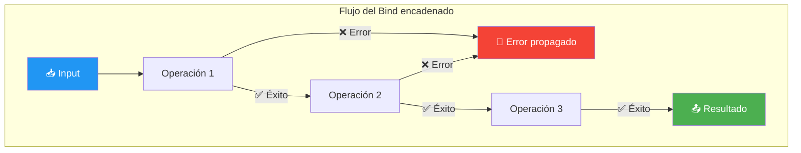
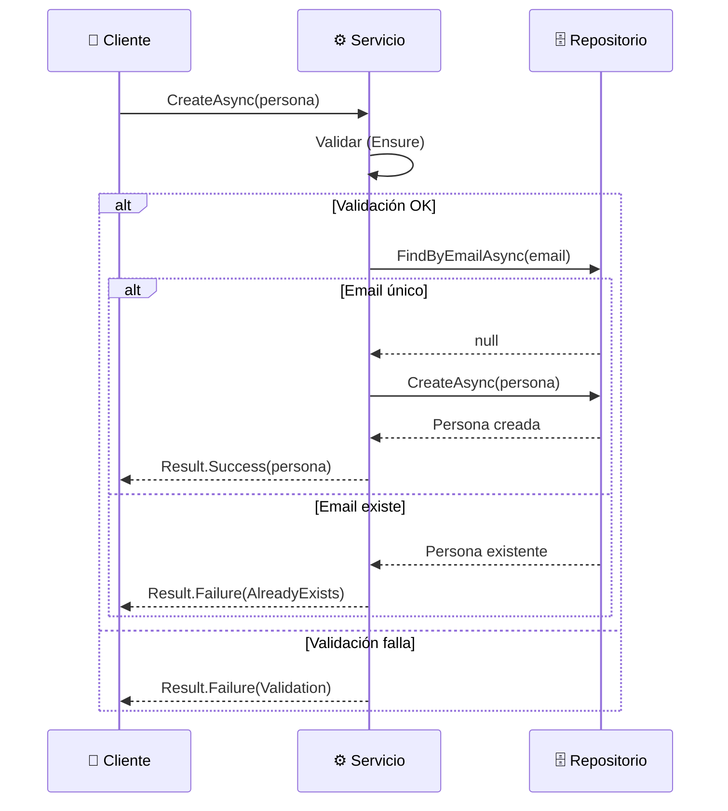
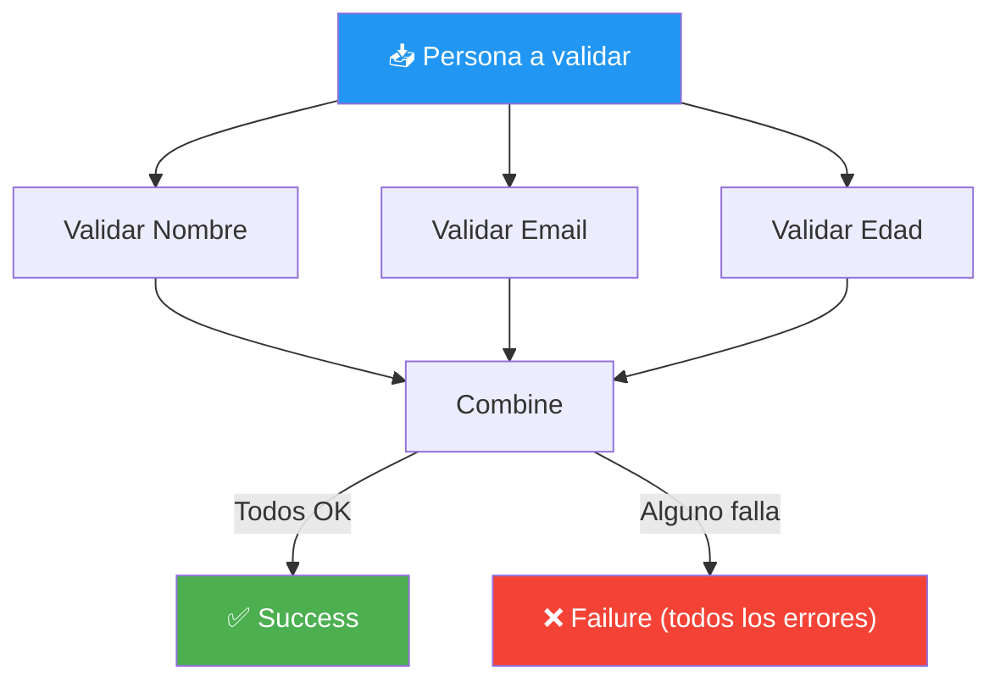
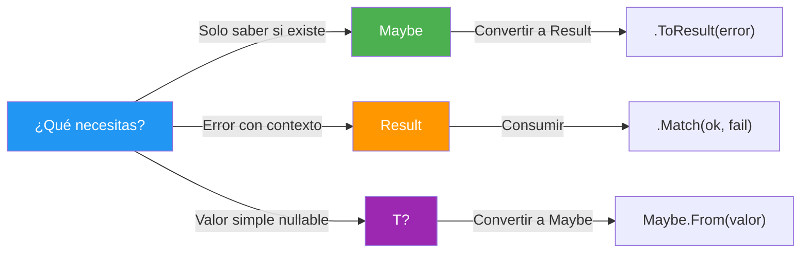

- [15. Patrón Result vs Excepciones (ROP)](#15-patrón-result-vs-excepciones-rop)
  - [15.1. El Problema de las Excepciones](#151-el-problema-de-las-excepciones)
  - [15.2. Union Types: un tipo que puede ser dos cosas](#152-union-types-un-tipo-que-puede-ser-dos-cosas)
  - [15.3. La Metáfora del Tren](#153-la-metáfora-del-tren)
  - [15.4. Errores de Dominio](#154-errores-de-dominio)
  - [15.5. El Tipo Result](#155-el-tipo-result)
  - [15.6. CSharpFunctionalExtensions](#156-csharpfunctionalextensions)
  - [15.7. Operaciones con Result](#157-operaciones-con-result)
  - [15.8. El Tipo Maybe](#158-el-tipo-maybe)
  - [15.9. Result vs Excepciones: Cuándo Usar Cada Uno](#159-result-vs-excepciones-cuándo-usar-cada-uno)
  - [15.10. Result con Async/Await](#1510-result-con-asyncawait)
  - [15.11. Patrón Validator con Result.Combine](#1511-patrón-validator-con-resultcombine)
  - [15.12. Maybe vs Result vs Nullable](#1512-maybe-vs-result-vs-nullable)
  - [15.13. Ejemplo Completo](#1513-ejemplo-completo)
  - [15.14. Buenas Prácticas](#1514-buenas-prácticas)


# 15. Patrón Result vs Excepciones (ROP)

> 💡 **Punto de partida:** Si intentas abrir una puerta y no tiene cerradura, ¿lanzas una excepción? No. Simplemente dices "no se puede abrir". Las excepciones fueron diseñadas para errores inesperados (base de datos caída, archivo corrupto), pero frecuentemente se usan para control de flujo ("usuario no encontrado", "email ya existe"). **Railway Oriented Programming (ROP)** es un patrón funcional que modela el éxito y el error como dos vías de un tren.

En este tema aprenderás a manejar errores sin excepciones usando `Result<T, TError>` y `Maybe<T>` con la librería `CSharpFunctionalExtensions`.

**Objetivos de aprendizaje:**

- Comprender por qué las excepciones no son ideales para control de flujo
- Conocer la metáfora del tren (vía del éxito / vía de error)
- Definir errores de dominio con `abstract record` y factory
- Usar `Result<T, TError>` con Bind, Map, Ensure, Tap, Match
- Usar `Maybe<T>` y convertirlo a Result con `ToResult()`

## 15.1. El Problema de las Excepciones

Las excepciones fueron diseñadas para **situaciones excepcionales**, pero se usan frecuentemente para control de flujo:

```csharp
// ❌ PROBLEMA: Excepciones para control de flujo
public Persona GetPersona(int id)
{
    try
    {
        return _repository.GetById(id);
    }
    catch (PersonaNotFoundException)
    {
        return null;  // Usar excepción para "no encontrado"
    }
}
```

| Problema | Descripción |
|----------|-------------|
| **Coste** | Las excepciones son costosas (crear stack trace) |
| **Flujo** | Rompen el flujo natural del código |
| **Encadenamiento** | Difíciles de encadenar |
| **Type-safety** | No son type-safe (el compilador no verifica) |
| **Documentación** | No sabes qué excepciones puede lanzar un método |

> 📝 **Nota:** Lanzar una excepción es como usar un martillo para matar una mosca. Funciona, pero es excesivo. Las excepciones deberían ser para situaciones realmente excepcionales (base de datos no disponible, archivo corrupto), no para "el usuario no existe".

## 15.2. Union Types: un tipo que puede ser dos cosas

Antes de entender `Result`, necesitas entender qué es un **Union Type**.

Un **Union Type** es un tipo que puede contener **exactamente uno** de varios tipos posibles. No es una clase con varias propiedades, sino un tipo que está en **uno u otro estado**, nunca en ambos.

### Union Types en C# 15 (nuevo)

C# 15 introduce el keyword `union` para declarar union types de forma nativa. Veámoslo con un dominio real: gestionar productos.

**Paso 1: Definir los casos (estados posibles)**

```csharp
// Los estados posibles de crear un producto
public record class ProductoCreado(string Nombre, decimal Precio);
public record class NombreVacio();
public record class PrecioNegativo(decimal Precio);
public record class NombreDuplicado(string Nombre);
```

**Paso 2: Declarar la unión**

```csharp
// CrearProductoResult puede ser UNO de estos casos, nunca más de uno
public union CrearProductoResult(
    ProductoCreado,
    NombreVacio,
    PrecioNegativo,
    NombreDuplicado
);
```

**Paso 3: Usar en un servicio**

```csharp
public class ProductoService
{
    public CrearProductoResult CrearProducto(string nombre, decimal precio)
    {
        // Validar nombre
        if (string.IsNullOrWhiteSpace(nombre))
            return new NombreVacio();

        // Validar precio
        if (precio < 0)
            return new PrecioNegativo(precio);

        // Comprobar duplicado
        if (_repository.Existe(nombre))
            return new NombreDuplicado(nombre);

        // Todo OK
        _repository.Crear(new Producto(nombre, precio));
        return new ProductoCreado(nombre, precio);
    }
}
```

**Paso 4: Consumir con pattern matching**

```csharp
var resultado = service.CrearProducto("Laptop", 999);

string mensaje = resultado switch
{
    ProductoCreado p => $"✅ Producto '{p.Nombre}' creado con precio {p.Precio}€",
    NombreVacio     => "❌ El nombre del producto es obligatorio",
    PrecioNegativo n => $"❌ El precio {n.Precio} no puede ser negativo",
    NombreDuplicado d => $"❌ Ya existe un producto llamado '{d.Nombre}'",
};
// Si añades un nuevo caso a la unión y olvidas cubrirlo, el compilador da WARNING
```

📌 Ejemplo real: **Rust** usa discriminated unions (`enum`) en todo momento. `Option<T>` y `Result<T, E>` son union types nativos. C# 15 se acerca a este nivel de expresividad.

### La ventaja: exhaustiveness checking

La gran ventaja de los Union Types es que el compilador **te obliga** a cubrir todos los casos. Si añades un nuevo estado a la unión y olvidas manejarlo en algún `switch`, el compilador te avisa:

```
warning CS8509: The switch expression does not handle all possible values
of its input type (it is not exhaustive).
```

Esto es algo que **no puedes hacer** con clases heredadas o interfaces: el compilador nunca te avisa si olvidas un `case` en un `switch` sobre una interfaz.

### Comparación: Union Types vs herencia

| Enfoque | Sintaxis | Exhaustiveness | Cerrado |
|---------|----------|----------------|---------|
| **Union Types** | `public union Result<T>(Success<T>, Failure);` | ✅ Compilador avisa | ✅ Solo los casos declarados |
| **Herencia** | `abstract class Result { class Success : Result; class Failure : Result; }` | ❌ No avisa | ❌ Puede haber subtipos nuevos |
| **Interfaz** | `interface IResult { class Success : IResult; }` | ❌ No avisa | ❌ Cualquiera puede implementar |

### ¿Por qué no usamos `union` en este curso?

Porque estamos en **C# 14 / .NET 10**, y `union` es una feature de **C# 15 / .NET 11** (aún en preview). Si intentamos usarlo ahora:

```csharp
// ❌ Esto NO compila en C# 14 — error de sintaxis
public union CrearProductoResult(ProductoCreado, NombreVacio, PrecioNegativo);
```

En su lugar, usamos `CSharpFunctionalExtensions` que implementa el mismo patrón de forma manual:

```csharp
// ✅ Esto SÍ compila en C# 14 — con la librería
Result<Producto, DomainError> resultado = service.CrearProducto(dto);
```

> 📝 **Nota:** Cuando .NET 11 salga de preview y sea estable, podremos usar `union` nativo. Mientras tanto, el patrón con librería funciona perfectamente y es lo que se usa en producción. El concepto es el mismo: un tipo que puede ser éxito O error, nunca ambos.

## 15.3. La Metáfora del Tren

**Railway Oriented Programming (ROP)** modela el flujo como un tren con dos vías:

```mermaid
flowchart LR
    subgraph Input["Entrada"]
        I[Input]
    end

    subgraph Track["Vía del Tren"]
        direction TB
        Op[Operación]
        Op -->|"Éxito"| ST[Success Track]
        Op -->|"Fallo"| FT[Failure Track]
    end

    subgraph Output["Salida"]
        direction TB
        ST -->|"Value"| SV[Result&#60;T,Error&#62;]
        FT -->|"Error"| SE[Result&#60;T,Error&#62;]
    end

    I --> Op

    style ST fill:#7cd97e,stroke:#333,color:#000
    style FT fill:#ff9999,stroke:#333,color:#000
    style SV fill:#ffdd57,stroke:#333,color:#000
    style SE fill:#ffdd57,stroke:#333,color:#000
```



**Concepto clave:**
- Si todo va bien, el tren sigue la vía del **éxito**
- Si algo falla, el tren pasa a la vía de **error**
- **No se necesita try-catch** en cada operación
- El error se propaga automáticamente

> 💡 **Analogía:** ROP es como un semáforo con dos luces: verde (éxito) y rojo (error). Si un semáforo en tu ruta está en rojo, no necesitas revisar todos los demás: el error se detiene en ese punto.

## 15.4. Errores de Dominio

Los errores de dominio se definen como `abstract record` con nested records. Un **factory** evita el casting explícito:

```csharp
// ✅ BUENO: Errores de dominio con records anidados
public abstract record DomainError(string Message)
{
    public sealed record NotFound(int Id)
        : DomainError($"No se ha encontrado ninguna persona con el identificador: {Id}");

    public sealed record Validation(IEnumerable<string> Errors)
        : DomainError("Se han detectado errores de validación en la entidad.");

    public sealed record AlreadyExists(string Email)
        : DomainError($"Conflicto: El email {Email} ya está registrado.");

    public sealed record Storage(Exception Exception)
        : DomainError($"Error de almacenamiento: {Exception.Message}");
}

// Factory para crear errores sin casting explícito
public static class DomainErrors
{
    public static DomainError NotFound(int id) => new DomainError.NotFound(id);
    public static DomainError Validation(IEnumerable<string> errors) => new DomainError.Validation(errors);
    public static DomainError AlreadyExists(string email) => new DomainError.AlreadyExists(email);
    public static DomainError Storage(Exception ex) => new DomainError.Storage(ex);
}
```

```csharp
// ❌ MALO: Casting explícito necesario
.ToResult((DomainError)new DomainError.NotFound(id))

// ✅ BUENO: Factory sin casting
.ToResult(DomainErrors.NotFound(id))
```

> 📝 **Nota:** C# no permite covarianza implícita con tipos genéricos heredados. Al usar `Result<T, DomainError>`, no podemos hacer `new DomainError.NotFound()` directamente porque el compilador no infiere el tipo base automáticamente. Los factory methods resuelven esto.

## 15.5. El Tipo Result

`Result<TValue, TError>` representa éxito o fracaso:

```csharp
// Crear resultados
var ok = Result.Success<Persona, DomainError>(new Persona { Nombre = "Ana" });
var fail = Result.Failure<Persona, DomainError>(DomainErrors.NotFound(1));

// Verificar
if (ok.IsSuccess)
{
    Console.WriteLine(ok.Value);  // Persona
}

if (fail.IsFailure)
{
    Console.WriteLine(fail.Error.Message);  // "No se ha encontrado..."
}
```

## 15.6. CSharpFunctionalExtensions

### Instalación

```bash
dotnet add package CSharpFunctionalExtensions
```

### Configuración en appsettings.json

```json
{
  "Serilog": {
    "MinimumLevel": {
      "Default": "Information",
      "Override": {
        "Microsoft": "Warning",
        "System": "Warning"
      }
    }
  }
}
```

## 15.7. Operaciones con Result

### Tabla Completa de Operaciones

| Operación | Descripción | Firma típica | Ejemplo |
|-----------|-------------|---------------|---------|
| **Success** | Crear resultado de éxito | `Result.Success<T,E>(value)` | `Result.Success<Persona, Error>(persona)` |
| **Failure** | Crear resultado de fallo | `Result.Failure<T,E>(error)` | `Result.Failure<Persona, Error>(error)` |
| **Bind** | Encadenar operaciones que retornan Result | `Result<T,E> → (T → Result<U,E>) → Result<U,E>` | `.Bind(p => Validate(p))` |
| **Map** | Transformar el valor en caso de éxito | `Result<T,E> → (T → U) → Result<U,E>` | `.Map(p => p.Nombre)` |
| **MapError** | Transformar el error | `Result<T,E> → (E → F) → Result<T,F>` | `.MapError(e => new Error(e.Message))` |
| **Ensure** | Validación condicional | `Result<T,E> → (T → bool) → E → Result<T,E>` | `.Ensure(p => p.Edad >= 18, error)` |
| **Tap** | Efectos secundarios (logging, cache) | `Result<T,E> → (T → void) → Result<T,E>` | `.Tap(p => logger.Log(...))` |
| **TapError** | Efectos secundarios en error | `Result<T,E> → (E → void) → Result<T,E>` | `.TapError(e => logger.Log(...))` |
| **Match** | Consumir el resultado final | `Result<T,E> → (T → U) → (E → U) → U` | `.Match(ok => ..., fail => ...)` |
| **OnFailureCompensate** | Recuperación ante fallo | `Result<T,E> → (E → Result<T,E>) → Result<T,E>` | `.OnFailureCompensate(_ => TryBD())` |
| **ToResult** | Convertir Maybe a Result | `Maybe<T> → E → Result<T,E>` | `maybe.ToResult(error)` |
| **Combine** | Combinar múltiples Results | `Result<T,E>... → Result<T,E>` | `Result.Combine(r1, r2, r3)` |

### Success y Failure: Crear Resultados

```csharp
// Crear resultado de éxito
var ok = Result.Success<Persona, DomainError>(new Persona { Nombre = "Ana" });

// Crear resultado de fallo
var fail = Result.Failure<Persona, DomainError>(DomainErrors.NotFound(1));
```

### Bind: Encadenar Operaciones que Pueden Fallar

```csharp
// Sin Result: anidamiento de null checks
public Persona? GetPersonaSegura(int id)
{
    var persona = _repository.GetById(id);
    if (persona is null) return null;
    if (persona.IsDeleted) return null;
    return persona;
}

// Con Result: encadenamiento fluido
public Result<Persona, DomainError> GetPersonaSegura(int id)
{
    return _repository.GetById(id)
        .ToResult(DomainErrors.NotFound(id))
        .Ensure(p => !p.IsDeleted, new DomainError.Validation(["Persona eliminada"]));
}
```



> 💡 **Analogía — La Tubería:**
> `Bind` es como una tubería de agua. Si el agua fluye bien, pasa por todos los tramos y sale limpia al final. Pero si en algún punto el tubo está roto (error), el agua se detiene ahí y no llega al final. No necesitas revisar todos los tramos — el agua para donde se rompe.

> 💡 **Analogía — Llamar por teléfono:**
> Imagina que llamas a un restaurante para hacer un pedido. Mientras esperas a que te contesten, **no puedes hacer nada más**. Estás pegado al teléfono, mirando la pantalla, sin poder cocinar, sin poder trabajar. Eso es una operación síncrona: **esperas parado**.

### Map: Transformar el Valor

```csharp
// Transformar el valor en caso de éxito
Result<string, DomainError> nombre = resultado
    .Map(p => p.Nombre);  // Result<Persona, Error> → Result<string, Error>
```

### MapError: Transformar el Error

```csharp
var resultadoProcesado = resultado
    .MapError(e => new DomainError.Validation([$"Error: {e.Message}"]));
```

### Ensure: Validación Condicional

```csharp
var validado = ObtenerPersona(1)
    .Ensure(p => p.IsActive, new DomainError.Validation(["Inactiva"]))
    .Ensure(p => p.Edad >= 18, new DomainError.Validation(["Menor de edad"]));
```

### Tap: Efectos Secundarios

```csharp
public class PersonaService(IPersonaRepository repository, ILogger<PersonaService> logger) : IPersonaService
{
    public Result<Persona, DomainError> GetById(int id)
    {
        return repository.GetById(id)
            .Tap(p => logger.LogInformation("Obtenida persona: {Nombre}", p.Nombre))
            .TapError(e => logger.LogError("Error: {Message}", e.Message));
    }
}
```

### Match: Consumir el Resultado

```csharp
resultado.Match(
    onSuccess: persona => Console.WriteLine($"Hola {persona.Nombre}"),
    onFailure: error => Console.WriteLine($"Error: {error.Message}")
);
```

### OnFailureCompensate: Patrón de Recuperación

```csharp
public Result<Persona, DomainError> GetById(int id)
{
    return Maybe.From(cache.Get(id))
        .ToResult(DomainErrors.NotFound(id))
        .OnFailureCompensate(_ => GetFromRepository(id));  // Si falla cache, busca en BD
}
```

> 💡 **Consejo:** `OnFailureCompensate` es útil para patrones de recuperación. Si el cache falla, intenta en la BD. Si la BD primaria falla, intenta en la secundaria.

## 15.8. El Tipo Maybe

**Maybe** (también llamado Option) representa un valor que puede existir o no. Es la alternativa funcional a `null`:

```csharp
// En lugar de esto:
Persona? ObtenerPersona(int id);

// Hacemos esto:
Maybe<Persona> ObtenerPersona(int id);
```

### Crear Maybe

```csharp
// Con valor
Maybe<Persona> conValor = Maybe.From(persona);

// Sin valor (None)
Maybe<Persona> sinValor = Maybe<Persona>.None;
```

### Operaciones con Maybe

```csharp
// HasValue / HasNoValue
if (maybe.HasValue)
    Console.WriteLine(maybe.Value);

// Where: filtrar
Maybe<Persona> activo = maybe.Where(p => p.IsActive);

// Map: transformar
Maybe<string> nombre = maybe.Map(p => p.Nombre);
```

### Maybe a Result: ToResult

```csharp
// Maybe → Result
Maybe<Persona> persona = repository.GetById(id);

// Si tiene valor → Success
// Si no tiene valor → Failure con el error dado
Result<Persona, DomainError> resultado = persona
    .ToResult(DomainErrors.NotFound(id));
```

> ⚠️ **Advertencia:** `ToResult()` de CSharpFunctionalExtensions solo acepta `string` como error. Para usar tipos personalizados como `DomainError`, necesitas crear una extensión propia (ver ejemplo completo en 15.9).

### ¿Cuándo usar Maybe vs Result?

| Escenario | Tipo recomendado |
|-----------|-----------------|
| Valor puede ser null | `Maybe<T>` |
| Operación puede fallar | `Result<T, Error>` |
| Null significa "no encontrado" | `Maybe<T>` → `ToResult()` |
| Error con contexto (validación, negocio) | `Result<T, Error>` |

## 15.9. Result vs Excepciones: Cuándo Usar Cada Uno

| Situación | Usar | Ejemplo |
|-----------|------|---------|
| Usuario no encontrado | `Result` | `DomainErrors.NotFound(id)` |
| Datos de entrada inválidos | `Result` | `DomainError.Validation(errors)` |
| Email ya registrado | `Result` | `DomainError.AlreadyExists(email)` |
| Base de datos caída | **Excepción** | `SqlException` |
| Archivo corrupto | **Excepción** | `IOException` |
| Error de configuración | **Excepción** | `InvalidOperationException` |

> 💡 **Regla simple:** Si el usuario puede resolver el error (rellenar un campo, elegir otro email), usa `Result`. Si es un error del sistema que requiere intervención técnica, usa excepción.

## 15.10. Result con Async/Await

En aplicaciones reales, la mayoría de operaciones son asíncronas (lectura de BD, llamadas a API). CSharpFunctionalExtensions soporta `async/await` con `Task<Result<T, E>>`.

```csharp
// Operación asíncrona que retorna Result
public async Task<Result<Persona, DomainError>> GetByIdAsync(int id)
{
    var persona = await _repository.GetByIdAsync(id);
    return persona is not null
        ? Result.Success<Persona, DomainError>(persona)
        : Result.Failure<Persona, DomainError>(DomainErrors.NotFound(id));
}

// Encadenar operaciones asíncronas con Bind
public async Task<Result<Persona, DomainError>> CreateAsync(Persona persona)
{
    return await Result.Success<Persona, DomainError>(persona)
        .Ensure(p => p.Nombre.Length > 0, DomainErrors.Validation(["Nombre requerido"]))
        .Bind(async p => await CheckEmailUniqueAsync(p))
        .Map(async p => await _repository.CreateAsync(p))
        .Tap(p => _logger.LogInformation("Creada persona: {Id}", p.Id));
}
```



> ⚠️ **Advertencia:** No mezcles `Result` con `async void`. Siempre usa `async Task<Result<T, E>>` para que el error se propague correctamente.

## 15.11. Patrón Validator con Result.Combine

`Result.Combine` permite validar múltiples condiciones y agrupar los errores. Es ideal para formularios donde quieres mostrar **todos** los errores de golpe, no solo el primero.

```csharp
// Validar múltiples condiciones y combinar errores
public Result<Persona, DomainError> Validar(Persona persona)
{
    var resultadoNombre = Result.Success<Persona, DomainError>(persona)
        .Ensure(p => !string.IsNullOrWhiteSpace(p.Nombre), DomainErrors.Validation(["Nombre requerido"]))
        .Ensure(p => p.Nombre.Length >= 2, DomainErrors.Validation(["Nombre muy corto (mínimo 2 caracteres)"]));

    var resultadoEmail = Result.Success<Persona, DomainError>(persona)
        .Ensure(p => !string.IsNullOrWhiteSpace(p.Email), DomainErrors.Validation(["Email requerido"]))
        .Ensure(p => p.Email.Contains('@'), DomainErrors.Validation(["Email inválido"]));

    var resultadoEdad = Result.Success<Persona, DomainError>(persona)
        .Ensure(p => p.Edad >= 0, DomainErrors.Validation(["Edad no puede ser negativa"]))
        .Ensure(p => p.Edad <= 150, DomainErrors.Validation(["Edad no puede ser mayor de 150"]));

    // Combine: si alguno falla, agrupa TODOS los errores
    return Result.Combine(resultadoNombre, resultadoEmail, resultadoEdad)
        .Map(_ => persona);
}

// Uso
var resultado = Validar(new Persona { Nombre = "", Email = "invalido", Edad = -5 });
resultado.Match(
    onSuccess: p => Console.WriteLine("Válido"),
    onFailure: e => Console.WriteLine($"Errores: {e.Message}")
);
// Salida: "Errores: Nombre requerido, Email requerido, Email inválido, Edad no puede ser negativa"
```



> 💡 **Consejo:** `Result.Combine` es útil para formularios web donde quieres mostrar todos los errores al usuario de una vez, no ir campo por campo.

## 15.12. Maybe vs Result vs Nullable

| Tipo | Qué representa | Cuándo usarlo | Ejemplo |
|------|----------------|---------------|---------|
| **`T?` (Nullable)** | Valor que puede ser null | Primitivas (int?, string?), propiedades opcionales simples | `int? edad = null;` |
| **`Maybe<T>`** | Objeto que puede existir o no | Búsquedas donde "no encontrado" es válido | `Maybe<Persona> = repository.GetById(id)` |
| **`Result<T, E>`** | Operación que puede fallar con error descriptivo | Lógica de negocio con errores conocidos | `Result<Persona, DomainError>` |



```csharp
// Nullable: simple, pero sin contexto
int? edad = null;
if (edad.HasValue) { /* usar */ }

// Maybe: más expresivo, con operaciones funcionales
Maybe<Persona> persona = repository.GetById(id);
persona
    .Where(p => p.IsActive)
    .Tap(p => Console.WriteLine($"Encontrado: {p.Nombre}"));

// Result: error descriptivo con dominio
Result<Persona, DomainError> resultado = service.GetById(id);
resultado.Match(
    onSuccess: p => Console.WriteLine(p.Nombre),
    onFailure: e => Console.WriteLine(e.Message) // "Persona con ID 5 no encontrada"
);
```

> 💡 **Regla:** Si solo necesitas "existe/no existe" → `Maybe<T>`. Si necesitas saber **por qué** falló → `Result<T, E>`. Si es un campo simple que puede ser null → `T?`.

## 15.13. Ejemplo Completo

### Errores de Dominio

```csharp
namespace Academia.Errors;

public abstract record DomainError(string Message)
{
    public sealed record NotFound(int Id)
        : DomainError($"Persona con ID {Id} no encontrada");

    public sealed record Validation(IEnumerable<string> Errors)
        : DomainError(string.Join(", ", Errors));

    public sealed record AlreadyExists(string Email)
        : DomainError($"El email {Email} ya está registrado");

    public sealed record Storage(Exception Exception)
        : DomainError($"Error de almacenamiento: {Exception.Message}");
}

public static class DomainErrors
{
    public static DomainError NotFound(int id) => new DomainError.NotFound(id);
    public static DomainError Validation(IEnumerable<string> errors) => new DomainError.Validation(errors);
    public static DomainError AlreadyExists(string email) => new DomainError.AlreadyExists(email);
    public static DomainError Storage(Exception ex) => new DomainError.Storage(ex);
}
```

### Extensión para Maybe.ToResult con Tipos Personalizados

```csharp
using CF = CSharpFunctionalExtensions;

namespace Academia.Extensions;

public static class MaybeExtensions
{
    extension<T>(Maybe<T> maybe) where T : class
    {
        public CF.Result<T, TError> ToResult<TError>(TError error)
        {
            return maybe.HasValue
                ? CF.Result.Success<T, TError>(maybe.Value)
                : CF.Result.Failure<T, TError>(error);
        }

        public CF.Result<T, TError> ToResult<TError>(Func<TError> errorFactory)
        {
            return maybe.HasValue
                ? CF.Result.Success<T, TError>(maybe.Value)
                : CF.Result.Failure<T, TError>(errorFactory());
        }
    }
}
```

### Servicio con Result (Patrón ROP)

```csharp
public class PersonaService(
    IPersonaRepository repository,
    IValidador<Persona> validador,
    ICache<int, Persona> cache,
    ILogger<PersonaService> logger
) : IPersonaService
{
    // GetById con caché y Maybe.ToResult
    public Result<Persona, DomainError> GetById(int id)
    {
        return Maybe.From(cache.Get(id))
            .ToResult(DomainErrors.NotFound(id))
            .OnFailureCompensate(_ => GetFromRepository(id));
    }

    // Create con encadenamiento ROP completo
    public Result<Persona, DomainError> Create(Persona persona)
    {
        return Result.Success<Persona, DomainError>(persona)
            .Bind(validador.Validar)
            .Bind(CheckEmailIsUnique)
            .Map(p => repository.Create(p)!)
            .Tap(p => logger.LogInformation("Creada persona: {Id}", p.Id));
    }

    // Update con validaciones encadenadas
    public Result<Persona, DomainError> Update(int id, Persona persona)
    {
        return Maybe.From(repository.GetById(id))
            .ToResult(DomainErrors.NotFound(id))
            .Bind(_ => validador.Validar(persona))
            .Bind(p => CheckEmailUniqueForUpdate(id, p))
            .Map(p => repository.Update(id, p)!)
            .Tap(_ => cache.Remove(id));
    }

    private Result<Persona, DomainError> GetFromRepository(int id)
    {
        return Maybe.From(repository.GetById(id))
            .ToResult(DomainErrors.NotFound(id))
            .Tap(p => cache.Set(id, p));
    }

    private Result<Persona, DomainError> CheckEmailIsUnique(Persona p) =>
        repository.FindByEmail(p.Email) is null
            ? Result.Success<Persona, DomainError>(p)
            : Result.Failure<Persona, DomainError>(DomainErrors.AlreadyExists(p.Email));

    private Result<Persona, DomainError> CheckEmailUniqueForUpdate(int id, Persona p)
    {
        var existente = repository.FindByEmail(p.Email);
        return existente is null || existente.Id == id
            ? Result.Success<Persona, DomainError>(p)
            : Result.Failure<Persona, DomainError>(DomainErrors.AlreadyExists(p.Email));
    }
}
```

### Uso

```csharp
var service = new PersonaService(repository, validador, cache, logger);

// Obtener
var resultado = service.GetById(1);
resultado.Match(
    onSuccess: p => Console.WriteLine($"Hola {p.Nombre}"),
    onFailure: e => Console.WriteLine($"Error: {e.Message}")
);

// Crear
var crear = service.Create(new Persona { Nombre = "Ana", Email = "ana@correo.com" });
crear.Match(
    onSuccess: p => Console.WriteLine($"Creado: {p.Id}"),
    onFailure: e => Console.WriteLine($"Error: {e.Message}")
);

// Crear con error
var error = service.Create(new Persona { Nombre = "", Email = "" });
error.Match(
    onSuccess: _ => { },
    onFailure: e => Console.WriteLine($"Errores: {e.Message}")
);
```

## 15.14. Buenas Prácticas

- **Result en vez de excepciones**: Para errores controlados. Más explícito y funcional
- **Never para unit**: Para operaciones que no retornan valor. Evita confusión con null
- **Maybe para "puede que no exista"**: Más claro que retornar null
- **No mezclar Result con async void**: Siempre `async Task<Result<T, E>>`

---

**Resumen del punto:**

| Concepto | Descripción |
|----------|-------------|
| **ROP** | Modela el flujo como un tren con dos vías (éxito/error) |
| **DomainError** | Abstract record con nested records para errores de dominio |
| **DomainErrors** | Factory para crear errores sin casting explícito |
| **Result\<T, TError\>** | Representa éxito (Value) o fracaso (Error) |
| **Maybe\<T\>** | Representa un valor que puede existir o no |
| **ToResult()** | Convierte Maybe a Result propagando el error |
| **Bind** | Encadena operaciones que retornan Result (como una tubería) |
| **Map** | Transforma el valor en caso de éxito |
| **MapError** | Transforma el error |
| **Ensure** | Validación condicional |
| **Tap** | Efectos secundarios sin modificar el flujo |
| **Match** | Consume el resultado final |
| **Combine** | Agrupa múltiples Results (para validaciones) |
| **OnFailureCompensate** | Patrón de recuperación |
| **Result con async** | `Task<Result<T, E>>` para operaciones asíncronas |
| **Maybe vs Result** | Maybe para "no existe", Result para "error con contexto" |

**¿Qué viene después?**

En el siguiente punto veremos concurrencia y asincronía: async/await, Task, CancellationToken y por qué no debemos usar `async void`.

