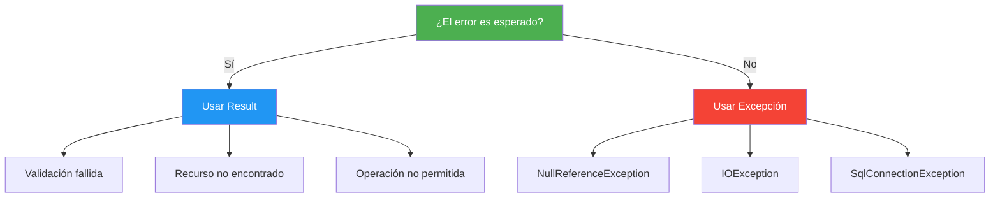

- [15. Patrón Result y Programación Funcional](#15-patrón-result-y-programación-funcional)
  - [15.1. El Problema: Excepciones como Flujo de Control](#151-el-problema-excepciones-como-flujo-de-control)
  - [15.2. Result<T>: Errores sin Excepciones](#152-resultt-errores-sin-excepciones)
  - [15.3. Maybe<T>: Valores que Pueden No Existir](#153-maybet-valores-que-pueden-no-existir)
  - [15.4. Guard: Validaciones Concisas](#154-guard-validaciones-concisas)
  - [15.5. Bind y Map: Encadenando Operaciones](#155-bind-y-map-encadenando-operaciones)
  - [15.6. Match: El Pattern Matching del Result](#156-match-el-pattern-matching-del-result)
  - [15.7. Result vs Excepciones: Cuándo Usar Cada Uno](#157-result-vs-excepciones-cuándo-usar-cada-uno)


# 15. Patrón Result y Programación Funcional

> 💡 **Punto de partida:** Imagina que estás en una cadena de montaje de coches. Si una pieza falla, ¿lanzas una alarma y paras toda la fábrica (excepción), o marcas la pieza como defectuosa y sigues adelante (Result)? En programación, las excepciones son como esas alarmas: útiles para errores inesperados, pero un desastre si las usas para errores "normales" como "usuario no encontrado" o "email ya registrado". El patrón `Result` te permite manejar errores como **datos**, no como excepciones.

En este tema aprenderás el patrón Result con CSharpFunctionalExtensions: `Result<T>`, `Maybe<T>`, `Guard`, `Bind`, `Map` y `Match`, y cuándo usar Result vs Excepciones.

**Objetivos de aprendizaje:**

- Comprender por qué las excepciones como flujo de control son un problema
- Usar `Result<T>` para representar éxito o fallo
- Aplicar `Maybe<T>` para valores que pueden no existir
- Encadenar operaciones con `Bind` y `Map`
- Tomar decisiones con `Match`
- Distinguir cuándo usar Result vs Excepciones

## 15.1. El Problema: Excepciones como Flujo de Control

Las excepciones están diseñadas para errores **inesperados** (fallo de disco, conexión rota, null reference). Pero muchas veces las usamos para errores **esperados** (usuario no encontrado, validación fallida, saldo insuficiente).

```csharp
// ❌ MALO: Usar excepciones para errores esperados
public Persona ObtenerPorId(int id)
{
    var persona = _repository.GetById(id);
    if (persona is null)
        throw new NotFoundException($"Persona con ID {id} no encontrada"); // Esto NO es un error inesperado
    return persona;
}

// El problema: el que llama DEBE usar try-catch para algo "normal"
try
{
    var persona = service.ObtenerPorId(42);
}
catch (NotFoundException ex)
{
    Console.WriteLine(ex.Message); // "Persona con ID 42 no encontrada"
}
```

| Problema | Consecuencia |
|----------|-------------|
| Las excepciones son lentas | Capturar una excepción cuesta ~100x más que un `if` |
| No son visibles en la firma del método | `ObtenerPorId` "parece" que siempre devuelve un `Persona` |
| Se olvidan los catch | Si no capturas, la app se cae |
| Dificultan el encadenamiento | No puedes hacer `Obtener().Guardar().Enviar()` sin anidar try-catch |

> 💡 **Analogía:** Las excepciones son como un coche con un único botón: "PANICO". Si te equivocas de camino, presionas PANICO y el coche se para. El patrón Result es como tener un GPS: te dice "turn left", "road not found", pero no Para el coche.

## 15.2. Result<T>: Errores sin Excepciones

`Result<T>` es un tipo que puede contener **éxito** (con un valor `T`) o **fallo** (con un mensaje de error). Es un tipo monádico: puede encadenarse.

### Paquete NuGet

```bash
dotnet add package CSharpFunctionalExtensions
```

### Uso básico

```csharp
using CSharpFunctionalExtensions;

// Crear un Result de éxito
var exito = Result.Success(42);
var exitoTexto = Result.Success("Operación completada");

// Crear un Result de fallo
var fallo = Result.Failure<int>("No se encontró el elemento");

// Usar un Result
if (exito.IsSuccess)
{
    Console.WriteLine($"Valor: {exito.Value}"); // 42
}

if (fallo.IsFailure)
{
    Console.WriteLine($"Error: {fallo.Error}"); // "No se encontró el elemento"
}
```

### Result como retorno de método

```csharp
using CSharpFunctionalExtensions;

public class PersonaService(IPersonaRepository repository)
{
    public Result<Persona> ObtenerPorId(int id)
    {
        var persona = repository.GetById(id);
        if (persona is null)
            return Result.Failure<Persona>($"Persona con ID {id} no encontrada");

        return Result.Success(persona);
    }

    public Result<Persona> Crear(string nombre, string email)
    {
        // Validaciones
        if (string.IsNullOrWhiteSpace(nombre))
            return Result.Failure<Persona>("El nombre no puede estar vacío");

        if (string.IsNullOrWhiteSpace(email))
            return Result.Failure<Persona>("El email no puede estar vacío");

        if (_repository.ExisteEmail(email))
            return Result.Failure<Persona>("El email ya está registrado");

        var persona = new Persona(nombre, email);
        _repository.Add(persona);
        return Result.Success(persona);
    }
}

// El que llama SABE que puede haber error (está en la firma)
var resultado = service.Crear("Ana", "ana@email.com");
if (resultado.IsSuccess)
{
    Console.WriteLine($"Creada: {resultado.Value.Nombre}");
}
else
{
    Console.WriteLine($"Error: {resultado.Error}");
}
```

> 📝 **Nota:** `Result<T>` no puede ser `null`. Si el método no devuelve nada de interés, usa `Result` (sin genérico). Si devuelve un valor, usa `Result<T>`.

### UnitResult: Result sin valor

```csharp
// Para operaciones que pueden fallar pero no devuelven valor
public Result Eliminar(int id)
{
    if (!_repository.Existe(id))
        return Result.Failure("No se encontró el elemento");

    _repository.Delete(id);
    return Result.Success();
}
```

📌 **Ejemplo real:** En un sistema bancario, transferir dinero puede fallar por "saldo insuficiente", "cuenta destino no existe" o "límite diario alcanzado". Estos NO son errores inesperados: son casos de negocio que el usuario espera. Usar `Result` en vez de excepciones hace que el código sea más claro y eficiente.

## 15.3. Maybe<T>: Valores que Pueden No Existir

`Maybe<T>` representa un valor que **puede no existir**. Es como un `nullable` pero con más funcionalidades.

```csharp
using CSharpFunctionalExtensions;

// Crear un Maybe
var alguno = Maybe<string>.From("Hola");
var ninguno = Maybe<string>.None;

// Usar un Maybe
if (alguno.HasValue)
{
    Console.WriteLine(alguno.Value); // "Hola"
}

// Convertir desde nullable
string? nombre = null;
var maybe = Maybe<string>.From(nombre); // Maybe.None
```

### Maybe con colecciones

```csharp
// Buscar el primero que cumpla una condición
var personas = new List<Persona>
{
    new("Ana", 25),
    new("Carlos", 30),
    new("María", 28)
};

Maybe<Persona> encontrado = personas
    .FirstOrDefault(p => p.Edad > 29)
    .ToMaybe(); // Maybe<Persona> con el valor o None

encontrado.Map(p => Console.WriteLine($"Encontrado: {p.Nombre}"));
```

### Maybe como retorno de método

```csharp
public Maybe<Persona> BuscarPorEmail(string email)
{
    var persona = _repository.GetByEmail(email);
    return Maybe<Persona>.From(persona); // Si persona es null, devuelve Maybe.None
}

// Uso
var resultado = service.BuscarPorEmail("ana@email.com");
resultado.Execute(
    some: persona => Console.WriteLine($"Encontrado: {persona.Nombre}"),
    none: () => Console.WriteLine("No se encontró")
);
```

> 💡 **Consejo:** Usa `Maybe<T>` cuando el "no encontrar nada" es un caso normal, no un error. Por ejemplo, `BuscarPorEmail` puede no encontrar nada y eso está bien. Pero `ObtenerPorId` en un endpoint que espera un resultado SÍ debería fallar con `Result.Failure`.

## 15.4. Guard: Validaciones Concisas

`Guard` es una clase que facilita las validaciones comunes. En vez de escribir muchos `if`, usas una sintaxis más fluida.

```csharp
using CSharpFunctionalExtensions;

public Result<Persona> Crear(string nombre, string email, int edad)
{
    // Guard agrupa validaciones
    var resultado = Result
        .Success()
        .Tap(() => Guard.NotNullOrEmpty(nombre, nameof(nombre)))
        .Tap(() => Guard.NotNullOrEmpty(email, nameof(email)))
        .Tap(() => Guard.NotNegative(edad, nameof(edad)))
        .Tap(() => Guard.Maximun(edad, 150, nameof(edad)));

    if (resultado.IsFailure)
        return Result.Failure<Persona>(resultado.Error);

    var persona = new Persona(nombre, email, edad);
    return Result.Success(persona);
}
```

### Guard con más validaciones

```csharp
// Guard compilation: múltiples validaciones encadenadas
var resultado = Guard
    .NotNull(nombre, nameof(nombre))
    .NotWhiteSpace(nombre, nameof(nombre))
    .NotNull(email, nameof(email))
    .Matches(email, @"^[^@]+@[^@]+\.[^@]+$", nameof(email), "Email no válido")
    .InRange(edad, 0, 150, nameof(edad));
```

> 📝 **Nota:** `Guard` no es parte de CSharpFunctionalExtensions oficial. Si necesitas validaciones más potentes, considera usar `FluentValidation` que es la librería estándar para validaciones en .NET.

## 15.5. Bind y Map: Encadenando Operaciones

`Bind` y `Map` permiten encadenar operaciones sobre `Result<T>` sin escribir `if/else` en cada paso.

### Map: Transforma el valor interior

```csharp
// Map transforma el valor SI el resultado es exitoso
var resultado = Result.Success(10)
    .Map(x => x * 2)           // 20
    .Map(x => x + 5)           // 25
    .Map(x => $"El resultado es {x}"); // "El resultado es 25"

Console.WriteLine(resultado.Value); // "El resultado es 25"
```

### Bind: Encadena operaciones que devuelven Result

```csharp
// Bind es como Map pero la función devuelve un Result
public Result<Persona> Obtener(int id)
{
    var persona = _repository.GetById(id);
    if (persona is null) return Result.Failure<Persona>("No encontrada");
    return Result.Success(persona);
}

public Result<Persona> ActualizarEmail(Persona persona, string nuevoEmail)
{
    if (string.IsNullOrEmpty(nuevoEmail))
        return Result.Failure<Persona>("Email vacío");

    var actualizada = persona with { Email = nuevoEmail };
    return Result.Success(actualizada);
}

public Result EnviarBienvenida(Persona persona)
{
    _email.Enviar(persona.Email, "¡Bienvenido!");
    return Result.Success();
}

// Encadenar con Bind (sin anidar if/else)
var resultado = Obtener(1)
    .Bind(p => ActualizarEmail(p, "nuevo@email.com"))
    .Bind(p => EnviarBienvenida(p));

if (resultado.IsFailure)
    Console.WriteLine($"Error: {resultado.Error}");
```

### Diferencia entre Map y Bind

| Operación | Función de entrada | Función de salida | Uso |
|-----------|-------------------|-------------------|-----|
| **Map** | `T → U` | `Result<U>` | Transformar el valor |
| **Bind** | `T → Result<U>` | `Result<U>` | Encadenar operaciones que pueden fallar |

```csharp
// Map: transforma el valor (la función NO devuelve Result)
var doble = Result.Success(5).Map(x => x * 2); // Result<int> con valor 10

// Bind: encadena operaciones que pueden fallar (la función SÍ devuelve Result)
var resultado = Result.Success(5)
    .Bind(x => x > 0 
        ? Result.Success(x * 2) 
        : Result.Failure<int>("Debe ser positivo")); // Result<int>
```

> 💡 **Analogía:** `Map` es como una estación de una cadena de montaje que **transforma** la pieza (pintarla, lijarla). `Bind` es como una estación que puede **rechazar** la pieza (si falla el control de calidad).

📌 **Ejemplo real:** En un sistema de registro de usuario, el flujo es: validar email → comprobar que no existe → crear usuario → enviar email de bienvenida. Cada paso puede fallar. Con `Bind`, encadena todo en una línea sin anidar `if/else`.

## 15.6. Match: El Pattern Matching del Result

`Match` permite ejecutar una función diferente según si el `Result` es éxito o fallo. Es como un `if/else` pero funcional.

```csharp
var resultado = service.ObtenerPorId(42);

// Match ejecuta una función según el caso
string mensaje = resultado.Match(
    success: persona => $"Encontrado: {persona.Nombre}",
    failure: error => $"Error: {error}"
);

Console.WriteLine(mensaje); // "Encontrado: Ana" o "Error: Persona no encontrada"
```

### Match con efectos secundarios

```csharp
resultado.Match(
    success: persona =>
    {
        Console.WriteLine($"Nombre: {persona.Nombre}");
        Console.WriteLine($"Email: {persona.Email}");
        return Unit.Value; // Unit es como void para lambdas
    },
    failure: error =>
    {
        Console.WriteLine($"Error: {error}");
        return Unit.Value;
    }
);
```

### Match con switch expression

```csharp
// Alternativa: usar switch expression
string mensaje = resultado switch
{
    { IsSuccess: true } => $"Encontrado: {resultado.Value.Nombre}",
    { IsFailure: true } => $"Error: {resultado.Error}",
    _ => "Estado desconocido"
};
```

> 💡 **Consejo:** `Match` es la forma más limpia de manejar `Result` cuando necesitas transformarlo en un valor o efecto secundario. Evita los `if/else` repetitivos.

## 15.7. Result vs Excepciones: Cuándo Usar Cada Uno

| Criterio | Result | Excepciones |
|----------|--------|-------------|
| **Tipo de error** | Esperado (validación, no encontrado) | Inesperado (fallo de disco, null ref) |
| **Frecuencia** | Frecuente (cada petición) | Rara (excepcional) |
| **Velocidad** | Rápido (un objeto simple) | Lento (stack trace, captura) |
| **Visibilidad** | Visible en la firma del método | Invisible (oculta en el código) |
| **Encadenamiento** | `Bind`, `Map`, `Match` | `try/catch` anidados |
| **Testing** | Fácil de testear | Difícil de capturar en tests |



### Ejemplo completo: API con Result

```csharp
// Endpoint que usa Result para manejar errores
app.MapGet("/api/personas/{id}", (int id, IPersonaService service) =>
{
    var resultado = service.ObtenerPorId(id);

    return resultado.Match(
        success: persona => Results.Ok(persona),
        failure: error => Results.NotFound(new { Error = error })
    );
});

// Service que devuelve Result
public class PersonaService : IPersonaService
{
    public Result<Persona> ObtenerPorId(int id)
    {
        if (id <= 0)
            return Result.Failure<Persona>("El ID debe ser positivo");

        var persona = _repository.GetById(id);
        if (persona is null)
            return Result.Failure<Persona>($"Persona con ID {id} no encontrada");

        return Result.Success(persona);
    }
}
```

> ⚠️ **Advertencia:** No uses `Result` para errores de infraestructura (fallo de BD, error de red). Esos SÍ son excepciones. `Result` es para errores de **negocio** que el código puede manejar.

---

**Resumen del punto:**

| Concepto | Descripción |
|----------|-------------|
| **Result\<T\>** | Tipo que representa éxito (con valor) o fallo (con error) |
| **Maybe\<T\>** | Tipo que representa un valor que puede no existir |
| **Guard** | Validaciones concisas y encadenables |
| **Map** | Transforma el valor interior de un Result |
| **Bind** | Encadena operaciones que devuelven Result |
| **Match** | Ejecuta una función según éxito o fallo |
| **Result vs Excepciones** | Result para errores esperados, Excepciones para inesperados |

En el siguiente punto veremos concurrencia y asíncronismo en C#: `async/await`, `Task`, `CancellationToken` y patrones de concurrencia para construir aplicaciones más rápidas y responsivas.
