- [16. Concurrencia y Asincronía en C#](#16-concurrencia-y-asincronía-en-c)
  - [16.1. Sincronía: La Base para Entender la Asincronía](#161-sincronía-la-base-para-entender-la-asincronía)
  - [16.2. Operaciones de E/S: El Verdadero Enemigo](#162-operaciones-de-e-s-el-verdadero-enemigo)
  - [16.3. Asíncronía: No Bloquear Mientras Esperas](#163-asincronía-no-bloquear-mientras-esperas)
  - [16.4. Concurrencia vs Paralelismo vs Sincronía vs Asíncronía](#164-concurrencia-vs-paralelismo-vs-sincronía-vs-asíncronía)
    - [16.4.1. Diseñar en paralelo: Los 3 errores clásicos](#1641-diseñar-en-paralelo-los-3-errores-clásicos)
    - [16.4.2. El coste invisible de Task.Run y el ThreadPool](#1642-el-coste-invisible-de-taskrun-y-el-threadpool)
    - [16.4.3. ¿Cuándo NO paralelizar? La regla de oro](#1643-cuándo-no-paralelizar-la-regla-de-oro)
  - [16.5. Async/Await: La Base de la Asincronía en C#](#165-asyncawait-la-base-de-la-asincronía-en-c)
  - [16.6. Task y Task\<T\>: El Resultado de una Operación Asíncrona](#166-task-y-taskt-el-resultado-de-una-operación-asíncrona)
  - [16.7. CancellationToken: Cancelar Operaciones en Marcha](#167-cancellationtoken-cancelar-operaciones-en-marcha)
  - [16.8. Async Void vs Async Task](#168-async-void-vs-async-task)
  - [16.9. Patrones de Concurrencia](#169-patrones-de-concurrencia)
  - [16.10. Errores en Código Asíncrono](#1610-errores-en-código-asíncrono)
  - [16.11. Parallel.For vs Task.WhenAll](#1611-parallelfor-vs-taskwhenall)
  - [16.12. Task vs ValueTask vs IAsyncEnumerable](#1612-task-vs-valuetask-vs-iasyncenumerable)


# 16. Concurrencia y Asincronía en C#

> 💡 **Punto de partida:** Tu app web hace una petición a una API externa que tarda 3 segundos. Mientras tanto, el usuario mira la pantalla... ¿cargando? ¿Y si en vez de esperar, la app pudiera hacer otras cosas mientras tanto? Eso es la **asincronía**: no bloquear el hilo mientras esperas algo lento (red, disco, base de datos). Pero cuidado: asincronía no es paralelismo. Vamos a ver la diferencia y cómo usar `async/await` correctamente.

En este tema aprenderás qué es la sincronía, por qué las operaciones de E/S son un problema, cómo la asincronía lo resuelve, y cómo usar `async/await`, `Task`, `CancellationToken` correctamente en C#.

**Objetivos de aprendizaje:**

- Entender qué es la sincronía y por qué bloquea el hilo
- Distinguir operaciones de CPU vs operaciones de I/O
- Distinguir concurrencia, paralelismo y asíncrono
- Dominar `async/await` y cuándo usarlo
- Entender `Task` y `Task<T>` como promesas de C#
- Usar `CancellationToken` para cancelar operaciones largas
- Evitar los peligros de `async void`
- Aplicar patrones de concurrencia: `WhenAll`, `WhenAny`, `Parallel.For`
- Diferenciar `Task`, `ValueTask` e `IAsyncEnumerable`
- Diseñar operaciones paralelas correctamente (los 3 errores clásicos)

## 16.1. Sincronía: La Base para Entender la Asincronía

Antes de hablar de asíncronia, necesitas entender **sincronía**. Es el modelo "normal" que conoces: un programa ejecuta instrucciones una tras otra, en orden, esperando a que cada una termine antes de pasar a la siguiente.

### ¿Qué es una operación síncrona?

Una operación síncrona es aquella que **bloquea el hilo** hasta que termina. El hilo no puede hacer nada más mientras espera.

```mermaid
sequenceDiagram
    participant H as 🧵 Hilo de ejecución
    participant O as ⏳ Operación (red/disco/BD)

    H->>O: Inicio petición
    Note over H: 🔒 Hilo BLOQUEADO — no puede hacer nada
    Note over H: 🔒 Hilo BLOQUEADO — el usuario espera...
    Note over H: 🔒 Hilo BLOQUEADO — la app se congela...
    O-->>H: Resultado
    Note over H: ✅ Hilo LIBRE — continúa ejecutando

    style H fill:#f44336,color:#fff
    style O fill:#FF9800,color:#fff
```

```csharp
// ❌ SÍNCRONO: El hilo está bloqueado durante toda la operación
public string ObtenerDatosSync()
{
    using var client = new HttpClient();
    // GetStringAsync internamente usa .Result → BLOQUEA el hilo
    string datos = client.GetStringAsync("https://api.ejemplo.com").Result;
    return datos;
}
```

> 💡 **Analogía — Llamar por teléfono:**
> Imagina que llamas a un restaurante para hacer un pedido. Mientras esperas a que te contesten, **no puedes hacer nada más**. Estás pegado al teléfono, mirando la pantalla, sin poder cocinar, sin poder trabajar. Eso es una operación síncrona: **esperas parado**.

### Tipos de operaciones

No todas las operaciones son iguales. Hay dos grandes familias:

| Tipo | Qué hace | Ejemplos | ¿Bloquea el hilo? |
|------|----------|----------|-------------------|
| **CPU-bound** | Cálculos intensivos | Calcular Primos, procesar imagen, comprimir ZIP | Sí (pero se puede paralelizar) |
| **I/O-bound** | Esperar algo externo | Leer fichero, petición HTTP, consulta BD | Sí (pero se puede hacer asíncrona) |

📌 **Ejemplo real:** Cuando abres Instagram y carga tu feed, la app hace una petición a un servidor en EE.UU. Esa petición tarda 500ms-2s. Si fuera síncrona, tu pantalla estaría congelada ese tiempo. Con asíncronía, la app sigue respondiendo mientras recibe los datos.

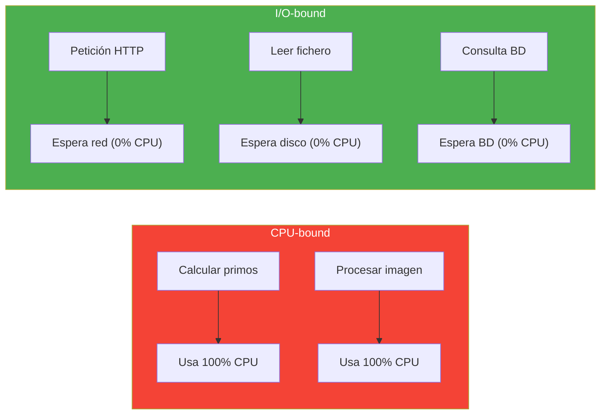

> 💡 **Truco:** Las operaciones de I/O son las que **más benefician** de la asincronía. Porque mientras esperas la respuesta de la red o del disco, el hilo está **libre** para hacer otras cosas. ¡No estás quemando CPU esperando!

## 16.2. Operaciones de E/S: El Verdadero Enemigo

Las operaciones de entrada/salida (I/O) son las que más afectan al rendimiento de una app. Son **lentas** comparadas con la CPU:

| Operación | Tiempo típico | Velocidad CPU |
|-----------|---------------|---------------|
| Leer de RAM | ~100 nanosegundos | — |
| Leer disco SSD | ~100 microsegundos | 1.000x más lento |
| Leer disco HDD | ~10 milisegundos | 100.000x más lento |
| Petición a Internet | ~100 milisegundos | 1.000.000x más lento |
| Consulta a BD | ~50 milisegundos | 500.000x más lento |

> 💡 **Analogía — El Supermercado:**
> Piensa en la CPU como tú, en tu cocina. Leer un dato de la RAM es como coger una especia de la estantería (instantáneo). Leer de disco es como ir al garaje a buscar una caja (lento). Hacer una petición a Internet es como ir al supermercado a comprar los ingredientes (muy lento). Si fueras **síncrono**, te quedarías sentado en la cocina esperando a que vuelvas del supermercado. Con **asincronía**, mandas a alguien al supermercado y tú sigues cocinando con lo que tienes.

### ¿Qué pasa internamente cuando bloqueas en I/O?

Aquí viene lo que normalmente no te explican. Cuando tu hilo hace una operación de I/O (leer disco, petición HTTP, consulta a BD), esto es lo que **realmente** pasa:

```mermaid
sequenceDiagram
    participant TP as 🧵 Thread Pool
    participant H as 🧵 Hilo asignado
    participant OS as ⚙️ Sistema Operativo
    participant IO as 💾 Recurso I/O (disco/red/BD)

    TP->>H: Asigna hilo a tu código
    H->>OS: "Quiero leer este fichero"
    OS->>IO: Envía petición al hardware
    
    Note over H: 🔒 Hilo BLOQUEADO<br/>No puede hacer nada<br/>Ocupa memoria (~1MB)
    Note over IO: ⏳ Esperando respuesta<br/>del hardware...
    
    IO-->>OS: Datos listos
    OS-->>H: "Aquí tienes los datos"
    Note over H: ✅ Hilo LIBRE de nuevo<br/>Procesa el resultado
    
    Note over TP: El hilo vuelve al pool<br/>listo para otro trabajo

    style H fill:#f44336,color:#fff
    style IO fill:#FF9800,color:#fff
    style OS fill:#607D8B,color:#fff
    style TP fill:#4CAF50,color:#fff
```

**El problema real no es la velocidad. Es el RECURSO desperdiciado:**

| Recurso | Mientras bloquea en I/O | Coste |
|---------|------------------------|-------|
| **Hilo** | Ocupado, no puede hacer nada | ~1MB de stack |
| **Memoria** | El hilo sigue vivo en RAM | 1000 hilos = 1GB |
| **CPU** | 0% de uso (esperando) | Desperdicio total |
| **Escalabilidad** | 1 hilo por petición | 1000 peticiones = 1000 hilos muertos |

📌 **Ejemplo real:** Imagina un servidor web con 5000 usuarios conectados. Si cada petición bloquea un hilo durante 200ms leyendo de la BD, necesitas 5000 hilos simultáneos. Cada hilo consume ~1MB de RAM. Son **5GB de RAM solo en hilos esperando**. Con asincronía, esos mismos 5000 usuarios se atienden con ~200 hilos que se reutilizan constantemente. **25x menos memoria.**

## 16.3. Asíncronía: No Bloquear Mientras Esperas

La **asincronía** es la capacidad de **iniciar una operación y seguir haciendo otras cosas** mientras esperas el resultado. No es paralelismo (no es hacer dos cosas al mismo tiempo), es **no quedarse parado esperando**.

> 💡 **Analogía — Enviar un email:**
> - **Síncrono:** Llamas por teléfono y esperas pegado al auricular a que te respondan. No puedes hacer nada más.
> - **Asíncrono:** Mandas un email y sigues trabajando. Cuando te respondan, te enteras y miras la respuesta. **No pierdes el tiempo esperando.**

```mermaid
sequenceDiagram
    participant U as 👤 Usuario
    participant A as 🖥️ App (hilo principal)
    participant R as 🌐 API Remota

    Note over A: Estado: RECIBIENDO petición

    U->>A: "Dame mis datos"
    A->>R: Fetch datos (async)
    Note over A: 🟢 Hilo LIBRE — puede procesar otros usuarios
    A-->>U: "Tus datos están en proceso"

    Note over R: ...500ms pasan...
    R-->>A: Datos recibidos
    Note over A: ✅ Procesa resultado y responde

    style A fill:#4CAF50,color:#fff
```

```csharp
// ✅ ASÍNCRONO: El hilo se libera mientras espera
public async Task<string> ObtenerDatosAsync()
{
    using var client = new HttpClient();
    // await libera el hilo. Cuando llegue la respuesta, se reanuda.
    string datos = await client.GetStringAsync("https://api.ejemplo.com");
    return datos;
}
```

### ¿Cómo funciona internamente? El ciclo de vida de un `await`

Cuando el compilador encuentra un `await`, esto es lo que **realmente** pasa paso a paso:

```mermaid
sequenceDiagram
    participant Main as 🧵 Hilo Principal
    participant Compilador as 🔧 Compilador C#
    participant TP as 🧵 Thread Pool
    participant OS as ⚙️ Sistema Operativo
    participant IO as 💾 Recurso I/O

    Main->>Compilador: "Llama a await LeerFicheroAsync()"
    Compilador->>Main: 1. Ejecuta hasta el primer await
    Main->>OS: 2. Lanza la operación de I/O (NO bloquea)
    Main->>TP: 3. DEVUELVE el hilo al pool ← ¡Clave!
    
    Note over Main: 🟢 Hilo principal LIBRE<br/>Puede atender otros usuarios,<br/>procesar peticiones, etc.
    
    Note over IO: ⏳ Esperando respuesta del hardware...
    
    IO-->>OS: 4. Datos listos
    OS-->>TP: 5. "Hay un trabajo pendiente"
    TP->>Main: 6. Asigna CUALQUIER hilo disponible
    
    Note over Main: ✅ Reanuda después del await<br/>Con los datos en la variable
    
    Main->>Main: 7. Continúa ejecutando

    style Main fill:#4CAF50,color:#fff
    style TP fill:#2196F3,color:#fff
    style IO fill:#FF9800,color:#fff
```

**Lo clave del diagrama:**

1. **Paso 3:** El hilo VUELVE al pool. No se queda esperando. No ocupa memoria.
2. **Paso 6:** Puede ser **OTRO hilo** distinto. Por eso el Thread ID cambia.
3. **El resultado** se guarda en la variable `datos` como si hubiera sido síncrono.

> 💡 **Analogía — La promesa:**
> `await` es como un **vale por un resultado futuro**. Le dices al sistema: "Necesito esto, pero no puedo quedarme aquí esperando. Cuando lo tengas, llámame." El sistema te devuelve un **vale** (un `Task`). Mientras tanto, tú sigues haciendo otras cosas. Cuando el resultado está listo, el sistema te dice "ya puedes continuar" y tú coges el resultado del vale.

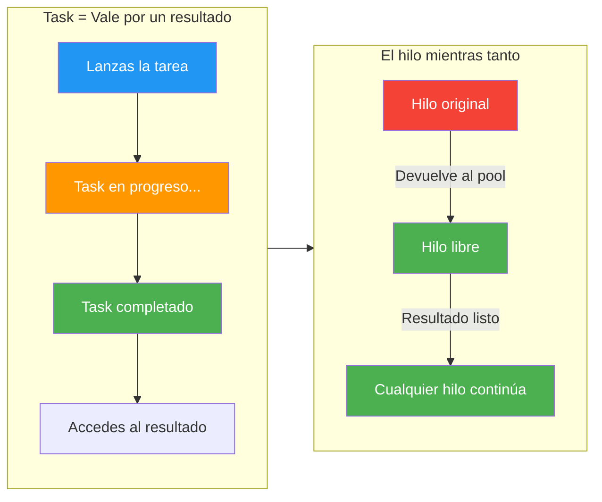

📌 **Ejemplo real:** Cuando abres Netflix y carga tu lista de series, la app hace 15 peticiones HTTP a la vez (thumbnails, recomendaciones, historial). Cada petición es un `await`. El hilo principal no espera: lanza las 15 peticiones (crea 15 Tasks), se devuelve al pool, y cuando cada respuesta llega, el pool asigna un hilo para procesarla. Si fueran síncronas, la app estaría congelada 15 x 200ms = **3 segundos**. Con asincronía, tarda lo que la más lenta: **~200ms**.

> 💡 **Consejo:** Usa `async/await` en operaciones de I/O (red, disco, BD). **NO** lo uses para operaciones de CPU puro (calcular primos, procesar imagen) — para eso usa `Task.Run` o `Parallel.For`.

## 16.4. Concurrencia vs Paralelismo vs Sincronía vs Asíncronía

Estos cuatro términos se confunden mucho. Vamos a aclararlos de una vez:

| Concepto | Definición | Analogía | Ejemplo en C# |
|----------|-----------|----------|---------------|
| **Sincronía** | Ejecutar en orden, esperando cada paso | Llamar por teléfono y esperar | `.Result`, `.Wait()` |
| **Asíncrono** | No bloquear mientras esperas | Mandar email y seguir trabajando | `async/await` |
| **Concurrencia** | Múltiples tareas en progreso (intercaladas) | Un cocinero con varias recetas | `Task.WhenAll` |
| **Paralelismo** | Múltiples tareas al mismo tiempo en varios hilos | Dos cocineros, cada uno con su receta | `Parallel.For` |


> 💡 **Analogía — El Restaurante (versión completa):**
> - **Secuencial (síncrono):** Un cocinero, una receta a la vez. Acaba la paella, luego empieza el postre.
> - **Concurrencia:** Un cocinero que prepara varias recetas "a la vez": pone el arroz a hervir, mientras pela las gambas, mientras calienta el aceite. Intercambia tareas cuando una está "esperando".
> - **Paralelismo:** Dos cocineros. Cada uno con su receta. Realmente cocinando al mismo tiempo.
> - **Asíncrono:** El cocinero manda a un comensal al supermercado a comprar pan y sigue cocinando. Cuando vuelva el de pan, lo pone en la mesa.

```mermaid
sequenceDiagram
    participant S as 🔴 Secuencial
    participant C as 🔵 Concurrencia
    participant P as 🟠 Paralelismo

    Note over S: Cocina paella (30min)
    Note over S: Cocina postre (20min)
    Note over S: Total: 50min

    Note over C: Pone arroz (espera)
    Note over C: Pela gambas (mientras)
    Note over C: Calienta aceite (mientras)
    Note over C: Total: 30min

    par Cocinero 1
        Note over P: Cocina paella (30min)
    and Cocinero 2
        Note over P: Cocina postre (20min)
    end
    Note over P: Total: 30min

    style S fill:#f44336,color:#fff
    style C fill:#2196F3,color:#fff
    style P fill:#FF9800,color:#fff
```

📌 **Ejemplo real:** Cuando haces scroll en Instagram y se cargan imágenes, la app no se bloquea. Usa **asincronía** para cargar las imágenes mientras tú sigues navegando. Si cargara todo de golpe, la pantalla se congelaría. Y si además descarga 10 imágenes a la vez, usa **concurrencia** (las 10 en progreso). Si tuviera 2 núcleos de CPU trabajando en decode de imagen, sería **paralelismo**.

### 16.4.1. Diseñar en paralelo: Los 3 errores clásicos

Cuando tienes varias operaciones de I/O independientes, el instinto es hacerlas secuenciales. Pero eso es un error de diseño que cuesta **multiplicar el tiempo de respuesta**. Vamos a ver los 3 patrones y por qué fallan.

> 💡 **Punto de partida:** Tienes que leer un CSV (1000 filas), un JSON (500 elementos) y una BD SQLite (100 registros). Cada operación tarda ~50ms. ¿Cómo lo haces?

#### Error 1: Await secuencial (el más común)

```csharp
// ❌ MAL: await secuencial — cada uno ESPERA al anterior
var csv = await LeerCsvAsync("productos.csv");       // 50ms
var json = await LeerJsonAsync("productos.json");    // 50ms
var sqlite = await LeerSqliteAsync("productos.db");  // 50ms
// Total: 150ms — ¡3x más lento de lo necesario!
```

```mermaid
gantt
    title Error 1: Await secuencial
    dateFormat X
    axisFormat %s
    
    section CSV
    Leer CSV (50ms)     :0, 50
    section JSON
    Espera...           :0, 50
    Leer JSON (50ms)    :50, 100
    section SQLite
    Espera...           :50, 100
    Leer SQLite (50ms)  :100, 150
```

**Por qué falla:** Cada `await` pausa la ejecución hasta que termine. Es como ir al supermercado y hacer 3 viajes separados: uno por leche, otro por pan, otro por huevos. Total = 3 viajes.

#### Error 2: Fire-and-forget (olvidar el resultado)

```csharp
// ❌ MAL: Lanzas sin await — no sabes cuándo terminan
_ = LeerCsvAsync("productos.csv");
_ = LeerJsonAsync("productos.json");
_ = LeerSqliteAsync("productos.db");
// ¡No tienes los resultados! Y si falla, no te enteras.
```

**Por qué falla:** Lanzas las tareas pero nunca recoges los resultados. Es como mandar a 3 personas al supermercado y no abrir la puerta cuando vuelven. Los productos se pierden.

#### Error 3: WhenAll + await secuencial (falso paralelo)

```csharp
// ❌ MAL: Lanzas en paralelo pero luego accedes con .Result
var tarea1 = LeerCsvAsync("productos.csv");
var tarea2 = LeerJsonAsync("productos.json");
var tarea3 = LeerSqliteAsync("productos.db");

await Task.WhenAll(tarea1, tarea2, tarea3); // Paralelo ✓

// Pero luego accedes así (secuencial):
var csv = await tarea1;  // Espera (ya terminó, pero...)
var json = await tarea2; // Espera
var sqlite = await tarea3; // Espera
```

**Por qué falla:** `WhenAll` sí es paralelo, pero luego acceder con `await` individual es secuencial. Es como cocinar 3 platos a la vez pero servir uno por uno.

#### ✅ El patrón correcto

```csharp
// ✅ BIEN: Lanzar sin await, WhenAll, y acceder a .Result
var tareaCsv = LeerCsvAsync("productos.csv");       // Lanza (NO await)
var tareaJson = LeerJsonAsync("productos.json");     // Lanza (NO await)
var tareaSqlite = LeerSqliteAsync("productos.db");  // Lanza (NO await)

await Task.WhenAll(tareaCsv, tareaJson, tareaSqlite); // Espera las 3

// Ahora sí accedemos al resultado (ya terminaron)
var csv = tareaCsv.Result;
var json = tareaJson.Result;
var sqlite = tareaSqlite.Result;
// Total: ~50ms (lo que tarda la más lenta)
```

```mermaid
gantt
    title ✅ Patrón correcto: Task.WhenAll
    dateFormat X
    axisFormat %s
    
    section CSV
    Leer CSV (50ms)     :0, 50
    section JSON
    Leer JSON (50ms)    :0, 50
    section SQLite
    Leer SQLite (50ms)  :0, 50
    section Resultado
    WhenAll espera      :0, 50
    Accede a resultados :50, 51
```

📌 **Ejemplo real:** El ejemplo `15-SincroniaVsAsyncronia` en la carpeta de ejemplos muestra exactamente esto. Mide el tiempo de cada enfoque y muestra los Thread IDs para que veas la diferencia entre secuencial y paralelo. **¡Ejecútalo y compara los tiempos!**

> 🔧 **Truco:** La regla es simple: **lanza sin await, guarda el Task, y haz await al final**. Si cada operación es independiente de las demás, se ejecutan en paralelo automáticamente.

### 16.4.2. El coste invisible de Task.Run y el ThreadPool

Hemos visto que `Task.WhenAll` es ideal para I/O. Pero, ¿qué pasa cuando usamos `Task.Run` para paralelizar cálculos en memoria? Aquí viene lo que normalmente no te explican.

#### ¿Qué es el ThreadPool?

El **ThreadPool** es un池 de hilos pre-creados que .NET reutiliza. En vez de crear un hilo nuevo para cada tarea (costoso), el ThreadPool mantiene un número fijo de hilos "listos para trabajar".

```
ThreadPool: [Hilo 1] [Hilo 2] [Hilo 3] [Hilo 4] ... [Hilo N]
            ↑         ↑         ↑         ↑
            Listo     Ocupado   Listo     Ocupado
```

Cuando ejecutas `Task.Run(() => Algo())`, esto es lo que **realmente** pasa:

| Paso | Qué hace | Tiempo |
|------|----------|--------|
| 1. Crear tarea | Reservar memoria para el Task | ~0.1-0.5 ms |
| 2. Buscar hilo | El ThreadPool busca un hilo libre | ~0.05 ms |
| 3. Programar | Encolar la tarea en ese hilo | ~0.1 ms |
| 4. Ejecutar | El hilo ejecuta tu código | Variable |
| 5. Context switch | Guardar/cargar estado del hilo | ~0.01-0.1 ms |
| 6. Reciclar | Devolver el hilo al pool | ~0.05 ms |

**Total overhead por tarea: ~0.3-1.2 ms**

> 💡 **Analogía:** Imagina un restaurante con 4 cocineros (núcleos). Si un cliente pide un plato rápido (2 ms), pero el chef tiene que:

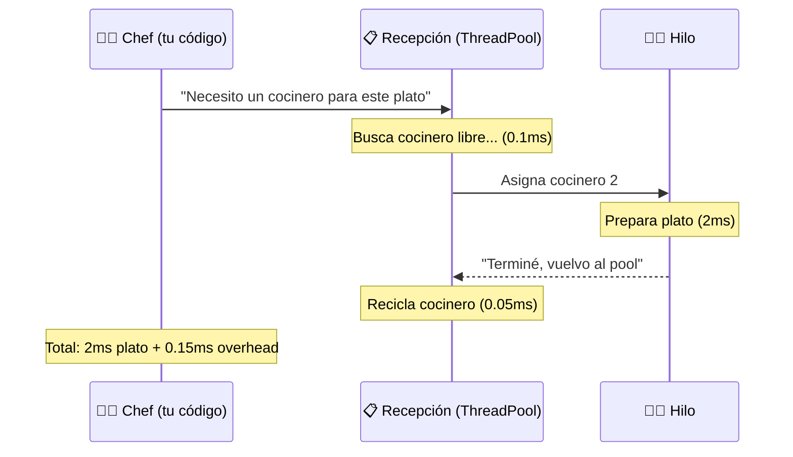

¿Ves el problema? Si el plato tarda 2 ms pero el overhead de "buscar cocinero, asignarlo, reciclarlo" cuesta 0.15 ms, estás perdiendo un **7.5%** del tiempo solo en logística.

#### El problema real: muchas tareas, pocos núcleos

Supongamos que tienes 30 tareas de cálculo, cada una tarda ~27 ms. Si las lanzas en paralelo con `Task.Run` en un ordenador con 4 núcleos:

```
30 tareas ÷ 4 núcleos = 7.5 tareas por núcleo
```

Cada núcleo debe ejecutar ~8 tareas **una detrás de otra**. Pero ahora tenemos overhead adicional:

| Operación | Tiempo | Total (30 tareas) |
|-----------|--------|-------------------|
| Crear tarea | 0.5 ms | 15 ms |
| Context switch | 0.1 ms | 3 ms |
| Programar en ThreadPool | 0.2 ms | 6 ms |
| **Total overhead** | | **~24 ms** |

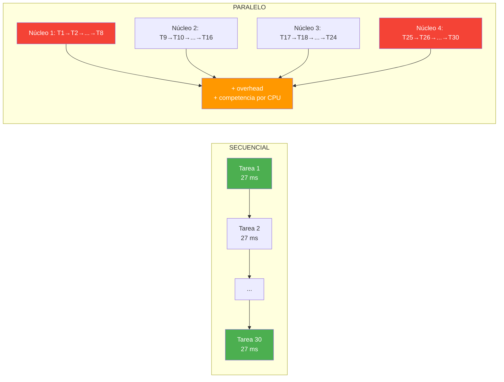

**Secuencial**: 30 × 27 ms = **810 ms** (sin overhead, sin competencia)
**Paralelo**: 810 ms + 24 ms overhead + competencia ≈ **más lento** (depende de la carga)

#### ¿Por qué la competencia empeora las cosas?

Cuando muchas tareas compiten por pocos núcleos, el sistema operativo hace **context switches** constantes: guarda el estado de un hilo, carga otro, ejecuta un poco, vuelve a cambiar... Cada cambio cuesta tiempo.

> 💡 **Analogía:** Es como tener 4 cajeros en un supermercado pero 30 clientes esperando. Los cajeros trabajan rápido, pero si cada cliente solo necesita 5 segundos, el tiempo de "llamar al siguiente, acercarse, sentarse" acaba siendo más que el tiempo de compra.

**El paralelismo empeora el rendimiento** no porque la herramienta sea mala, sino porque las tareas son **demasiado rápidas** para compensar el overhead de `Task.Run`.

📌 **Ejemplo real:** Netflix no paraleliza el decode de un frame de vídeo (2-3 ms, cálculo rápido). Pero sí paraleliza la descarga de thumbnails (E/S de red, 100+ ms cada una). Cada herramienta para su trabajo.

### 16.4.3. ¿Cuándo NO paralelizar? La regla de oro

No todo se debe paralelizar. La clave es saber **cuándo** vale la pena y cuándo no.

| Tipo de operación | ¿Paralelizar? | ¿Por qué? | Ejemplo |
|-------------------|---------------|-----------|---------|
| **E/S** (disco, red, BD) | **SÍ** ✅ | El hilo **espera** sin usar CPU. Otro puede trabajar. | Leer ficheros, llamadas HTTP, consultas BD |
| **Cálculo simple** (en memoria) | **NO** ❌ | El hilo **usa la CPU** todo el tiempo. El overhead de Task.Run supera el beneficio. | Count, Where, Take, Select simple |
| **Cálculo pesado** (>50 ms) | **SÍ** ✅ | Cada tarea tarda bastante. El overhead de Task.Run se compensa. | GroupBy con millones de registros, procesamiento de imagen |

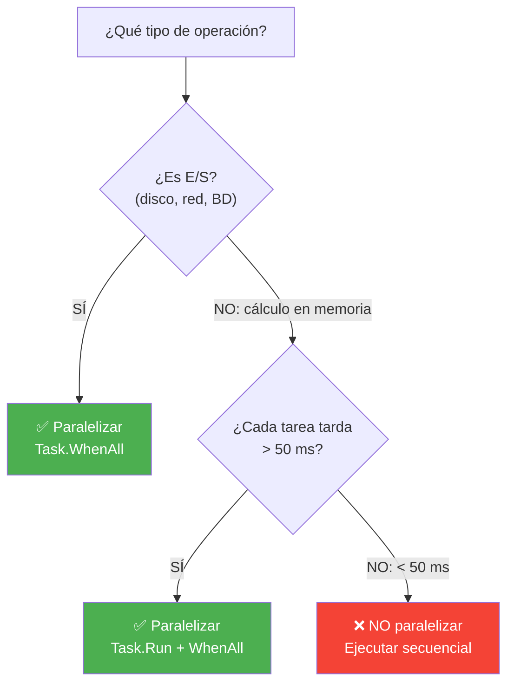

#### La "zona muerta" (5-50 ms)

Hay una zona gris donde el resultado es **impredecible**:

- **< 5 ms**: Casi siempre más lento en paralelo (overhead domina)
- **5-50 ms**: Depende del hardware, número de núcleos, tipo de operación
- **> 50 ms**: Casi siempre más rápido en paralelo

> ⚠️ **Advertencia:** ¡No blindly paralelices! Siempre **mide** antes de decidir. El paralelismo puede empeorar el rendimiento si las tareas son demasiado rápidas.

📌 **Ejemplo real:** Netflix no paraleliza el decode de un frame de vídeo (2-3 ms). Pero sí paraleliza la descarga de thumbnails (E/S de red, 100+ ms cada una). Cada herramienta para su trabajo.

#### Resumen visual

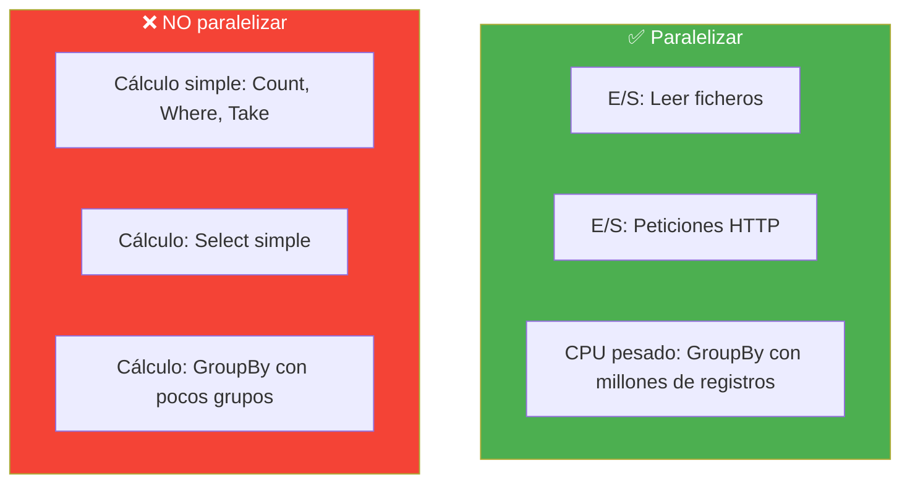

> 💡 **Consejo para el examen:** Si te preguntan "¿cuándo usar Task.Run?", la respuesta es: **solo para I/O o cálculos pesados (> 50 ms)**. Para todo lo demás, ejecuta secuencial. Más código, menos sorpresas.

## 16.5. Async/Await: La Base de la Asincronía en C#

`async` y `await` son las palabras clave que C# usa para la programación asíncrona. `await` pausa la ejecución del método **sin bloquear el hilo** hasta que termine la operación.

### Sintaxis básica

```csharp
// Método asíncrono: tiene la palabra clave "async" y devuelve Task o Task<T>
public async Task<string> LeerFicheroAsync(string ruta)
{
    using var reader = new StreamReader(ruta);
    // await pausa la ejecución hasta que ReadToEndAsync termine
    // Mientras tanto, el hilo está LIBRE para hacer otras cosas
    string contenido = await reader.ReadToEndAsync();
    return contenido;
}

// Uso
string texto = await LeerFicheroAsync("datos.txt");
Console.WriteLine(texto);
```

### Flujo de ejecución

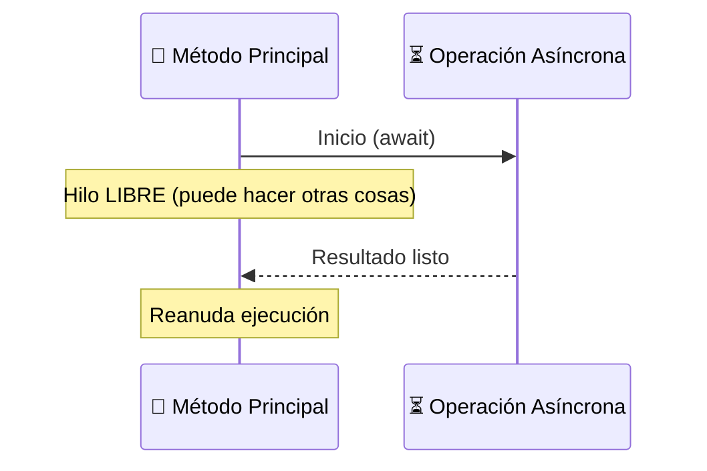

### Diferencia: síncrono vs asíncrono

```csharp
// ❌ BLOQUEANTE: Congela el hilo durante 3 segundos
public string ObtenerDatosSync()
{
    string datos = client.GetStringAsync("https://api.ejemplo.com").Result; // BLOQUEA
    return datos;
}

// ✅ NO BLOQUEANTE: Libera el hilo mientras espera
public async Task<string> ObtenerDatosAsync()
{
    string datos = await client.GetStringAsync("https://api.ejemplo.com"); // NO bloquea
    return datos;
}
```

| Enfoque | Hilo | Tiempo respuesta | Memoria |
|---------|------|-----------------|---------|
| `.Result` / `.Wait()` | Bloqueado | Lenta (congelación) | Normal |
| `await` | Libre | Rápida (responsiva) | Normal |

> ⚠️ **Advertencia:** **NUNCA** uses `.Result` o `.Wait()` en código de UI o en ASP.NET Core. Pueden causar **deadlocks** (el hilo de UI espera a que termine algo que necesita el hilo de UI para terminar). Usa siempre `await`.

## 16.6. Task y Task\<T\>: El Resultado de una Operación Asíncrona

Un `Task` representa una operación asíncrona en curso. Es como un **vale por un resultado futuro** — una promesa de que obtendrás algo, pero todavía no.

### El ciclo de vida de un Task

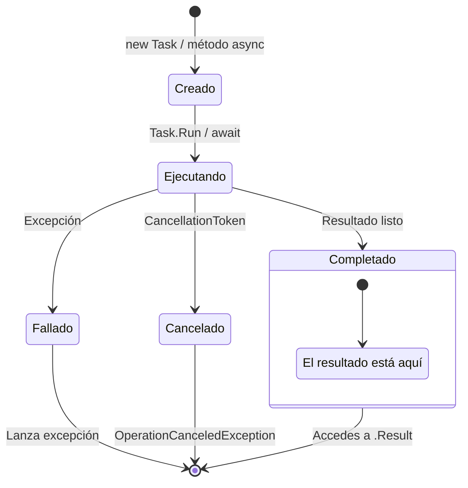

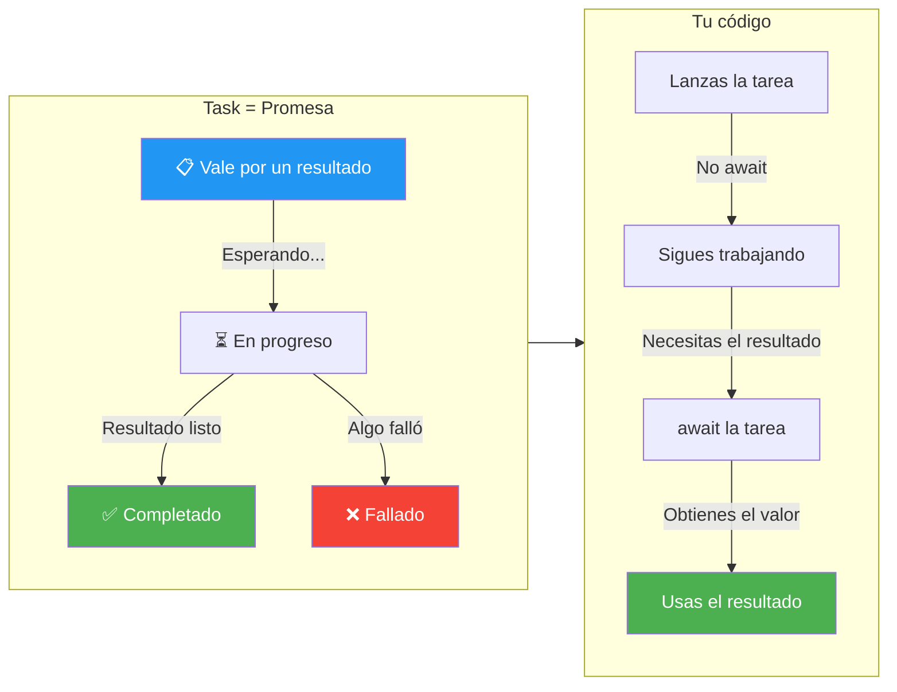

| Tipo | Significado | Ejemplo |
|------|-------------|---------|
| `Task` | Operación sin valor de retorno | `GuardarAsync()` |
| `Task<T>` | Operación con valor de retorno | `LeerAsync() → Task<string>` |
| `Task.CompletedTask` | Tarea ya completada | Para casos triviales |

```csharp
// Task<T>: devuelve un valor
public async Task<int> ContarLineasAsync(string ruta)
{
    using var reader = new StreamReader(ruta);
    int contador = 0;
    while (await reader.ReadLineAsync() is not null)
    {
        contador++;
    }
    return contador;
}

// Task: no devuelve valor
public async Task GuardarLogAsync(string mensaje)
{
    using var writer = new StreamWriter("log.txt", append: true);
    await writer.WriteLineAsync($"[{DateTime.Now}] {mensaje}");
}
```

### Múltiples tareas en paralelo

```csharp
// Lanzar varias tareas y esperar a que terminen TODAS
Task<int> tarea1 = ContarLineasAsync("fichero1.txt");
Task<int> tarea2 = ContarLineasAsync("fichero2.txt");
Task<int> tarea3 = ContarLineasAsync("fichero3.txt");

// Esperar a que terminen las tres (en paralelo)
await Task.WhenAll(tarea1, tarea2, tarea3);

// Obtener resultados
int total = tarea1.Result + tarea2.Result + tarea3.Result;
Console.WriteLine($"Total líneas: {total}");
```

### WhenAll y WhenAny

```csharp
// WhenAll: esperar a que TERMINEN TODAS
var tareas = new List<Task<string>>
{
    ObtenerDatosAsync("https://api1.com"),
    ObtenerDatosAsync("https://api2.com"),
    ObtenerDatosAsync("https://api3.com")
};

string[] resultados = await Task.WhenAll(tareas);
// Ejecuta las 3 en paralelo, espera a que terminen las 3

// WhenAny: esperar a que termine LA PRIMERA
Task<string> primera = await Task.WhenAny(tareas);
string resultadoRapido = await primera;
// útil para timeouts o "el más rápido gana"
```

📌 **Ejemplo real:** Cuando abres Netflix y carga los thumbnails de las series, lanza 10-20 peticiones en paralelo con `Task.WhenAll`. Si esperara secuencialmente, tardaría 10x más. Con paralelo, tarda lo que la más lenta.

## 16.7. CancellationToken: Cancelar Operaciones en Marcha

Un `CancellationToken` permite cancelar operaciones asíncronas que están en curso. Es como decirle a una tarea "ya no te necesito, para".

```csharp
using var cts = new CancellationTokenSource();

// Lanzar tarea con token
var tarea = ObtenerDatosAsync("https://api.ejemplo.com", cts.Token);

// Cancelar después de 5 segundos
cts.CancelAfter(TimeSpan.FromSeconds(5));

try
{
    string datos = await tarea;
}
catch (OperationCanceledException)
{
    Console.WriteLine("Operación cancelada por el usuario");
}
```

### Implementar CancellationToken en métodos

```csharp
public async Task<string> DescargarFicheroAsync(string url, CancellationToken token)
{
    using var client = new HttpClient();

    // Pasar el token al método que hace la petición
    using var respuesta = await client.GetAsync(url, token);

    respuesta.EnsureSuccessStatusCode();

    return await respuesta.Content.ReadAsStringAsync(token);
}

// CancellationTokenSource con timeout
using var cts = new CancellationTokenSource(TimeSpan.FromSeconds(30));
string datos = await DescargarFicheroAsync("https://api.ejemplo.com/datos", cts.Token);
```

### Encadenar tokens

```csharp
// Token global + token local
using var ctsGlobal = new CancellationTokenSource();
using var ctsLocal = new CancellationTokenSource();

// Combinar ambos tokens
using var ctsCombinado = CancellationTokenSource
    .CreateLinkedTokenSource(ctsGlobal.Token, ctsLocal.Token);

// Se cancela si cualquiera de los dos se cancela
await OperacionLargaAsync(ctsCombinado.Token);
```

> 💡 **Consejo:** Siempre pasa el `CancellationToken` a los métodos asíncronos que crees. Si el usuario cancela una operación, tu app puede liberar recursos rápidamente en vez de esperar a que termine.

## 16.8. Async Void vs Async Task

| Retorno | Uso | Problemas |
|---------|-----|-----------|
| `async Task` | Métodos que pueden fallar | Ninguno (el estándar) |
| `async Task<T>` | Métodos que devuelven un valor | Ninguno |
| `async void` | SOLO para eventos de UI | Difícil de testear, errores no capturables |

```csharp
// ✅ BIEN: async Task
public async Task ProcesarAsync()
{
    await Task.Delay(1000);
    // Si lanza excepción, se captura en el Task
}

// ❌ PELIGROSO: async void
public async void Boton_Click()
{
    await Task.Delay(1000);
    throw new Exception("Error"); // ¡Excepción no capturada! La app se cae
}

// ✅ La excepción de async Task SÍ se captura
try
{
    await ProcesarAsync();
}
catch (Exception ex)
{
    Console.WriteLine($"Error: {ex.Message}");
}
```

> ⚠️ **Advertencia:** **NUNCA** uses `async void` excepto en manejadores de eventos de UI (`Button_Click`). Un `async void` que lanza una excepción provoca que la aplicación se cierre inmediatamente. No hay forma de capturar esa excepción con `try/catch`.

## 16.9. Patrones de Concurrencia

### Producer-Consumer con BlockingCollection

```csharp
using System.Collections.Concurrent;

// Productor: genera datos
// Consumidor: procesa datos
var cola = new BlockingCollection<string>();

// Productor (en un hilo separado)
Task.Run(() =>
{
    for (int i = 0; i < 10; i++)
    {
        cola.Add($"Tarea {i}");
        Thread.Sleep(100); // Simular trabajo
    }
    cola.CompleteAdding(); // Señal de que ya no hay más datos
});

// Consumidor (en el hilo principal)
foreach (var item in cola.GetConsumingEnumerable())
{
    Console.WriteLine($"Procesando: {item}");
}
```

### Parallel.ForEach: Procesamiento paralelo

```csharp
var productos = new List<Producto> { /* 1000 productos */ };

// Procesar en paralelo usando todos los núcleos
Parallel.ForEach(productos, producto =>
{
    producto.Precio = CalcularPrecioConDescuento(producto);
    Console.WriteLine($"Procesado: {producto.Nombre} en hilo {Environment.CurrentManagedThreadId}");
});
```

### SemaphoreSlim: Limitar concurrencia

```csharp
// Máximo 3 descargas simultáneas
var semaphore = new SemaphoreSlim(3);
var tareas = urls.Select(async url =>
{
    await semaphore.WaitAsync(); // Esperar si ya hay 3 descargando
    try
    {
        await DescargarAsync(url);
    }
    finally
    {
        semaphore.Release(); // Liberar el hueco
    }
});

await Task.WhenAll(tareas);
```

📌 **Ejemplo real:** Un servicio de streaming como Netflix usa `SemaphoreSlim` para limitar cuántas descargas simultáneas puede hacer un usuario. Si intentas descargar 10 películas a la vez, solo 3 se descargan realmente; las demás esperan en cola.

## 16.10. Errores en Código Asíncrono

### Capturar excepciones

```csharp
// Capturar excepción de una tarea
try
{
    string datos = await ObtenerDatosAsync("https://api.ejemplo.com");
}
catch (HttpRequestException ex)
{
    Console.WriteLine($"Error de red: {ex.Message}");
}
catch (TaskCanceledException ex)
{
    Console.WriteLine($"Timeout: {ex.Message}");
}
```

### Excepciones en Task.WhenAll

```csharp
// WhenAll lanza AggregateException si alguna tarea falla
var tareas = new[]
{
    ExitosoAsync(),
    FallidoAsync(),       // Esta lanza excepción
    ExitosoAsync2()
};

try
{
    await Task.WhenAll(tareas);
}
catch (AggregateException ae)
{
    foreach (var ex in ae.InnerExceptions)
    {
        Console.WriteLine($"Error: {ex.Message}");
    }
}
```

> 📝 **Nota:** En .NET 8+, `Task.WhenAll` lanza la primera excepción directamente (sin `AggregateException`). Para capturar todas, usa `Task.WhenAll(tareas).ConfigureAwait(false)` o captura cada tarea individualmente.

## 16.11. Parallel.For vs Task.WhenAll

Muchos alumnos confunden `Parallel.For` con `Task.WhenAll`. Son para cosas diferentes:

| Característica | `Task.WhenAll` | `Parallel.For` |
|----------------|----------------|----------------|
| **Uso principal** | Operaciones de I/O (red, disco, BD) | Operaciones de CPU (cálculos) |
| **Libera hilos en espera** | ✅ Sí (async/await) | ❌ No (bloquea el hilo) |
| **Efecto en I/O** | Rápido, escalable | Lento, bloquea hilos |
| **Efecto en CPU** | Innecesario (no paraleliza CPU) | Aprovecha múltiples núcleos |
| **Resultado** | Recoge los resultados de cada task | Modifica datos in-place |

```csharp
// ✅ Task.WhenAll: para operaciones de I/O
var tareas = urls.Select(url => client.GetStringAsync(url));
string[] resultados = await Task.WhenAll(tareas);

// ✅ Parallel.For: para operaciones de CPU
Parallel.For(0, 10000, i =>
{
    resultado[i] = CalcularPrimos(i); // Cálculo intensivo
});
```

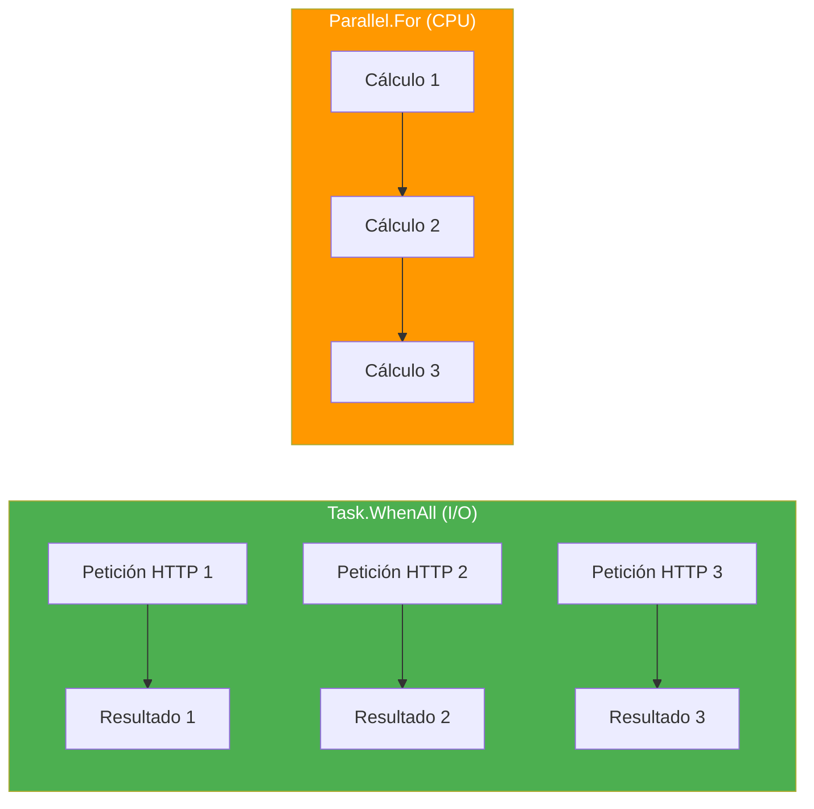

> ⚠️ **Advertencia:** No uses `Parallel.For` para operaciones de I/O. Parallel bloquea un hilo del ThreadPool por cada iteración. Si una iteración tarda 1 segundo en respuesta de red, 100 iteraciones necesitarán 100 hilos bloqueados durante 1 segundo. Con `Task.WhenAll`, solo necesitas 1 hilo que se libera inmediatamente.

📌 **Ejemplo real:** Netflix descarga imágenes con `Task.WhenAll` (I/O). Pero procesa thumbnails (redimensionar, comprimir) con `Parallel.ForEach` (CPU). Cada herramienta para su trabajo.

## 16.12. Task vs ValueTask vs IAsyncEnumerable

### Task vs ValueTask

| Característica | `Task<T>` | `ValueTask<T>` |
|----------------|-----------|----------------|
| **Tipo** | Reference type (clase) | Value type (struct) |
| **Alocación en heap** | ✅ Sí | ❌ No (si es síncrono) |
| **Rendimiento** | Normal | Mejor para hot paths |
| **¿Se puede hacer await múltiples veces?** | ✅ Sí | ❌ Solo 1 vez |
| **Uso general** | El estándar (usa este por defecto) | Solo si sabes que será síncrono la mayoría de las veces |

```csharp
// ✅ Task<T>: el estándar
public async Task<int> ObtenerEdadAsync(int id)
{
    var usuario = await _repo.GetByIdAsync(id);
    return usuario.Edad;
}

// ✅ ValueTask<T>: solo si la mayoría de las veces es síncrono
public ValueTask<int> ObtenerCachedAsync(int id)
{
    if (_cache.TryGetValue(id, out int valor))
        return new ValueTask<int>(valor); // Síncrono, sin alocación

    return new ValueTask<int>(ObtenerDesdeRedAsync(id)); // Async
}
```

> 💡 **Consejo:** Usa `Task<T>` por defecto. Solo usa `ValueTask<T>` cuando tengas un escenario de **hot path** donde la operación suele ser síncrona (ej: caché con HIT frecuente).

### IAsyncEnumerable\<T\>

Permite **emitir resultados de forma asíncrona** uno a uno. Útil para streaming de datos (lectura de ficheros grandes, resultados paginados de API).

```csharp
// Leer líneas de un fichero grande sin cargar todo en memoria
public async IAsyncEnumerable<string> LeerLineasAsync(string ruta)
{
    using var reader = new StreamReader(ruta);
    while (await reader.ReadLineAsync() is { } linea)
    {
        yield return linea; // Emitir cada línea de forma asíncrona
    }
}

// Uso con await foreach
await foreach (var linea in LeerLineasAsync("datos.csv"))
{
    Console.WriteLine(linea);
}
```

```mermaid
sequenceDiagram
    participant C as 🧵 Consumidor
    participant P as 📡 Productor

    C->>P: Siguiente elemento
    Note over P: Procesando...
    P-->>C: Elemento 1
    Note over C: Procesa elemento 1
    C->>P: Siguiente elemento
    Note over P: Procesando...
    P-->>C: Elemento 2
    Note over C: Procesa elemento 2

    style C fill:#4CAF50,color:#fff
    style P fill:#2196F3,color:#fff
```

📌 **Ejemplo real:** Cuando descargas un fichero grande con Chrome, ves la barra de progreso avanzando poco a poco. Eso es streaming con `IAsyncEnumerable` — no espera a tener todo el fichero para mostrarlo, va emitiendo porciones a medida que llegan.

---

**Resumen del punto:**

| Concepto | Descripción |
|----------|-------------|
| **Sincronía** | Bloquear el hilo y esperar (lo que NO queremos en I/O) |
| **Asíncrono** | No bloquear el hilo mientras esperas algo lento |
| **Concurrencia** | Múltiples tareas en progreso (intercaladas) |
| **Paralelismo** | Múltiples tareas ejecutándose al mismo tiempo en varios hilos |
| **Operaciones de I/O** | Red, disco, BD — las que más benefician de async |
| **Async/Await** | Mecanismo de C# para programación asíncrona legible |
| **Task** | Promesa de una operación asíncrona (vale por un resultado futuro) |
| **Task\<T\>** | Promesa que devuelve un valor |
| **ValueTask\<T\>** | Alternativa ligera a Task para hot paths síncronos |
| **IAsyncEnumerable\<T\>** | Streaming asíncrono de resultados |
| **CancellationToken** | Permite cancelar operaciones en marcha |
| **WhenAll** | Esperar a que terminen todas las tareas |
| **WhenAny** | Esperar a que termine la primera tarea |
| **Parallel.For** | Paralelizar operaciones de CPU |
| **SemaphoreSlim** | Limitar el número de tareas concurrentes |
| **async void** | Peligroso: solo para eventos de UI |
| **Los 3 errores clásicos** | Await secuencial, fire-and-forget, WhenAll + await |

En el siguiente punto veremos Programación Reactiva con Rx.NET: flujos de datos asíncronos, Subject, operadores y cuándo usar IObservable vs IAsyncEnumerable.

> 💡 **Ejercicio práctico:** Ejecuta el ejemplo `15-SincroniaVsAsyncronia` de la carpeta de ejemplos. Compara los tiempos de sincrono, async mal y async bien. Fíjate en los Thread IDs del log de Serilog: en sincronismo todos son el mismo, en async bien son distintos. Eso es la diferencia entre secuencial y paralelo.
