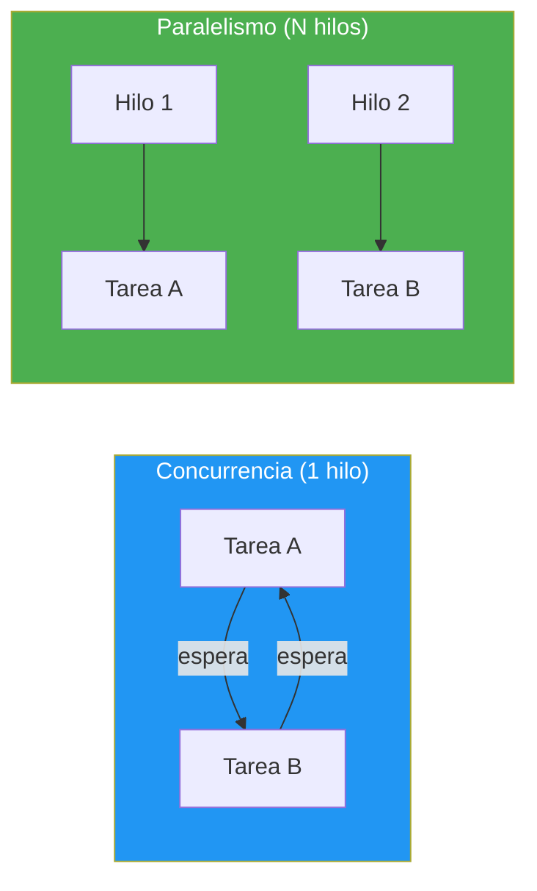
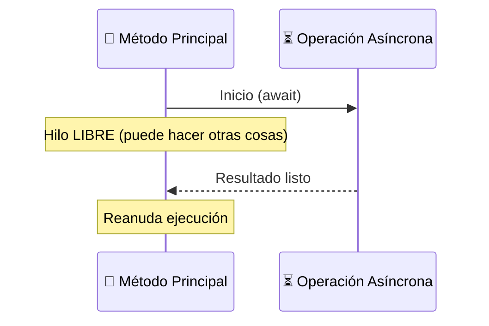

- [16. Concurrencia y Asincronía en C#](#16-concurrencia-y-asincronía-en-c)
  - [16.1. Concurrencia vs Paralelismo](#161-concurrencia-vs-paralelismo)
  - [16.2. Async/Await: La Base de la Asincronía](#162-asyncawait-la-base-de-la-asincronía)
  - [16.3. Task y Task\<T\>: El Resultado de una Operación Asíncrona](#163-task-y-taskt-el-resultado-de-una-operación-asíncrona)
  - [16.4. CancellationToken: Cancelar Operaciones en Marcha](#164-cancellationtoken-cancelar-operaciones-en-marcha)
  - [16.5. Async Void vs Async Task](#165-async-void-vs-async-task)
  - [16.6. Patrones de Concurrencia](#166-patrones-de-concurrencia)
  - [16.7. Errores en Código Asíncrono](#167-errores-en-código-asíncrono)


# 16. Concurrencia y Asincronía en C#

> 💡 **Punto de partida:** Tu app web hace una petición a una API externa que tarda 3 segundos. Mientras tanto, el usuario mira la pantalla... ¿cargando? ¿Y si en vez de esperar, la app pudiera hacer otras cosas mientras tanto? Eso es la **asincronía**: no bloquear el hilo mientras esperas algo lento (red, disco, base de datos). Pero cuidado: asincronía no es paralelismo. Vamos a ver la diferencia y cómo usar `async/await` correctamente.

En este tema aprenderás `async/await`, `Task`, `Task<T>`, `CancellationToken`, la diferencia entre `async void` y `async Task`, y los patrones de concurrencia en C#.

**Objetivos de aprendizaje:**

- Distinguir concurrencia, paralelismo y asíncrono
- Dominar `async/await` y cuándo usarlo
- Entender `Task` y `Task<T>` como promesas de C#
- Usar `CancellationToken` para cancelar operaciones largas
- Evitar los peligros de `async void`
- Aplicar patrones de concurrencia: `WhenAll`, `WhenAny`, `Task.WhenAll`

## 16.1. Concurrencia vs Paralelismo

Estos términos se confunden mucho, pero son diferentes:

| Concepto | Definición | Ejemplo |
|----------|-----------|---------|
| **Concurrencia** | Múltiples tareas en progreso (intercaladas) | Un cocinero que prepara varias recetas a la vez |
| **Paralelismo** | Múltiples tareas ejecutándose al mismo tiempo | Dos cocineros, cada uno con su receta |
| **Asíncrono** | No bloquear el hilo mientras esperas | Esperar el pan sin parar de cocinar |



📌 **Ejemplo real:** Cuando haces scroll en Instagram y se cargan imágenes, la app no se bloquea. Usa **asincronía** para cargar las imágenes mientras tú sigues navegando. Si cargara todo de golpe, la pantalla se congelaría.

> 💡 **Analogía — El Restaurante:**
> - **Secuencial:** Un cocinero, una receta a la vez. Acaba la paella, luego empieza el postre.
> - **Concurrencia:** Un cocinero que prepara varias recetas "a la vez": pone el arroz a hervir, mientras pela las gambas, mientras calienta el aceite. Intercambia tareas cuando una está "esperando".
> - **Paralelismo:** Dos cocineros. Cada uno con su receta. Realmente cocinando al mismo tiempo.

## 16.2. Async/Await: La Base de la Asincronía

`async` y `await` son las palabras clave que C# usa para la programación asíncrona. `await` pausa la ejecución del método **sin bloquear el hilo** hasta que termine la operación.

### Sintaxis básica

```csharp
// Método asíncrono: tiene la palabra clave "async" y devuelve Task o Task<T>
public async Task<string> LeerFicheroAsync(string ruta)
{
    using var reader = new StreamReader(ruta);
    // await pausa la ejecución hasta que ReadToEndAsync termine
    // Mientras tanto, el hilo está LIBRE para hacer otras cosas
    string contenido = await reader.ReadToEndAsync();
    return contenido;
}

// Uso
string texto = await LeerFicheroAsync("datos.txt");
Console.WriteLine(texto);
```

### Flujo de ejecución



### Diferencia: sincrono vs asíncrono

```csharp
// ❌ BLOQUEANTE: Congela el hilo durante 3 segundos
public string ObtenerDatosSync()
{
    string datos = client.GetStringAsync("https://api.ejemplo.com").Result; // BLOQUEA
    return datos;
}

// ✅ NO BLOQUEANTE: Libera el hilo mientras espera
public async Task<string> ObtenerDatosAsync()
{
    string datos = await client.GetStringAsync("https://api.ejemplo.com"); // NO bloquea
    return datos;
}
```

| Enfoque | Hilo | Tiempo respuesta | Memoria |
|---------|------|-----------------|---------|
| `.Result` / `.Wait()` | Bloqueado | Lenta (congelación) | Normal |
| `await` | Libre | Rápida (responsiva) | Normal |

> ⚠️ **Advertencia:** **NUNCA** uses `.Result` o `.Wait()` en código de UI o en ASP.NET Core. Pueden causar **deadlocks** (el hilo de UI espera a que termine algo que necesita el hilo de UI para terminar). Usa siempre `await`.

## 16.3. Task y Task\<T\>: El Resultado de una Operación Asíncrona

Un `Task` representa una operación asíncrona en curso. Es como un "vale por un resultado futuro".

| Tipo | Significado | Ejemplo |
|------|-------------|---------|
| `Task` | Operación sin valor de retorno | `GuardarAsync()` |
| `Task<T>` | Operación con valor de retorno | `LeerAsync() → Task<string>` |
| `Task.CompletedTask` | Tarea ya completada | Para casos triviales |

```csharp
// Task<T>: devuelve un valor
public async Task<int> ContarLineasAsync(string ruta)
{
    using var reader = new StreamReader(ruta);
    int contador = 0;
    while (await reader.ReadLineAsync() is not null)
    {
        contador++;
    }
    return contador;
}

// Task: no devuelve valor
public async Task GuardarLogAsync(string mensaje)
{
    using var writer = new StreamWriter("log.txt", append: true);
    await writer.WriteLineAsync($"[{DateTime.Now}] {mensaje}");
}
```

### Múltiples tareas en paralelo

```csharp
// Lanzar varias tareas y esperar a que terminen TODAS
Task<int> tarea1 = ContarLineasAsync("fichero1.txt");
Task<int> tarea2 = ContarLineasAsync("fichero2.txt");
Task<int> tarea3 = ContarLineasAsync("fichero3.txt");

// Esperar a que terminen las tres (en paralelo)
await Task.WhenAll(tarea1, tarea2, tarea3);

// Obtener resultados
int total = tarea1.Result + tarea2.Result + tarea3.Result;
Console.WriteLine($"Total líneas: {total}");
```

### WhenAll y WhenAny

```csharp
// WhenAll: esperar a que TERMINEN TODAS
var tareas = new List<Task<string>>
{
    ObtenerDatosAsync("https://api1.com"),
    ObtenerDatosAsync("https://api2.com"),
    ObtenerDatosAsync("https://api3.com")
};

string[] resultados = await Task.WhenAll(tareas);
// Ejecuta las 3 en paralelo, espera a que terminen las 3

// WhenAny: esperar a que termine LA PRIMERA
Task<string> primera = await Task.WhenAny(tareas);
string resultadoRapido = await primera;
// útil para timeouts o "el más rápido gana"
```

📌 **Ejemplo real:** Cuando abres Netflix y carga los thumbnails de las series, lanza 10-20 peticiones en paralelo con `Task.WhenAll`. Si esperara secuencialmente, tardaría 10x más. Con paralelo, tarda lo que la más lenta.

## 16.4. CancellationToken: Cancelar Operaciones en Marcha

Un `CancellationToken` permite cancelar operaciones asíncronas que están en curso. Es como decirle a una tarea "ya no te necesito, para".

```csharp
using var cts = new CancellationTokenSource();

// Lanzar tarea con token
var tarea = ObtenerDatosAsync("https://api.ejemplo.com", cts.Token);

// Cancelar después de 5 segundos
cts.CancelAfter(TimeSpan.FromSeconds(5));

try
{
    string datos = await tarea;
}
catch (OperationCanceledException)
{
    Console.WriteLine("Operación cancelada por el usuario");
}
```

### Implementar CancellationToken en métodos

```csharp
public async Task<string> DescargarFicheroAsync(string url, CancellationToken token)
{
    using var client = new HttpClient();

    // Pasar el token al método que hace la petición
    using var respuesta = await client.GetAsync(url, token);

    respuesta.EnsureSuccessStatusCode();

    return await respuesta.Content.ReadAsStringAsync(token);
}

// CancellationTokenSource con timeout
using var cts = new CancellationTokenSource(TimeSpan.FromSeconds(30));
string datos = await DescargarFicheroAsync("https://api.ejemplo.com/datos", cts.Token);
```

### Encadenar tokens

```csharp
// Token global + token local
using var ctsGlobal = new CancellationTokenSource();
using var ctsLocal = new CancellationTokenSource();

// Combinar ambos tokens
using var ctsCombinado = CancellationTokenSource
    .CreateLinkedTokenSource(ctsGlobal.Token, ctsLocal.Token);

// Se cancela si cualquiera de los dos se cancela
await OperacionLargaAsync(ctsCombinado.Token);
```

> 💡 **Consejo:** Siempre pasa el `CancellationToken` a los métodos asíncronos que crees. Si el usuario cancela una operación, tu app puede liberar recursos rápidamente en vez de esperar a que termine.

## 16.5. Async Void vs Async Task

| Retorno | Uso | Problemas |
|---------|-----|-----------|
| `async Task` | Métodos que pueden fallar | Ninguno (el estándar) |
| `async Task<T>` | Métodos que devuelven un valor | Ninguno |
| `async void` | SOLO para eventos de UI | Difícil de testear, errores no capturables |

```csharp
// ✅ BIEN: async Task
public async Task ProcesarAsync()
{
    await Task.Delay(1000);
    // Si lanza excepción, se captura en el Task
}

// ❌ PELIGROSO: async void
public async void Boton_Click()
{
    await Task.Delay(1000);
    throw new Exception("Error"); // ¡Excepción no capturada! La app se cae
}

// ✅ La excepción de async Task SÍ se captura
try
{
    await ProcesarAsync();
}
catch (Exception ex)
{
    Console.WriteLine($"Error: {ex.Message}");
}
```

> ⚠️ **Advertencia:** **NUNCA** uses `async void` excepto en manejadores de eventos de UI (`Button_Click`). Un `async void` que lanza una excepción provoca que la aplicación se cierre inmediatamente. No hay forma de capturar esa excepción con `try/catch`.

## 16.6. Patrones de Concurrencia

### Producer-Consumer con BlockingCollection

```csharp
using System.Collections.Concurrent;

// Productor: genera datos
// Consumidor: procesa datos
var cola = new BlockingCollection<string>();

// Productor (en un hilo separado)
Task.Run(() =>
{
    for (int i = 0; i < 10; i++)
    {
        cola.Add($"Tarea {i}");
        Thread.Sleep(100); // Simular trabajo
    }
    cola.CompleteAdding(); // Señal de que ya no hay más datos
});

// Consumidor (en el hilo principal)
foreach (var item in cola.GetConsumingEnumerable())
{
    Console.WriteLine($"Procesando: {item}");
}
```

### Parallel.ForEach: Procesamiento paralelo

```csharp
var productos = new List<Producto> { /* 1000 productos */ };

// Procesar en paralelo usando todos los núcleos
Parallel.ForEach(productos, producto =>
{
    producto.Precio = CalcularPrecioConDescuento(producto);
    Console.WriteLine($"Procesado: {producto.Nombre} en hilo {Environment.CurrentManagedThreadId}");
});
```

### SemaphoreSlim: Limitar concurrencia

```csharp
// Máximo 3 descargas simultáneas
var semaphore = new SemaphoreSlim(3);
var tareas = urls.Select(async url =>
{
    await semaphore.WaitAsync(); // Esperar si ya hay 3 descargando
    try
    {
        await DescargarAsync(url);
    }
    finally
    {
        semaphore.Release(); // Liberar el hueco
    }
});

await Task.WhenAll(tareas);
```

📌 **Ejemplo real:** Un servicio de streaming como Netflix usa `SemaphoreSlim` para limitar cuántas descargas simultáneas puede hacer un usuario. Si intentas descargar 10 películas a la vez, solo 3 se descargan realmente; las demás esperan en cola.

## 16.7. Errores en Código Asíncrono

### Capturar excepciones

```csharp
// Capturar excepción de una tarea
try
{
    string datos = await ObtenerDatosAsync("https://api.ejemplo.com");
}
catch (HttpRequestException ex)
{
    Console.WriteLine($"Error de red: {ex.Message}");
}
catch (TaskCanceledException ex)
{
    Console.WriteLine($"Timeout: {ex.Message}");
}
```

### Excepciones en Task.WhenAll

```csharp
// WhenAll lanza AggregateException si alguna tarea falla
var tareas = new[]
{
    ExitosoAsync(),
    FallidoAsync(),       // Esta lanza excepción
    ExitosoAsync2()
};

try
{
    await Task.WhenAll(tareas);
}
catch (AggregateException ae)
{
    foreach (var ex in ae.InnerExceptions)
    {
        Console.WriteLine($"Error: {ex.Message}");
    }
}
```

> 📝 **Nota:** En .NET 8+, `Task.WhenAll` lanza la primera excepción directamente (sin `AggregateException`). Para capturar todas, usa `Task.WhenAll(tareas).ConfigureAwait(false)` o captura cada tarea individualmente.

---

**Resumen del punto:**

| Concepto | Descripción |
|----------|-------------|
| **Concurrencia** | Múltiples tareas en progreso (intercaladas) |
| **Paralelismo** | Múltiples tareas ejecutándose al mismo tiempo en varios hilos |
| **Async/Await** | Mecanismo de C# para programación asíncrona |
| **Task** | Promesa de una operación asíncrona |
| **Task\<T\>** | Promesa que devuelve un valor |
| **CancellationToken** | Permite cancelar operaciones en marcha |
| **WhenAll** | Esperar a que terminen todas las tareas |
| **WhenAny** | Esperar a que termine la primera tarea |
| **SemaphoreSlim** | Limitar el número de tareas concurrentes |
| **async void** | Peligroso: solo para eventos de UI |

En el siguiente punto veremos Programación Reactiva con Rx.NET: flujos de datos asíncronos, Subject, operadores y cuándo usar IObservable vs IAsyncEnumerable.
