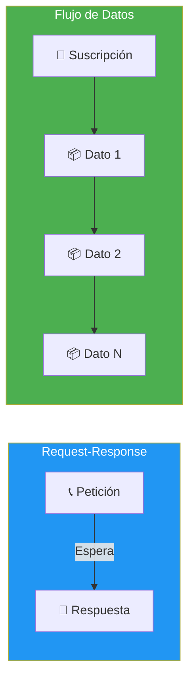
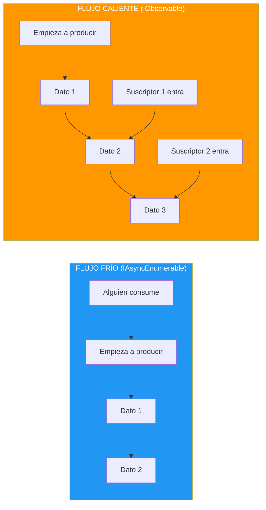
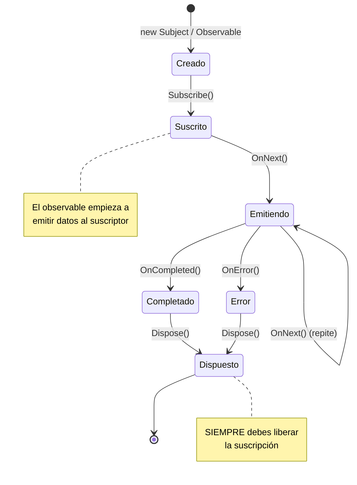
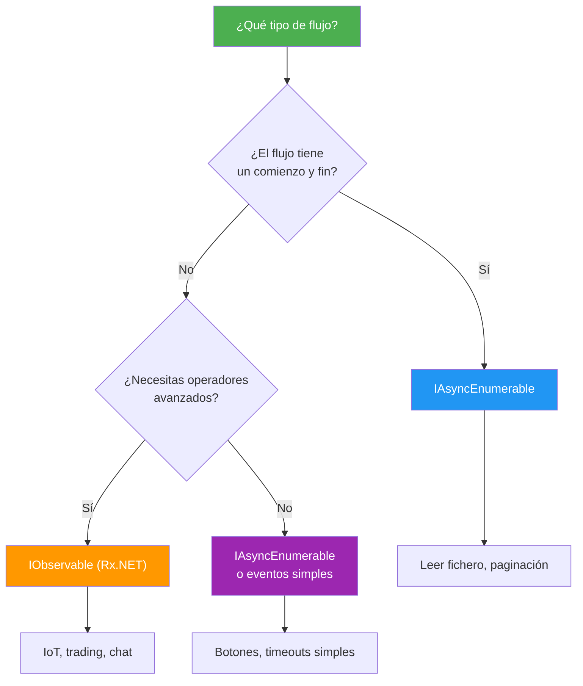

- [17. Programación Reactiva en C#](#17-programación-reactiva-en-c)
  - [17.1. Flujos de Datos: El Nuevo Paradigma](#171-flujos-de-datos-el-nuevo-paradigma)
  - [17.2. IAsyncEnumerable: Flujos Fríos](#172-iasyncenumerable-flujos-fríos)
  - [17.3. IObservable: Flujos Calientes](#173-iobservable-flujos-calientes)
  - [17.4. Rx.NET: Programación Reactiva](#174-rxnet-programación-reactiva)
  - [17.5. Subject y Subject Specialized](#175-subject-y-subject-specialized)
  - [17.6. Operadores de Rx.NET](#176-operadores-de-rxnet)
  - [17.7. Cuándo Usar Cada Uno](#177-cuándo-usar-cada-uno)
  - [17.8. Buenas Prácticas](#178-buenas-prácticas)


# 17. Programación Reactiva en C#

> 💡 **Punto de partida:** Has visto `async/await` para operaciones individuales, pero... ¿qué pasa cuando necesitas manejar un **flujo continuo** de datos? Como un chat en tiempo real, las notificaciones de una red social o los sensores de un IoT. No es una sola petición-respuesta, sino un **río de datos** que fluye constantemente. La Programación Reactiva te permite trabajar con estos flujos de forma declarativa y elegante.

En este aprenderás los dos tipos de flujos en C#: `IAsyncEnumerable` (fríos) y `IObservable` (calientes con Rx.NET), los Subject, los operadores más importantes y cuándo usar cada uno.

**Objetivos de aprendizaje:**

- Entender la diferencia entre flujos fríos y calientes
- Usar `IAsyncEnumerable` con `await foreach`
- Crear y suscribirse a `IObservable` con Rx.NET
- Aplicar operadores: Map, Filter, Merge, Throttle, Switch
- Distinguir cuándo usar IAsyncEnumerable vs IObservable

## 17.1. Flujos de Datos: El Nuevo Paradigma

La programación tradicional es **request-response**: haces una pregunta, obtienes una respuesta. La programación reactiva es **flujos de datos**: te suscribes a un flujo y recibes datos cuando llegan.



| Paradigma | Modelo | Ejemplo |
|-----------|--------|---------|
| **Request-Response** | "¿Cuántos clientes hay?" → 42 | API REST tradicional |
| **Flujo de datos** | "Avísame cuando cambien los clientes" | Chat en tiempo real, IoT |

📌 **Ejemplo real:** Instagram no te envía una notificación cada vez que hay una foto nueva. Te suscribes a tu feed y los datos fluyen hacia ti automáticamente. Eso es programación reactiva.

### Flujos Fríos vs Calientes

Hay dos tipos de flujos. La diferencia es **cuándo empiezan a emitir datos**:



| Característica | Frío (IAsyncEnumerable) | Caliente (IObservable) |
|----------------|------------------------|------------------------|
| **¿Cuándo empieza?** | Cuando alguien lo consume | Siempre, ya está emitiendo |
| **¿Qué pasa si te suscribes tarde?** | Nada, receivedes todo desde el inicio | Pierdes lo que ya pasó |
| **Analogía** | Netflix (ves cuando quieres) | TV en directo (si llegas tarde, te lo pierdes) |

> 💡 **Analogía:**
> - **Flujo frío** = Netflix: eliges cuándo ver la serie, la ves desde el principio.
> - **Flujo caliente** = TV en directo: si te conectas a las 21:30 y la peli empezó a las 21:00, te la has perdido.

📌 **Ejemplo real:** Un sensor de temperatura emite datos cada segundo (flujo caliente). Si tu app se conecta a las 10:00:05, no recibirá los datos de 10:00:00 a 10:00:04. Pero un fichero CSV es un flujo frío: siempre puedes leerlo desde la primera línea.

## 17.2. IAsyncEnumerable: Flujos Fríos

Un **flujo frío** es como una receta: se ejecuta cada vez que alguien lo consume. `IAsyncEnumerable<T>` es el flujo frío por defecto en C#.

### Sintaxis con await foreach

```csharp
// Generador asíncrono de números
public async IAsyncEnumerable<int> GenerarNumerosAsync()
{
    for (int i = 1; i <= 10; i++)
    {
        await Task.Delay(500); // Simular trabajo lento
        yield return i;        // Devolver valor de forma asíncrona
    }
}

// Consumir con await foreach
await foreach (var numero in GenerarNumerosAsync())
{
    Console.WriteLine($"Número: {numero}");
    // Se imprime uno cada 500ms
}
```

### Streaming de datos reales

```csharp
// Leer un fichero línea a línea de forma asíncrona
public async IAsyncEnumerable<string> LeerLineasAsync(string ruta)
{
    using var reader = new StreamReader(ruta);
    string? linea;
    while ((linea = await reader.ReadLineAsync()) is not null)
    {
        yield return linea;
    }
}

// Usar
await foreach (var linea in LeerLineasAsync("datos.csv"))
{
    Console.WriteLine(linea);
}
```

### Transformar flujos con LINQ

```csharp
// IAsyncEnumerable soporta LINQ (nuget: System.Linq.Async)
await foreach (var resultado in GenerarNumerosAsync()
    .Where(n => n % 2 == 0)    // Filtrar pares
    .Select(n => n * n))       // Elevar al cuadrado
{
    Console.WriteLine(resultado);
}
```

> 💡 **Consejo:** Para usar LINQ con `IAsyncEnumerable`, instala el paquete `System.Linq.Async`. Proporciona Where, Select, OrderBy, ToListAsync, etc.

### Cuándo usar IAsyncEnumerable

| Caso de uso | Ejemplo |
|-------------|---------|
| Leer un fichero línea a línea | Logs, CSV grandes |
| Streaming de datos desde una API | Paginación de resultados |
| Procesar colas de mensajes | Cola de RabbitMQ, Kafka |
| Sensores IoT que envían datos periódicamente | Temperatura, humedad |

## 17.3. IObservable: Flujos Calientes

Un **flujo caliente** es como una antena de radio: emite datos todo el tiempo, independientemente de si hay alguien escuchando. Si te suscribes tarde, pierdes datos anteriores.

### Interfaz IObservable

```csharp
// IObservable<T> es la interfaz base de Rx.NET
public interface IObservable<out T>
{
    IDisposable Subscribe(IObserver<T> observer);
}
```

### Crear un observable con Rx.NET

```csharp
using System.Reactive.Linq;
using System.Reactive.Subjects;

// Subject: emisor de eventos que también es observable
var subject = new Subject<string>();

// Suscribirse
subject.Subscribe(
    onNext: dato => Console.WriteLine($"Recibido: {dato}"),
    onError: error => Console.WriteLine($"Error: {error.Message}"),
    onCompleted: () => Console.WriteLine("Flujo terminado")
);

// Emitir datos
subject.OnNext("Hola");
subject.OnNext("Mundo");
subject.OnCompleted();
```

### Subject como puente

```csharp
// Subject actúa como puente entre productor y consumidor
var subject = new Subject<int>();

// Productor: emite datos
Task.Run(() =>
{
    for (int i = 0; i < 10; i++)
    {
        subject.OnNext(i);
        Thread.Sleep(100);
    }
    subject.OnCompleted();
});

// Consumidor: recibe datos
subject.Subscribe(Console.WriteLine);
```

### Ciclo de vida de un observable

Todo observable sigue este ciclo: **Crear → Suscribir → Emitir → Dispose**



**Los 3 eventos que puede emitir un observable:**

| Evento | Método | Significado |
|--------|--------|-------------|
| **OnNext** | `subject.OnNext(valor)` | Emitir un dato |
| **OnError** | `subject.OnError(ex)` | Error, flujo terminado |
| **OnCompleted** | `subject.OnCompleted()` | Flujo terminado correctamente |

> ⚠️ **Advertencia:** Si no haces `Dispose()`, la suscripción permanece activa y el observable sigue emitiendo datos. Esto causa **memory leaks** en servidores.

📌 **Ejemplo real:** Cuando abres Netflix y te suscribes a una serie, es como hacer `Subscribe()`. Cuando terminas de ver (o cancelas la suscripción), es como hacer `Dispose()`. Si no cancelas, Netflix sigue descargando episodios que no ves.

## 17.4. Rx.NET: Programación Reactiva

**Rx.NET** (Reactive Extensions) es la librería que implementa la programación reactiva en .NET. Proporciona operadores poderosos para transformar, filtrar y combinar flujos de datos.

### Instalación

```bash
dotnet add package System.Reactive
```

### Crear observables desde diferentes fuentes

```csharp
using System.Reactive.Linq;

// Desde un intervalo de tiempo
var intervalo = Observable.Interval(TimeSpan.FromSeconds(1));
intervalo.Subscribe(n => Console.WriteLine($"Tick {n}"));

// Desde eventos
var clicks = Observable.FromEventPattern(
    handler => button.Click += handler,
    handler => button.Click -= handler
);
clicks.Subscribe(_ => Console.WriteLine("Botón clicado"));

// Desde un patrón de datos
var datos = Observable.Return(42); // Un solo valor
var secuencia = Observable.Range(1, 10); // Del 1 al 10
```

### Cadena de operadores

```csharp
// Filtrar, transformar y combinar flujos
var observable = Observable
    .Interval(TimeSpan.FromMilliseconds(100))         // Un valor cada 100ms
    .Where(n => n % 2 == 0)                          // Solo pares
    .Select(n => n * 2)                              // Duplicar
    .Throttle(TimeSpan.FromSeconds(1))                // Máximo 1 por segundo
    .Buffer(3)                                        // Agrupar de 3 en 3
    .Subscribe(
        grupo => Console.WriteLine($"Grupo: {string.Join(", ", grupo)}"),
        () => Console.WriteLine("Completado")
    );
```

📌 **Ejemplo real:** En una app de trading, el precio de una acción cambia cientos de veces por segundo. Rx.NET permite filtrar, agrupar y transformar esos datos en tiempo real: mostrar solo cambios significativos (>1%), agrupar por segundo, o alertar si el precio baja más de un 5%.

## 17.5. Subject y Subject Specialized

`Subject<T>` es un tipo que es **simultáneamente** emisor (`IObserver<T>`) y receptor (`IObservable<T>`). Hay varios tipos especializados:

| Subject | Descripción | Comportamiento |
|---------|-------------|----------------|
| `Subject<T>` | Básico | Solo emite a suscriptores actuales |
| `BehaviorSubject<T>` | Recuerda el último valor | Emite el último valor a nuevos suscriptores |
| `ReplaySubject<T>` | Graba los últimos N valores | Los nuevos suscriptores reciben el historial |
| `AsyncSubject<T>` | Solo el último valor completo | Solo emite cuando se completa el flujo |

### BehaviorSubject: "¿Cuál es el valor actual?"

```csharp
var subject = new BehaviorSubject<int>(0); // Valor inicial: 0

// Suscriptor 1 recibe el valor actual
subject.Subscribe(v => Console.WriteLine($"S1: {v}")); // S1: 0

subject.OnNext(1); // S1: 1
subject.OnNext(2); // S1: 2

// Suscriptor 2 recibe el ÚLTIMO valor (2), no los anteriores
subject.Subscribe(v => Console.WriteLine($"S2: {v}")); // S2: 2

subject.OnNext(3); // S1: 3, S2: 3
```

📌 **Ejemplo real:** `BehaviorSubject` es perfecto para el estado de una aplicación. En una app Blazor, `BehaviorSubject<User?>` mantiene el usuario actual: cuando un componente nuevo se suscribe, recibe el usuario que ya está logueado.

### ReplaySubject: "Quiero el historial"

```csharp
var subject = new ReplaySubject<int>(2); // Guarda los últimos 2 valores

subject.OnNext(1);
subject.OnNext(2);
subject.OnNext(3);

// Nuevo suscriptor recibe los últimos 2: 2 y 3
subject.Subscribe(v => Console.WriteLine($"S: {v}")); // S: 2, S: 3
```

### AsyncSubject: "Solo el resultado final"

```csharp
var subject = new AsyncSubject<int>();

subject.OnNext(1);
subject.OnNext(2);
subject.OnCompleted(); // Solo ahora emite el último valor

subject.Subscribe(v => Console.WriteLine($"S: {v}")); // S: 2
```

## 17.6. Operadores de Rx.NET

### Transformación: Select, SelectMany

```csharp
// Select: transforma cada valor
var cuadrados = Observable.Range(1, 5)
    .Select(n => n * n);
// 1, 4, 9, 16, 25

// SelectMany: aplanar flujos anidados
var clicks = Observable.FromEventPattern(button, "Click");
clicks
    .SelectMany(_ => Observable.FromAsync(() => ObtenerDatosAsync()))
    .Subscribe(datos => Console.WriteLine(datos));
```

### Filtrado: Where, DistinctUntilChanged, Throttle

```csharp
// Where: filtrar por condición
var pares = Observable.Range(1, 10)
    .Where(n => n % 2 == 0);

// DistinctUntilChanged: ignorar valores repetidos consecutivos
var stream = new Subject<string>();
stream
    .DistinctUntilChanged()
    .Subscribe(Console.WriteLine);
stream.OnNext("A"); // A
stream.OnNext("A"); // (no emite, repetido)
stream.OnNext("B"); // B

// Throttle: emitir solo después de un periodo sin cambios
var input = new Subject<string>();
input
    .Throttle(TimeSpan.FromSeconds(500)) // Espera 500ms sin cambios
    .Subscribe(texto => BuscarEnTiempoReal(texto));
```

### Combinación: Merge, Concat, CombineLatest, Zip

```csharp
// Merge: unir dos flujos en uno solo
var teclado = Observable.FromEventPattern(keyHandler, "KeyPress");
var raton = Observable.FromEventPattern(mouseHandler, "Click");
var todos = teclado.Merge(raton); // Recibe eventos de ambos

// CombineLatest: combinar el último valor de cada flujo
var nombre = new BehaviorSubject<string>("Ana");
var edad = new BehaviorSubject<int>(25);

nombre.CombineLatest(edad, (n, e) => $"{n}, {e} años")
    .Subscribe(Console.WriteLine);

nombre.OnNext("Carlos"); // Carlos, 25 años
edad.OnNext(30);         // Carlos, 30 años
```

### Control de tiempo: Delay, Timeout, Buffer

```sharp
// Delay: retrasar cada valor
var retardado = Observable.Range(1, 5)
    .Delay(TimeSpan.FromSeconds(2));

// Timeout: cancelar si no llega un valor a tiempo
var conTimeout = Observable.Interval(TimeSpan.FromSeconds(1))
    .Timeout(TimeSpan.FromSeconds(5)); // Error si no llega nada en 5s

// Buffer: agrupar valores por tiempo o cantidad
Observable.Interval(TimeSpan.FromSeconds(1))
    .Buffer(TimeSpan.FromSeconds(5)) // Cada 5 segundos
    .Subscribe(grupo => Console.WriteLine($"Grupo de {grupo.Count}"));
```

> 💡 **Consejo:** Rx.NET tiene más de 400 operadores. No necesitas memorizarlos todos. Los más usados son: `Where`, `Select`, `Merge`, `CombineLatest`, `Throttle`, `Buffer`, `Switch` y `DistinctUntilChanged`.

### Manejo de errores: OnError, Catch, Retry

```csharp
// OnError: notificar un error y terminar el flujo
var subject = new Subject<string>();
subject.Subscribe(
    onNext: Console.WriteLine,
    onError: ex => Console.WriteLine($"Error: {ex.Message}"),
    onCompleted: () => Console.WriteLine("Completado")
);

subject.OnNext("Dato 1");
subject.OnError(new InvalidOperationException("Algo falló"));
// El flujo TERMINA aquí. No se emiten más datos.

// Catch: capturar error y continuar con otro flujo
var fallback = Observable.Return("Valor por defecto");
var conFallback = subject.Catch(fallback);

// Retry: reintentar automáticamente
var observable = Observable.Throw<int>(new Exception("Error de red"))
    .Retry(3); // Reintenta 3 veces antes de fallar
```

> ⚠️ **Advertencia:** Si un observable lanza `OnError`, la suscripción **termina automáticamente**. No recibirás más datos. Es como una excepción que mata el hilo.

### Dispose: Cancelar suscripciones

Siempre debes hacer `Dispose()` de las suscripciones para evitar **memory leaks**:

```csharp
// ❌ MAL: La suscripción nunca se cancela
subject.OnNext += handler; // Memory leak!

// ✅ BIEN: Usar using para dispose automático
using var subscription = subject
    .Throttle(TimeSpan.FromSeconds(1))
    .Subscribe(Console.WriteLine);

// Cuando sales del scope, se cancela automáticamente

// ✅ BIEN: Dispose manual
var subscription = subject.Subscribe(Console.WriteLine);
// ... más tarde ...
subscription.Dispose(); // Cancelar
```

📌 **En producción:** En un servidor ASP.NET, si no haces `Dispose()` de las suscripciones, cada petición crea una suscripción nueva que nunca se libera. Después de 1000 peticiones, tienes 1000 suscripciones activas quemando memoria.

## 17.7. Cuándo Usar Cada Uno

| Característica | IAsyncEnumerable | IObservable (Rx.NET) |
|---------------|------------------|---------------------|
| **Modelo** | Pull (el consumidor pide) | Push (el productor emite) |
| **Franja** | Frío (se ejecuta al consumir) | Caliente (emite todo el tiempo) |
| **Cancelación** | `CancellationToken` | `Dispose()` |
| **Operadores** | LINQ (Where, Select, etc.) | 400+ operadores Rx |
| **Complejidad** | Baja (similar a LINQ) | Alta (curva de aprendizaje) |
| **Uso típico** | Ficheros, APIs paginadas | Eventos UI, IoT, WebSockets |



### Ejemplo: Búsqueda en tiempo real con Rx

```csharp
// Input del usuario
var input = new Subject<string>();

input
    .Throttle(TimeSpan.FromMilliseconds(300))     // Esperar 300ms sin escribir
    .DistinctUntilChanged()                        // Ignorar si escribe lo mismo
    .Where(texto => texto.Length >= 2)             // Mínimo 2 caracteres
    .SelectMany(texto => BuscarAsync(texto))       // Buscar (cancela la anterior)
    .Subscribe(resultados => MostrarResultados(resultados));
```

📌 **Ejemplo real:** La barra de búsqueda de Google usa exactamente este patrón: espera a que dejes de escribir (throttle), ignora si escribes lo mismo (distinctUntilChanged), busca solo si hay al menos 2 caracteres (where), y cancela la búsqueda anterior si escribes algo nuevo (switch).

### Ejemplo práctico: Filtrar eventos por tipo

El ejemplo `14-ReactividadRxNet` muestra un patrón real: un sensor emite notificaciones de diferentes tipos (Create, Update, Delete, Error) y cada consumidor filtra lo que le interesa:

```csharp
// Productor: Subject que emite notificaciones
var subject = new Subject<Notificacion>();

// Consumidor 1: solo CREATE y UPDATE (filtra DELETE y ERROR)
subject
    .Where(n => n.Tipo != NotificacionTipo.Error && n.Tipo != NotificacionTipo.Delete)
    .Subscribe(n => Console.WriteLine($"Consumidor-1: {n.Mensaje}"));

// Consumidor 2: solo CREATE, DELETE y ERROR (filtra UPDATE)
subject
    .Where(n => n.Tipo != NotificacionTipo.Update)
    .Subscribe(n => Console.WriteLine($"Consumidor-2: {n.Mensaje}"));
```

📌 **Clave del ejemplo 14:** El segundo consumidor se conecta **8 segundos tarde**. Como es un flujo caliente (Subject), **pierde los primeros 8 segundos de datos**. Solo ve los eventos desde el momento de su suscripción. ¡Eso es la diferencia entre frío y caliente!

> 📝 **Nota:** Para la mayoría de casos en ASP.NET Core, `IAsyncEnumerable` es suficiente. Rx.NET es más potente pero también más complejo. Úsalo cuando necesites operaciones temporales (throttle, debounce) o combinación de múltiples flujos.

## 17.8. Buenas Prácticas

- **Rx.NET para flujos complejos**: Múltiples fuentes, transformaciones, combinaciones
- **IAsyncEnumerable para datos secuenciales**: Más simple que Rx para IoT/SSE
- **Throttle para limitar velocidad**: No sobrecargar el sistema
- **Subjects en producción con cuidado**: Preferir `Observable.Create`

---

**Resumen del punto:**

| Concepto | Descripción |
|----------|-------------|
| **Flujo frío** | Se ejecuta cada vez que se consume (IAsyncEnumerable) |
| **Flujo caliente** | Emite datos todo el tiempo (IObservable) |
| **IAsyncEnumerable** | Flujo frío con `await foreach` |
| **await foreach** | Iterar sobre un flujo asíncrono |
| **IObservable** | Interfaz base de flujos reactivos |
| **Subject** | Emisor y receptor de eventos (Subject, BehaviorSubject, ReplaySubject) |
| **Rx.NET** | Librería con 400+ operadores para flujos reactivos |
| **Throttle** | Emitir solo después de un periodo sin cambios |
| **Merge** | Unir dos flujos en uno |
| **CombineLatest** | Combinar el último valor de cada flujo |

**¿Qué viene después?**

En el siguiente punto veremos cómo consumir APIs externas: HttpClient, IHttpClientFactory, Refit para interfaces tipadas y Polly para resiliencia.

