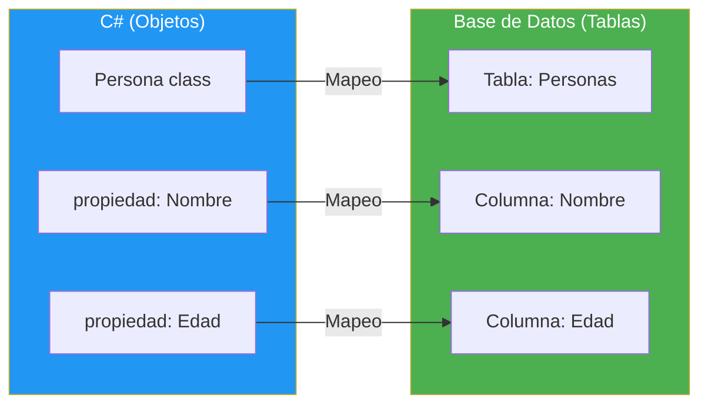

- [20. Entity Framework Core: ORM de .NET](#20-entity-framework-core-orm-de-net)
  - [20.1. ¿Qué es un ORM?](#201-qué-es-un-orm)
  - [20.2. DbContext: El Corazón de EF Core](#202-dbcontext-el-corazón-de-ef-core)
  - [20.3. Configuración: Data Annotations vs Fluent API](#203-configuración-data-annotations-vs-fluent-api)
  - [20.4. CRUD con EF Core](#204-crud-con-ef-core)
  - [20.5. LINQ to Entities](#205-linq-to-entities)
  - [20.6. SQL Raw](#206-sql-raw)
  - [20.7. Migraciones](#207-migraciones)
  - [20.8. Seed Data](#208-seed-data)


# 20. Entity Framework Core: ORM de .NET

> 💡 **Punto de partida:** Has estado escribiendo SQL a mano: `INSERT INTO Personas (Nombre, Edad) VALUES ('Ana', 25)`. Pero ¿y si te equivocas en el nombre de una columna? ¿Y si la estructura de la tabla cambia? Tienes que buscar y cambiar cada consulta SQL. Un **ORM** (Object-Relational Mapping) te permite trabajar con la base de datos como si fuera código C#: con clases, propiedades y LINQ. EF Core es el ORM de Microsoft para .NET.

En este tema aprenderás Entity Framework Core: `DbContext`, configuración con Data Annotations y Fluent API, CRUD, LINQ to Entities, SQL raw, migraciones y seed data.

**Objetivos de aprendizaje:**

- Entender qué es un ORM y por qué se usa
- Configurar `DbContext` y modelos de entidad
- Dominar Data Annotations vs Fluent API
- Realizar operaciones CRUD completas
- Usar LINQ to Entities para consultas tipadas
- Escribir SQL raw cuando LINQ no es suficiente
- Crear y aplicar migraciones
- Sembrar datos iniciales con Seed Data

## 20.1. ¿Qué es un ORM?

Un **ORM** (Object-Relational Mapping) mapea entre clases C# y tablas de base de datos. Cada clase es una tabla, cada propiedad es una columna.



| Sin ORM | Con ORM |
|---------|---------|
| `string sql = "INSERT INTO Personas...";` | `context.Personas.Add(persona);` |
| `command.ExecuteNonQuery();` | `context.SaveChangesAsync();` |
| Errores en runtime (strings) | Errores en compile-time (tipado) |
| SQL diferente por cada SGBD | LINQ se traduce automáticamente |
| Mapeo manual de resultados | `ToList<Persona>()` directo |

📌 **Ejemplo real:** Cuando usas Instagram, cada vez que guardas un comentario, EF Core traduce `context.Comentarios.Add(comentario)` a `INSERT INTO Comentarios (Texto, UsuarioId, Fecha) VALUES (...)`. No escribes SQL, pero se ejecuta SQL.

## 20.2. DbContext: El Corazón de EF Core

El `DbContext` es la clase principal de EF Core. Representa una sesión con la base de datos y permite consultar y guardar datos.

### Definir un DbContext

```csharp
using Microsoft.EntityFrameworkCore;

public class AppDbContext : DbContext
{
    // Cada DbSet<> es una tabla
    public DbSet<Persona> Personas => Set<Persona>();
    public DbSet<Producto> Productos => Set<Producto>();
    public DbSet<Pedido> Pedidos => Set<Pedido>();

    public AppDbContext(DbContextOptions<AppDbContext> options) : base(options)
    {
    }

    // Configuración adicional (Fluent API)
    protected override void OnModelCreating(ModelBuilder modelBuilder)
    {
        // Configuración de modelos
    }
}
```

### Modelo de entidad

```csharp
public class Persona
{
    public int Id { get; set; }              // PK por convención
    public string Nombre { get; set; } = "";
    public string Email { get; set; } = "";
    public int Edad { get; set; }
    public DateTime FechaRegistro { get; set; }
    public bool Activo { get; set; }

    // Relación: una persona tiene muchos pedidos
    public ICollection<Pedido> Pedidos { get; set; } = new List<Pedido>();
}

public class Pedido
{
    public int Id { get; set; }
    public DateTime Fecha { get; set; }
    public decimal Total { get; set; }

    // FK: cada pedido pertenece a una persona
    public int PersonaId { get; set; }
    public Persona Persona { get; set; } = null!; // Navegación
}
```

### Registrar el DbContext

```csharp
// Program.cs
builder.Services.AddDbContext<AppDbContext>(options =>
    options.UseSqlite("Data Source=app.db"));
    // options.UseSqlServer(connectionString);  // Para SQL Server
    // options.UseNpgsql(connectionString);    // Para PostgreSQL
```

> 💡 **Consejo:** Usa `Set<Persona>()` en vez de `DbSet<Persona>` como propiedad autoimplementada. Es más limpio y evita problemas con el tracking de EF Core.

## 20.3. Configuración: Data Annotations vs Fluent API

Hay dos formas de configurar cómo se mapean las clases a tablas:

### Data Annotations (atributos)

```csharp
using System.ComponentModel.DataAnnotations;
using System.ComponentModel.DataAnnotations.Schema;

[Table("tbl_personas")] // Nombre de la tabla
public class Persona
{
    [Key]                          // Clave primaria
    [DatabaseGenerated(DatabaseGeneratedOption.Identity)] // Auto-incremento
    public int Id { get; set; }

    [Required]                     // NOT NULL
    [MaxLength(100)]               // VARCHAR(100)
    public string Nombre { get; set; } = "";

    [Required]
    [EmailAddress]                 // Validación de formato
    [MaxLength(200)]
    public string Email { get; set; } = "";

    [Column("edad")]               // Nombre de columna
    public int Edad { get; set; }

    [NotMapped]                    // No crear columna
    public string NombreCompleto => $"{Nombre} ({Edad})";
}
```

### Fluent API (OnModelCreating)

```csharp
protected override void OnModelCreating(ModelBuilder modelBuilder)
{
    modelBuilder.Entity<Persona>(entity =>
    {
        entity.ToTable("tbl_personas");

        entity.HasKey(p => p.Id);

        entity.Property(p => p.Nombre)
            .IsRequired()
            .HasMaxLength(100);

        entity.Property(p => p.Email)
            .IsRequired()
            .HasMaxLength(200);

        entity.Property(p => p.Edad)
            .HasColumnName("edad");

        entity.Ignore(p => p.NombreCompleto); // No mapear

        // Relación
        entity.HasMany(p => p.Pedidos)
            .WithOne(ped => ped.Persona)
            .HasForeignKey(ped => ped.PersonaId)
            .OnDelete(DeleteBehavior.Cascade);
    });
}
```

### Comparativa

| Característica | Data Annotations | Fluent API |
|---------------|------------------|------------|
| **Sintaxis** | Atributos en la clase | Código en `OnModelCreating` |
| **Legibilidad** | visible en la clase | Separado del modelo |
| **Potencia** | Limitada | Completa |
| **Configuraciones** | Básicas (Required, MaxLength) | Avanzadas (relaciones, índices, seeds) |
| **Recomendación** | Modelos simples | Proyectos reales |

> 📝 **Nota:** Para proyectos reales, usa **Fluent API** siempre. Es más potente y mantiene el modelo limpio de atributos. Data Annotations solo para modelos rápidos o prototipos.

## 20.4. CRUD con EF Core

### Create: Insertar

```csharp
// Insertar uno
var persona = new Persona { Nombre = "Ana", Email = "ana@email.com", Edad = 25 };
context.Personas.Add(persona);
await context.SaveChangesAsync();

// Insertar varios
var personas = new List<Persona>
{
    new() { Nombre = "Carlos", Email = "carlos@email.com", Edad = 30 },
    new() { Nombre = "María", Email = "maria@email.com", Edad = 28 }
};
context.Personas.AddRange(personas);
await context.SaveChangesAsync();
```

### Read: Consultar

```csharp
// Por ID
var persona = await context.Personas.FindAsync(1);

// Primero o defecto
var ana = await context.Personas
    .FirstOrDefaultAsync(p => p.Nombre == "Ana");

// Todos
var todas = await context.Personas.ToListAsync();

// Con filtros
var activas = await context.Personas
    .Where(p => p.Activo && p.Edad > 25)
    .OrderBy(p => p.Nombre)
    .ToListAsync();
```

### Update: Actualizar

```csharp
// Forma 1: Modificar y guardar (tracking)
var persona = await context.Personas.FindAsync(1);
if (persona is not null)
{
    persona.Nombre = "Ana María"; // EF Core detecta el cambio
    await context.SaveChangesAsync();
}

// Forma 2: Actualizar sin tracking
var persona = new Persona { Id = 1, Nombre = "Ana María", Email = "ana@email.com" };
context.Personas.Update(persona);
await context.SaveChangesAsync();
```

### Delete: Eliminar

```csharp
// Eliminar por ID
var persona = await context.Personas.FindAsync(1);
if (persona is not null)
{
    context.Personas.Remove(persona);
    await context.SaveChangesAsync();
}

// Eliminar varios
var inactivas = await context.Personas
    .Where(p => !p.Activo)
    .ToListAsync();

context.Personas.RemoveRange(inactivas);
await context.SaveChangesAsync();
```

## 20.5. LINQ to Entities

EF Core traduce LINQ a SQL automáticamente:

```csharp
// Estas consultas LINQ se convierten en SQL
var resultado = await context.Personas
    .Where(p => p.Edad > 25)                    // WHERE Edad > 25
    .OrderBy(p => p.Nombre)                     // ORDER BY Nombre
    .Select(p => new                            // SELECT Nombre, Email
    {
        p.Nombre,
        p.Email
    })
    .ToListAsync();
```

### Operaciones comunes

```csharp
// Contar
int total = await context.Personas.CountAsync();

// Any (más eficiente que Count > 0)
bool hayAlguno = await context.Personas.AnyAsync(p => p.Edad > 30);

// First / FirstOrDefault
var primero = await context.Personas
    .OrderBy(p => p.Nombre)
    .FirstOrDefaultAsync();

// Max / Min / Sum / Average
int edadMax = await context.Personas.MaxAsync(p => p.Edad);
decimal totalPedidos = await context.Pedidos.SumAsync(p => p.Total);
```

### Include: Cargar relaciones (Eager Loading)

```csharp
// Cargar pedidos junto con la persona
var personaConPedidos = await context.Personas
    .Include(p => p.Pedidos)                    // JOIN con Pedidos
    .FirstOrDefaultAsync(p => p.Id == 1);

// Cargar relaciones anidadas
var personaCompleta = await context.Personas
    .Include(p => p.Pedidos)
        .ThenInclude(ped => ped.Productos)      // JOIN anidado
    .FirstOrDefaultAsync(p => p.Id == 1);
```

> ⚠️ **Advertencia:** Sin `Include`, EF Core NO carga las relaciones por defecto (N+1 problem). Si intentas acceder a `persona.Pedidos` sin incluirlos, recibirás una colección vacía o una excepción.

### Proyección a DTOs

```csharp
// Proyectar directamente a un DTO (más eficiente)
var dtos = await context.Personas
    .Where(p => p.Activo)
    .Select(p => new PersonaDto
    {
        Id = p.Id,
        Nombre = p.Nombre,
        TotalPedidos = p.Pedidos.Count
    })
    .ToListAsync();
```

## 20.6. SQL Raw

Cuando LINQ no es suficiente (consultas complejas, optimización, consultas legadas), puedes escribir SQL directamente. EF Core ofrece varias formas de hacerlo de forma segura.

### FromSqlRaw — Entidades completas

Devuelve entidades completas que EF Core-trackea:

```csharp
// SQL con parámetros posicionales
var personas = await context.Personas
    .FromSqlRaw("SELECT * FROM Personas WHERE Edad > {0}", 25)
    .ToListAsync();

// Con interpolated string (más legible, seguro contra SQL injection)
int edadMinima = 25;
string nombre = "Ana";
var filtradas = await context.Personas
    .FromSqlInterpolated($"SELECT * FROM Personas WHERE Edad > {edadMinima} AND Nombre = {nombre}")
    .ToListAsync();
```

### SqlQueryRaw — Escalares y DTOs

Si NO necesitas entidades, usa `SqlQueryRaw` para devolver escalares o DTOs:

```csharp
// Contar registros (escalar)
int total = await context.Database
    .SqlQueryRaw<int>("SELECT COUNT(*) FROM Personas")
    .SingleAsync();

// Obtener soloSome campos en un DTO
var resumen = await context.Database
    .SqlQueryRaw<ResumenPersona>(
        "SELECT Id, Nombre, Email FROM Personas WHERE Activo = true")
    .ToListAsync();

// Media de edad (escalar)
double media = await context.Database
    .SqlQueryRaw<double>("SELECT AVG(Edad) FROM Personas")
    .SingleAsync();

// DTO personalizado
public record ResumenPersona(int Id, string Nombre, string Email);
```

> 💡 **Consejo:** `SqlQueryRaw` NO trackea las entidades. Es ideal para consultas de solo lectura donde no necesitas modificar el resultado.

### ExecuteSqlRaw — Comandos (INSERT, UPDATE, DELETE)

```csharp
// UPDATE directo
int filas = await context.Database
    .ExecuteSqlRawAsync(
        "UPDATE Personas SET Activo = 0 WHERE Edad < {0}", 18);

// DELETE directo
await context.Database
    .ExecuteSqlRawAsync(
        "DELETE FROM Personas WHERE UltimaConexion < {0}",
        DateTime.Now.AddYears(-2));

// Con interpolated (automáticamente parametrizado)
int umbral = 65;
await context.Database
    .ExecuteSqlInterpolatedAsync(
        $"UPDATE Personas SET Activo = 0 WHERE Edad > {umbral}");
```

> ⚠️ **Advertencia:** `ExecuteSqlRaw` NO pasa por el Change Tracker. Si tenías entidades en memoria, no se actualizan. Llama a `DetectChanges()` después si necesitas sincronizar.

### Stored Procedures

```csharp
// Ejecutar stored procedure que devuelve entidades
var personas = await context.Personas
    .FromSqlRaw("EXECEDURE GetPersonasActivas @EdadMinima = {0}", 18)
    .ToListAsync();

// Stored procedure que devuelve un escalar
int total = await context.Database
    .SqlQueryRaw<int>("EXECEDURE ContarPersonasActivas")
    .SingleAsync();

// Stored procedure con ExecuteSqlRaw (sin retorno)
await context.Database
    .ExecuteSqlRawAsync(
        "EXECEDURE ActualizarEstadisticas @Fecha = {0}",
        DateTime.Now);
```

### ⚠️ SQL Injection — NUNCA Concatenes Strings

```csharp
// ❌ MALO: SQL Injection vulnerable
var personas = await context.Personas
    .FromSqlRaw($"SELECT * FROM Personas WHERE Nombre = '{nombre}'")  // ¡PELIGRO!
    .ToListAsync();

// ✅ BUENO: Parametrizado automáticamente
var personas = await context.Personas
    .FromSqlInterpolated($"SELECT * FROM Personas WHERE Nombre = {nombre}")
    .ToListAsync();

// ✅ BUENO: Parámetros posicionales
var personas = await context.Personas
    .FromSqlRaw("SELECT * FROM Personas WHERE Nombre = {0}", nombre)
    .ToListAsync();
```

### ¿Cuándo usar SQL Raw vs LINQ?

| Escenario | Usa | Por qué |
|-----------|-----|---------|
| Consulta simple con WHERE/ORDER BY | LINQ | Más seguro, legible, type-safe |
| Consulta con JOIN complejo | SQL Raw | LINQ genera SQL ineficiente |
| UPDATE/DELETE masivo | `ExecuteSqlRaw` | Más rápido que cargar y modificar |
| Stored Procedure | SQL Raw | LINQ no soporta SPs directamente |
| Consulta optimizada para rendimiento | SQL Raw | Control total sobre el SQL |
| Reports / Estadísticas | `SqlQueryRaw` | No necesitas entidad completa |

> 💡 **Consejo:** Empieza SIEMPRE con LINQ. Solo recurre a SQL Raw cuando LINQ no funciona o es significativamente más lento. EF Core es muy bueno generando SQL optimizado.

## 20.7. Migraciones

Las migraciones mantienen la base de datos sincronizada con los modelos. Cuando cambias un modelo, creas una migración que genera el SQL necesario.

### Comandos de migración

```bash
# Crear una migración
dotnet ef migrations add "Inicial"

# Aplicar migraciones
dotnet ef database update

# Eliminar última migración
dotnet ef migrations remove

# Generar script SQL (sin aplicar)
dotnet ef migrations script
```

### Flujo de trabajo


### Ejemplo de migración generada

```csharp
// Migrations/20260906_Inicial.cs (generada automáticamente)
public partial class Inicial : Migration
{
    protected override void Up(MigrationBuilder migrationBuilder)
    {
        migrationBuilder.CreateTable(
            name: "Personas",
            columns: table => new
            {
                Id = table.Column<int>(nullable: false)
                    .Annotation("Sqlite:Autoincrement", true),
                Nombre = table.Column<string>(maxLength: 100, nullable: false),
                Email = table.Column<string>(maxLength: 200, nullable: false),
                Edad = table.Column<int>(nullable: false),
                FechaRegistro = table.Column<DateTime>(nullable: false),
                Activo = table.Column<bool>(nullable: false)
            },
            constraints: table =>
            {
                table.PrimaryKey("PK_Personas", x => x.Id);
            });
    }

    protected override void Down(MigrationBuilder migrationBuilder)
    {
        migrationBuilder.DropTable(name: "Personas");
    }
}
```

> 💡 **Consejo:** Nunca edites una migración ya aplicada. Si necesitas cambiar algo, crea una nueva migración. Las migraciones son como "snapshots" de la estructura de la BD.

## 20.8. Seed Data

El seed data inserta datos iniciales en la base de datos (usuarios admin, categorías por defecto, etc.).

### Usando HasData en Fluent API

```csharp
protected override void OnModelCreating(ModelBuilder modelBuilder)
{
    // Seed Data
    modelBuilder.Entity<Persona>().HasData(
        new Persona
        {
            Id = 1,
            Nombre = "Admin",
            Email = "admin@email.com",
            Edad = 30,
            FechaRegistro = new DateTime(2026, 1, 1),
            Activo = true
        },
        new Persona
        {
            Id = 2,
            Nombre = "Ana",
            Email = "ana@email.com",
            Edad = 25,
            FechaRegistro = new DateTime(2026, 3, 15),
            Activo = true
        }
    );
}
```

### Seed Data con Benson (extensión)

```csharp
// Para datos más complejos, crear un método de extensión
public static class ModelBuilderExtensions
{
    public static void Seed(this ModelBuilder modelBuilder)
    {
        modelBuilder.Entity<Categoria>().HasData(
            Enum.GetValues(typeof(CategoriaEnum))
                .Cast<CategoriaEnum>()
                .Select(c => new Categoria
                {
                    Id = (int)c,
                    Nombre = c.ToString()
                })
        );
    }
}

// Usar en OnModelCreating
protected override void OnModelCreating(ModelBuilder modelBuilder)
{
    modelBuilder.Seed();
}
```

> 📝 **Nota:** Después de añadir seed data, necesitas crear una nueva migración: `dotnet ef migrations add "SeedData"`. Los datos se insertan al aplicar la migración.

---

**Resumen del punto:**

| Concepto | Descripción |
|----------|-------------|
| **ORM** | Mapea clases C# a tablas de BD |
| **DbContext** | Sesión con la base de datos (consultas, guardado) |
| **DbSet\<T\>** | Representa una tabla en la BD |
| **Data Annotations** | Atributos para configurar modelos (básico) |
| **Fluent API** | Código en `OnModelCreating` (avanzado, recomendado) |
| **LINQ to Entities** | Consultas LINQ traducidas a SQL automáticamente |
| **Include** | Cargar relaciones (Eager Loading) |
| **SQL Raw** | SQL directo cuando LINQ no es suficiente |
| **Migraciones** | Mantener la BD sincronizada con los modelos |
| **Seed Data** | Datos iniciales insertados con HasData |

En el siguiente punto veremos bases de datos SQL y NoSQL: PostgreSQL, MongoDB y Redis, con ejemplos C# para cada una.
