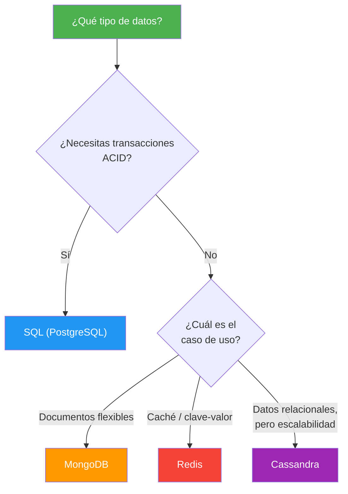
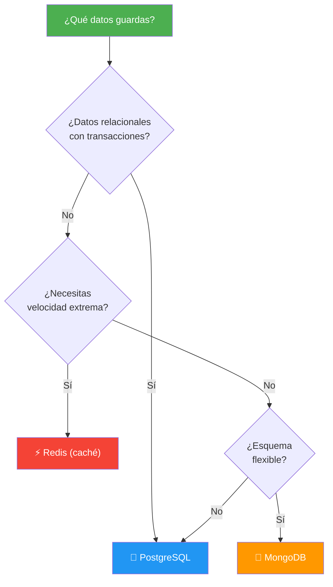

- [21. Bases de Datos SQL y NoSQL](#21-bases-de-datos-sql-y-nosql)
  - [21.1. ACID vs BASE: Dos Filosofías](#211-acid-vs-base-dos-filosofías)
  - [21.2. PostgreSQL: El SQL Potente](#212-postgresql-el-sql-potente)
  - [21.3. MongoDB: Documentos Flexibles](#213-mongodb-documentos-flexibles)
  - [21.4. Redis: Caché y Clave-Valor](#214-redis-caché-y-clave-valor)
  - [21.5. Comparativa y Cuándo Usar Cada Uno](#215-comparativa-y-cuándo-usar-cada-uno)


# 21. Bases de Datos SQL y NoSQL

> 💡 **Punto de partida:** Necesitas guardar datos, pero... ¿una base de datos relacional como PostgreSQL? ¿O un documento como MongoDB? ¿O una caché como Redis? No hay una "mejor" base de datos: cada una está diseñada para problemas diferentes. PostgreSQL es como una hoja de cálculo gigante con relaciones. MongoDB es como guardar PDFs flexibles. Redis es como una estantería donde guardas cajas etiquetadas. Vamos a ver cuándo usar cada una.

En este tema aprenderás las diferencias entre ACID y BASE, y usarás PostgreSQL (SQL), MongoDB (documentos) y Redis (clave-valor) con ejemplos C# completos.

**Objetivos de aprendizaje:**

- Entender ACID (SQL) vs BASE (NoSQL)
- Crear CRUD completo con PostgreSQL usando Dapper
- Trabajar con MongoDB: documentos, inserción, consulta
- Usar Redis para caché y almacenamiento clave-valor
- Elegir la base de datos adecuada según el caso de uso

## 21.1. ACID vs BASE: Dos Filosofías

| Propiedad | ACID (SQL) | BASE (NoSQL) |
|-----------|-----------|--------------|
| **A** - Atomicity / **BA** - Basically Available | Todo o nada (transacciones) | Disponible (puede tener datos temporales inconsistentes) |
| **C** - Consistency / **S** - Soft state | Siempre consistente | Estado "blando" (puede cambiar) |
| **I** - Isolation / **E** - Eventually consistent | Aislamiento entre transacciones | Consistencia eventual (se sincroniza después) |
| **D** - Durability | Los datos persisten después de commit | Los datos persisten (pero puede haber lag) |



📌 **Ejemplo real:** Un banco usa PostgreSQL (ACID): si transfieres dinero, la transacción es "todo o nada" — no puede quedarse a medias. Un feed de redes sociales usa MongoDB (BASE): si un post tarda 1 milisegundo más en aparecer, no pasa nada.

## 21.2. PostgreSQL: El SQL Potente

PostgreSQL es el SGBD relacional open-source más potente. Soporta JSON, GIS, full-text search y extensiones.

### Instalación del driver

```bash
dotnet add package Npgsql
dotnet add package Dapper
```

### CRUD con Dapper

```csharp
using Npgsql;
using Dapper;

public class PersonaRepository
{
    private readonly string _connectionString;

    public PersonaRepository(string connectionString)
    {
        _connectionString = connectionString;
    }

    public async Task<IEnumerable<Persona>> GetAllAsync()
    {
        using var connection = new NpgsqlConnection(_connectionString);
        return await connection.QueryAsync<Persona>("SELECT * FROM Personas ORDER BY Nombre");
    }

    public async Task<Persona?> GetByIdAsync(int id)
    {
        using var connection = new NpgsqlConnection(_connectionString);
        return await connection.QueryFirstOrDefaultAsync<Persona>(
            "SELECT * FROM Personas WHERE Id = @Id", new { Id = id });
    }

    public async Task<int> CreateAsync(Persona persona)
    {
        using var connection = new NpgsqlConnection(_connectionString);
        return await connection.ExecuteScalarAsync<int>(
            @"INSERT INTO Personas (Nombre, Email, Edad, FechaRegistro, Activo)
              VALUES (@Nombre, @Email, @Edad, @FechaRegistro, @Activo)
              RETURNING Id",
            persona);
    }

    public async Task<bool> UpdateAsync(Persona persona)
    {
        using var connection = new NpgsqlConnection(_connectionString);
        int filas = await connection.ExecuteAsync(
            @"UPDATE Personas
              SET Nombre = @Nombre, Email = @Email, Edad = @Edad, Activo = @Activo
              WHERE Id = @Id",
            persona);
        return filas > 0;
    }

    public async Task<bool> DeleteAsync(int id)
    {
        using var connection = new NpgsqlConnection(_connectionString);
        int filas = await connection.ExecuteAsync(
            "DELETE FROM Personas WHERE Id = @Id", new { Id = id });
        return filas > 0;
    }
}
```

### JOINs con Dapper

```csharp
// Consulta con JOIN
var personasConPedidos = await connection.QueryAsync<Persona, Pedido, (Persona, Pedido)>(
    @"SELECT p.*, ped.*
      FROM Personas p
      INNER JOIN Pedidos ped ON p.Id = ped.PersonaId
      WHERE p.Activo = true",
    (persona, pedido) => (persona, pedido),
    splitOn: "Id"
);
```

### Transacciones

```csharp
using var connection = new NpgsqlConnection(_connectionString);
await connection.OpenAsync();

using var transaction = await connection.BeginTransactionAsync();

try
{
    await connection.ExecuteAsync(
        "UPDATE Cuentas SET Saldo = Saldo - @Monto WHERE Id = @CuentaOrigen",
        new { Monto = 100, CuentaOrigen = 1 }, transaction);

    await connection.ExecuteAsync(
        "UPDATE Cuentas SET Saldo = Saldo + @Monto WHERE Id = @CuentaDestino",
        new { Monto = 100, CuentaDestino = 2 }, transaction);

    await transaction.CommitAsync(); // Todo o nada
}
catch
{
    await transaction.RollbackAsync(); // Deshacer todo
    throw;
}
```

> 💡 **Consejo:** Para EF Core con PostgreSQL, usa el paquete `Npgsql.EntityFrameworkCore.PostgreSQL`. Para Dapper, usa `Npgsql` directamente. Dapper es más rápido para consultas complejas, EF Core para CRUD rápido.

## 21.3. MongoDB: Documentos Flexibles

MongoDB almacena documentos BSON (JSON binario). No necesitas un esquema fijo: cada documento puede tener estructura diferente.

### Instalación

```bash
dotnet add package MongoDB.Driver
```

### Modelo y configuración

```csharp
using MongoDB.Bson;
using MongoDB.Bson.Serialization.Attributes;

public class ProductoMongo
{
    [BsonId]
    [BsonRepresentation(BsonType.ObjectId)]
    public string Id { get; set; } = "";

    [BsonElement("nombre")]
    public string Nombre { get; set; } = "";

    [BsonElement("precio")]
    public decimal Precio { get; set; }

    [BsonElement("categorias")]
    public List<string> Categorias { get; set; } = new();

    [BsonElement("especificaciones")]
    public Dictionary<string, string> Especificaciones { get; set; } = new();

    [BsonElement("fechaCreacion")]
    public DateTime FechaCreacion { get; set; }
}
```

### CRUD con MongoDB Driver

```csharp
using MongoDB.Driver;

public class ProductoMongoRepository
{
    private readonly IMongoCollection<ProductoMongo> _productos;

    public ProductoMongoRepository(string connectionString, string database)
    {
        var client = new MongoClient(connectionString);
        var db = client.GetDatabase(database);
        _productos = db.GetCollection<ProductoMongo>("productos");
    }

    // CREATE
    public async Task<string> CreateAsync(ProductoMongo producto)
    {
        await _productos.InsertOneAsync(producto);
        return producto.Id;
    }

    // READ: buscar todos
    public async Task<List<ProductoMongo>> GetAllAsync()
    {
        return await _productos.Find(_ => true).ToListAsync();
    }

    // READ: buscar por ID
    public async Task<ProductoMongo?> GetByIdAsync(string id)
    {
        return await _productos.Find(p => p.Id == id).FirstOrDefaultAsync();
    }

    // READ: buscar por categoría
    public async Task<List<ProductoMongo>> GetByCategoriaAsync(string categoria)
    {
        return await _productos
            .Find(p => p.Categorias.Contains(categoria))
            .ToListAsync();
    }

    // UPDATE
    public async Task<bool> UpdateAsync(ProductoMongo producto)
    {
        var resultado = await _productos.ReplaceOneAsync(
            p => p.Id == producto.Id,
            producto);
        return resultado.IsAcknowledged && resultado.ModifiedCount > 0;
    }

    // DELETE
    public async Task<bool> DeleteAsync(string id)
    {
        var resultado = await _productos.DeleteOneAsync(p => p.Id == id);
        return resultado.IsAcknowledged && resultado.DeletedCount > 0;
    }
}
```

### Agregaciones

```csharp
// Pipeline de agregación: agrupar por categoría y calcular promedio
var pipeline = _productos.Aggregate()
    .Unwind(p => p.Categorias)                    // Aplanar categorías
    .Group(
        new { Categoria = "$categorias" },
        g => new
        {
            Categoria = g.Key.Categoria,
            TotalProductos = g.Count(),
            PrecioPromedio = g.Average(p => p.Precio)
        })
    .SortByDescending(x => x.TotalProductos);

var resultados = await pipeline.ToListAsync();
```

> 📝 **Nota:** MongoDB es ideal cuando los datos son jerárquicos (documentos JSON) y el esquema cambia frecuentemente. No necesitas migraciones: simplemente añades nuevos campos a los documentos.

📌 **Ejemplo real:** Instagram guarda los perfiles de usuario en MongoDB. Cada usuario tiene información diferente: unos tienen linkedin, otros no; unos tienen bio larga, otros vacía. Con MongoDB no necesitas un esquema rígido.

## 21.4. Redis: Caché y Clave-Valor

Redis es una base de datos en memoria ultra-rápida. Se usa principalmente para caché, sesiones, colas de mensajes y contadores.

### Instalación

```bash
dotnet add package StackExchange.Redis
```

### Conexión y operaciones básicas

```csharp
using StackExchange.Redis;

public class RedisCacheService
{
    private readonly ConnectionMultiplexer _redis;
    private readonly IDatabase _db;

    public RedisCacheService(string connectionString)
    {
        _redis = ConnectionMultiplexer.Connect(connectionString);
        _db = _redis.GetDatabase();
    }

    // SET: guardar valor
    public async Task SetAsync(string key, string value, TimeSpan? expiry = null)
    {
        await _db.StringSetAsync(key, value, expiry);
    }

    // GET: obtener valor
    public async Task<string?> GetAsync(string key)
    {
        return await _db.StringGetAsync(key);
    }

    // DELETE: eliminar
    public async Task<bool> DeleteAsync(string key)
    {
        return await _db.KeyDeleteAsync(key);
    }

    // EXISTS: comprobar si existe
    public async Task<bool> ExistsAsync(string key)
    {
        return await _db.KeyExistsAsync(key);
    }

    // INCREMENT: incrementar contador
    public async Task<long> IncrementAsync(string key)
    {
        return await _db.StringIncrementAsync(key);
    }
}
```

### Caché con patrón Cache-Aside

```csharp
public class ProductoService
{
    private readonly RedisCacheService _cache;
    private readonly ProductoRepository _repository;

    public async Task<Producto?> ObtenerProductoAsync(int id)
    {
        string key = $"producto:{id}";

        // 1. Buscar en caché
        string? cached = await _cache.GetAsync(key);
        if (cached is not null)
        {
            return JsonSerializer.Deserialize<Producto>(cached);
        }

        // 2. Si no está, buscar en BD
        var producto = await _repository.GetByIdAsync(id);
        if (producto is not null)
        {
            // 3. Guardar en caché para próxima vez
            await _cache.SetAsync(key, JsonSerializer.Serialize(producto),
                TimeSpan.FromMinutes(30));
        }

        return producto;
    }
}
```

### Listas y colas

```csharp
// Lista: push y pop (cola de mensajes)
await _db.ListLeftPushAsync("cola:tareas", "Tarea 1");
await _db.ListLeftPushAsync("cola:tareas", "Tarea 2");

string? tarea = await _db.ListRightPopAsync("cola:tareas"); // "Tarea 1" (FIFO)

// Hash: objetos con múltiples campos
var hash = new HashEntry[]
{
    new("nombre", "Ana"),
    new("email", "ana@email.com"),
    new("edad", "25")
};
await _db.HashSetAsync("usuario:1", hash);

RedisValue nombre = await _db.HashGetAsync("usuario:1", "nombre");
```

> 💡 **Consejo:** Redis es ideal para caché de sesiones de usuario, datos de productos que cambian poco, contadores de visitas y colas de tareas. No uses Redis como base de datos principal: los datos están en memoria y se pierden al reiniciar (a menos que configures persistencia).

📌 **Ejemplo real:** Twitter usa Redis para cachear los timelines de los usuarios. Cuando abres Twitter, el timeline se carga de Redis (microsegundos), no de la base de datos (milisegundos). Los datos se actualizan cuando alguien twittea.

## 21.5. Comparativa y Cuándo Usar Cada Uno

| Característica | PostgreSQL | MongoDB | Redis |
|---------------|-----------|---------|-------|
| **Tipo** | Relacional (tablas) | Documentos (JSON) | Clave-valor (memoria) |
| **Esquema** | Rígido (migraciones) | Flexible (cambia solo) | Sin esquema |
| **Rendimiento** | Rápido (con índices) | Muy rápido | Ultrarrápido (memoria) |
| **Escalabilidad** | Vertical + read replicas | Horizontal (sharding) | Vertical + clustering |
| **Transacciones** | ✅ ACID completo | ✅ Transacciones multi-doc | ⚠️ Limitadas |
| **Relaciones** | ✅ JOINs nativos | ⚠️ Embedding/referencing | ❌ No hay |
| **Uso típico** | Datos relacionales, e-commerce | Contenido, perfiles, IoT | Caché, sesiones, colas |
| **Coste** | Gratis (open source) | Gratis (open source) | Gratis (open source) |



### Ejemplo: Arquitectura híbrida

```csharp
// Un sistema real usa las tres:
// PostgreSQL: datos principales (usuarios, pedidos)
// MongoDB: contenido flexible (posts, comentarios)
// Redis: caché de sesiones y datos frecuentes

public class PedidoService
{
    private readonly PedidoRepository _pedidoRepo;     // PostgreSQL
    private readonly PostRepository _postRepo;          // MongoDB
    private readonly RedisCacheService _cache;          // Redis

    public async Task<Pedido?> ObtenerPedidoAsync(int id)
    {
        // 1. Buscar en caché (Redis)
        string cached = await _cache.GetAsync($"pedido:{id}");
        if (cached is not null)
            return JsonSerializer.Deserialize<Pedido>(cached);

        // 2. Buscar en BD principal (PostgreSQL)
        var pedido = await _pedidoRepo.GetByIdAsync(id);

        // 3. Guardar en caché
        if (pedido is not null)
            await _cache.SetAsync($"pedido:{id}", JsonSerializer.Serialize(pedido));

        return pedido;
    }
}
```

> 📝 **Nota:** En producción, la mayoría de sistemas usan una combinación: PostgreSQL para datos transaccionales, Redis para caché, y a veces MongoDB para contenido flexible. No es "uno o otro", sino "el correcto para cada tipo de dato".

---

**Resumen del punto:**

| Concepto | Descripción |
|----------|-------------|
| **ACID** | Atomicidad, Consistencia, Aislamiento, Durabilidad (SQL) |
| **BASE** | Básicamente Disponible, Estado blando, Consistencia eventual (NoSQL) |
| **PostgreSQL** | SGBD relacional open-source, potente y maduro |
| **Dapper** | Micro ORM para consultas SQL rápidas |
| **MongoDB** | Base de datos de documentos BSON sin esquema fijo |
| **Redis** | Base de datos en memoria para caché y clave-valor |
| **Cache-Aside** | Patrón: buscar en caché → si no está, buscar en BD → guardar en caché |
| **Híbrido** | Usar PostgreSQL + Redis + MongoDB según el tipo de dato |

En el siguiente punto veremos testing avanzado: NUnit, FluentAssertions, Moq y TestContainers para tests profesionales.
