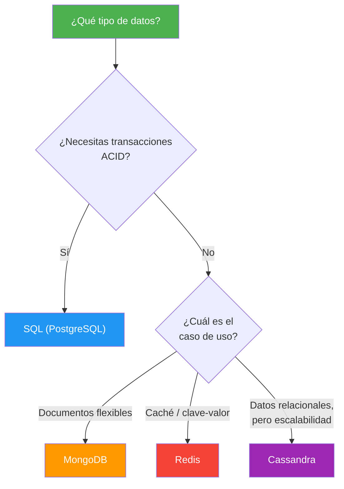
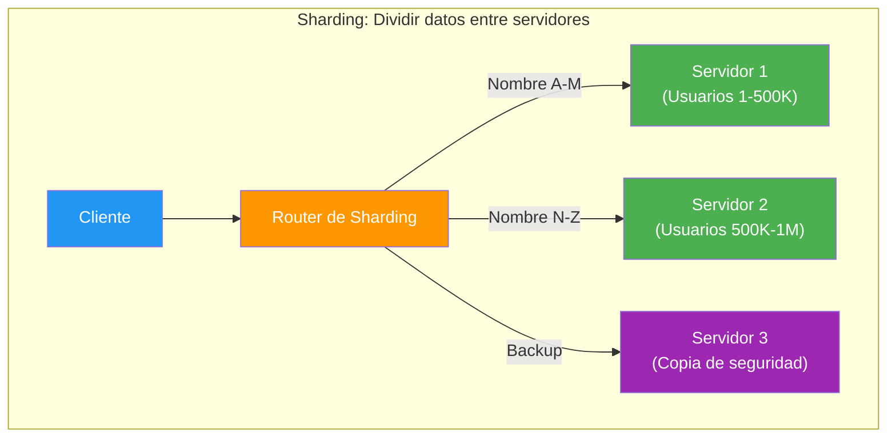
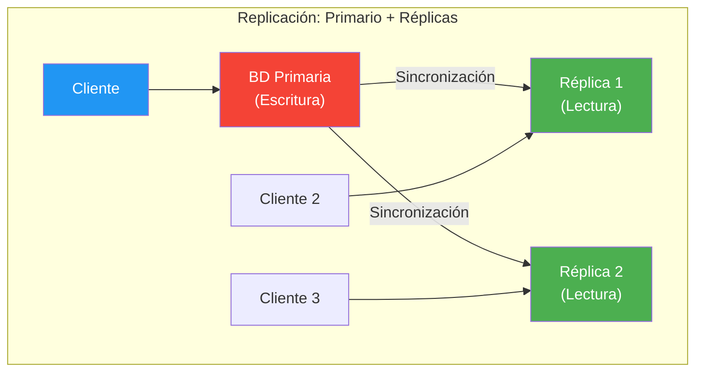
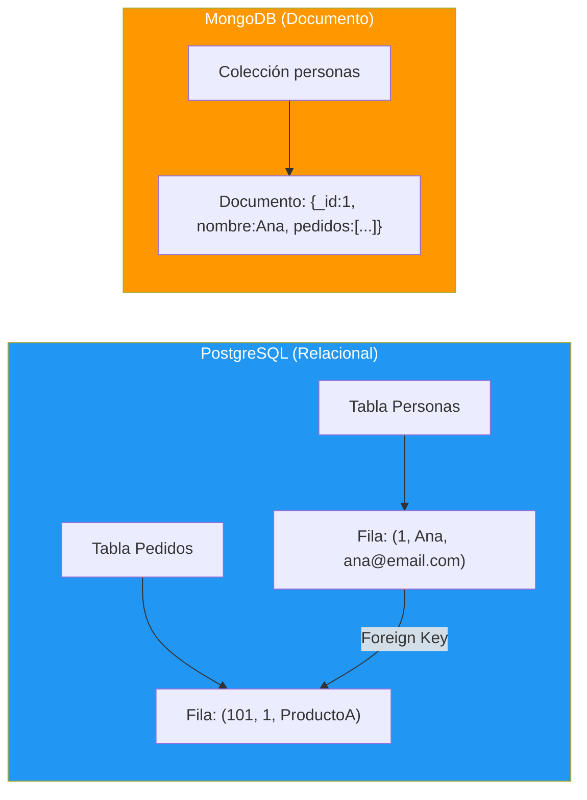
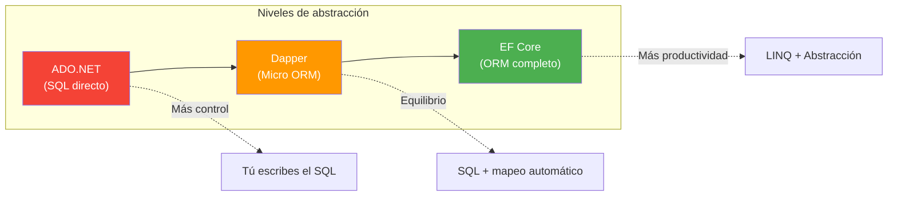
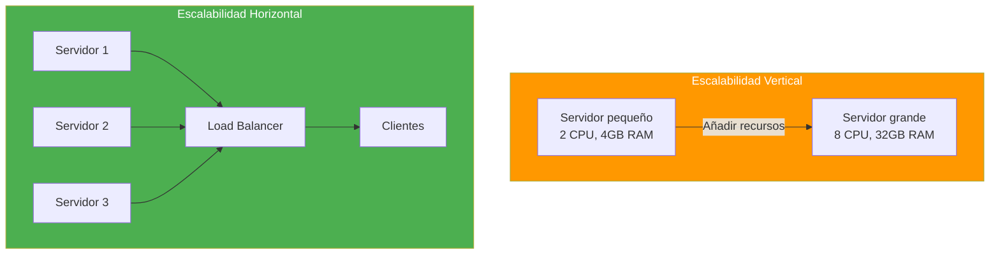
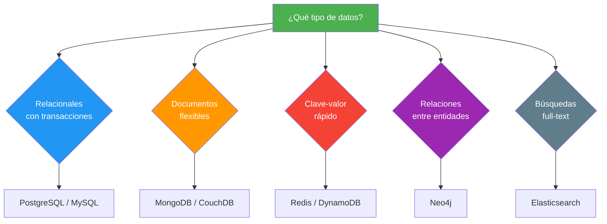
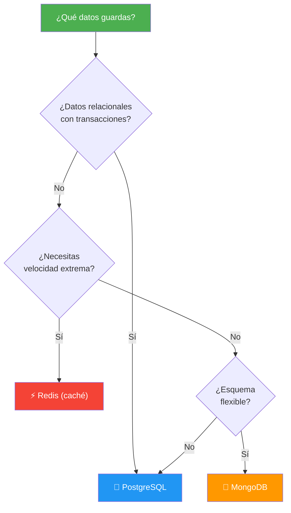

- [21. Bases de Datos SQL y NoSQL](#21-bases-de-datos-sql-y-nosql)
  - [21.1. ACID vs BASE: Dos Filosofías](#211-acid-vs-base-dos-filosofías)
  - [21.2. PostgreSQL: El SQL Potente](#212-postgresql-el-sql-potente)
  - [21.3. MongoDB: Documentos Flexibles](#213-mongodb-documentos-flexibles)
  - [21.4. Redis: Caché y Clave-Valor](#214-redis-caché-y-clave-valor)
  - [21.5. Sharding y Replicación](#215-sharding-y-replicación)
  - [21.6. Patrón Cache-Aside](#216-patrón-cache-aside)
  - [21.7. Consistencia Eventual](#217-consistencia-eventual)
  - [21.8. Modelo Relacional vs Documento](#218-modelo-relacional-vs-documento)
  - [21.9. Dapper vs EF Core vs ADO.NET](#219-dapper-vs-ef-core-vs-ado)
  - [21.10. Escalabilidad Vertical vs Horizontal](#2110-escalabilidad-vertical-vs-horizontal)
  - [21.11. Comparativa y Cuándo Usar Cada Uno](#2111-comparativa-y-cuándo-usar-cada-uno)


# 21. Bases de Datos SQL y NoSQL

> 💡 **Punto de partida:** Necesitas guardar datos, pero... ¿una base de datos relacional como PostgreSQL? ¿O un documento como MongoDB? ¿O una caché como Redis? No hay una "mejor" base de datos: cada una está diseñada para problemas diferentes. PostgreSQL es como una hoja de cálculo gigante con relaciones. MongoDB es como guardar PDFs flexibles. Redis es como una estantería donde guardas cajas etiquetadas. Vamos a ver cuándo usar cada una.

En este tema aprenderás las diferencias entre ACID y BASE, y usarás PostgreSQL (SQL), MongoDB (documentos) y Redis (clave-valor) con ejemplos C# completos.

**Objetivos de aprendizaje:**

- Entender ACID (SQL) vs BASE (NoSQL)
- Crear CRUD completo con PostgreSQL usando Dapper
- Trabajar con MongoDB: documentos, inserción, consulta
- Usar Redis para caché y almacenamiento clave-valor
- Elegir la base de datos adecuada según el caso de uso

## 21.1. ACID vs BASE: Dos Filosofías

| Propiedad | ACID (SQL) | BASE (NoSQL) |
|-----------|-----------|--------------|
| **A** - Atomicity / **BA** - Basically Available | Todo o nada (transacciones) | Disponible (puede tener datos temporales inconsistentes) |
| **C** - Consistency / **S** - Soft state | Siempre consistente | Estado "blando" (puede cambiar) |
| **I** - Isolation / **E** - Eventually consistent | Aislamiento entre transacciones | Consistencia eventual (se sincroniza después) |
| **D** - Durability | Los datos persisten después de commit | Los datos persisten (pero puede haber lag) |



📌 **Ejemplo real:** Un banco usa PostgreSQL (ACID): si transfieres dinero, la transacción es "todo o nada" — no puede quedarse a medias. Un feed de redes sociales usa MongoDB (BASE): si un post tarda 1 milisegundo más en aparecer, no pasa nada.

## 21.2. PostgreSQL: El SQL Potente

PostgreSQL es el SGBD relacional open-source más potente. Soporta JSON, GIS, full-text search y extensiones.

### Instalación del driver

```bash
dotnet add package Npgsql
dotnet add package Dapper
```

### CRUD con Dapper

```csharp
using Npgsql;
using Dapper;

public class PersonaRepository(string connectionString)
{
    public async Task<IEnumerable<Persona>> GetAllAsync()
    {
        using var connection = new NpgsqlConnection(connectionString);
        return await connection.QueryAsync<Persona>("SELECT * FROM Personas ORDER BY Nombre");
    }

    public async Task<Persona?> GetByIdAsync(int id)
    {
        using var connection = new NpgsqlConnection(connectionString);
        return await connection.QueryFirstOrDefaultAsync<Persona>(
            "SELECT * FROM Personas WHERE Id = @Id", new { Id = id });
    }

    public async Task<int> CreateAsync(Persona persona)
    {
        using var connection = new NpgsqlConnection(connectionString);
        return await connection.ExecuteScalarAsync<int>(
            @"INSERT INTO Personas (Nombre, Email, Edad, FechaRegistro, Activo)
              VALUES (@Nombre, @Email, @Edad, @FechaRegistro, @Activo)
              RETURNING Id",
            persona);
    }

    public async Task<bool> UpdateAsync(Persona persona)
    {
        using var connection = new NpgsqlConnection(connectionString);
        int filas = await connection.ExecuteAsync(
            @"UPDATE Personas
              SET Nombre = @Nombre, Email = @Email, Edad = @Edad, Activo = @Activo
              WHERE Id = @Id",
            persona);
        return filas > 0;
    }

    public async Task<bool> DeleteAsync(int id)
    {
        using var connection = new NpgsqlConnection(connectionString);
        int filas = await connection.ExecuteAsync(
            "DELETE FROM Personas WHERE Id = @Id", new { Id = id });
        return filas > 0;
    }
}
```

### JOINs con Dapper

```csharp
// Consulta con JOIN
var personasConPedidos = await connection.QueryAsync<Persona, Pedido, (Persona, Pedido)>(
    @"SELECT p.*, ped.*
      FROM Personas p
      INNER JOIN Pedidos ped ON p.Id = ped.PersonaId
      WHERE p.Activo = true",
    (persona, pedido) => (persona, pedido),
    splitOn: "Id"
);
```

### Transacciones

```csharp
using var connection = new NpgsqlConnection(_connectionString);
await connection.OpenAsync();

using var transaction = await connection.BeginTransactionAsync();

try
{
    await connection.ExecuteAsync(
        "UPDATE Cuentas SET Saldo = Saldo - @Monto WHERE Id = @CuentaOrigen",
        new { Monto = 100, CuentaOrigen = 1 }, transaction);

    await connection.ExecuteAsync(
        "UPDATE Cuentas SET Saldo = Saldo + @Monto WHERE Id = @CuentaDestino",
        new { Monto = 100, CuentaDestino = 2 }, transaction);

    await transaction.CommitAsync(); // Todo o nada
}
catch
{
    await transaction.RollbackAsync(); // Deshacer todo
    throw;
}
```

> 💡 **Consejo:** Para EF Core con PostgreSQL, usa el paquete `Npgsql.EntityFrameworkCore.PostgreSQL`. Para Dapper, usa `Npgsql` directamente. Dapper es más rápido para consultas complejas, EF Core para CRUD rápido.

### EF Core con PostgreSQL: CRUD Completo

```bash
dotnet add package Npgsql.EntityFrameworkCore.PostgreSQL
dotnet add package Microsoft.EntityFrameworkCore.Tools
```

```csharp
using Microsoft.EntityFrameworkCore;

// DbContext
public class AppDbContext(DbContextOptions<AppDbContext> options) : DbContext(options)
{
    public DbSet<Persona> Personas => Set<Persona>();

    protected override void OnModelCreating(ModelBuilder modelBuilder)
    {
        modelBuilder.Entity<Persona>(entity =>
        {
            entity.HasKey(p => p.Id);
            entity.Property(p => p.Nombre).HasMaxLength(100).IsRequired();
            entity.Property(p => p.Email).HasMaxLength(200);
        });
    }
}

// Repository con EF Core
public class PersonaEfRepository(AppDbContext context)
{
    // READ: Obtener todos
    public async Task<List<Persona>> GetAllAsync()
    {
        return await context.Personas
            .OrderBy(p => p.Nombre)
            .ToListAsync();
    }

    // READ: Obtener por ID
    public async Task<Persona?> GetByIdAsync(int id)
    {
        return await context.Personas.FindAsync(id);
    }

    // READ: Buscar por email
    public async Task<Persona?> GetByEmailAsync(string email)
    {
        return await context.Personas
            .FirstOrDefaultAsync(p => p.Email == email);
    }

    // CREATE
    public async Task<Persona> CreateAsync(Persona persona)
    {
        context.Personas.Add(persona);
        await context.SaveChangesAsync();
        return persona;
    }

    // UPDATE
    public async Task<bool> UpdateAsync(Persona persona)
    {
        var existente = await context.Personas.FindAsync(persona.Id);
        if (existente is null) return false;

        existente.Nombre = persona.Nombre;
        existente.Email = persona.Email;
        existente.Edad = persona.Edad;
        existente.Activo = persona.Activo;

        await context.SaveChangesAsync();
        return true;
    }

    // DELETE
    public async Task<bool> DeleteAsync(int id)
    {
        var persona = await context.Personas.FindAsync(id);
        if (persona is null) return false;

        context.Personas.Remove(persona);
        await context.SaveChangesAsync();
        return true;
    }

    // CONSULTA COMPLEJA: Filtrar, ordenar, paginar
    public async Task<List<Persona>> SearchAsync(string? nombre, int page, int pageSize)
    {
        return await context.Personas
            .Where(p => nombre == null || p.Nombre.Contains(nombre))
            .OrderBy(p => p.Nombre)
            .Skip((page - 1) * pageSize)
            .Take(pageSize)
            .ToListAsync();
    }
}
```

### Registro en DI

```csharp
// Program.cs
builder.Services.AddDbContext<AppDbContext>(options =>
    options.UseNpgsql(builder.Configuration.GetConnectionString("PostgreSQL")));
```

### CRUD con Dapper vs EF Core

| Operación | Dapper | EF Core |
|-----------|--------|---------|
| **SELECT simple** | `QueryAsync<T>(sql)` | `context.Personas.ToListAsync()` |
| **INSERT** | `ExecuteAsync(sql, param)` | `context.Personas.AddAsync(p)` |
| **UPDATE** | `ExecuteAsync(sql, param)` | `p.Nombre = "nuevo"; SaveChanges()` |
| **DELETE** | `ExecuteAsync(sql, param)` | `context.Personas.Remove(p)` |
| **JOIN complejo** | `QueryAsync<T>(sqlJoin)` | `Include()` + LINQ |
| **Rendimiento** | Más rápido | Más productivo |
| **Usar cuando** | Consultas complejas, reporting | CRUD rápido, prototipos |

## 21.3. MongoDB: Documentos Flexibles

MongoDB almacena documentos BSON (JSON binario). No necesitas un esquema fijo: cada documento puede tener estructura diferente.

### Instalación

```bash
dotnet add package MongoDB.Driver
```

### Modelo y configuración

```csharp
using MongoDB.Bson;
using MongoDB.Bson.Serialization.Attributes;

public class ProductoMongo
{
    [BsonId]
    [BsonRepresentation(BsonType.ObjectId)]
    public string Id { get; set; } = "";

    [BsonElement("nombre")]
    public string Nombre { get; set; } = "";

    [BsonElement("precio")]
    public decimal Precio { get; set; }

    [BsonElement("categorias")]
    public List<string> Categorias { get; set; } = new();

    [BsonElement("especificaciones")]
    public Dictionary<string, string> Especificaciones { get; set; } = new();

    [BsonElement("fechaCreacion")]
    public DateTime FechaCreacion { get; set; }
}
```

### CRUD con MongoDB Driver

```csharp
using MongoDB.Driver;

public class ProductoMongoRepository(string connectionString, string database)
{
    private readonly IMongoCollection<ProductoMongo> _productos = new MongoClient(connectionString)
        .GetDatabase(database)
        .GetCollection<ProductoMongo>("productos");

    // CREATE
    public async Task<string> CreateAsync(ProductoMongo producto)
    {
        await _productos.InsertOneAsync(producto);
        return producto.Id;
    }

    // READ: buscar todos
    public async Task<List<ProductoMongo>> GetAllAsync()
    {
        return await _productos.Find(_ => true).ToListAsync();
    }

    // READ: buscar por ID
    public async Task<ProductoMongo?> GetByIdAsync(string id)
    {
        return await _productos.Find(p => p.Id == id).FirstOrDefaultAsync();
    }

    // READ: buscar por categoría
    public async Task<List<ProductoMongo>> GetByCategoriaAsync(string categoria)
    {
        return await _productos
            .Find(p => p.Categorias.Contains(categoria))
            .ToListAsync();
    }

    // UPDATE
    public async Task<bool> UpdateAsync(ProductoMongo producto)
    {
        var resultado = await _productos.ReplaceOneAsync(
            p => p.Id == producto.Id,
            producto);
        return resultado.IsAcknowledged && resultado.ModifiedCount > 0;
    }

    // DELETE
    public async Task<bool> DeleteAsync(string id)
    {
        var resultado = await _productos.DeleteOneAsync(p => p.Id == id);
        return resultado.IsAcknowledged && resultado.DeletedCount > 0;
    }
}
```

### Agregaciones

```csharp
// Pipeline de agregación: agrupar por categoría y calcular promedio
var pipeline = _productos.Aggregate()
    .Unwind(p => p.Categorias)                    // Aplanar categorías
    .Group(
        new { Categoria = "$categorias" },
        g => new
        {
            Categoria = g.Key.Categoria,
            TotalProductos = g.Count(),
            PrecioPromedio = g.Average(p => p.Precio)
        })
    .SortByDescending(x => x.TotalProductos);

var resultados = await pipeline.ToListAsync();
```

> 📝 **Nota:** MongoDB es ideal cuando los datos son jerárquicos (documentos JSON) y el esquema cambia frecuentemente. No necesitas migraciones: simplemente añades nuevos campos a los documentos.

📌 **Ejemplo real:** Instagram guarda los perfiles de usuario en MongoDB. Cada usuario tiene información diferente: unos tienen linkedin, otros no; unos tienen bio larga, otros vacía. Con MongoDB no necesitas un esquema rígido.

### EF Core con MongoDB: CRUD Completo

```bash
dotnet add package MongoDB.EntityFrameworkCore
```

```csharp
using Microsoft.EntityFrameworkCore;

// DbContext
public class MongoDbContext(DbContextOptions<MongoDbContext> options) : DbContext(options)
{
    public DbSet<ProductoMongo> Productos => Set<ProductoMongo>();

    protected override void OnModelCreating(ModelBuilder modelBuilder)
    {
        modelBuilder.Entity<ProductoMongo>(entity =>
        {
            entity.HasKey(p => p.Id);
            entity.Property(p => p.Nombre).HasMaxLength(200);
        });
    }
}

// Repository con EF Core
public class ProductoMongoEfRepository(MongoDbContext context)
{
    // READ: Obtener todos
    public async Task<List<ProductoMongo>> GetAllAsync()
    {
        return await context.Productos
            .OrderBy(p => p.Nombre)
            .ToListAsync();
    }

    // READ: Obtener por ID
    public async Task<ProductoMongo?> GetByIdAsync(string id)
    {
        return await context.Productos.FindAsync(id);
    }

    // READ: Buscar por categoría
    public async Task<List<ProductoMongo>> GetByCategoriaAsync(string categoria)
    {
        return await context.Productos
            .Where(p => p.Categorias.Contains(categoria))
            .ToListAsync();
    }

    // CREATE
    public async Task<ProductoMongo> CreateAsync(ProductoMongo producto)
    {
        context.Productos.Add(producto);
        await context.SaveChangesAsync();
        return producto;
    }

    // UPDATE
    public async Task<bool> UpdateAsync(ProductoMongo producto)
    {
        var existente = await context.Productos.FindAsync(producto.Id);
        if (existente is null) return false;

        existente.Nombre = producto.Nombre;
        existente.Precio = producto.Precio;
        existente.Categorias = producto.Categorias;

        await context.SaveChangesAsync();
        return true;
    }

    // DELETE
    public async Task<bool> DeleteAsync(string id)
    {
        var producto = await context.Productos.FindAsync(id);
        if (producto is null) return false;

        context.Productos.Remove(producto);
        await context.SaveChangesAsync();
        return true;
    }
}
```

### Registro en DI

```csharp
// Program.cs
builder.Services.AddDbContext<MongoDbContext>(options =>
    options.UseMongoDB(builder.Configuration.GetConnectionString("MongoDB")));
```

### MongoDB: Driver Nativo vs EF Core

| Característica | MongoDB.Driver | EF Core + MongoDB |
|----------------|---------------|-------------------|
| **Control** | Total sobre la BD | Abstraído por EF Core |
| **Agregaciones** | Pipeline completo (Unwind, Group, Match) | Limitado (LINQ se traduce parcialmente) |
| **Esquema** | Sin esquema fijo | Define entidades con Fluent API |
| **Migraciones** | No existen | `dotnet ef migrations add` |
| **CRUD** | `InsertOneAsync`, `Find`, `ReplaceOneAsync` | `Add`, `SaveChanges`, LINQ |
| **Usar cuando** | Agregaciones complejas, documentos anidados | CRUD rápido, si ya usas EF Core |
| **Rendimiento** | Más rápido | Más productivo |

## 21.4. Redis: Caché y Clave-Valor

Redis es una base de datos en memoria ultra-rápida. Se usa principalmente para caché, sesiones, colas de mensajes y contadores.

### Instalación

```bash
dotnet add package StackExchange.Redis
dotnet add package Microsoft.Extensions.Caching.StackExchangeRedis
```

### CRUD con StackExchange.Redis (Driver Nativo): CRUD Completo

```csharp
using StackExchange.Redis;
using System.Text.Json;

public class PersonaRedisRepository(string connectionString)
{
    private readonly ConnectionMultiplexer _redis = ConnectionMultiplexer.Connect(connectionString);
    private IDatabase _db = null!;

    public async Task InitializeAsync()
    {
        _db = _redis.GetDatabase();
    }

    // CREATE: Guardar persona
    public async Task<bool> CreateAsync(Persona persona)
    {
        string key = $"persona:{persona.Id}";
        string json = JsonSerializer.Serialize(persona);
        return await _db.StringSetAsync(key, json, TimeSpan.FromHours(24));
    }

    // READ: Obtener persona por ID
    public async Task<Persona?> GetByIdAsync(int id)
    {
        string key = $"persona:{id}";
        string? json = await _db.StringGetAsync(key);
        return json is null ? null : JsonSerializer.Deserialize<Persona>(json);
    }

    // READ: Obtener todas las personas (scan)
    public async Task<List<Persona>> GetAllAsync()
    {
        var personas = new List<Persona>();
        var server = _redis.GetServer(_redis.GetEndPoints().First());
        var keys = server.Keys(pattern: "persona:*");

        foreach (var key in keys)
        {
            string? json = await _db.StringGetAsync(key);
            if (json is not null)
                personas.Add(JsonSerializer.Deserialize<Persona>(json)!);
        }
        return personas;
    }

    // UPDATE: Actualizar persona
    public async Task<bool> UpdateAsync(Persona persona)
    {
        string key = $"persona:{persona.Id}";
        string? existing = await _db.StringGetAsync(key);
        if (existing is null) return false;

        string json = JsonSerializer.Serialize(persona);
        return await _db.StringSetAsync(key, json, TimeSpan.FromHours(24));
    }

    // DELETE: Eliminar persona
    public async Task<bool> DeleteAsync(int id)
    {
        return await _db.KeyDeleteAsync($"persona:{id}");
    }

    // EXISTS: Comprobar si existe
    public async Task<bool> ExistsAsync(int id)
    {
        return await _db.KeyExistsAsync($"persona:{id}");
    }

    // INCREMENT: Incrementar contador
    public async Task<long> IncrementAsync(string key)
    {
        return await _db.StringIncrementAsync(key);
    }
}
```

### IDistributedCache: Interfaz .NET para caché

```csharp
using Microsoft.Extensions.Caching.Distributed;

// Registro en DI
builder.Services.AddStackExchangeRedisCache(options =>
{
    options.Configuration = builder.Configuration.GetConnectionString("Redis");
    options.InstanceName = "Academia_";
});

// Uso con IDistributedCache
public class PersonaCacheService(IDistributedCache cache)
{
    public async Task<Persona?> GetAsync(int id)
    {
        string? json = await cache.GetStringAsync($"persona:{id}");
        return json is null ? null : JsonSerializer.Deserialize<Persona>(json);
    }

    public async Task SetAsync(Persona persona)
    {
        string json = JsonSerializer.Serialize(persona);
        await cache.SetStringAsync($"persona:{persona.Id}", json,
            new DistributedCacheEntryOptions
            {
                AbsoluteExpirationRelativeToNow = TimeSpan.FromHours(24),
                SlidingExpiration = TimeSpan.FromMinutes(30)
            });
    }

    public async Task RemoveAsync(int id)
    {
        await cache.RemoveAsync($"persona:{id}");
    }
}
```

### Patrón Cache-Aside: EF Core + Redis

```csharp
// Servicio que usa EF Core para datos y Redis para caché
public class PersonaService(
    AppDbContext context,
    IDistributedCache cache,
    ILogger<PersonaService> logger
)
{
    public async Task<Persona?> GetByIdAsync(int id)
    {
        // 1. Buscar en Redis
        string? cached = await cache.GetStringAsync($"persona:{id}");
        if (cached is not null)
        {
            logger.LogDebug("Cache HIT para persona {Id}", id);
            return JsonSerializer.Deserialize<Persona>(cached);
        }

        // 2. Si no está, buscar con EF Core
        logger.LogDebug("Cache MISS para persona {Id}", id);
        var persona = await context.Personas.FindAsync(id);
        if (persona is not null)
        {
            // 3. Guardar en Redis
            await cache.SetStringAsync($"persona:{id}",
                JsonSerializer.Serialize(persona),
                new DistributedCacheEntryOptions
                {
                    AbsoluteExpirationRelativeToNow = TimeSpan.FromMinutes(30)
                });
        }
        return persona;
    }

    public async Task<Persona> CreateAsync(Persona persona)
    {
        context.Personas.Add(persona);
        await context.SaveChangesAsync();
        // Invalidar caché
        await cache.RemoveAsync($"persona:{persona.Id}");
        return persona;
    }

    public async Task<bool> UpdateAsync(Persona persona)
    {
        var existente = await context.Personas.FindAsync(persona.Id);
        if (existente is null) return false;

        existente.Nombre = persona.Nombre;
        existente.Email = persona.Email;
        await context.SaveChangesAsync();
        // Invalidar caché
        await cache.RemoveAsync($"persona:{persona.Id}");
        return true;
    }

    public async Task<bool> DeleteAsync(int id)
    {
        var persona = await context.Personas.FindAsync(id);
        if (persona is null) return false;

        context.Personas.Remove(persona);
        await context.SaveChangesAsync();
        // Invalidar caché
        await cache.RemoveAsync($"persona:{id}");
        return true;
    }
}
```

### Caché con patrón Cache-Aside

```csharp
public class ProductoService(RedisCacheService cache, ProductoRepository repository)
{
    public async Task<Producto?> ObtenerProductoAsync(int id)
    {
        string key = $"producto:{id}";

        // 1. Buscar en caché
        string? cached = await cache.GetAsync(key);
        if (cached is not null)
        {
            return JsonSerializer.Deserialize<Producto>(cached);
        }

        // 2. Si no está, buscar en BD
        var producto = await repository.GetByIdAsync(id);
        if (producto is not null)
        {
            // 3. Guardar en caché para próxima vez
            await cache.SetAsync(key, JsonSerializer.Serialize(producto),
                TimeSpan.FromMinutes(30));
        }

        return producto;
    }
}
```

### Listas y colas

```csharp
// Lista: push y pop (cola de mensajes)
await _db.ListLeftPushAsync("cola:tareas", "Tarea 1");
await _db.ListLeftPushAsync("cola:tareas", "Tarea 2");

string? tarea = await _db.ListRightPopAsync("cola:tareas"); // "Tarea 1" (FIFO)

// Hash: objetos con múltiples campos
var hash = new HashEntry[]
{
    new("nombre", "Ana"),
    new("email", "ana@email.com"),
    new("edad", "25")
};
await _db.HashSetAsync("usuario:1", hash);

RedisValue nombre = await _db.HashGetAsync("usuario:1", "nombre");
```

> 💡 **Consejo:** Redis es ideal para caché de sesiones de usuario, datos de productos que cambian poco, contadores de visitas y colas de tareas. No uses Redis como base de datos principal: los datos están en memoria y se pierden al reiniciar (a menos que configures persistencia).

📌 **Ejemplo real:** Twitter usa Redis para cachear los timelines de los usuarios. Cuando abres Twitter, el timeline se carga de Redis (microsegundos), no de la base de datos (milisegundos). Los datos se actualizan cuando alguien twittea.

### Redis: Driver Nativo vs EF Core

Redis **NO tiene un provider oficial de EF Core**. La razón es que Redis no es una base de datos relacional: no soporta JOINs, no tiene esquema, y sus operaciones son clave-valor. EF Core está diseñado para bases de datos relacionales.

Sin embargo, existen alternativas para integrar Redis en arquitecturas con EF Core:

| Solución | Descripción | Cuándo usarla |
|----------|-------------|---------------|
| **StackExchange.Redis** | Driver nativo, control total | Caché, sesiones, colas (recomendado) |
| **IDistributedCache** | Interfaz .NET para caché distribuido | Caché simple con Redis o SQL Server |
| **EF Core + Redis Cache** | Usar Redis como segundo nivel de caché | Cuando EF Core cachea consultas en Redis |

```csharp
// Patrón recomendado: EF Core para datos, Redis para caché
public class ProductoService(
    AppDbContext context,
    IDistributedCache cache
) : IProductoService
{
    public async Task<Producto?> GetByIdAsync(int id)
    {
        // 1. Buscar en Redis
        string? cached = await cache.GetStringAsync($"producto:{id}");
        if (cached is not null)
            return JsonSerializer.Deserialize<Producto>(cached);

        // 2. Si no está, buscar con EF Core
        var producto = await context.Productos.FindAsync(id);
        if (producto is not null)
        {
            // 3. Guardar en Redis para próxima vez
            await cache.SetStringAsync($"producto:{id}",
                JsonSerializer.Serialize(producto),
                new DistributedCacheEntryOptions
                {
                    AbsoluteExpirationRelativeToNow = TimeSpan.FromMinutes(30)
                });
        }
        return producto;
    }
}
```

> 📝 **Nota:** Redis como EF Core provider no existe porque Redis no es relacional. El patrón correcto es: **EF Core para la BD principal** (PostgreSQL, SQL Server) y **Redis como caché** encima.

### Comparativa: Driver Nativo vs EF Core (las 3 BD)

| BD | Driver Nativo | EF Core Provider | Cuándo usar nativo | Cuándo usar EF Core |
|----|---------------|------------------|-------------------|---------------------|
| **PostgreSQL** | `Npgsql` + Dapper | `Npgsql.EntityFrameworkCore.PostgreSQL` | Consultas complejas, reporting | CRUD rápido, si ya usas EF Core |
| **MongoDB** | `MongoDB.Driver` | `MongoDB.EntityFrameworkCore` | Agregaciones complejas | CRUD simple, si ya usas EF Core |
| **Redis** | `StackExchange.Redis` | ❌ No existe oficialmente | Caché, sesiones, colas | Usar `IDistributedCache` + Redis |

## 21.5. Diseño de Datos: SQL vs NoSQL

### Integridad referencial vs Flexibilidad

**PostgreSQL (ACID)** garantiza integridad referencial con claves externas:

```sql
-- PostgreSQL: integridad fuerte con claves externas
CREATE TABLE Pedidos (
    Id SERIAL PRIMARY KEY,
    ClienteId INT NOT NULL REFERENCES Clientes(Id),  -- FK: no puede existir sin cliente
    ProductoId INT NOT NULL REFERENCES Productos(Id),
    Cantidad INT CHECK (Cantidad > 0),               -- CHECK: debe ser positivo
    Total DECIMAL(10,2) NOT NULL
);

-- Si intentas insertar un ClienteId que no existe → ERROR
-- Si intentas borrar un Cliente que tiene pedidos → ERROR (a menos que CASCADE)
```

**MongoDB (BASE)** no tiene claves externas. La integridad se gestiona en la aplicación:

```csharp
// MongoDB: sin integridad referencial en la BD
// Si borras un cliente, sus pedidos quedan huérfanos
// Tú debes gestionarlo en el código
```

| Característica | PostgreSQL | MongoDB |
|----------------|-----------|---------|
| **Claves externas** | ✅ Nativo | ❌ No existe |
| **Integridad referencial** | ✅ La BD lo garantiza | ❌ La aplicación lo gestiona |
| **Transacciones** | ✅ ACID completo | ✅ Multi-doc (desde 4.0) |
| **Constraints** | ✅ CHECK, UNIQUE, NOT NULL | ❌ Solo en el código |
| **Consistencia** | ✅ Fuerte (siempre) | ⚠️ Eventual (puede haber lag) |

> 💡 **Analogía:** PostgreSQL es como un banco: cada movimiento está verificado, tiene restrictions, y si algo no cuadra, no deja pasar la operación. MongoDB es como un Excel: tú controlas qué es válido y qué no.

### Embedded vs Referencias en MongoDB

MongoDB permite dos formas de modelar relaciones:

#### Embedded (Documentos embebidos)

El documento hijo se guarda **dentro** del padre. No necesitas JOINs.

```json
{
  "_id": "cliente123",
  "nombre": "Ana",
  "pedidos": [
    { "producto": "Laptop", "precio": 999, "fecha": "2026-09-01" },
    { "producto": "Ratón", "precio": 25, "fecha": "2026-09-05" }
  ]
}
```

```csharp
// Consulta: un solo documento, sin JOIN
var cliente = await collection.Find(c => c.Id == "cliente123").FirstOrDefaultAsync();
// Los pedidos ya vienen dentro del documento
```

#### Referencias (Documento referenciado)

El documento hijo tiene una referencia al padre. Similar a las claves externas.

```json
// Documento Cliente
{ "_id": "cliente123", "nombre": "Ana" }

// Documento Pedido (referencia al cliente)
{ "_id": "pedido456", "clienteId": "cliente123", "producto": "Laptop", "precio": 999 }
```

```csharp
// Consulta: necesitas dos queries o $lookup
var pedidos = await collection.Find(p => p.ClienteId == "cliente123").ToListAsync();
```

### Cuándo usar Embedded vs Referencias

| Criterio | Embedded | Referencias |
|----------|----------|-------------|
| **Datos pequeños** | ✅ Ideal | ⚠️ Innecesario |
| **Datos grandes (>16MB)** | ❌ Límite de documento | ✅ Necesario |
| **Acceso conjunto frecuente** | ✅ Un solo documento | ⚠️ Requiere $lookup |
| **Datos que cambian independientemente** | ⚠️ Actualizar todos los docs | ✅ Actualizar solo el referenciado |
| **Cardinalidad alta (1:N grande)** | ❌ Documento crece demasiado | ✅ Colección separada |
| **Cardinalidad 1:1 o 1:N pequeña** | ✅ Perfecto | ⚠️ Overhead innecesario |

📌 **Ejemplo real:** En Instagram:
- **Embedded**: Los comentarios van dentro del post (post.comentarios = [...])
- **Referencias**: Los usuarios se referencian por ID (post.usuarioId = "abc123")

```csharp
// ✅ EMBEDDING: Comentarios dentro del post (1:N pequeña)
public class Post
{
    public string Id { get; set; }
    public string Texto { get; set; }
    public List<Comentario> Comentarios { get; set; } = new();  // Embebido
}

// ✅ REFERENCIA: Pedidos referencian a cliente (1:N grande)
public class Pedido
{
    public string Id { get; set; }
    public string ClienteId { get; set; }  // Referencia, no embebido
    public List<ItemPedido> Items { get; set; } = new();
}
```

> ⚠️ **Advertencia:** No embebas colecciones grandes. Si un cliente tiene 10.000 pedidos, no los guardes dentro del documento del cliente. Usa referencias.

### Ahorrar JOINs con documentos embebidos

En SQL, para obtener un pedido con su cliente, necesitas un JOIN:

```sql
-- PostgreSQL: JOIN para combinar tablas
SELECT p.*, c.Nombre, c.Email
FROM Pedidos p
INNER JOIN Clientes c ON p.ClienteId = c.Id
WHERE p.Id = 456;
```

En MongoDB con embedding, el dato ya está junto:

```csharp
// MongoDB: sin JOIN, el dato ya está en el documento
var pedido = await collection.Find(p => p.Id == "456").FirstOrDefaultAsync();
// pedido.ClienteNombre ya está ahí (embebido)
```

> 💡 **Consejo:** El embedding elimina JOINs pero crea redundancia. Si el cliente cambia de email, tienes que actualizar todos los pedidos embebidos. Elige según tu caso de uso: si los datos son estáticos, embebe; si cambian, referencia.

## 21.5. Sharding y Replicación

Cuando tu base de datos crece demasiado para un solo servidor, necesitas **distribuir los datos**. Hay dos estrategias principales:

### Sharding (Particionado)

Dividir los datos entre múltiples servidores. Cada servidor tiene una parte de los datos.



> 💡 **Analogía — La Biblioteca:**
> Imagina una biblioteca con 1 millón de libros. En vez de tenerlos todos en un edificio gigante, los divides en 3 edificios: libros A-M en el edificio 1, N-Z en el edificio 2, y un backup en el edificio 3. Cuando alguien busca un libro, preguntas "¿por qué letra empieza?" y lo envías al edificio correcto.

### Replicación (Primario-Replica)

Tener una copia primaria (escritura) y varias réplicas (lectura). Las escrituras van al primario, las lecturas se distribuyen entre réplicas.



> 💡 **Analogía — Las Fotocopias:**
> La replicación es como tener fotocopias de un documento. Si el original se pierde, usas la copia. Y si muchas personas quieren leer el mismo documento, les das fotocopias en vez de hacer una cola para leer el original.

## 21.6. Patrón Cache-Aside

El patrón más común para usar caché con bases de datos:

```mermaid
sequenceDiagram
    participant C as 🧵 Cliente
    participant CA as 🗄️ Caché (Redis)
    participant BD as 🐘 BD (PostgreSQL)

    C->>CA: Buscar dato
    alt Cache HIT
        CA-->>C: Dato encontrado ✅
    else Cache MISS
        CA-->>C: No encontrado ❌
        C->>BD: Consultar BD
        BD-->>C: Dato
        C->>CA: Guardar en caché (TTL)
    end

    Note over CA: Próxima vez: CACHE HIT (rápido)

    style CA fill:#FF9800,color:#fff
    style BD fill:#2196F3,color:#fff
```

**Flujo:**
1. **Lectura:** Buscar en caché → Si está (HIT), devolver. Si no está (MISS), consultar BD y guardar en caché.
2. **Escritura:** Actualizar BD → Invalidar caché (borrar la clave).
3. **TTL:** Los datos en caché expiran después de X segundos/minutos.

📌 **Ejemplo real:** Instagram guarda en Redis las fotos de perfil. Cuando abres un perfil, primero busca en Redis (1ms). Si no está, va a PostgreSQL (50ms) y guarda en Redis para la próxima vez.

## 21.7. Consistencia Eventual

En sistemas distribuidos, la **consistencia eventual** significa que los datos se sincronizan entre servidores, pero no inmediatamente. Durante unos milisegundos, diferentes servidores pueden tener datos diferentes.

```mermaid
sequenceDiagram
    participant U as 👤 Usuario
    participant S1 as 🖥️ Servidor 1
    participant S2 as 🖥️ Servidor 2

    U->>S1: Actualizar perfil (_nombre: "Ana" → "María")
    S1-->>U: ✅ Guardado en Servidor 1
    Note over S1: nombre = "María"
    Note over S2: nombre = "Ana" (aún no actualizado)

    U->>S2: Leer perfil
    S2-->>U: nombre = "Ana" 😱 (dato antiguo)

    Note over S1,S2: ...50ms después...
    S1->>S2: Sincronizar datos
    Note over S2: nombre = "María" ✅

    U->>S2: Leer perfil
    S2-->>U: nombre = "María" ✅

    style U fill:#2196F3,color:#fff
    style S1 fill:#4CAF50,color:#fff
    style S2 fill:#FF9800,color:#fff
```

> 💡 **Analogía — El Grupo de WhatsApp:**
> Cuando mandas un mensaje en un grupo, no todos lo reciben al mismo tiempo. Algunos lo ven antes que otros. El mensaje "eventualmente" llega a todos, pero hay un pequeñísimo lag. Eso es consistencia eventual.

**¿Cuándo es aceptable?**
- ✅ Feed de redes sociales (un post tarde 1ms en aparecer no importa)
- ✅ Contador de likes (que no esté sincronizado al instante no es crítico)
- ❌ Transferencia bancaria (necesita consistencia fuerte, ACID)
- ❌ Stock de inventario (vender 2 veces el mismo producto es grave)

## 21.8. Modelo Relacional vs Documento

El mismo dato modelado en SQL vs MongoDB:

| Concepto | PostgreSQL (Relacional) | MongoDB (Documento) |
|----------|------------------------|---------------------|
| **Entidad** | Tabla `Personas` | Colección `personas` |
| **Fila/Documento** | Fila | Documento JSON |
| **Columna/Campo** | Columna | Campo del documento |
| **Relación 1:N** | JOIN con tabla foreign key | Documentos embebidos o referencias |
| **Índice** | `CREATE INDEX` | `collection.CreateIndex()` |
| **Migración** | SQL scripts (migraciones) | No necesita (esquema flexible) |



**PostgreSQL (relacional):**
```sql
-- Persona
INSERT INTO Personas (Nombre, Email) VALUES ('Ana', 'ana@email.com');
-- Pedido referenciando persona
INSERT INTO Pedidos (PersonaId, Producto) VALUES (1, 'ProductoA');
```

**MongoDB (documento):**
```json
{
  "_id": 1,
  "nombre": "Ana",
  "email": "ana@email.com",
  "pedidos": [
    {"producto": "ProductoA", "fecha": "2026-01-15"}
  ]
}
```

> 💡 **Consejo:** Si los datos tienen relaciones fuertas (pedidos → cliente → productos), usa SQL. Si los datos son autocontenidos (posts con comentarios embebidos), usa MongoDB.

## 21.9. Dapper vs EF Core vs ADO.NET

| Característica | ADO.NET | Dapper | EF Core |
|----------------|---------|--------|---------|
| **Nivel de abstracción** | Bajo (SQL directo) | Medio (micro ORM) | Alto (ORM completo) |
| **Velocidad** | ⭐⭐⭐⭐⭐ (más rápido) | ⭐⭐⭐⭐ (casi como ADO) | ⭐⭐⭐ (más lento) |
| **Tipo de código** | SQL en strings | SQL + mapeo automático | LINQ + Change Tracking |
| **Migraciones** | Manual | Manual | Automáticas |
| **Change Tracking** | ❌ No | ❌ No | ✅ Sí |
| **Lazy Loading** | ❌ No | ❌ No | ✅ Sí |
| **Testing** | Difícil | Fácil | Fácil (InMemory) |
| **Curva de aprendizaje** | Alta | Baja | Media |



> 💡 **Cuándo usar cada uno:**
> - **ADO.NET:** Consultas complejas, optimización extrema, Stored Procedures
> - **Dapper:** CRUD rápido, control del SQL, alto rendimiento
> - **EF Core:** Desarrollo rápido,Change Tracking, migraciones automáticas, LINQ

## 21.10. Escalabilidad Vertical vs Horizontal

| Tipo | Qué es | Ventajas | Desventajas |
|------|--------|----------|-------------|
| **Vertical (Scale Up)** | Añadir más CPU/RAM al servidor | Simple, sin cambios de código | Límite físico, caro, punto único de fallo |
| **Horizontal (Scale Out)** | Añadir más servidores | Ilimitado, tolerancia a fallos | Complejo, requiere distribución |



> 💡 **Analogía:**
> - **Vertical:** Tu habitación es pequeña. La agrandas (más metros, más estanterías). Pero hay un límite: no puedes agrandarla infinitamente.
> - **Horizontal:** En vez de agrandar la habitación, coges otra habitación. Tienes 2 habitaciones. Y si necesitas más, coges una tercera. No hay límite, pero necesitas coordinar qué va en cada habitación.

**En bases de datos:**
- **PostgreSQL:** Escala vertical (más CPU/RAM) + Read Replicas (horizontal para lecturas)
- **MongoDB:** Escala horizontal con **sharding** (dividir datos entre servidores)
- **Redis:** Escala con clustering (múltiples nodos)

## 21.11. Comparativa y Cuándo Usar Cada Uno

| Característica | PostgreSQL | MongoDB | Redis |
|---------------|-----------|---------|-------|
| **Tipo** | Relacional (tablas) | Documentos (JSON) | Clave-valor (memoria) |
| **Esquema** | Rígido (migraciones) | Flexible (cambia solo) | Sin esquema |
| **Rendimiento** | Rápido (con índices) | Muy rápido | Ultrarrápido (memoria) |
| **Escalabilidad** | Vertical + read replicas | Horizontal (sharding) | Vertical + clustering |
| **Transacciones** | ✅ ACID completo | ✅ Transacciones multi-doc | ⚠️ Limitadas |
| **Relaciones** | ✅ JOINs nativos | ⚠️ Embedding/referencing | ❌ No hay |
| **Uso típico** | Datos relacionales, e-commerce | Contenido, perfiles, IoT | Caché, sesiones, colas |
| **Coste** | Gratis (open source) | Gratis (open source) | Gratis (open source) |

### Otras alternativas

| Tipo | BD | Cuándo usarla |
|------|-----|---------------|
| **SQL** | MySQL / MariaDB | Web apps, CMS (WordPress), hosting barato |
| **SQL** | SQL Server | Enterprise .NET, integración con Azure |
| **NoSQL Documentos** | CouchDB | Sincronización offline-first |
| **NoSQL Columnas** | Cassandra | Big data, IoT, alta escritura |
| **NoSQL Grafo** | Neo4j | Redes sociales, recomendaciones, grafos |
| **NoSQL Clave-Valor** | DynamoDB | Serverless AWS, escalamiento automático |
| **NewSQL** | CockroachDB | SQL + escalabilidad horizontal |
| **Buscador** | Elasticsearch | Búsquedas full-text, logs |
| **Timeseries** | InfluxDB | Métricas, IoT, monitorización |



> 📝 **Nota:** Neo4j es interesante para redes sociales. Si Instagram guardara "Ana sigue a Carlos, Carlos sigue a Pedro", en PostgreSQL necesitarías una tabla de relaciones y JOINs complejos. En Neo4j es simplemente `Ana -> Carlos -> Pedro` y puedes hacer "amigos de amigos" en milisegundos.

### Cuándo elegir cada base de datos

| Situación | BD recomendada | Por qué |
|-----------|---------------|---------|
| **E-commerce** (productos, pedidos, pagos) | PostgreSQL | Integridad referencial, transacciones ACID |
| **Blog / CMS** (posts, comentarios) | MongoDB | Esquema flexible, documentos jerárquicos |
| **Red social** (amigos, likes, feeds) | Neo4j + Redis | Grafo para relaciones, caché para feeds |
| **Chat en tiempo real** (mensajes, salas) | MongoDB + Redis | Documentos flexibles, caché de sesiones |
| **IoT** (sensores, métricas) | InfluxDB + Redis | Timeseries para métricas, Redis para caché |
| **Búsqueda** (productos, artículos) | PostgreSQL + Elasticsearch | SQL para datos, ES para búsquedas full-text |
| **Gaming** (ranking, partidas) | Redis | Velocidad extrema,排行榜 en tiempo real |



### Ejemplo: Arquitectura híbrida

```csharp
// Un sistema real usa las tres:
// PostgreSQL: datos principales (usuarios, pedidos)
// MongoDB: contenido flexible (posts, comentarios)
// Redis: caché de sesiones y datos frecuentes

public class PedidoService(PedidoRepository pedidoRepo, PostRepository postRepo, RedisCacheService cache)
{
    public async Task<Pedido?> ObtenerPedidoAsync(int id)
    {
        // 1. Buscar en caché (Redis)
        string cached = await cache.GetAsync($"pedido:{id}");
        if (cached is not null)
            return JsonSerializer.Deserialize<Pedido>(cached);

        // 2. Buscar en BD principal (PostgreSQL)
        var pedido = await pedidoRepo.GetByIdAsync(id);

        // 3. Guardar en caché
        if (pedido is not null)
            await cache.SetAsync($"pedido:{id}", JsonSerializer.Serialize(pedido));

        return pedido;
    }
}
```

> 📝 **Nota:** En producción, la mayoría de sistemas usan una combinación: PostgreSQL para datos transaccionales, Redis para caché, y a veces MongoDB para contenido flexible. No es "uno o otro", sino "el correcto para cada tipo de dato".

---

**Resumen del punto:**

| Concepto | Descripción |
|----------|-------------|
| **ACID** | Atomicidad, Consistencia, Aislamiento, Durabilidad (SQL) |
| **BASE** | Básicamente Disponible, Estado blando, Consistencia eventual (NoSQL) |
| **PostgreSQL** | SGBD relacional open-source, potente y maduro |
| **Dapper** | Micro ORM para consultas SQL rápidas |
| **MongoDB** | Base de datos de documentos BSON sin esquema fijo |
| **Redis** | Base de datos en memoria para caché y clave-valor |
| **Cache-Aside** | Patrón: buscar en caché → si no está, buscar en BD → guardar en caché |
| **Híbrido** | Usar PostgreSQL + Redis + MongoDB según el tipo de dato |

En el siguiente punto veremos testing avanzado: NUnit, FluentAssertions, Moq y TestContainers para tests profesionales.
