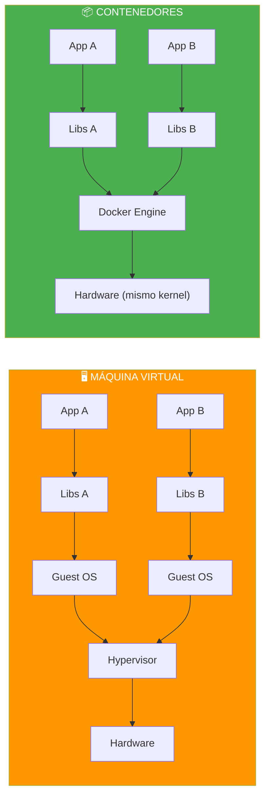
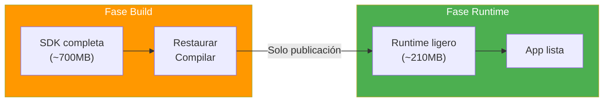
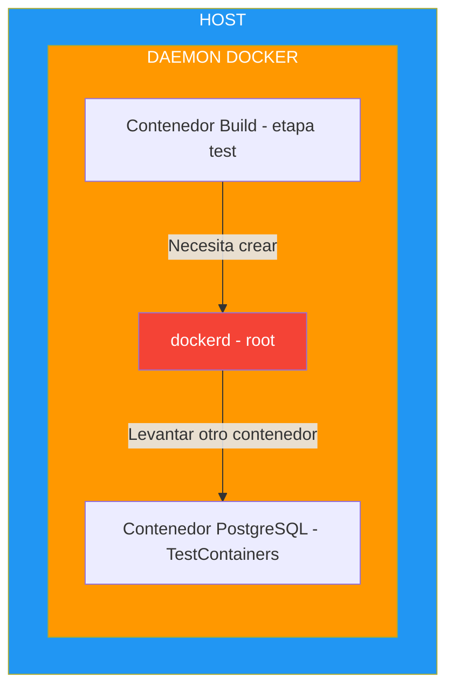
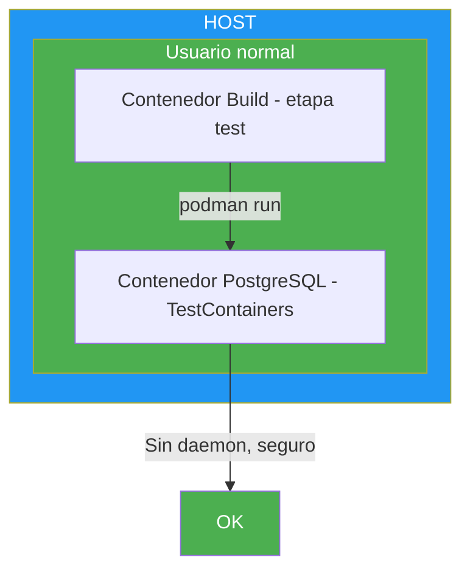

- [23. Docker y Podman: Contenedores y Despliegue](#23-docker-y-podman-contenedores-y-despliegue)
  - [23.1. ¿Qué son los Contenedores?](#231-qué-son-los-contenedores)
  - [23.2. Dockerfile: La Receta](#232-dockerfile-la-receta)
  - [23.3. Comandos Esenciales de Docker](#233-comandos-esenciales-de-docker)
  - [23.4. Docker Compose: Orquestación Local](#234-docker-compose-orquestación-local)
  - [23.5. Volúmenes y Persistencia](#235-volúmenes-y-persistencia)
  - [23.6. Buenas Prácticas en Dockerfiles](#236-buenas-prácticas-en-dockerfiles)
  - [23.7. Infraestructuras y Entorno de Desarrollo](#237-infraestructuras-y-entorno-de-desarrollo)


# 23. Docker y Podman: Contenedores y Despliegue

> 💡 **Punto de partida:** En el tema 09 vimos contenedores a nivel teórico. Ahora vamos a **usarlo**: crear un Dockerfile para tu app .NET, levantar una base de datos con Docker Compose, gestionar volúmenes para persistir datos y aprender los comandos esenciales. Docker es como una "caja mágica" donde empaquetas tu aplicación con todo lo que necesita para funcionar: el runtime, las librerías, la configuración, los datos. Y esa caja funciona igual en tu portátil, en el servidor de la empresa y en la nube. Podman es una alternativa a Docker que usa los mismos Dockerfiles y comandos similares.

En este tema aprenderás a crear Dockerfiles, imágenes, contenedores, volúmenes y a orquestar servicios con Docker Compose (y Podman Compose).

**Objetivos de aprendizaje:**

- Entender la diferencia entre imagen y contenedor
- Crear un Dockerfile para una app .NET
- Dominar los comandos esenciales: build, run, ps, stop, rm, logs
- Usar Docker Compose (o Podman Compose) para levantar varios servicios
- Configurar volúmenes para persistir datos
- Aplicar buenas prácticas: multi-stage build, .dockerignore

## 23.1. ¿Qué son los Contenedores?

Un **contenedor** es una unidad de software empaquetada con todo lo necesario para ejecutarse: código, runtime, librerías, dependencias del sistema. Es más ligero que una máquina virtual porque comparte el kernel del sistema operativo anfitrión.



| Concepto | Definición | Ejemplo |
|----------|-----------|---------|
| **Imagen** | Plantilla inmutable (como una foto) | `mcr.microsoft.com/dotnet/sdk:10.0` |
| **Contenedor** | Instancia en ejecución de una imagen | Un contenedor con tu app ejecutándose |
| **Dockerfile** | Receta de texto para crear una imagen | Instrucciones FROM, COPY, RUN, etc. |
| **Docker Compose** | Orquestación de varios contenedores | App + PostgreSQL + Redis |

> 💡 **Analogía:** Una **imagen** es como el plano de un coche. Un **contenedor** es el coche fabricado a partir de ese plano. Puedes fabricar mil coches (contenedores) del mismo plano (imagen).

📌 **Ejemplo real:** Cuando Netflix despliega una actualización, crea una nueva imagen Docker con la app actualizada. Luego lanza nuevos contenedores con esa imagen y elimina los antiguos. Si algo falla, solo tiene que volver a la imagen anterior.

## 23.2. Dockerfile: La Receta

Un `Dockerfile` es un fichero de texto con las instrucciones para construir una imagen Docker.

### Dockerfile para ASP.NET Core (multi-stage build)

```dockerfile
# === FASE 1: Build ===
FROM mcr.microsoft.com/dotnet/sdk:10.0 AS build
WORKDIR /src

# Copiar csproj y restaurar dependencias (caché de capas)
COPY *.csproj .
RUN dotnet restore

# Copiar todo el código y compilar
COPY . .
RUN dotnet publish -c Release -o /app/publish

# === FASE 2: Runtime ===
FROM mcr.microsoft.com/dotnet/aspnet:10.0 AS runtime
WORKDIR /app

# Copiar solo lo necesario del build
COPY --from=build /app/publish .

# Puerto que expone la app
EXPOSE 5000

# Comando de inicio
ENTRYPOINT ["dotnet", "MiAplicacion.dll"]
```

### Explicación de cada instrucción

| Instrucción | Descripción |
|-------------|-------------|
| `FROM` | Imagen base (el "sistema operativo" del contenedor) |
| `WORKDIR` | Directorio de trabajo (como `cd`) |
| `COPY` | Copiar ficheros del host al contenedor |
| `RUN` | Ejecutar un comando durante la construcción |
| `EXPOSE` | Indicar puertos que la app usa (documentación) |
| `ENTRYPOINT` | Comando que se ejecuta al iniciar el contenedor |
| `CMD` | Comando por defecto (puede ser sobreescrito) |

### Multi-stage build: Por qué es importante



| Sin multi-stage | Con multi-stage |
|----------------|-----------------|
| Imagen final: ~700MB | Imagen final: ~210MB |
| SDK incluida (innecesaria) | Solo runtime |
| Mayor superficie de ataque | Menor superficie de ataque |

## 23.3. Comandos Esenciales de Docker

### Construir y ejecutar

```bash
# Construir una imagen
docker build -t miapp:v1 .

# Ejecutar un contenedor
docker run -d -p 5000:5000 --name miapp miapp:v1

# Ver contenedores en ejecución
docker ps

# Ver todos los contenedores (incluyendo parados)
docker ps -a

# Parar un contenedor
docker stop miapp

# Eliminar un contenedor
docker rm miapp

# Ver logs
docker logs miapp

# Logs en tiempo real
docker logs -f miapp

# Ejecutar un comando dentro del contenedor
docker exec -it miapp /bin/bash
```

### Gestionar imágenes

```bash
# Listar imágenes
docker images

# Eliminar una imagen
docker rmi miapp:v1

# Eliminar todas las imágenes no usadas
docker image prune -a

# Pull de una imagen
docker pull postgres:16
```

### Comandos útiles

```bash
# Inspeccionar un contenedor
docker inspect miapp

# Ver puertos en uso
docker port miapp

# Copiar ficheros del contenedor al host
docker cp miapp:/app/logs/app.txt ./logs/

# Limitar recursos
docker run -d --memory=512m --cpus=1.0 miapp:v1
```

> 💡 **Consejo:** Usa `docker compose` en vez de `docker run` para proyectos con múltiples servicios. Es más fácil de gestionar y documenta la arquitectura.

### Equivalencias con Podman

Podman usa **los mismos Dockerfiles** y comandos casi idénticos (solo cambia `docker` por `podman`):

| Docker | Podman | Descripción |
|--------|--------|-------------|
| `docker build -t miapp:v1 .` | `podman build -t miapp:v1 .` | Construir imagen |
| `docker run -d -p 5000:5000 miapp` | `podman run -d -p 5000:5000 miapp` | Ejecutar contenedor |
| `docker ps` | `podman ps` | Ver contenedores activos |
| `docker ps -a` | `podman ps -a` | Ver todos los contenedores |
| `docker stop miapp` | `podman stop miapp` | Parar contenedor |
| `docker rm miapp` | `podman rm miapp` | Eliminar contenedor |
| `docker logs miapp` | `podman logs miapp` | Ver logs |
| `docker exec -it miapp bash` | `podman exec -it miapp bash` | Entrar al contenedor |
| `docker images` | `podman images` | Listar imágenes |
| `docker rmi miapp:v1` | `podman rmi miapp:v1` | Eliminar imagen |
| `docker pull postgres:16` | `podman pull postgres:16` | Descargar imagen |
| `docker compose up -d` | `podman compose up -d` | Arrancar servicios |

> 📝 **Nota:** Podman es **daemonless** (sin proceso en segundo plano) y **rootless** (sin permisos de administrador) por defecto. Los comandos son casi idénticos a Docker.

## 23.4. Docker Compose: Orquestación Local

**Docker Compose** define y ejecuta múltiples contenedores con un solo fichero YAML.

### docker-compose.yml completo

```yaml
services:
  app:
    build:
      context: .
      dockerfile: Dockerfile
    ports:
      - "5000:5000"
    environment:
      - ASPNETCORE_ENVIRONMENT=Development
      - ConnectionStrings__DefaultConnection=Host=db;Database=miapp;Username=admin;Password=password123
      - Redis__Connection=cache:6379
    depends_on:
      db:
        condition: service_healthy
      cache:
        condition: service_started
    networks:
      - app-network

  db:
    image: postgres:16
    environment:
      POSTGRES_DB: miapp
      POSTGRES_USER: admin
      POSTGRES_PASSWORD: password123
    ports:
      - "5432:5432"
    volumes:
      - pgdata:/var/lib/postgresql/data
    healthcheck:
      test: ["CMD-SHELL", "pg_isready -U admin -d miapp"]
      interval: 10s
      timeout: 5s
      retries: 5
    networks:
      - app-network

  cache:
    image: redis:7-alpine
    ports:
      - "6379:6379"
    volumes:
      - redisdata:/data
    networks:
      - app-network

volumes:
  pgdata:
  redisdata:

networks:
  app-network:
    driver: bridge
```

### Comandos de Docker Compose

```bash
# Levantar todo en segundo plano
docker compose up -d

# Ver el estado
docker compose ps

# Ver logs
docker compose logs -f app

# Parar todo
docker compose down

# Parar y eliminar volúmenes
docker compose down -v

# Reconstruir una imagen
docker compose build app

# Ejecutar un comando en un servicio
docker compose exec db psql -U admin -d miapp
```

### Podman Compose

**Podman Compose** usa el mismo `docker-compose.yml`. Solo cambia el comando:

```bash
# Mismos comandos, cambiando "docker" por "podman"
podman compose up -d
podman compose ps
podman compose logs -f app
podman compose down
podman compose down -v
podman compose build app
podman compose exec db psql -U admin -d miapp
```

> 💡 **Consejo:** Si usas Podman Desktop en Windows, `podman compose` viene incluido. Si usas Linux, instala `podman-compose` con `pip install podman-compose`.

### Dependencias y health checks

```yaml
services:
  app:
    depends_on:
      db:
        condition: service_healthy  # Esperar a que la BD esté lista
      cache:
        condition: service_started

  db:
    healthcheck:
      test: ["CMD-SHELL", "pg_isready -U admin"]
      interval: 10s
      timeout: 5s
      retries: 5
```

> 📝 **Nota:** `depends_on` solo espera a que el contenedor esté **arrancado**, no a que el servicio interno esté listo. Usa `healthcheck` + `condition: service_healthy` para esperar a que la base de datos esté realmente lista para recibir conexiones.

📌 **Ejemplo real:** En un proyecto de clase, `docker compose up -d` levanta tu app en el puerto 5000, PostgreSQL en el 5432 y Redis en el 6379. Todo configurado y listo para desarrollar.

## 23.5. Volúmenes y Persistencia

Los contenedores son **efímeros**: si borras un contenedor, pierdes todos sus datos. Los **volúmenes** guardan datos fuera del contenedor.

### Tipos de volúmenes

| Tipo | Descripción | Comando |
|------|-------------|---------|
| **Named volume** | Gestorado por Docker/Podman | `-v pgdata:/var/lib/postgresql/data` |
| **Bind mount** | Mapea una carpeta del host | `-v /mi/carpeta:/app/data` |
| **Tmpfs** | En memoria (se pierde al parar) | `--tmpfs /app/temp` |

```yaml
services:
  db:
    image: postgres:16
    volumes:
      - pgdata:/var/lib/postgresql/data  # Named volume (persistente)
      - ./init.sql:/docker-entrypoint-initdb.d/init.sql  # Bind mount (init script)

volumes:
  pgdata:  # Declarar el volumen
```

### Backup de volúmenes

```bash
# Crear backup de un volumen
docker run --rm -v pgdata:/data -v $(pwd):/backup alpine \
    tar czf /backup/pgdata-backup.tar.gz -C /data .

# Restaurar un backup
docker run --rm -v pgdata:/data -v $(pwd):/backup alpine \
    tar xzf /backup/pgdata-backup.tar.gz -C /data
```

> ⚠️ **Advertencia:** **NUNCA** guardes datos importantes solo en el contenedor. Si ejecutas `docker compose down -v` (o `podman compose down -v`), los volúmenes se eliminan y los datos se pierden. Usa siempre named volumes para datos persistentes.

## 23.6. Buenas Prácticas en Dockerfiles

### .dockerignore

```
# .dockerignore (evitar copiar ficheros innecesarios)
**/bin/
**/obj/
**/.vs/
**/.idea/
**/node_modules/
**/*.md
**/.git/
**/docker-compose*.yml
**/Dockerfile*
```

### Multi-stage build optimizado

```dockerfile
# Build stage
FROM mcr.microsoft.com/dotnet/sdk:10.0 AS build
WORKDIR /src

# Capa de restauración (se cachea si no cambian los csproj)
COPY *.csproj .
RUN dotnet restore

# Capa de build (se recalcula solo si cambia el código)
COPY . .
RUN dotnet publish -c Release -o /app/publish --no-restore

# Runtime stage
FROM mcr.microsoft.com/dotnet/aspnet:10.0 AS runtime
WORKDIR /app

# Usuario no-root (seguridad)
RUN adduser --disabled-password --gecos "" appuser
USER appuser

COPY --from=build --chown=appuser:appuser /app/publish .
EXPOSE 5000
ENTRYPOINT ["dotnet", "MiAplicacion.dll"]
```

### Variables de entorno en el Dockerfile

```dockerfile
# Configuración por defecto (se puede sobreescribir en docker-compose)
ENV ASPNETCORE_URLS=http://+:5000
ENV ASPNETCORE_ENVIRONMENT=Development
ENV DOTNET_RUNNING_IN_CONTAINER=true
```

> 💡 **Consejo:** Para el examen, recuerda las 3 capas de caché en Docker/Podman: **imágenes base** (FROM), **restauración de dependencias** (COPY csproj + RUN restore) y **build** (COPY código + RUN publish). Si no cambian los csproj, se reutiliza la caché de la capa de restauración.

## 23.7. Infraestructuras y Entorno de Desarrollo

### ¿Dónde se usan Docker y Podman?

Docker y Podman son **técnicamente equivalentes**. Ambos usan los mismos Dockerfiles, los mismos `docker-compose.yml` y los mismos comandos (solo cambia `docker` por `podman`). El formato de contenedor es el mismo (estándar OCI): una imagen creada con Docker funciona con Podman y viceversa.

| Plataforma | Docker | Podman |
|------------|:------:|:------:|
| **Windows** | Docker Desktop (WSL2) | Podman Desktop (WSL2) |
| **macOS** | Docker Desktop (VM) | Podman Machine (VM) |
| **Linux** | Docker Engine (nativo) | Podman (nativo, rootless) |
| **AWS** | ✅ ECS, EKS, EC2 | ✅ ECS, EKS, EC2 |
| **Azure** | ✅ ACI, AKS | ✅ ACI, AKS |
| **Google Cloud** | ✅ Cloud Run, GKE | ✅ Cloud Run, GKE |
| **Kubernetes** | ✅ Orquesta contenedores | ✅ Orquesta contenedores |
| **GitHub Actions** | ✅ `docker build` | ✅ `podman build` |
| **GitLab CI/CD** | ✅ Docker executor | ✅ Podman executor |
| **JetBrains Rider** | ✅ Plugin integrado | ✅ Mismo plugin |

### ¿Cuál usa el mercado?

En la práctica, **Docker domina el mercado** (~80% de cuota), pero ambos son válidos:

| | Docker | Podman |
|--|:------:|:------:|
| **Cuota de mercado** | ~80% (líder indiscutible) | ~20% y creciendo |
| **Ninguna empresa rechaza** | ✅ Conocimiento válido | ✅ Conocimiento válido |
| **Razón principal de elección** | Comunidad, documentación, ecosistema | Licencia gratuita para empresas grandes |

**¿Por qué Podman en empresas?** La razón principal es **económica**: Docker Desktop cobra licencia a empresas con más de 250 empleados o ingresos superiores a $10M. Podman es 100% gratis y open source. Empresas como Red Hat, IBM y Google usan Podman por esto.

**¿Por qué Docker sigue dominando?** Comunidad, documentación y habitad. Si buscas "docker" en Google, hay millones de resultados. Cada tutorial, cada curso y cada respuesta de Stack Overflow usa Docker.

> 📝 **Nota:** Para este módulo, **ambos son equivalentes**. Ninguna empresa te preguntará si usaste Docker o Podman en tus proyectos. Lo que importa es que sepas crear Dockerfiles, orquestar con Compose y desplegar contenedores. Si sabes Docker, sabes Podman con un `alias docker=podman`.

### Docker y Podman en JetBrains Rider

Rider usa **el mismo plugin** para Docker y Podman. No necesitas instalar nada adicional:


**Para conectar Docker:**
1. `Ctrl+Alt+S` → `Build, Execution, Deployment` → `Docker`
2. Seleccionar tu conexión Docker
3. Aparecerá en la ventana `Services` (`Alt+8`)


**Para conectar Podman:**
1. `Ctrl+Alt+S` → `Build, Execution, Deployment` → `Docker`
2. Seleccionar **Podman** en la lista de conexiones
3. Elegir tu Podman machine


> 💡 **Consejo:** En Rider, tanto Docker como Podman se gestionan desde la misma ventana de `Services` (`Alt+8`). Puedes ver contenedores, imágenes, volúmenes y redes de ambos sin cambiar de herramienta.

### Añadir soporte Docker/Podman a un proyecto .NET

En Rider puedes añadir soporte de contenedores a tu proyecto con clic derecho:

- **Dockerfile:** Clic derecho en el proyecto → `Add` → `Dockerfile`
- **Docker Compose:** Clic derecho en el proyecto → `Add` → `Docker Compose File`

Rider genera automáticamente el Dockerfile multi-etapa y el `.dockerignore` optimizados para tu proyecto .NET.

📌 **Ejemplo real:** Netflix, Amazon y Google usan contenedores (Docker o Podman) para desplegar miles de servicios diariamente. La elección entre uno u otro depende del ecosistema del centro o la empresa, no de funcionalidad.

> 🔧 **Truco:** Si vienes de Docker y quieres probar Podman, solo necesitas `alias docker=podman` en Linux. En Windows, instala Podman Desktop y los comandos son idénticos.

### Docker-in-Docker: Tests dentro de un contenedor

Cuando un Dockerfile tiene una etapa de `dotnet test` y esos tests usan TestContainers, se produce un **Docker-in-Docker**: un contenedor intenta crear otros contenedores.



**El problema:** Para que esto funcione con Docker, necesitas exponer el daemon en el puerto `2375 without TLS`. Esto abre una vulnerabilidad de seguridad porque cualquier proceso en la máquina puede enviar comandos al daemon (equivalente a root).

**La solución con Podman:** Podman es daemonless. No hay proceso central que exponer:



> ⚠️ **Advertencia:** Con Docker, ejecutar tests dentro de un contenedor requiere exponer el daemon en el puerto `2375 without TLS`. Con **Podman**, no hay daemon que exponer: cada contenedor es un proceso independiente del usuario, sin riesgo de seguridad.

---

**Resumen del punto:**

| Concepto | Descripción |
|----------|-------------|
| **Contenedor** | Unidad de software empaquetada con código + dependencias + runtime |
| **Imagen** | Plantilla inmutable para crear contenedores |
| **Dockerfile** | Receta de texto con instrucciones FROM, COPY, RUN, etc. |
| **Multi-stage build** | Fase build + fase runtime para imágenes ligeras |
| **Docker Compose** | Orquestación de varios contenedores con YAML |
| **Podman Compose** | Alternativa a Docker Compose, mismo formato YAML |
| **Volúmenes** | Persistencia de datos fuera del contenedor |
| **Named volume** | Volumen gestionado por Docker (recomendado) |
| **Bind mount** | Mapeo de carpeta del host al contenedor |
| **Health check** | Comprobar que un servicio está listo |
| **.dockerignore** | Ficheros excluidos del contexto de construcción |
| **Docker/Podman en Rider** | Mismo plugin, ventana Services (`Alt+8`) |

**¿Qué viene después?**

En el siguiente punto veremos seguridad: autenticación, autorización, JWT, hashing de contraseñas, CORS y OWASP Top 10.

