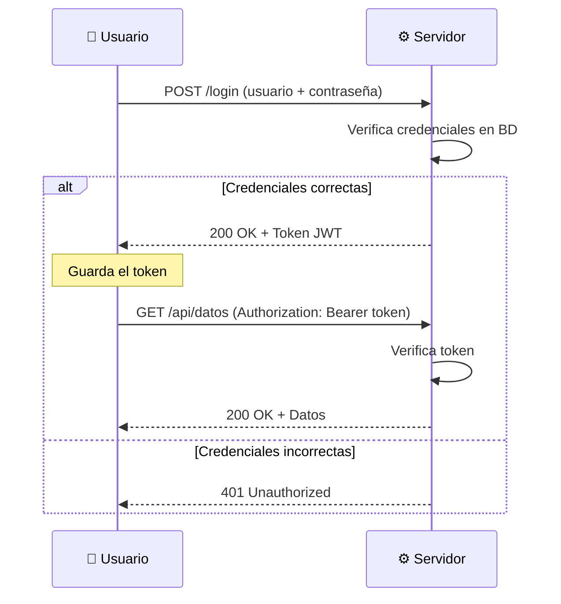
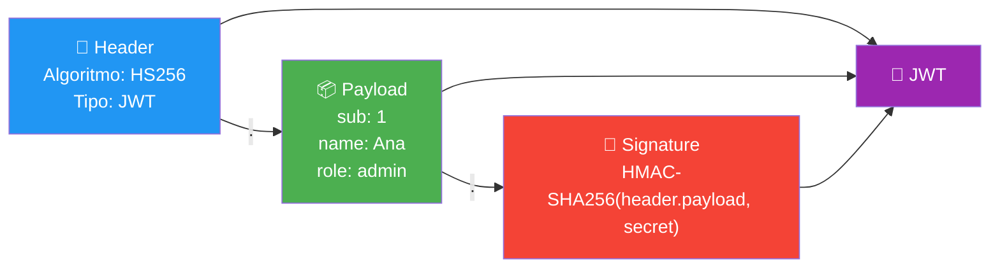
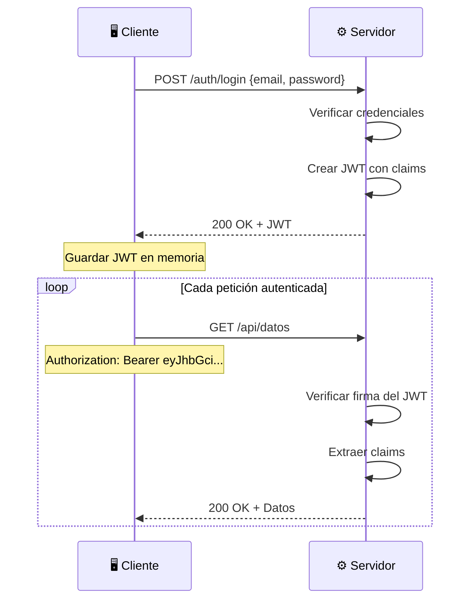
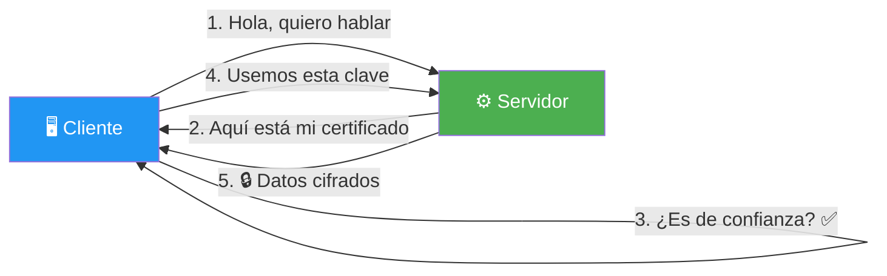

- [24. Seguridad en Aplicaciones Web](#24-seguridad-en-aplicaciones-web)
  - [24.1. Autenticación: ¿Quién Eres?](#241-autenticación-quién-eres)
  - [24.2. Autorización: ¿Qué Puedes Hacer?](#242-autorización-qué-puedes-hacer)
  - [24.3. JWT: Estructura y Flujo](#243-jwt-estructura-y-flujo)
  - [24.4. Hashing de Contraseñas: BCrypt](#244-hashing-de-contraseñas-bcrypt)
  - [24.5. CORS: Orígenes Permitidos](#245-cors-orígenes-permitidos)
  - [24.6. HTTPS: Comunicación Segura](#246-https-comunicación-segura)
  - [24.7. OWASP Top 10](#247-owasp-top-10)


# 24. Seguridad en Aplicaciones Web

> 💡 **Punto de partida:** Tu app funciona, pero... ¿es segura? ¿Alguien puede adivinar las contraseñas? ¿Puede un atacante enviar código malicioso en un formulario? ¿Qué pasa si interceptan las peticiones? La seguridad no es un "extra": es un requisito fundamental. Vamos a ver las principales amenazas y cómo proteger nuestra aplicación con autenticación, autorización, JWT, hashing, CORS y HTTPS.

En este tema profundizarás en seguridad web: autenticación vs autorización, JWT (estructura y flujo), hashing con BCrypt, CORS, HTTPS y el OWASP Top 10.

**Objetivos de aprendizaje:**

- Distinguir autenticación de autorización
- Entender la estructura y flujo de JWT
- Hashear contraseñas con BCrypt (nunca almacenar en texto plano)
- Configurar CORS para permitir orígenes específicos
- Entender HTTPS y los certificados SSL/TLS
- Conocer el OWASP Top 10 y las principales amenazas

## 24.1. Autenticación: ¿Quién Eres?

La **autenticación** verifica la identidad de un usuario. "¿Quién eres?"



### Métodos de autenticación

| Método | Descripción | Seguridad | Cuándo usar |
|--------|-------------|-----------|-------------|
| **Session/Cookie** | ID de sesión en cookie del servidor | Alta | Web apps tradicionales |
| **JWT** | Token firmado con datos del usuario | Alta | APIs REST, SPA, móviles |
| **OAuth 2.0** | Login con Google, GitHub, etc. | Muy alta | SSO, apps de terceros |
| **API Key** | Clave estática en cabecera | Media | APIs internas |

### Ejemplo de autenticación con JWT

```csharp
// Program.cs: Configurar autenticación JWT
builder.Services.AddAuthentication("Bearer")
    .AddJwtBearer(options =>
    {
        options.TokenValidationParameters = new()
        {
            ValidateIssuer = true,
            ValidateAudience = true,
            ValidateLifetime = true,
            ValidateIssuerSigningKey = true,
            ValidIssuer = "https://miapp.com",
            ValidAudience = "https://miapp.com",
            IssuerSigningKey = new SymmetricSecurityKey(
                Encoding.UTF8.GetBytes(builder.Configuration["JwtSettings:SecretKey"]!))
        };
    });

builder.Services.AddAuthorization();

var app = builder.Build();

app.UseAuthentication();
app.UseAuthorization();

// Endpoint público
app.MapGet("/", () => "¡Bienvenido!");

// Endpoint protegido
app.MapGet("/api/datos-privados", () =>
{
    return new { Mensaje = "Estos son datos privados", Fecha = DateTime.Now };
}).RequireAuthorization();
```

> 📝 **Nota:** `UseAuthentication()` debe ir **antes** de `UseAuthorization()` en el pipeline de middleware. Si los pones al revés, la autorización no funcionará porque no sabe quién es el usuario.

## 24.2. Autorización: ¿Qué Puedes Hacer?

La **autorización** determina qué puede hacer un usuario una vez autenticado. "¿Qué permisos tienes?"

### RBAC: Role-Based Access Control

```csharp
// Configurar políticas de autorización
builder.Services.AddAuthorization(options =>
{
    options.AddPolicy("AdminOnly", policy =>
        policy.RequireRole("Admin"));

    options.AddPolicy("AdminOrManager", policy =>
        policy.RequireRole("Admin", "Manager"));

    options.AddPolicy("MinAge18", policy =>
        policy.RequireClaim("age", claim =>
        {
            var value = claim.Value;
            return int.TryParse(value, out int age) && age >= 18;
        }));
});

// Usar en endpoints
app.MapGet("/api/admin/usuarios", () =>
{
    return new { Lista = "Todos los usuarios" };
}).RequireAuthorization("AdminOnly");

app.MapGet("/api/ventas", () =>
{
    return new { Ventas = "Datos de ventas" };
}).RequireAuthorization("AdminOrManager");

app.MapGet("/api/servicios-adultos", () =>
{
    return new { Contenido = "Contenido +18" };
}).RequireAuthorization("MinAge18");
```

### Autorización por claims personalizados

```csharp
// Endpoint que comprueba el nombre del usuario
app.MapGet("/api/perfil/{nombre}", (string nombre, ClaimsPrincipal user) =>
{
    var nombreUsuario = user.FindFirst(ClaimTypes.Name)?.Value;
    if (nombreUsuario != nombre)
        return Results.Forbid();

    return Results.Ok(new { Perfil = $"Bienvenido, {nombre}" });
}).RequireAuthorization();
```

> ⚠️ **Advertencia:** La autorización **no sustituye** a la autenticación. Siempre primero autenticas (`UseAuthentication`), luego autorizas (`UseAuthorization`). Un usuario no autenticado no tiene claims que comprobar.

## 24.3. JWT: Estructura y Flujo

Un **JWT** (JSON Web Token) es un token firmado que contiene datos del usuario. Tiene tres partes: `HEADER.PAYLOAD.SIGNATURE`.

### Estructura



| Parte | Contenido | Ejemplo |
|-------|-----------|---------|
| **Header** | Algoritmo de firma y tipo | `{"alg":"HS256","typ":"JWT"}` |
| **Payload** | Claims (datos del usuario) | `{"sub":1,"name":"Ana","role":"admin","exp":1757164800}` |
| **Signature** | Firma para verificar integridad | `HMAC-SHA256(base64(header)+"."+base64(payload), secret)` |

### Flujo completo



### Generar JWT en C#

```csharp
using Microsoft.IdentityModel.Tokens;
using System.IdentityModel.Tokens.Jwt;
using System.Security.Claims;

public string GenerarToken(int userId, string email, string role)
{
    var key = new SymmetricSecurityKey(
        Encoding.UTF8.GetBytes(_jwtSettings.SecretKey));
    var credentials = new SigningCredentials(key, SecurityAlgorithms.HmacSha256);

    var claims = new[]
    {
        new Claim(ClaimTypes.NameIdentifier, userId.ToString()),
        new Claim(ClaimTypes.Email, email),
        new Claim(ClaimTypes.Role, role),
        new Claim(JwtRegisteredClaimNames.Jti, Guid.NewGuid().ToString())
    };

    var token = new JwtSecurityToken(
        issuer: _jwtSettings.Issuer,
        audience: _jwtSettings.Audience,
        claims: claims,
        expires: DateTime.UtcNow.AddMinutes(_jwtSettings.ExpirationMinutes),
        signingCredentials: credentials
    );

    return new JwtSecurityTokenHandler().WriteToken(token);
}
```

> ⚠️ **Advertencia:** **NUNCA** guardes datos sensibles en el payload de un JWT (contraseñas, números de tarjeta). El payload se puede **leer** (aunque no modificar sin la firma). Guarda solo datos no sensibles: ID, nombre, rol.

📌 **Ejemplo real:** Cuando haces login en Spotify, el servidor genera un JWT con tu ID y tipo de cuenta (free/premium). Cada vez que Spotify reproduce una canción, envía ese JWT para verificar que tienes derecho a escucharla.

## 24.4. Hashing de Contraseñas: BCrypt

**NUNCA** almacenes contraseñas en texto plano. Usa **hashing** con un algoritmo seguro como **BCrypt**.

### Instalación

```bash
dotnet add package BCrypt.Net-Next
```

### Hashear y verificar

```csharp
using BCrypt.Net;

public class PasswordService
{
    // Hashear contraseña (para guardar en BD)
    public string HashPassword(string password)
    {
        return BCrypt.Net.BCrypt.HashPassword(password);
        // Genera algo como: $2a$11$LJ3m4ks1e4z1w5x5z5x5z...
    }

    // Verificar contraseña (para login)
    public bool VerifyPassword(string password, string hashedPassword)
    {
        return BCrypt.Net.BCrypt.Verify(password, hashedPassword);
        // Compara la contraseña con el hash almacenado
    }
}
```

### Ejemplo completo con registro y login

```csharp
public class AuthService(IPersonaRepository repository, PasswordService passwordService, TokenService tokenService) : IAuthService
{
    public async Task<Result<string>> RegisterAsync(string nombre, string email, string password)
    {
        // Verificar si el email ya existe
        if (await repository.GetByEmailAsync(email) is not null)
            return Result.Failure<string>("El email ya está registrado");

        // Hashear la contraseña
        string hashedPassword = passwordService.HashPassword(password);

        // Guardar usuario
        var persona = new Persona
        {
            Nombre = nombre,
            Email = email,
            PasswordHash = hashedPassword
        };

        await repository.AddAsync(persona);

        // Generar token
        string token = tokenService.GenerarToken(persona.Id, persona.Email, "User");
        return Result.Success(token);
    }

    public async Task<Result<string>> LoginAsync(string email, string password)
    {
        // Buscar usuario
        var persona = await repository.GetByEmailAsync(email);
        if (persona is null)
            return Result.Failure<string>("Credenciales incorrectas");

        // Verificar contraseña
        if (!passwordService.VerifyPassword(password, persona.PasswordHash))
            return Result.Failure<string>("Credenciales incorrectas");

        // Generar token
        string token = _tokenService.GenerarToken(persona.Id, persona.Email, "User");
        return Result.Success(token);
    }
}
```

> 💡 **Consejo:** BCrypt genera un salt (valor aleatorio) automáticamente. No necesitas gestionar el salt manualmente. Cada vez que hasheas la misma contraseña, obtienes un hash diferente (por el salt), pero `Verify` lo comprueba correctamente.

📌 **Ejemplo real:** Cuando Instagram guarda tu contraseña, la hashea con BCrypt. Cuando haces login, hashea la contraseña que introduces y la compara con el hash almacenado. Si coinciden, ¡accesas! Si no, "credenciales incorrectas".

## 24.5. CORS: Orígenes Permitidos

**CORS** (Cross-Origin Resource Sharing) controla qué dominios pueden acceder a tu API. Sin CORS, un script malicioso en `evil.com` no podría hacer peticiones a `tudominio.com`.

### Configuración

```csharp
// Program.cs
builder.Services.AddCors(options =>
{
    options.AddPolicy("PermitirFrontend", policy =>
    {
        policy.WithOrigins("http://localhost:3000", "https://miapp.com") // Orígenes permitidos
              .AllowAnyHeader()                                            // Cualquier cabecera
              .AllowAnyMethod()                                            // GET, POST, PUT, DELETE
              .AllowCredentials();                                         // Con cookies
    });
});

// Aplicar CORS (antes de UseAuthorization)
app.UseCors("PermitirFrontend");
```

### Políticas CORS

```csharp
// Permitir todos (solo desarrollo)
builder.Services.AddCors(options =>
{
    options.AddPolicy("AllowAll", policy =>
    {
        policy.AllowAnyOrigin()
              .AllowAnyHeader()
              .AllowAnyMethod();
    });
});

// Solo orígenes específicos
builder.Services.AddCors(options =>
{
    options.AddPolicy("Production", policy =>
    {
        policy.WithOrigins("https://miapp.com", "https://www.miapp.com")
              .WithHeaders("Authorization", "Content-Type")
              .WithMethods("GET", "POST", "PUT", "DELETE");
    });
});
```

> ⚠️ **Advertencia:** **NUNCA** uses `AllowAnyOrigin()` en producción. Eso permite que cualquier sitio web haga peticiones a tu API. Usa siempre orígenes específicos.

| Cabecera CORS | Descripción |
|---------------|-------------|
| `Access-Control-Allow-Origin` | Orígenes permitidos |
| `Access-Control-Allow-Methods` | Métodos HTTP permitidos |
| `Access-Control-Allow-Headers` | Cabeceras permitidas |
| `Access-Control-Allow-Credentials` | Permitir cookies |
| `Access-Control-Max-Age` | Tiempo de caché del preflight |

## 24.6. HTTPS: Comunicación Segura

**HTTPS** es HTTP con cifrado SSL/TLS. La "S" significa **Secure**.



| HTTP | HTTPS |
|------|-------|
| Puerto 80 | Puerto 443 |
| Datos en texto plano | Datos cifrados (SSL/TLS) |
| Google lo marca "No seguro" | Google lo marca "Seguro" |

### Configurar HTTPS en ASP.NET Core

```csharp
// Program.cs
var builder = WebApplication.CreateBuilder(args);

// Redirigir HTTP a HTTPS
builder.Services.AddHttpsRedirection(options =>
{
    options.RedirectStatusCode = StatusCodes.Status307TemporaryRedirect;
    options.HttpsPort = 443;
});

var app = builder.Build();

app.UseHttpsRedirection();
```

> 💡 **Consejo:** Para desarrollo local, usa `dotnet dev-certs https` para generar un certificado autofirmado. En producción, usa Let's Encrypt (gratuito) o un certificado comercial.

## 24.7. OWASP Top 10

El **OWASP Top 10** es la lista de las 10 vulnerabilidades de seguridad más comunes en aplicaciones web.

| # | Vulnerabilidad | Descripción | Cómo prevenirla |
|---|---------------|-------------|-----------------|
| **A01** | Broken Access Control | Acceso no autorizado a recursos | Autorización en cada endpoint |
| **A02** | Cryptographic Failures | Datos sensibles mal protegidos | Cifrado en reposo y tránsito |
| **A03** | Injection | Inyección de código (SQL, XSS) | Validación + parametrización |
| **A04** | Insecure Design | Diseño sin seguridad | Threat modeling |
| **A05** | Security Misconfiguration | Configuración por defecto insegura | Hardening + configuración mínima |
| **A06** | Vulnerable Components | Librerías con CVEs conocidos | `dotnet list package --vulnerable` |
| **A07** | Auth Failures | Autenticación débil | MFA + rate limiting |
| **A08** | Data Integrity Failures | Fallo en verificación de datos | Firmas digitales |
| **A09** | Logging Failures | Logs insuficientes | Logging estructurado |
| **A10** | SSRF | Server-Side Request Forgery | Validar URLs de destino |

### Ejemplos de prevención

```csharp
// A03: SQL Injection — USAR PARÁMETROS, NUNCA CONCATENAR
// ❌ MALO
var query = $"SELECT * FROM Usuarios WHERE Email = '{email}'";

// ✅ BUENO
var query = "SELECT * FROM Usuarios WHERE Email = @Email";
command.Parameters.AddWithValue("@Email", email);

// A03: XSS — SANITIZAR ENTRADAS
// ❌ MALO: Permitir HTML
string input = "<script>alert('hacked')</script>";

// ✅ BUENO: Sanitizar
using System.Net;
string safe = WebUtility.HtmlEncode(input);

// A07: Rate Limiting
builder.Services.AddRateLimiter(options =>
{
    options.AddFixedWindowLimiter("fixed", opt =>
    {
        opt.Window = TimeSpan.FromMinutes(1);
        opt.PermitLimit = 100; // Máximo 100 peticiones por minuto
    });
});
```

> 💡 **Consejo:** Para el examen, recuerda los 3 pilares de la seguridad web: **Confidencialidad** (solo los autorizados ven los datos), **Integridad** (los datos no se modifican), **Disponibilidad** (el servicio está accesible). Y la regla de oro: **NUNCA confíes en el cliente**.

---

**Resumen del punto:**

| Concepto | Descripción |
|----------|-------------|
| **Autenticación** | Verificar la identidad del usuario (¿quién eres?) |
| **Autorización** | Determinar qué puede hacer (¿qué permisos tienes?) |
| **JWT** | Token firmado con datos del usuario (Header.Payload.Signature) |
| **BCrypt** | Algoritmo de hashing seguro para contraseñas |
| **CORS** | Control de orígenes permitidos para peticiones HTTP |
| **HTTPS** | HTTP con cifrado SSL/TLS |
| **OWASP Top 10** | Las 10 vulnerabilidades web más comunes |
| **SQL Injection** | Inyección de código SQL, se previene con parámetros |
| **XSS** | Cross-Site Scripting, se previene sanitizando entradas |
| **Rate Limiting** | Limitar peticiones por usuario/timeframe |

En el siguiente punto veremos un resumen de la Parte 2 y cómo todo conecta con ASP.NET Core en la Unidad 02.
