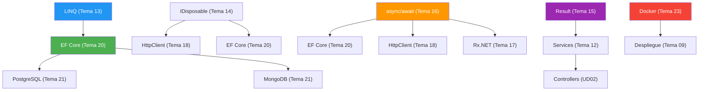
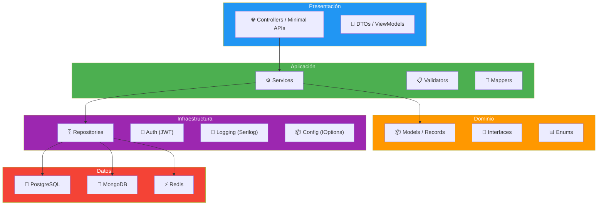
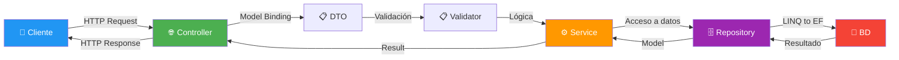

- [25. Resumen de la Parte 2 y Conexión con ASP.NET Core](#25-resumen-de-la-parte-2-y-conexión-con-aspnet-core)
  - [25.1. Recapitulación: Lo que Hemos Aprendido](#251-recapitulación-lo-que-hemos-aprendido)
  - [25.2. El Camino Recorrido](#252-el-camino-recorrido)
  - [25.3. Conexión con ASP.NET Core (UD02)](#253-conexión-con-aspnet-core-ud02)
  - [25.4. Qué Veremos en la Siguiente Unidad](#254-qué-veremos-en-la-siguiente-unidad)
  - [25.5. Consejos para el Examen](#255-consejos-para-el-examen)

# 25. Resumen de la Parte 2 y Conexión con ASP.NET Core

> 💡 **Punto de partida:** Has llegado al final de la Parte 2 de la asignatura. Has aprendido desde LINQ hasta Docker, pasando por programación funcional, concurrencia, bases de datos y seguridad. Pero... ¿cómo encaja todo esto? ¿Cuándo usar cada cosa? En este resumen conectaremos los puntos y prepararemos el camino para ASP.NET Core, el framework que usaremos en la Unidad 02.

En este tema haremos una recapitulación completa de la Parte 2, veremos cómo todo se conecta con ASP.NET Core y prepararemos lo que veremos en la siguiente unidad.

**Objetivos de aprendizaje:**

- Repasar los conceptos clave de los temas 14-24
- Entender cómo se conectan con ASP.NET Core
- Conocer qué veremos en la Unidad 02
- Preparar la base para el desarrollo web en servidor

## 25.1. Recapitulación: Lo que Hemos Aprendido

La Parte 2 ha sido un viaje por las tecnologías fundamentales del desarrollo backend en C#:

### Tabla resumen de temas

| Tema | Concepto clave | En una frase |
|------|---------------|--------------|
| **14. Ficheros** | IDisposable, System.IO, CSV, JSON | Guardar y leer datos de forma segura |
| **15. Result** | CSharpFunctionalExtensions | Manejar errores sin excepciones |
| **16. Concurrencia** | async/await, Task, CancellationToken | No bloquear el hilo mientras esperas |
| **17. Reactiva** | Rx.NET, IObservable, IAsyncEnumerable | Flujos de datos continuos |
| **18. APIs** | HttpClient, Refit, Polly | Consumir APIs externas de forma robusta |
| **19. Configuración** | appsettings.json, Serilog | Configurar y monitorizar la app |
| **20. EF Core** | DbContext, Migraciones, LINQ | Trabajar con bases de datos como C# |
| **21. SQL/NoSQL** | PostgreSQL, MongoDB, Redis | Elegir la BD correcta para cada caso |
| **22. Testing** | NUnit, FluentAssertions, Moq | Tests profesionales y mantenibles |
| **23. Docker** | Dockerfile, Compose, Volúmenes | Empaquetar y desplegar la app |
| **24. Seguridad** | JWT, BCrypt, CORS, OWASP | Proteger la app de amenazas |

### Skills adquiridos

```mermaid
graph TD
    A["🧠 Skills Parte 2"] --> B["📁 Datos"]
    A --> C["🔄 Asíncrono"]
    A --> D["🗄️ Persistencia"]
    A --> E["🧪 Calidad"]
    A --> F["🚀 Despliegue"]
    A --> G["🔒 Seguridad"]

    B --> B1["Leer/escribir ficheros"]
    B --> B2["CSV, JSON"]
    B --> B3["Manejar errores"]

    C --> C1["async/await"]
    C --> C2["Task, CancellationToken"]
    C --> C3["Programación reactiva"]

    D --> D1["EF Core"]
    D --> D2["PostgreSQL, MongoDB"]
    D --> D3["Redis (caché)"]

    E --> E1["NUnit, Moq"]
    E --> E2["FluentAssertions"]
    E --> E3["TestContainers"]

    F --> F1["Docker"]
    F --> F2["Docker Compose"]
    F --> F3["CI/CD"]

    G --> G1["JWT, BCrypt"]
    G --> G2["CORS, HTTPS"]
    G --> G3["OWASP Top 10"]

    style A fill:#4CAF50,color:#fff
    style B fill:#2196F3,color:#fff
    style C fill:#FF9800,color:#fff
    style D fill:#9C27B0,color:#fff
    style E fill:#f44336,color:#fff
    style F fill:#607D8B,color:#fff
    style G fill:#E91E63,color:#fff
```

> 💡 **Analogía:** La Parte 2 es como la caja de herramientas de un albañil. Cada herramienta (tema) sirve para algo específico: el llave inglesa (LINQ), el taladro (async/await), el nivel (EF Core)... ASP.NET Core es como construir la casa usando todas esas herramientas juntas.

## 25.2. El Camino Recorrido

### Primera Parte (Temas 01-13): Fundamentos

| Tema | Qué vimos |
|------|-----------|
| 01-03 | Arquitectura web, componentes, protocolos HTTP |
| 04-06 | HTTP, APIs REST, web dinámica |
| 07-09 | Lenguajes, frameworks, servidores, despliegue |
| 10-11 | Seguridad básica, Inyección de Dependencias |
| 12-13 | Patrones arquitectónicos, LINQ |

### Segunda Parte (Temas 14-24): Tecnologías Backend

| Tema | Qué vimos |
|------|-----------|
| 14-15 | Ficheros, formatos, programación funcional |
| 16-17 | Concurrencia, asíncrono, Rx.NET |
| 18-19 | APIs, configuración, logging |
| 20-21 | EF Core, bases de datos SQL y NoSQL |
| 22-23 | Testing, Docker |
| 24 | Seguridad avanzada |

### Conexión entre temas

> 📝 **Nota:** Cada tema de la Parte 2 es una pieza del puzzle. ASP.NET Core es el marco que une todas las piezas. En la Unidad 02 verás cómo todo se integra en un framework completo.

## 25.3. Conexión con ASP.NET Core (UD02)

ASP.NET Core es el framework de Microsoft para desarrollar aplicaciones web y APIs. Usa **todas** las tecnologías que hemos visto:

### Cómo se conecta cada tema con ASP.NET Core

| Tema | En ASP.NET Core |
|------|----------------|
| **LINQ (13)** | Consultas en EF Core, filtros en controllers |
| **Ficheros (14)** | Upload/download de ficheros, configuration |
| **Result (15)** | Manejo de errores en endpoints |
| **Concurrencia (16)** | `async` en controllers y servicios |
| **Rx.NET (17)** | WebSockets, Server-Sent Events |
| **Refit/Polly (18)** | Clientes HTTP para APIs externas |
| **Configuración (19)** | `appsettings.json`, `IOptions<T>` |
| **Logging (19)** | `ILogger<T>`, Serilog |
| **EF Core (20)** | `DbContext`, Migraciones, LINQ to Entities |
| **SQL/NoSQL (21)** | Repositories con Dapper, MongoDB, Redis |
| **Testing (22)** | Tests de controllers y servicios |
| **Docker (23)** | Dockerfile, Docker Compose para despliegue |
| **Seguridad (24)** | JWT, autenticación, autorización, CORS |

### Arquitectura típica de una app ASP.NET Core

📌 **Ejemplo real:** Un endpoint de "obtener perfil de usuario" usa: `async/await` (Tema 16) para no bloquear, `EF Core` (Tema 20) para consultar la BD, `LINQ` (Tema 13) para filtrar, `JWT` (Tema 24) para verificar quién es, `Serilog` (Tema 19) para logear, y `FluentAssertions` (Tema 22) en los tests.

## 25.4. Qué Veremos en la Siguiente Unidad

La Unidad 02 se llama **"Desarrollo de APIs REST con ASP.NET Core"** y es donde todo cobra sentido:

### Temas de la UD02

| Tema | Contenido |
|------|-----------|
| **26. Introducción a ASP.NET Core** | Pipeline, middleware, routing, minimal APIs |
| **27. Controllers y Endpoints** | Controladores, atributos, model binding |
| **28. Model Binding y Validación** | DTOs, Data Annotations, FluentValidation |
| **29. Dependency Injection en ASP.NET** | Registro, ciclos de vida, resolución |
| **30. Entity Framework Core en ASP.NET** | DbContext, repositorios, migraciones |
| **31. Autenticación y Autorización** | JWT, OAuth, policies |
| **32. Logging y Monitorización** | Serilog, Health Checks, Métricas |
| **33. Testing de APIs** | Tests de integración, WebApplicationFactory |
| **34. Documentación: Swagger/OpenAPI** | Swashbuckle, documentación automática |
| **35. Despliegue** | Docker, Azure, publicación |

### Flujo de trabajo en ASP.NET Core

> 💡 **Consejo:** ASP.NET Core es "solo" el pegamento que une todas las tecnologías que has aprendido. Si entiendes la Parte 2, la Unidad 02 será mucho más fácil. Lo nuevo será el framework web: pipeline, middleware, routing, model binding.

## 25.5. Consejos para el Examen

### Conceptos clave para recordar

| Concepto | Pregunta típica | Respuesta breve |
|----------|----------------|-----------------|
| **IDisposable** | ¿Cuándo usar `using`? | Siempre con recursos que implementan IDisposable |
| **async/await** | ¿Qué hace `await`? | Pausa el método sin bloquear el hilo |
| **Task vs async void** | ¿Cuándo usar async void? | Solo en eventos de UI, nunca en servicios |
| **Result\<T\>** | ¿Cuándo usar Result vs excepciones? | Result para errores esperados, excepciones para inesperados |
| **EF Core** | ¿Qué es Include? | Carga relaciones (Eager Loading) |
| **CORS** | ¿Qué controla? | Qué dominios pueden acceder a tu API |
| **JWT** | ¿Cuántas partes tiene? | 3: Header, Payload, Signature |
| **BCrypt** | ¿Por qué no MD5? | BCrypt es resistente a rainbow tables |
| **Docker** | ¿Diferencia imagen vs contenedor? | Imagen = plantilla, Contenedor = instancia |
| **TestContainers** | ¿Qué hace? | Lanza Docker reales para tests de integración |

### Errores comunes a evitar

1. ❌ Usar `.Result` o `.Wait()` en vez de `await`
2. ❌ `async void` en servicios (usar `async Task`)
3. ❌ Almacenar contraseñas en texto plano (usar BCrypt)
4. ❌ Concatenar strings en SQL (usar parámetros)
5. ❌ Crear `HttpClient` directamente (usar `IHttpClientFactory`)
6. ❌ No usar `Include` en EF Core (N+1 problem)
7. ❌ `AllowAnyOrigin()` en CORS producción
8. ❌ Guardar secretos en `appsettings.json` (usar User Secrets)
9. ❌ No usar `CancellationToken` en métodos asíncronos
10. ❌ No rotar logs (el disco se llena)

### Para el examen práctico

> 💡 **Consejo:** Siempre sigue el flujo: **Análisis → Diseño → Codificación → Tests**. No empieces a codificar sin saber qué quieres hacer. Primero el papel, luego el código.

---

**Resumen del punto:**

| Concepto | Descripción |
|----------|-------------|
| **Parte 2** | Tecnologías backend: ficheros, asíncrono, BD, testing, Docker, seguridad |
| **ASP.NET Core** | Framework que integra todas estas tecnologías |
| **Arquitectura** | Controllers → Services → Repositories → BD |
| **UD02** | Desarrollo de APIs REST con ASP.NET Core |
| **Examen** | Practicar cada concepto: async, EF Core, JWT, Docker |

---

Has completado la Parte 2 del módulo de Desarrollo Web en Entorno Servidor. Ahora tienes las herramientas necesarias para desarrollar aplicaciones web robustas, seguras y mantenibles. En la Unidad 02, todo esto cobra sentido cuando lo integramos en ASP.NET Core para crear APIs REST profesionales.

¡Nos vemos en la Unidad 02! 🚀
