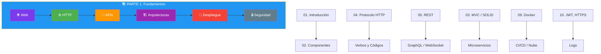
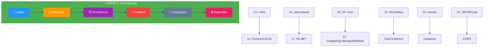
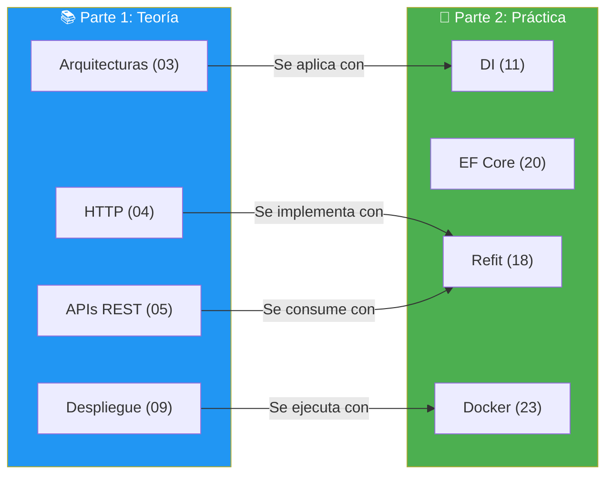

- [25. Resumen de la Unidad 01](#25-resumen-de-la-unidad-01)
  - [25.1. Parte 1: Fundamentos del Desarrollo Web en Servidor](#251-parte-1-fundamentos-del-desarrollo-web-en-servidor)
  - [25.2. Parte 2: C# Avanzado para Desarrollo Servidor](#252-parte-2-c-avanzado-para-desarrollo-servidor)
  - [25.3. Conexión entre Ambas Partes](#253-conexión-entre-ambas-partes)
  - [25.4. Conexión con la Unidad 02](#254-conexión-con-la-unidad-02)
  - [25.5. Consejos para el Examen](#255-consejos-para-el-examen)

# 25. Resumen de la Unidad 01

> 💡 **Punto de partida:** Has completado la Unidad 01, que consta de dos partes fundamentales. La Parte 1 te dio la base teórica de cómo funciona la web y el desarrollo en servidor. La Parte 2 te dio las herramientas de C# para construir aplicaciones reales. Ahora es momento de ver cómo todo encaja y prepararse para la Unidad 02: **Desarrollo de servicios web en .NET**.

## 25.1. Parte 1: Fundamentos del Desarrollo Web en Servidor

La Parte 1 cubrió los conceptos teóricos que todo desarrollador web debe conocer:

| Tema | Concepto clave | En una frase |
|------|---------------|--------------|
| **01. Introducción** | Front-end vs Back-end | La web tiene dos lados: lo que se ve y lo que procesa |
| **02. Componentes** | Back-end universal | Un mismo Back-end sirve a web, móvil y escritorio |
| **03. Arquitecturas** | MVC, SOLID, Microservicios | Cómo se organiza el código para que sea mantenible |
| **04. HTTP** | Verbos, Códigos de estado | El idioma que usan cliente y servidor para comunicarse |
| **05. APIs** | REST, GraphQL, WebSocket | Cómo se diseñan los servicios web modernos |
| **06. Web Dinámica** | SSR, tecnologías | Cómo se generan páginas personalizadas en el servidor |
| **07. Lenguajes** | Scripting, Compilado, Bytecode | Cómo se ejecuta el código en el servidor |
| **08. Servidores** | Apache, Nginx, Kestrel | El software que sirve las aplicaciones web |
| **09. Despliegue** | Docker, K8s, CI/CD | Cómo llevar la app de desarrollo a producción |
| **10. Seguridad** | Autenticación, Logs | Cómo proteger la app y monitorizarla |

📌 **Ejemplo real:** Cuando Netflix diseña su arquitectura, usa los conceptos de la Parte 1: HTTP para comunicar servicios, REST para las APIs, Docker para desplegar, y JWT para autenticar a los usuarios.

## 25.2. Parte 2: C# Avanzado para Desarrollo Servidor

La Parte 2 te dio las herramientas de C# para construir aplicaciones reales:

| Tema | Concepto clave | En una frase |
|------|---------------|--------------|
| **11. DI** | Inyección de Dependencias | No crees dependencias, recíbelas |
| **12. Patrones** | Repository, Service, Factory | Organizar el código para que sea mantenible |
| **13. LINQ** | Consultas declarativas | Manipular datos como si fueran SQL en C# |
| **14. Ficheros** | IDisposable, CSV, JSON | Leer y escribir datos de forma segura |
| **15. Result** | CSharpFunctionalExtensions | Manejar errores sin excepciones |
| **16. Async** | async/await, Task | No bloquear mientras esperas |
| **17. Reactiva** | Rx.NET, IAsyncEnumerable | Flujos de datos continuos |
| **18. APIs** | Refit, Polly | Consumir APIs externas de forma robusta |
| **19. Config** | Serilog, IOptions | Configurar y monitorizar la app |
| **20. EF Core** | DbContext, Migraciones | Trabajar con BD como C# |
| **21. SQL/NoSQL** | PostgreSQL, MongoDB, Redis | Elegir la BD correcta |
| **22. Testing** | NUnit, Moq, TestContainers | Tests profesionales |
| **23. Docker** | Dockerfile, Compose | Empaquetar la app |
| **24. Seguridad** | JWT, BCrypt, CORS | Proteger la app |

📌 **Ejemplo real:** El proyecto de Gestión Académica que hiciste en 1º usa concepts de la Parte 2: DI (tema 11), Repository (tema 12), LINQ (tema 13), CSV/JSON (tema 14), async/await (tema 16), y Serilog (tema 19).

## 25.3. Conexión entre Ambas Partes

La Parte 1 y la Parte 2 no son independientes. Se conectan así:

| Parte 1 (Teoría) | Parte 2 (Práctica) |
|-------------------|---------------------|
| HTTP (tema 04) | Refit/Polly (tema 18) |
| APIs REST (tema 05) | ASP.NET Core Minimal API |
| MVC (tema 03) | Repository/Service (tema 12) |
| Docker (tema 09) | Dockerfile/Compose (tema 23) |
| Seguridad (tema 10) | JWT/BCrypt (tema 24) |

> 📝 **Nota:** La Parte 1 es el "por qué" y la Parte 2 es el "cómo". Sabes que HTTP usa verbos (Parte 1), y ahora sabes cómo consumir APIs con Refit (Parte 2).

## 25.4. Conexión con la Unidad 02

La **Unidad 02** se llama **"Desarrollo de servicios web en .NET"** y es donde todo cobra sentido. Verás cómo integrar todas las tecnologías en ASP.NET Core:

| Tema de la UD02 | Tecnología de la UD01 |
|-----------------|----------------------|
| **Introducción a ASP.NET Core** | HTTP (04), Arquitecturas (03) |
| **Controllers y Endpoints** | REST (05), MVC (03) |
| **Dependency Injection** | DI (11), Scrutor (11) |
| **Entity Framework Core** | EF Core (20), LINQ (13) |
| **Autenticación y Autorización** | JWT (24), Seguridad (10) |
| **Logging y Monitorización** | Serilog (19), Logs (10) |
| **Testing de APIs** | NUnit/Moq (22), TestContainers (22) |
| **Swagger/OpenAPI** | APIs REST (05) |
| **Despliegue** | Docker (23), CI/CD (09) |

📌 **Ejemplo real:** En la UD02 crearás una API REST completa para gestionar productos. Usarás: ASP.NET Core (HTTP/REST), EF Core (PostgreSQL), DI (Scrutor), JWT (autenticación), Serilog (logging), NUnit (tests), y Docker (despliegue). Todo lo que aprendiste en la UD01.

## 25.5. Consejos para el Examen

### Conceptos clave de la Parte 1

| Concepto | Pregunta típica | Respuesta breve |
|----------|----------------|-----------------|
| **HTTP** | ¿Qué diferencia hay entre GET y POST? | GET lee, POST crea |
| **Códigos de estado** | ¿Qué significa 404? | Recurso no encontrado |
| **REST** | ¿Cuáles son los principios de REST? | Cliente-Servidor, sin estado, cacheable, uniforme |
| **MVC** | ¿Qué hace cada parte? | Modelo (datos), Vista (interfaz), Controlador (lógica) |
| **Docker** | ¿Qué es un contenedor? | Instancia aislada de una imagen |

### Conceptos clave de la Parte 2

| Concepto | Pregunta típica | Respuesta breve |
|----------|----------------|-----------------|
| **DI** | ¿Qué ciclo de vida usas? | Scoped por defecto |
| **LINQ** | ¿GroupBy + Select + ToList vs ToDictionary? | ToDictionary es más eficiente |
| **async/await** | ¿Cuándo usar async void? | Solo en eventos UI, nunca en servicios |
| **Result\<T\>** | ¿Result vs Excepciones? | Result para errores esperados |
| **EF Core** | ¿Qué es Include? | Carga relaciones (Eager Loading) |
| **JWT** | ¿Cuántas partes tiene? | 3: Header, Payload, Firma |
| **BCrypt** | ¿Por qué no MD5? | Resistente a rainbow tables |

### Errores comunes a evitar

1. ❌ Usar `.Result` o `.Wait()` en vez de `await`
2. ❌ `async void` en servicios (usar `async Task`)
3. ❌ Almacenar contraseñas en texto plano (usar BCrypt)
4. ❌ Concatenar strings en SQL (usar parámetros)
5. ❌ Crear `HttpClient` directamente (usar `IHttpClientFactory`)
6. ❌ No usar `Include` en EF Core (problema N+1)
7. ❌ `AllowAnyOrigin()` en CORS producción
8. ❌ Guardar secretos en `appsettings.json` (usar User Secrets)
9. ❌ No usar `CancellationToken` en métodos asíncronos
10. ❌ No rotar logs (el disco se llena)

---

**Resumen del punto:**

| Concepto | Descripción |
|----------|-------------|
| **Parte 1** | Fundamentos teóricos: HTTP, APIs, arquitecturas, despliegue, seguridad |
| **Parte 2** | Herramientas C#: DI, LINQ, async, EF Core, testing, Docker |
| **UD02** | Desarrollo de servicios web en .NET (ASP.NET Core) |
| **Conexión** | La Parte 1 es el "por qué", la Parte 2 es el "cómo" |

En la Unidad 02 veremos cómo integrar todo en ASP.NET Core para crear APIs REST profesionales.
