- [25. Resumen y Conclusiones](#25-resumen-y-conclusiones)
  - [25.1. Mapa Conceptual de la Unidad](#251-mapa-conceptual-de-la-unidad)
  - [25.2. Conceptos Clave](#252-conceptos-clave)
    - [Parte 1: Fundamentos del Desarrollo Web en Servidor](#parte-1-fundamentos-del-desarrollo-web-en-servidor)
      - [Tema 01: Introducción a la Web y el Desarrollo en Servidor](#tema-01-introducción-a-la-web-y-el-desarrollo-en-servidor)
      - [Tema 02: Componentes del Desarrollo Web](#tema-02-componentes-del-desarrollo-web)
      - [Tema 03: Arquitecturas de Software](#tema-03-arquitecturas-de-software)
      - [Tema 04: Protocolo HTTP](#tema-04-protocolo-http)
      - [Tema 05: APIs Web](#tema-05-apis-web)
      - [Tema 06: Desarrollo Web Dinámico](#tema-06-desarrollo-web-dinámico)
      - [Tema 07: Lenguajes de Programación en el Servidor](#tema-07-lenguajes-de-programación-en-el-servidor)
      - [Tema 08: Servidores Web](#tema-08-servidores-web)
      - [Tema 09: Despliegue y Contenedores](#tema-09-despliegue-y-contenedores)
      - [Tema 10: Seguridad Básica](#tema-10-seguridad-básica)
    - [Parte 2: C# Avanzado para Desarrollo Servidor](#parte-2-c-avanzado-para-desarrollo-servidor)
      - [Tema 11: Inyección de Dependencias (DI)](#tema-11-inyección-de-dependencias-di)
      - [Tema 12: Patrones de Diseño](#tema-12-patrones-de-diseño)
      - [Tema 13: LINQ y DataFrames](#tema-13-linq-y-dataframes)
      - [Tema 14: Ficheros y Serialización](#tema-14-ficheros-y-serialización)
      - [Tema 15: Manejo de Errores con Result](#tema-15-manejo-de-errores-con-result)
      - [Tema 16: Programación Asíncrona](#tema-16-programación-asíncrona)
      - [Tema 17: Flujos Reactivos](#tema-17-flujos-reactivos)
      - [Tema 18: Consumo de APIs Externas](#tema-18-consumo-de-apis-externas)
      - [Tema 19: Configuración y Logging](#tema-19-configuración-y-logging)
      - [Tema 20: Entity Framework Core](#tema-20-entity-framework-core)
      - [Tema 21: SQL y NoSQL](#tema-21-sql-y-nosql)
      - [Tema 22: Testing Profesional](#tema-22-testing-profesional)
      - [Tema 23: Docker y Contenedores](#tema-23-docker-y-contenedores)
      - [Tema 24: Seguridad en .NET](#tema-24-seguridad-en-net)
  - [25.3. Herramientas y Perfiles](#253-herramientas-y-perfiles)
    - [SDK y CLI](#sdk-y-cli)
    - [NuGet (paquetes habituales)](#nuget-paquetes-habituales)
    - [IDE](#ide)
  - [25.4. Errores Comunes a Evitar](#254-errores-comunes-a-evitar)
  - [25.5. Checklist de Supervivencia](#255-checklist-de-supervivencia)
    - [Parte 1: Fundamentos](#parte-1-fundamentos)
    - [Parte 2: C# Avanzado](#parte-2-c-avanzado)
  - [25.6. Glosario de Términos](#256-glosario-de-términos)
  - [25.7. Ejercicios de Repaso](#257-ejercicios-de-repaso)
  - [25.8. ¿Qué viene después?](#258-qué-viene-después)
  - [25.9. Mapa de Conexiones entre Temas](#259-mapa-de-conexiones-entre-temas)

# 25. Resumen y Conclusiones

> 💡 **Punto de partida:** Has completado la Unidad 01, que consta de dos partes fundamentales. La Parte 1 te dio la base teórica de cómo funciona la web y el desarrollo en servidor. La Parte 2 te dio las herramientas de C# para construir aplicaciones reales. Este resumen consolida todo en una sola mirada.

Hemos visto la teoría completa de Desarrollo Web en Entorno Servidor. Este punto consolida todos los conceptos en una sola mirada.

**Objetivos de aprendizaje:**

- Repasar los conceptos fundamentales de la unidad
- Consolidar el vocabulario técnico
- Tener una referencia rápida para el examen

## 25.1. Mapa Conceptual de la Unidad

```mermaid
graph TD
    UD01[UD01: Desarrollo Web en Entorno Servidor] --> P1[Parte 1: Fundamentos]
    UD01 --> P2[Parte 2: C# Avanzado]

    P1 --> WEB[La Web]
    P1 --> COMP[Componentes]
    P1 --> ARQ[Arquitecturas]
    P1 --> HTTP[Protocolo HTTP]
    P1 --> API[APIs Web]
    P1 --> DIN[Web Dinámica]
    P1 --> LENG[Lenguajes Servidor]
    P1 --> SRV[Servidores Web]
    P1 --> DES[Despliegue]
    P1 --> SEG[Seguridad]

    WEB --> WEB1[Front-end vs Back-end]
    WEB --> WEB2[Servidor:Hardware+Software]
    COMP --> COMP1[Cliente-Servidor]
    COMP --> COMP2[Capas: Presentación,Negocio,Datos]
    ARQ --> ARQ1[MVC]
    ARQ --> ARQ2[SOLID]
    ARQ --> ARQ3[Microservicios]
    HTTP --> HTTP1[Verbos:GET,POST,PUT,DELETE]
    HTTP --> HTTP2[Códigos:200,301,404,500]
    API --> API1[REST: Recursos y Verbos]
    API --> API2[GraphQL: Consulta Flexible]
    API --> API3[WebSocket: Bidireccional]
    DIN --> DIN1[SSR: Renderizado en Servidor]
    DIN --> DIN2[PHP,JSP,ASP.NET,Razor]
    LENG --> LENG1[Scripting: PHP,Python,Node.js]
    LENG --> LENG2[Compilado: C#,Java]
    LENG --> LENG3[Bytecode: JVM,CLR]
    SRV --> SRV1[Apache: Módulos]
    SRV --> SRV2[Nginx: Eventos]
    SRV --> SRV3[Kestrel: .NET]
    DES --> DES1[CI/CD: Automatización]
    DES --> DES2[Docker: Contenedores]
    DES --> DES3[Nube: AWS,Azure]
    SEG --> SEG1[Autenticación: JWT]
    SEG --> SEG2[Autorización: Roles]
    SEG --> SEG3[HTTPS,CORS,Logs]

    P2 --> DI[Inyección de Dependencias]
    P2 --> PAT[Patron Repository]
    P2 --> LINQ[LINQ + DataFrames]
    P2 --> FICH[Ficheros + JSON]
    P2 --> RESULT[Manejo de Errores]
    P2 --> ASYNC[Programación Asíncrona]
    P2 --> RX[Flujos Reactivos]
    P2 --> APIEXT[Consumo de APIs]
    P2 --> CONFIG[Configuración + Logging]
    P2 --> EF[Entity Framework Core]
    P2 --> BD[SQL + NoSQL]
    P2 --> TEST[Testing Profesional]
    P2 --> DOCKER[Docker + Compose]
    P2 --> SEGP[Seguridad + JWT]

    DI --> DI1[Transient, Scoped, Singleton]
    DI --> DI2[Scrutor: Auto-registro]
    PAT --> PAT1[Repository: Acceso a Datos]
    PAT --> PAT2[Service: Lógica de Negocio]
    PAT --> PAT3[Factory: Creación de Objetos]
    LINQ --> LINQ1[ Consultas Declarativas]
    LINQ --> LINQ2[Parallel LINQ: Paralelo]
    LINQ --> LINQ3[DataFrames: Big Data]
    FICH --> FICH1[File, StreamWriter, StreamReader]
    FICH --> FICH2[JSON: System.Text.Json]
    RESULT --> RESULT1[Result y Result<T>]
    RESULT --> RESULT2[Programación Funcional]
    ASYNC --> ASYNC1[async/await, Task]
    ASYNC --> ASYNC2[CancellationToken]
    RX --> RX1[Observable, Subject]
    RX --> RX2[IAsyncEnumerable]
    APIEXT --> APIEXT1[Refit: API Tipada]
    APIEXT --> APIEXT2[Polly: Resiliencia]
    CONFIG --> CONFIG1[IOptions<T>]
    CONFIG --> CONFIG2[Serilog: Logging]
    EF --> EF1[DbContext, Migraciones]
    EF --> EF2[Lazy, Eager, Explicit]
    BD --> BD1[PostgreSQL, MySQL, SQLite]
    BD --> BD2[MongoDB, Redis]
    TEST --> TEST1[NUnit + Moq]
    TEST --> TEST2[FluentAssertions]
    TEST --> TEST3[TestContainers: Docker]
    DOCKER --> DOCKER1[Dockerfile Multi-etapa]
    DOCKER --> DOCKER2[docker-compose.yml]
    SEGP --> SEGP1[BCrypt: Hash + Salt]
    SEGP --> SEGP2[JWT: Header, Payload, Firma]
    SEGP --> SEGP3[CORS: Orígenes Permitidos]

    style UD01 fill:#2196F3,color:#fff
    style P1 fill:#7c3aed,color:#fff
    style P2 fill:#4CAF50,color:#fff
    style WEB fill:#FF9800,color:#fff
    style COMP fill:#FF9800,color:#fff
    style ARQ fill:#FF9800,color:#fff
    style HTTP fill:#FF9800,color:#fff
    style API fill:#FF9800,color:#fff
    style DIN fill:#FF9800,color:#fff
    style LENG fill:#FF9800,color:#fff
    style SRV fill:#FF9800,color:#fff
    style DES fill:#FF9800,color:#fff
    style SEG fill:#FF9800,color:#fff
    style DI fill:#2196F3,color:#fff
    style PAT fill:#2196F3,color:#fff
    style LINQ fill:#2196F3,color:#fff
    style FICH fill:#2196F3,color:#fff
    style RESULT fill:#2196F3,color:#fff
    style ASYNC fill:#2196F3,color:#fff
    style RX fill:#2196F3,color:#fff
    style APIEXT fill:#2196F3,color:#fff
    style CONFIG fill:#2196F3,color:#fff
    style EF fill:#2196F3,color:#fff
    style BD fill:#2196F3,color:#fff
    style TEST fill:#2196F3,color:#fff
    style DOCKER fill:#2196F3,color:#fff
    style SEGP fill:#2196F3,color:#fff
```

## 25.2. Conceptos Clave

### Parte 1: Fundamentos del Desarrollo Web en Servidor

#### Tema 01: Introducción a la Web y el Desarrollo en Servidor
- **Front-end:** Lo que se ve en el navegador (HTML, CSS, JavaScript)
- **Back-end:** Lo que procesa en el servidor (lógica, base de datos, autenticación)
- **Full-Stack:** Desarrollador que domina ambos lados
- **La web es client-server:** El cliente (navegador) pide, el servidor responde
- 📌 Netflix usa front-end para la interfaz y back-end para recomendar contenido y gestionar pagos

#### Tema 02: Componentes del Desarrollo Web
- **Cliente:** Navegador, app móvil, escritorio — cualquier cosa que haga peticiones HTTP
- **Servidor:** Hardware + Software que escucha y responde peticiones
- **Capas:** Presentación (UI) → Negocio (lógica) → Datos (BD)
- **Un solo back-end sirve a múltiples clientes:** Web, móvil y escritorio consumen la misma API
- 📌 Instagram tiene un único back-end que sirve la web, la app iOS y la app Android

#### Tema 03: Arquitecturas de Software
- **MVC:** Modelo (datos) → Vista (interfaz) → Controlador (lógica). Separa responsabilidades
- **SOLID:** 5 principios para código mantenible (SRP, OCP, LSP, ISP, DIP)
- **Microservicios:** Dividir la app en servicios pequeños e independientes
- **Monolito vs Microservicios:** Monolito = todo junto (fácil de empezar, difícil de escalar). Microservicios = separado (difícil de empezar, fácil de escalar)
- 📌 Netflix pasó de monolito a +700 microservicios para escalar a millones de usuarios

#### Tema 04: Protocolo HTTP
- **HTTP:** Protocolo de comunicación cliente-servidor. Sin estado (stateless)
- **Verbos:** GET (leer), POST (crear), PUT (actualizar completo), PATCH (actualizar parcial), DELETE (eliminar)
- **Códigos de estado:** 2xx (éxito), 3xx (redirección), 4xx (error cliente), 5xx (error servidor)
- **Headers:** Metadatos de la petición/respuesta (Content-Type, Authorization, Cache-Control)
- **HTTPS:** HTTP con cifrado TLS. Imprescindible en producción
- 📌 Cuando haces login en una web, el navegador envía POST con credenciales y el servidor devuelve 200 OK o 401 Unauthorized

#### Tema 05: APIs Web
- **REST:** Arquitectura basada en recursos (URLs) y verbos HTTP. Stateless. Cacheable
- **GraphQL:** Consulta flexible. El cliente pide exactamente lo que necesita. Un único endpoint
- **WebSocket:** Comunicación bidireccional en tiempo real (chat, notificaciones, gaming)
- **REST vs GraphQL:** REST = múltiples endpoints, GraphQL = uno solo. REST es más simple, GraphQL es más flexible
- 📌 Instagram usa GraphQL para que cada pantalla pida solo los datos que necesita, reduciendo tráfico

#### Tema 06: Desarrollo Web Dinámico
- **SSR (Server-Side Rendering):** El servidor genera HTML completo antes de enviarlo al navegador
- **CSR (Client-Side Rendering):** El navegador recibe JavaScript vacío y renderiza todo en cliente
- **Tecnologías SSR:** PHP, JSP, ASP.NET Razor, Thymeleaf
- **Ventaja SSR:** SEO, carga inicial rápida. **Desventaja:** Recarga completa de página
- **Ventaja CSR:** Experiencia fluida (SPA). **Desventaja:** Peor SEO, carga inicial más lenta
- 📌 Amazon usa SSR para que cada producto sea indexado por Google (SEO)

#### Tema 07: Lenguajes de Programación en el Servidor
- **Scripting:** PHP, Python, Node.js — se interpretan línea a línea. Flexibles pero más lentos
- **Compilados:** C#, Java — se traducen a binario antes de ejecutar. Rendimiento alto
- **Bytecode:** JVM (Java), CLR (.NET) — compilación mixta. Portabilidad + rendimiento
- **C# y .NET:** Lenguaje de alto nivel, compilado, estático, multiparadigma. CLR gestiona memoria (GC) y compila JIT
- 📌 Node.js usa JavaScript en servidor con V8. Útil para I/O intensivo, pero no para CPU intensivo

#### Tema 08: Servidores Web
- **Apache:** El más histórico. Basado en módulos (.htaccess). PHP funciona genial con él
- **Nginx:** Orientado a eventos. Alto rendimiento. Proxy inverso y balanceo de carga
- **Kestrel:** Servidor de ASP.NET Core. Viene con .NET. Rápido y moderno
- **IIS:** Servidor de Microsoft para Windows. Integrado con .NET Framework
- **En producción:** Nginx (proxy) → Kestrel (app .NET) → PostgreSQL (BD)
- 📌 Airbnb usa Nginx como proxy inverso para repartir tráfico entre cientos de servidores

#### Tema 09: Despliegue y Contenedores
- **Docker:** Empaqueta la app con todo lo que necesita (OS, librerías, config). Funciona igual en cualquier máquina
- **Dockerfile:** Receta para construir la imagen (FROM, COPY, RUN, EXPOSE, CMD)
- **docker-compose.yml:** Define múltiples servicios (app + BD + caché) en un solo archivo
- **CI/CD:** Integración Continua (compilar + test automático) → Despliegue Continuo (publicar automático)
- **Nube:** AWS, Azure, Google Cloud — infraestructura bajo demanda
- 📌 Netflix despliega +4000 contenedores diarios con CI/CD en AWS

#### Tema 10: Seguridad Básica
- **Autenticación:** ¿Quién eres? → JWT, sesiones, OAuth
- **Autorización:** ¿Qué puedes hacer? → Roles, permisos, ACL
- **HTTPS:** Cifra la comunicación. Sin él,任何人都 puede ver tus datos en tránsito
- **CORS:** Controla qué dominios pueden acceder a tu API
- **SQL Injection:** Inyección de SQL malicioso. Se evita con consultas parametrizadas
- **XSS:** Cross-Site Scripting. Se evita sanitizando entradas
- **Logs:** Registro de eventos para detectar y depurar problemas
- 📌 Un banco usa HTTPS + JWT + CORS + logs para proteger las transacciones de sus clientes

### Parte 2: C# Avanzado para Desarrollo Servidor

#### Tema 11: Inyección de Dependencias (DI)
- **DI:** No crees dependencias, recíbelas. El contenedor las crea y te las inyecta
- **Ciclos de vida:** Transient (nueva cada vez), Scoped (una por petición), Singleton (una global)
- **Scrutor:** Auto-registro de dependencias sin escribir cada `AddSingleton`/`AddScoped`
- **Primary constructors (C# 14):** Inyectas por parámetro del constructor, no por campo privado
- **Ventaja:** Código desacoplado, testeable, mantenible
- 📌 ASP.NET Core usa DI por defecto. Cada controller recibe sus servicios por constructor

#### Tema 12: Patrones de Diseño
- **Repository:** Acceso a datos abstracto. No importa si es SQL, JSON o memoria
- **Service:** Lógica de negocio. Usa Repository para leer/escribir datos
- **Factory:** Crea objetos sin exponer la lógica de creación
- **Separación de responsabilidades:** Cada patrón hace una cosa. Repository = datos, Service = lógica
- **Carpeta Repositories/:** Por tipo (Personas/, Productos/) con implementaciones (Memory/, Json/, EfCore/)
- 📌 Un Repository de Personas puede leer de PostgreSQL en producción y de JSON en tests

#### Tema 13: LINQ y DataFrames
- **LINQ:** Consultas declarativas sobre colecciones. Como SQL pero en C#
- **Métodos:** Select, Where, GroupBy, OrderBy, Join, ToList, ToDictionary
- **PLINQ (AsParallel):** LINQ paralelo. Usa todos los cores del procesador
- **DataFrames (.NET DataFrame):** Tablas en memoria para big data. Columnas tipadas, operaciones vectoriales
- **Cuándo usar PLINQ:** Colecciones grandes (>10K elementos) + operaciones independientes + múltiples cores
- **ToDictionary vs Select+ToList:** ToDictionary es más eficiente cuando necesitas acceso por clave
- 📌 Netflix analiza millones de vistas diarias con DataFrames para recomendar contenido

#### Tema 14: Ficheros y Serialización
- **IDisposable:** Los ficheros son recursos. Usa `using` para liberarlos automáticamente
- **File:** Métodos estáticos para leer/escribir todo el contenido de golpe
- **StreamWriter/StreamReader:** Lectura/escritura línea a línea. Eficiente para ficheros grandes
- **JSON:** System.Text.Json (moderno, rápido) o Newtonsoft.Json (flexible)
- **CSV:** CsvHelper o mapeo manual con Split
- **Convención:** Mappers/ para mapear datos entre capas
- 📌 El example 09 lee 46.596 registros de accidentes de Madrid desde CSV

#### Tema 15: Manejo de Errores con Result<T>
- **Result:** Tipo funcional que encapsula éxito o error. Sin excepciones
- **Result<T>:** `Result.Ok(valor)` o `Result.Fail("mensaje")`
- **CSharpFunctionalExtensions:** Librería que añade Result, Maybe, y programación funcional a C#
- **Cuándo usar Result:** Errores esperados (validación, no encontrado, duplicado)
- **Cuándo usar excepciones:** Errores inesperados (null reference, file not found)
- **Ventaja:** El caller sabe que puede haber error y lo maneja explícitamente
- 📌 Un login usa Result: credenciales correctas → Ok, usuario no existe → Fail, contraseña mala → Fail

#### Tema 16: Programación Asíncrona
- **async/await:** Ejecuta código sin bloquear el hilo principal
- **Task:** Representa una operación asíncrona que aún no ha terminado
- **CancellationToken:** Señal para cancelar operaciones largas
- **async void:** ¡NUNCA en servicios! Solo en eventos de UI
- **.Result / .Wait():** ¡NUNCA! Bloquea el hilo y puede causar deadlocks
- **Patrón:** `await client.GetAsync(url)` en vez de `client.GetAsync(url).Result`
- 📌 Un endpoint que consulta una API externa usa async/await para no bloquear otros requests

#### Tema 17: Flujos Reactivos
- **Rx.NET:** Programación reactiva con observables. Los datos fluyen y tú reaccionas
- **Subject<T>:** Emisor de eventos. Varios suscriptores pueden escuchar
- **IAsyncEnumerable:**colección que se lee asincrónicamente elemento a elemento con `await foreach`
- **Flujos fríos (IAsyncEnumerable):** Cada suscriptor recorre todo desde el inicio
- **Flujos calientes (Rx.NET):** Los suscriptores tardíos pierden eventos anteriores
- **Operadores:** Merge (unir), Buffer (agrupar), Take (tomar N), Where (filtrar)
- 📌 Un chat en tiempo vivo usa Rx.NET para que cada mensaje llegue a todos los usuarios conectados

#### Tema 18: Consumo de APIs Externas
- **Refit:** Interfaz tipada para consumir APIs REST. Defines la interfaz, Refit genera la implementación
- **Polly:** Resiliencia. Retry, Circuit Breaker, Timeout, Bulkhead
- **IHttpClientFactory:** Crea HttpClient de forma segura. Evita Socket Exhaustion
- **Debounce:** Espera a que el usuario deje de escribir antes de buscar
- **Neverending Fetch:** Cancela peticiones anteriores cuando llega una nueva
- 📌 Glovo usa Polly para reintentar si un repartidor no responde la primera vez

#### Tema 19: Configuración y Logging
- **appsettings.json:** Fichero de configuración. Valores por defecto + valores por entorno
- **IOptions<T>:** Configuración tipada. Accedes a valores como propiedades
- **Secciones:** ConnectionStrings, Jwt, Logging, Cors, AppState
- **Serilog:** Logging estructurado. Sinks: Console, File, Seq
- **Niveles:** Verbose, Debug, Information, Warning, Error, Fatal
- **Logger<T>:** Logger inyectado por DI. Escríbelo en logs con `LogInformation`, `LogError`
- 📌 Un banco registra cada transacción con Serilog para auditoría y depuración

#### Tema 20: Entity Framework Core
- **ORM:** Object-Relational Mapping. Trabajar con BD como si fueran objetos C#
- **DbContext:** Clase que representa la conexión a la BD. Contiene DbSets
- **Migraciones:** Cambios en el modelo → cambios en la BD. `dotnet ef migrations add`
- **Modelo de dominio:** Records en Models/, Entidades en Entity/
- **Conveniones:** [Table], [Column], [Key], [Required], [MaxLength]
- **Relaciones:** One-to-Many, Many-to-Many, One-to-One
- **Carga de datos:** Eager (Include), Lazy (proxy), Explicit (Load)
- **SQL Raw:** FromSqlRaw para consultas nativas, ExecuteSqlRaw para comandos
- 📌 Un e-commerce usa EF Core con PostgreSQL para gestionar productos, pedidos y clientes

#### Tema 21: SQL y NoSQL
- **PostgreSQL:** BD relacional potente. JSONB, PostGIS, extensiones
- **MySQL:** BD relacional popular. Simple, rápido, community edition
- **SQLite:** BD embebida. Sin servidor. Ideal para desarrollo y apps móviles
- **MongoDB:** BD documental. JSON flexible. Sin esquema fijo
- **Redis:** Caché en memoria. Clave-valor. Expiración TTL
- **Caché:** FIFO (primero en entrar), LRU (menos usado recientemente), LFU (menos usado frecuentemente)
- **IDistributedCache:** Interfaz de .NET para caché (Memory, Redis, SQL Server)
- **Cuándo usar qué:** Relaciones→SQL, Documentos→MongoDB, Caché→Redis, Móvil→SQLite
- 📌 Toyota usa Redis para cachear catálogos de productos (consulta frecuente, datos que cambian poco)

#### Tema 22: Testing Profesional
- **NUnit:** Framework de tests. [TestFixture], [Test], [SetUp], [TestCase]
- **Moq:** Mocking de interfaces. Simula dependencias para aislar lo que se testea
- **FluentAssertions:** Aserciones legibles. `resultado.Should().Be(esperado)`
- **Patrón AAA:** Arrange (preparar), Act (ejecutar), Assert (verificar)
- **TestContainers:** Tests con Docker. BD real, Redis real, todo efímero
- **Cobertura:** `dotnet test --collect:"XPlat Code Coverage"`. Objetivo: >80%
- **Organización:** Misma estructura que el proyecto principal (Models/, Services/, Repositories/)
- 📌 Un equipo usa TestContainers para testear la BD real sin contaminar datos de desarrollo

#### Tema 23: Docker y Contenedores
- **Dockerfile:** Receta multi-etapa: build → test → runtime
- **docker-compose.yml:** Define servicios: app, BD, caché, etc.
- **.dockerignore:** Excluir bin/, obj/, .git/ del contexto de build
- **Multi-etapa:** Build stage compila y testea, runtime stage solo tiene la app
- **Non-root user:** Ejecutar como usuario no root por seguridad
- **COPY individual:** NUNCA `COPY . .`. Copiar carpetas una a una
- **Puertos:** `EXPOSE` en Dockerfile, `ports` en docker-compose.yml
- 📌 Netflix ejecuta +4000 contenedores diarios con Docker en la nube

#### Tema 24: Seguridad en .NET
- **BCrypt:** Hash de contraseñas con salt. Resistente a rainbow tables. ¡NUNCA MD5!
- **JWT:** Token firmado. Header (algoritmo), Payload (datos), Firma (secreto)
- **CORS:** Controla qué dominios pueden hacer peticiones a tu API
- **Autenticación vs Autorización:** Autenticación = quién eres. Autorización = qué puedes hacer
- **User Secrets:** Secretos fuera del código. `dotnet user-secrets set`
- **HTTPS Everywhere:** Redirigir todo a HTTPS en producción
- **Rate Limiting:** Limitar peticiones por IP para evitar abusos
- 📌 Un e-commerce usa JWT para login, BCrypt para contraseñas, y CORS para permitir solo su dominio

## 25.3. Herramientas y Perfiles

### SDK y CLI
- **`dotnet new sln`**: Crea una solución (.slnx en .NET 10)
- **`dotnet new console`**: Crea un proyecto de consola
- **`dotnet sln add`**: Añade un proyecto a la solución
- **`dotnet build`**: Compila el proyecto
- **`dotnet run`**: Compila y ejecuta
- **`dotnet restore`**: Restaura paquetes NuGet
- **`dotnet test`**: Ejecuta tests
- **`dotnet ef migrations add`**: Crea una migración de EF Core
- **`dotnet ef database update`**: Aplica migraciones a la BD

### NuGet (paquetes habituales)
- **Microsoft.Extensions.DependencyInjection** — Inyección de dependencias
- **Microsoft.Extensions.Configuration.Json** — Configuración JSON
- **Serilog** + sinks — Logging estructurado
- **NUnit** + Moq + FluentAssertions — Testing
- **Microsoft.EntityFrameworkCore.Sqlite** — EF Core con SQLite
- **Npgsql.EntityFrameworkCore.PostgreSQL** — EF Core con PostgreSQL
- **CsvHelper** — Lectura/escritura CSV
- **System.Text.Json** — Serialización JSON
- **CSharpFunctionalExtensions** — Programación funcional (Result)
- **Refit** — Cliente HTTP tipado
- **Polly** — Resiliencia y retry
- **StackExchange.Redis** — Cliente Redis

### IDE
- **JetBrains Rider:** IDE profesional, recomendado para C#. Multiplataforma
- **Visual Studio Code:** Editor ligero, multiplataforma, gratuito
- **Visual Studio:** IDE completo de Microsoft (versión Community gratuita)

## 25.4. Errores Comunes a Evitar

| Error | Por qué está mal | Cómo evitarlo |
|-------|------------------|---------------|
| Usar `.Result` o `.Wait()` | Bloquea el hilo, puede causar deadlocks | Usar siempre `await` |
| `async void` en servicios | No se puede await, errores silenciosos | Usar `async Task` |
| `HttpClient` directo | Socket Exhaustion en producción | Usar `IHttpClientFactory` |
| Contraseñas en texto plano | Cualquier hacker las lee | Usar BCrypt con salt |
| `AllowAnyOrigin()` en CORS | Cualquier web puede acceder a tu API | Configurar orígenes específicos |
| No usar `Include` en EF Core | Problema N+1 (muchas queries) | Usar Eager Loading con Include |
| Guardar secretos en appsettings.json | Se sube a git por accidente | Usar User Secrets o variables de entorno |
| `Parse` sin validar | Excepción si el dato no es válido | Usar `TryParse` |
| No usar `CancellationToken` | Operaciones no se pueden cancelar | Pasar token en métodos asíncronos |
| No rotar logs | El disco se llena | Configurar retención y rotación |
| `COPY . .` en Dockerfile | Copia archivos innecesarios | Copiar carpetas individuales |
| SQL con concatenación | SQL Injection | Usar consultas parametrizadas |
| `int` para dinero | Pierde decimales | Usar `decimal` |
| Confundir `=` y `==` | Asignación vs comparación | Usar `==` en condiciones |
| No usar `using` con recursos | Memory leaks | Envolver en `using` statements |

## 25.5. Checklist de Supervivencia

Antes de dar por cerrado el tema, asegúrate de poder responder **SÍ** a estas preguntas:

### Parte 1: Fundamentos
- [ ] ¿Entiendo la diferencia entre front-end y back-end?
- [ ] ¿Sé qué es el modelo cliente-servidor y las capas de una aplicación?
- [ ] ¿Puedo explicar MVC, SOLID y microservicios?
- [ ] ¿Recuerdo los verbos HTTP (GET, POST, PUT, PATCH, DELETE) y sus códigos de estado?
- [ ] ¿Diferencio entre REST, GraphQL y WebSocket?
- [ ] ¿Entiendo la diferencia entre SSR y CSR?
- [ ] ¿Sé qué hacen Apache, Nginx y Kestrel?
- [ ] ¿Puedo explicar qué es Docker y para qué sirve un contenedor?
- [ ] ¿Conozco los conceptos básicos de seguridad: JWT, CORS, HTTPS?

### Parte 2: C# Avanzado
- [ ] ¿Entiendo la Inyección de Dependencias y los ciclos de vida (Transient, Scoped, Singleton)?
- [ ] ¿Sé usar el patrón Repository y Service?
- [ ] ¿Puedo hacer consultas LINQ: Select, Where, GroupBy, OrderBy, Join?
- [ ] ¿Sé leer y escribir ficheros con `using`?
- [ ] ¿Entiendo cuándo usar Result<T> y cuándo excepciones?
- [ ] ¿Puedo escribir código asíncrono con async/await?
- [ ] ¿Diferencio entre IAsyncEnumerable (frío) y Rx.NET (caliente)?
- [ ] ¿Sé consumir APIs con Refit y añadir resiliencia con Polly?
- [ ] ¿Entiendo IOptions<T> y Serilog para configuración y logging?
- [ ] ¿Puedo crear un DbContext con EF Core y hacer migraciones?
- [ ] ¿Sé cuándo usar PostgreSQL, MongoDB, Redis o SQLite?
- [ ] ¿Puedo escribir tests con NUnit, Moq y FluentAssertions?
- [ ] ¿Sé crear un Dockerfile multi-etapa y un docker-compose.yml?
- [ ] ¿Entiendo JWT, BCrypt y CORS para seguridad?

> 🔧 **Truco:** La mejor forma de aprender es practicando. No leas solo los apuntes: abre el IDE y prueba cada ejemplo. Modifícalos, rompelos, arreglalos. Eso es como se aprende.

## 25.6. Glosario de Términos

| Término | Definición |
|---------|------------|
| **HTTP** | Protocolo de comunicación cliente-servidor. Sin estado (stateless) |
| **REST** | Arquitectura basada en recursos (URLs) y verbos HTTP |
| **GraphQL** | Lenguaje de consultas para APIs. Un solo endpoint, flexibilidad total |
| **WebSocket** | Protocolo de comunicación bidireccional en tiempo real |
| **MVC** | Modelo-Vista-Controlador. Patrón de arquitectura para separar responsabilidades |
| **SOLID** | 5 principios de diseño: SRP, OCP, LSP, ISP, DIP |
| **Docker** | Plataforma de contenedores. Empaqueta la app con todo lo que necesita |
| **CI/CD** | Integración Continua / Despliegue Continuo. Automatización de build y deploy |
| **DI** | Inyección de Dependencias. El contenedor crea e inyecta objetos |
| **Repository** | Patrón de acceso a datos. Abstrae la fuente de datos |
| **Service** | Patrón de lógica de negocio. Contiene la lógica de la aplicación |
| **LINQ** | Language Integrated Query. Consultas declarativas en C# |
| **PLINQ** | Parallel LINQ. LINQ paralelo con AsParallel() |
| **IDisposable** | Interfaz para liberar recursos no administrados (ficheros, conexiones) |
| **async/await** | Palabras clave para programación asíncrona sin bloquear hilos |
| **Task** | Representa una operación asíncrona que puede completarse en el futuro |
| **CancellationToken** | Señal para cancelar operaciones asíncronas en progreso |
| **Observable** | Fuente de datos que emite valores a suscriptores (Rx.NET) |
| **Subject** | Observable + Observer. Emisor de eventos en Rx.NET |
| **IAsyncEnumerable** | Colección que se lee asincrónicamente con `await foreach` |
| **Refit** | Cliente HTTP tipado. Define interfaz, Refit genera la implementación |
| **Polly** | Librería de resiliencia: retry, circuit breaker, timeout |
| **IOptions<T>** | Configuración tipada en .NET. Accedes a valores como propiedades |
| **Serilog** | Librería de logging estructurado con sinks (Console, File, Seq) |
| **DbContext** | Clase de EF Core que representa la conexión a la BD |
| **Migración** | Cambio en el modelo de EF Core que se aplica a la BD |
| **ORM** | Object-Relational Mapping. Mapea objetos C# a tablas de BD |
| **BCrypt** | Algoritmo de hash para contraseñas con salt |
| **JWT** | JSON Web Token. Token firmado con header, payload y firma |
| **CORS** | Cross-Origin Resource Sharing. Controla accesos entre dominios |
| **Result<T>** | Tipo funcional que encapsula éxito o error. Sin excepciones |
| **Redis** | BD en memoria. Caché clave-valor con expiración TTL |
| **NUnit** | Framework de tests para .NET |
| **Moq** | Librería para crear mocks de interfaces |
| **FluentAssertions** | Aserciones fluidas y legibles para tests |
| **TestContainers** | Tests con contenedores Docker efímeros |
| **LINQ to DataFrame** | Tablas en memoria para análisis de datos (big data) |

## 25.7. Ejercicios de Repaso

1. **Arquitecturas:** Explica la diferencia entre MVC, monolito y microservicios. ¿Cuándo usarías cada uno?

2. **HTTP:** Sin buscar, ¿cuáles son los 5 verbos HTTP y qué hace cada uno? ¿Qué código de estado devolverías si un usuario no está autenticado?

3. **REST vs GraphQL:** Una app móvil necesita mostrar datos de un usuario, sus pedidos y sus favoritos. ¿Usarías REST o GraphQL? Justifica.

4. **DI:** ¿Qué problema resuelve la Inyección de Dependencias? Explica con un ejemplo real.

5. **LINQ:** Dada una lista de `Pedido` con `ClienteId`, `Total` y `Fecha`, escribe una consulta LINQ que agrupe por `ClienteId` y muestre el total gastado por cada cliente.

6. **Async:** ¿Por qué `async void` es peligroso en servicios? ¿Qué pasa si usas `.Result` en un método asíncrono?

7. **EF Core:** Explica la diferencia entre Eager Loading (Include) y Lazy Loading. ¿Por qué el Lazy Loading puede causar el problema N+1?

8. **Docker:** Escribe un Dockerfile multi-etapa para una app .NET. Explica cada instrucción (FROM, COPY, RUN, EXPOSE, CMD).

9. **Seguridad:** ¿Por qué no se debe usar MD5 para contraseñas? ¿Qué es BCrypt y por qué es mejor?

10. **Testing:** Explica el patrón AAA (Arrange-Act-Assert). ¿Qué ventaja tiene usar Moq en lugar de una BD real para tests unitarios?

11. **Rx.NET vs IAsyncEnumerable:** ¿Cuándo usarías un flujo caliente y cuándo uno frío? Da un ejemplo de cada caso.

12. **Proyecto integrador:** Diseña la arquitectura de una API para gestionar una biblioteca. Indica: patrones (Repository, Service), tecnologías (EF Core, PostgreSQL), seguridad (JWT), despliegue (Docker), y testing (NUnit + TestContainers).

## 25.8. ¿Qué viene después?

En la **UD02: Desarrollo de servicios web en .NET** aprenderás a crear APIs REST profesionales con ASP.NET Core. Integrarás todo lo visto en la UD01:

| Tema UD01 | Se usa en UD02 para |
|-----------|---------------------|
| HTTP (04) | Entender cómo funcionan las peticiones |
| REST (05) | Diseñar los endpoints de la API |
| MVC (03) | Organizar controllers, services, repositories |
| DI (11) | Inyectar servicios en controllers |
| EF Core (20) | Conectar la API a PostgreSQL |
| JWT (24) | Autenticar usuarios |
| Docker (23) | Desplegar la app en contenedores |
| Testing (22) | Tests de integración con TestContainers |

📌 **Ejemplo real:** En la UD02 crearás una API REST completa para gestionar productos. Usarás: ASP.NET Core (HTTP/REST), EF Core (PostgreSQL), DI (Scrutor), JWT (autenticación), Serilog (logging), NUnit (tests), y Docker (despliegue). Todo lo que aprendiste en la UD01.

## 25.9. Mapa de Conexiones entre Temas

```mermaid
graph LR
    UD01[UD01: Introducción al Desarrollo en Servidor] --> UD02[UD02: Desarrollo de Servicios Web en .NET]
    UD02 --> UD03[UD03: Desarrollo de Páginas Web Dinámicas en .NET]
    UD03 --> UD04[UD04: Aplicaciones Web Híbridas y Componentes de Servidor en .NET]
    UD04 --> UD05[UD05: Desarrollo de Servicios Web en JVM]

    UD01 -.->|HTTP, REST, Arquitecturas| UD02
    UD02 -.->|ASP.NET Core, EF Core, APIs REST| UD03
    UD03 -.->|Razor, Blazor, MVC en .NET| UD04
    UD04 -.->|Componentes, Híbridos, JavaScript| UD05

    style UD01 fill:#4CAF50,color:#fff
    style UD02 fill:#2196F3,color:#fff
    style UD03 fill:#FF9800,color:#fff
    style UD04 fill:#9C27B0,color:#fff
    style UD05 fill:#f44336,color:#fff
```

