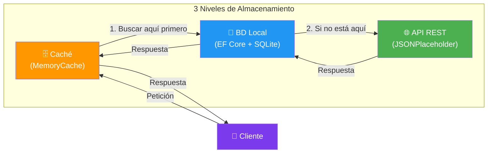
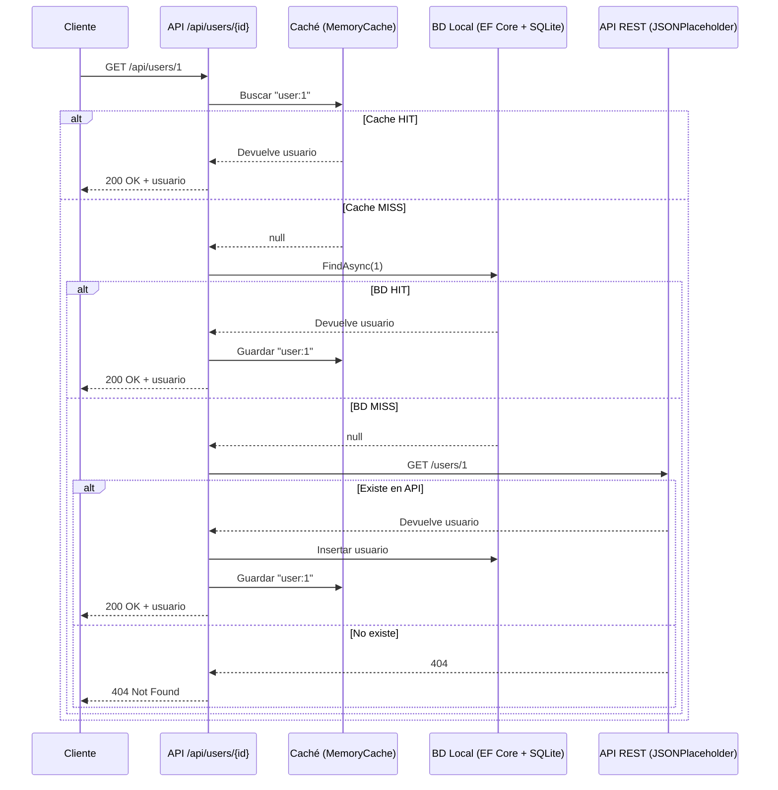
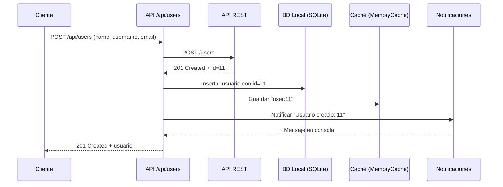
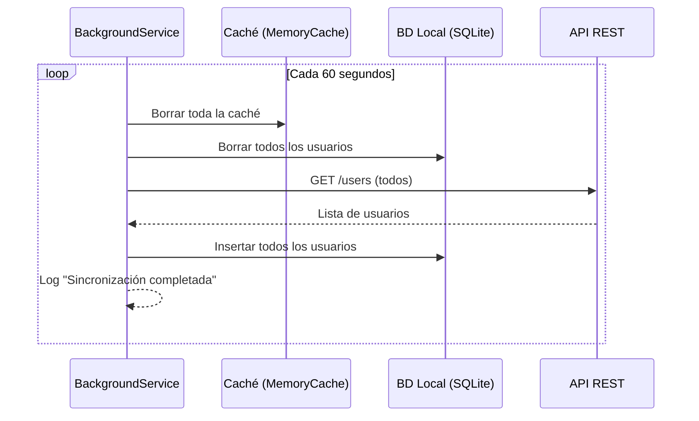
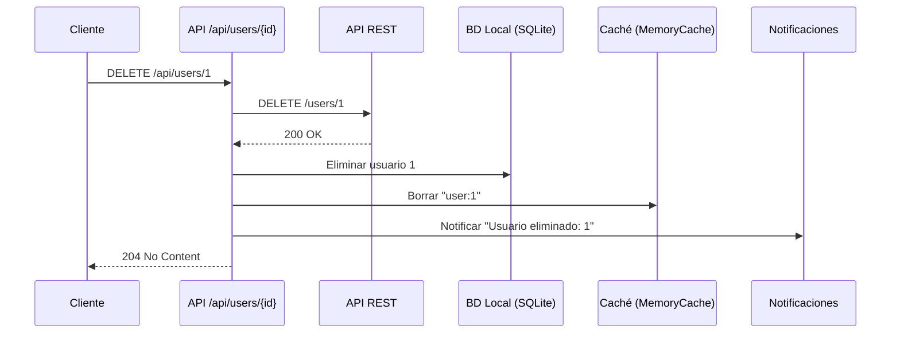

# Práctica 6: Servicio con Almacenamiento Local y Remoto en .NET

- [Práctica 6: Servicio con Almacenamiento Local y Remoto en .NET](#práctica-6-servicio-con-almacenamiento-local-y-remoto-en-net)
  - [Objetivo](#objetivo)
  - [Descripción](#descripción)
    - [Diagrama de Secuencia: Obtener usuario por ID](#diagrama-de-secuencia-obtener-usuario-por-id)
    - [Diagrama de Secuencia: Crear usuario](#diagrama-de-secuencia-crear-usuario)
    - [Diagrama de Secuencia: Sincronización cada 60s](#diagrama-de-secuencia-sincronización-cada-60s)
    - [Diagrama de Secuencia: Eliminar usuario](#diagrama-de-secuencia-eliminar-usuario)
  - [Tecnologías](#tecnologías)
  - [Docker Compose](#docker-compose)
    - [Conexión desde la app](#conexión-desde-la-app)
  - [Comportamiento del Sistema](#comportamiento-del-sistema)
    - [Al arrancar la aplicación](#al-arrancar-la-aplicación)
    - [Cada 60 segundos (BackgroundService)](#cada-60-segundos-backgroundservice)
    - [GET /api/users (obtener todos)](#get-apiusers-obtener-todos)
    - [GET /api/users/{id} (obtener uno)](#get-apiusersid-obtener-uno)
    - [POST /api/users (crear)](#post-apiusers-crear)
    - [PUT /api/users/{id} (actualizar)](#put-apiusersid-actualizar)
    - [DELETE /api/users/{id} (eliminar)](#delete-apiusersid-eliminar)
    - [GET /api/users/export (exportar a JSON)](#get-apiusersexport-exportar-a-json)
  - [Servicio de Notificaciones](#servicio-de-notificaciones)
  - [Requisitos Técnicos](#requisitos-técnicos)
    - [Arquitectura y código:](#arquitectura-y-código)
    - [Testing:](#testing)
    - [Documentación:](#documentación)
    - [Opcional (se valorará):](#opcional-se-valorará)
  - [Estructura de Proyecto](#estructura-de-proyecto)

---

## Objetivo

Desarrollar un servicio en **.NET** que gestione datos con **tres niveles de almacenamiento**: caché (MemoryCache), base de datos local (EF Core + SQLite) y API REST remota. El servicio realizará operaciones CRUD de forma asíncrona y usará las tecnologías vistas en la UD01.

Debes tener en cuenta que cada 60 segundos se sincronizará la base de datos local con la API REST remota, y que al arrancar la aplicación se borrará la base de datos local y se cargará desde la API REST.

Además tendrá un servicio de notificaciones. Para ello usaremos programación reactiva. En Program.cs, nada más arrancar el servicio, se suscribirá a los eventos de creación, actualización y eliminación de usuarios y mostrará un mensaje en consola. Este servicio estará inyectado en el `UserService` y se llamará cada vez que se cree, actualice o elimine un usuario.

Todo tendrá que estar documentado con XMLDoc y tener tests unitarios con NUnit + Moq + FluentAssertions.

---

## Descripción

Usaremos la API de **JSONPlaceholder** (https://jsonplaceholder.typicode.com) como almacenamiento remoto. Trabajaremos con el recurso **"users"** con campos: **id**, **name**, **username**, **email**.



**Flujo de datos:**
- Lectura: caché → BD local → API REST
- Escritura: API REST → BD local → caché
- Sincronización: cada 60 segundos, BackgroundService limpia y recarga desde la API

### Diagrama de Secuencia: Obtener usuario por ID



### Diagrama de Secuencia: Crear usuario



### Diagrama de Secuencia: Sincronización cada 60s



### Diagrama de Secuencia: Eliminar usuario


- Al arrancar la aplicación, se borra la BD local y se carga desde la API REST
- El servicio de notificaciones se inyecta en `UserService` y se llama en cada operación de escritura. En `Program.cs`, nada más arrancar, se suscriben los handlers que muestran mensajes en consola.

---

## Tecnologías

| Tecnología | Para qué | Paquete NuGet |
|------------|----------|---------------|
| **MemoryCache** | Caché en memoria | `Microsoft.Extensions.Caching.Memory` |
| **EF Core + SQLite** | BD local | `Microsoft.EntityFrameworkCore.Sqlite` |
| **Refit** | Cliente HTTP tipado | `Refit` + `Refit.HttpClientFactory` |
| **CSharpFunctionalExtensions** | Manejo de errores con Result | `CSharpFunctionalExtensions` |
| **Serilog** | Logging con rolling files | `Serilog.Extensions.Hosting` + `Serilog.Sinks.Console` + `Serilog.Sinks.File` |
| **System.Reactive** | Notificaciones con Rx.NET | `System.Reactive` |
| **NUnit + Moq + FluentAssertions** | Testing | `NUnit` + `Moq` + `FluentAssertions` |

---

## Docker Compose

El ejemplo base NO necesita Docker Compose (SQLite y MemoryCache funcionan sin infraestructura externa).

### Opcional: Ampliar con PostgreSQL y Redis

Si quieres ampliar el proyecto, puedes sustituir SQLite por PostgreSQL y MemoryCache por Redis:

```yaml
services:
  postgres:
    image: postgres:16-alpine
    container_name: repositorio-postgres
    environment:
      POSTGRES_DB: usuarios
      POSTGRES_USER: postgres
      POSTGRES_PASSWORD: postgres
    ports:
      - "5432:5432"
    volumes:
      - postgres_data:/var/lib/postgresql/data

  redis:
    image: redis:7-alpine
    container_name: repositorio-redis
    ports:
      - "6379:6379"

volumes:
  postgres_data:
```

```bash
# Iniciar
docker-compose up -d

# Verificar PostgreSQL
docker exec -it repositorio-postgres psql -U postgres -c "SELECT 1;"

# Verificar Redis
docker exec -it repositorio-redis redis-cli ping  # → PONG
```

### Conexión desde la app

```json
{
  "ConnectionStrings": {
    "PostgreSQL": "Host=localhost;Port=5432;Database=usuarios;Username=postgres;Password=postgres",
    "Redis": "localhost:6379"
  }
}
```

---

## Comportamiento del Sistema

### Al arrancar la aplicación
- Se borra la base de datos local
- Se cargan todos los usuarios desde la API REST
- Se insertan en la BD local

### Cada 60 segundos (BackgroundService)
- Se borran todos los datos de la caché
- Se borran todos los datos de la BD local
- Se vuelven a cargar desde la API REST

### GET /api/users (obtener todos)
- Se devuelven desde la BD local
- Si no hay datos, se obtienen de la API REST, se almacenan y se devuelven

### GET /api/users/{id} (obtener uno)
- Se busca en la **caché**
- Si no está, se busca en la **BD local** y se añade a la caché
- Si no está, se obtiene de la **API REST**, se almacena en BD, se añade a caché y se devuelve
- Si no existe en ningún sitio → 404 Not Found

### POST /api/users (crear)
- Se envía a la API REST
- Se obtiene el ID generado
- Se almacena en la BD local
- Se añade a la caché
- Se devuelve el usuario creado con código 201 Created

### PUT /api/users/{id} (actualizar)
- Se envía a la API REST
- Si se actualiza correctamente, se actualiza en BD local y caché
- Se devuelve el usuario actualizado con código 200 OK
- Si no existe → 404 Not Found

### DELETE /api/users/{id} (eliminar)
- Se elimina de la API REST
- Se elimina de la BD local y de la caché
- Se devuelve código 204 No Content
- Si no existe → 404 Not Found

### GET /api/users/export (exportar a JSON)
- Se obtienen todos los usuarios (siguiendo la lógica de obtener todos)
- Se serializan a JSON con `System.Text.Json`
- Se escriben en un fichero en el sistema de archivos local
- Se devuelve la ruta del fichero generado

---

## Servicio de Notificaciones

Se debe implementar un servicio de notificaciones usando **programación reactiva** con `System.Reactive` (Rx.NET).

Requisitos:
- El servicio debe exponer un `IObservable<T>` con los eventos de usuario
- Se debe inyectar en `UserService`
- Se debe notificar en cada operación de escritura (crear, actualizar, eliminar)
- En `Program.cs`, se deben suscribir handlers que muestren mensajes en consola al arrancar

---

## Requisitos Técnicos

### Arquitectura y código:
- ✅ Todo asíncrono (`async`/`Task<T>`)
- ✅ Primary constructors en C# 14
- ✅ Modelo de dominio, DTOs (request/response), entidades EF Core
- ✅ Mapeos entre DTOs, entidades y dominio
- ✅ Result<T, DomainError> con CSharpFunctionalExtensions
- ✅ Configuración externa via `appsettings.json` + `IOptions<T>`
- ✅ Código documentado con XMLDoc

### Testing:
- ✅ Tests unitarios con NUnit + Moq + FluentAssertions
- ✅ Patrón AAA (Arrange-Act-Assert)
- ✅ Tests del servicio mockeando repositorio y caché

### Documentación:
- ✅ README.md con arquitectura, ejecución y configuración
- ✅ Git con commits en español

### Opcional (se valorará):
- ✅ Docker (Dockerfile multi-stage + docker-compose.yml)
- ✅ Tests de integración con TestContainers
- ✅ Pipeline CI/CD
- ✅ Sustituir SQLite por PostgreSQL
- ✅ Sustituir MemoryCache por Redis

---

## Estructura de Proyecto

```
MiServicio/
├── Program.cs
├── appsettings.json
├── Models/
│   └── User.cs
├── Entity/
│   ├── AppDbContext.cs
│   └── UserEntity.cs
├── Dto/
│   ├── JsonPlaceholderUserDto.cs
│   ├── UserResponseDto.cs
│   └── CreateUserRequest.cs
├── Repositories/
│   └── UserRepository.cs
├── Services/
│   ├── UserService.cs
│   └── IUserService.cs
├── Cache/
│   ├── ICacheService.cs
│   └── MemoryCacheService.cs
├── Api/
│   └── IJsonPlaceholderApi.cs
├── Notifications/
│   ├── INotificationService.cs
│   └── ConsoleNotificationService.cs
├── Config/
│   └── AppConfig.cs
├── Infrastructure/
│   └── DependenciesProvider.cs
├── Errors/
│   └── DomainError.cs
├── Validators/
│   └── CreateUserRequestValidator.cs
├── Sync/
│   └── UserSyncBackgroundService.cs
├── Tests/
│   └── UserServiceTests.cs
├── Dockerfile
├── docker-compose.yml
└── MiServicio.csproj
```
