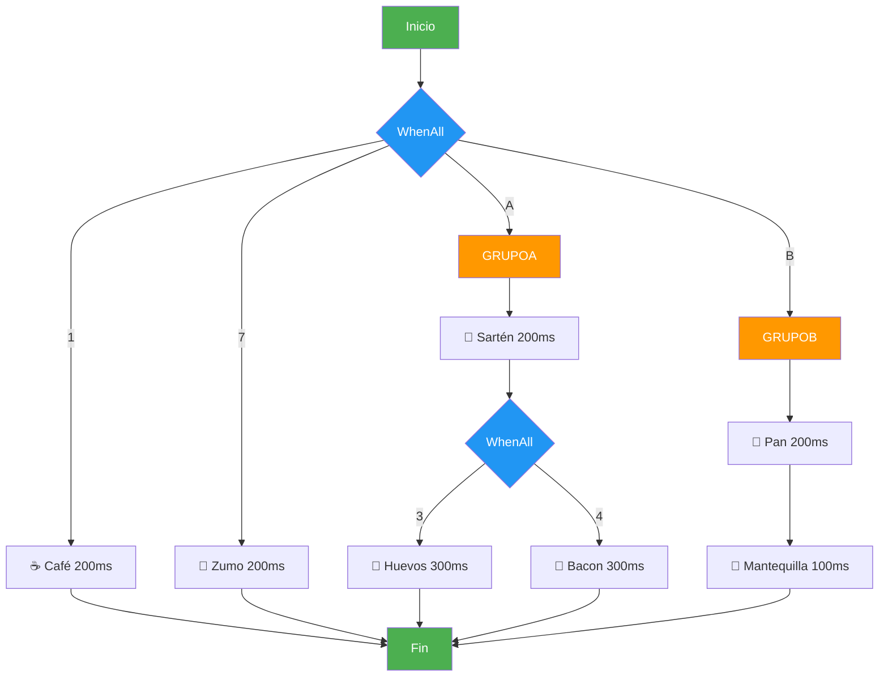

# Ejemplo 02: Desayuno Asíncrono

## ¿Qué aprenderás?

- Por qué `async/await` **solo no mejora** el rendimiento
- Cómo el **diseño** de qué paralelizamos marca la diferencia
- Uso de `Task.WhenAll` con **grupos de tareas**
- `CancellationToken` para abortar operaciones que se pasan de tiempo
- La diferencia entre "async malo" y "async bueno"

## Las 7 acciones del desayuno

| # | Acción | Tiempo | ¿Depende de algo? |
|---|--------|--------|--------------------|
| 1 | Hacer café | 200ms | No |
| 2 | Calentar sartén | 200ms | No |
| 3 | Freír huevos | 300ms | Sí → necesita sartén caliente (2) |
| 4 | Freír bacon | 300ms | Sí → necesita sartén caliente (2) |
| 5 | Tostar pan | 200ms | No |
| 6 | Untar mantequilla | 100ms | Sí → necesita pan tostado (5) |
| 7 | Hacer zumo | 200ms | No |

> 💡 **Clave:** Las acciones 1, 2, 5 y 7 son **independientes**. Las acciones 3 y 4 necesitan la 2. La 6 necesita la 5. Esto define qué podemos paralelizar.

## Los 5 modos de ejecución

### PARTE 1: Secuencial

```
1 → 2 → 3 → 4 → 5 → 6 → 7
```

Todo uno tras otro. Tiempo total = **1500ms**.

### PARTE 2: Asíncrono malo

```csharp
await HacerCafeAsync();      // 200ms
await CalentarSartenAsync();  // 200ms
await FreirHuevosAsync();     // 300ms
// ... uno tras otro
```

Usamos `async/await` pero **cada tarea espera a la anterior**. Es igual de lento: **1500ms**.

> ⚠️ **Error común:** Pensar que `async/await` automáticamente paraleliza. NO. Solo libera el hilo mientras espera, pero si haces `await` secuencial, estás igual que antes.

### PARTE 3: Asíncrono bueno



**Estructura:**
```
WhenAll(1, A, B, 7)              ← 4 grupos en paralelo
├── 1. Café (200ms)
├── A = secuencial(2, WhenAll(3,4)) = 200 + 300 = 500ms
│   ├── 2. Calentar sartén (200ms)
│   └── WhenAll(3, 4)
│       ├── 3. Freír huevos (300ms)
│       └── 4. Freír bacon (300ms)
├── B = secuencial(5, 6) = 200 + 100 = 300ms
│   ├── 5. Tostar pan (200ms)
│   └── 6. Untar mantequilla (100ms)
└── 7. Zumo (200ms)
```

**Tiempo total = máx(200, 500, 300, 200) = 500ms** → ¡3x más rápido!

### PARTE 4: Async malo + CancellationToken (500ms) → FALLA

```csharp
using var cts = new CancellationTokenSource();
cts.CancelAfter(500);

await HacerCafeAsync(cts.Token);       // 200ms
await CalentarSartenAsync(cts.Token);  // 200ms (400ms total)
await FreirHuevosAsync(cts.Token);     // 300ms (700ms total) → ¡CANCELADO!
```

El modo secuencial necesita 1500ms pero el timeout es 500ms. **Falla en la acción 3**.

**Mensaje:** "¡El café se ha enfriado! ☕❄️"

### PARTE 5: Async bueno + CancellationToken (500ms) → PASA

```csharp
using var cts = new CancellationTokenSource();
cts.CancelAfter(500);

await Task.WhenAll(
    HacerCafeAsync(cts.Token),      // 200ms
    EjecutarGrupoA(cts.Token),      // 500ms
    EjecutarGrupoB(cts.Token),      // 300ms
    HacerZumoAsync(cts.Token)       // 200ms
); // Total: 500ms → ¡CABE EN EL TIMEOUT!
```

El modo paralelo necesita 500ms y el timeout es 500ms. **¡Pasa por los pelos!**

**Mensaje:** "¡A tiempo! Café calentito, huevos perfectos. ☕🍳"

## Tabla comparativa de tiempos

| Modo | Tiempo | ¿Cumple 500ms? | Descripción |
|------|--------|-----------------|-------------|
| **Secuencial** | 1500ms | ❌ NO | Todo uno tras otro |
| **Async malo** | 1500ms | ❌ NO | `await` secuencial, sin paralelismo |
| **Async bueno** | 500ms | ✅ SÍ | `Task.WhenAll` con grupos |
| **Async malo + CT** | ~700ms | ❌ FALLA | Cancelado en acción 3 |
| **Async bueno + CT** | 500ms | ✅ PASA | Justo a tiempo |

## Por qué el diseño importa

> 💡 **El problema no es el código, es el DISEÑO.**

Mismo lenguaje, mismas herramientas, resultados radicalmente diferentes:

| Diseño | Tiempo | Ejemplo real |
|--------|--------|--------------|
| Secuencial | 1500ms | Netflix carga películas una por una |
| Paralelo sin diseño | 1500ms | Netflix hace `await` de cada peli |
| Paralelo con diseño | 500ms | Netflix carga portadas, géneros y recomendaciones a la vez |

📌 **Ejemplo real:** Netflix no carga tus recomendaciones después de cargar el catálogo. Lanza **todas las peticiones en paralelo** y muestra lo que llegue primero. Si hiciera `await` secuencial, tardaría 10x más.

## CancellationToken: ¿por qué es valioso?

Un `CancellationToken` es un **mecanismo de aborto controlado**. Permite cancelar operaciones asíncronas de forma limpia.

### Casos de uso reales

| Escenario | Timeout | Acción al cancelar |
|-----------|---------|-------------------|
| API con timeout | 5s | Devolver 408 Request Timeout |
| Llamada a base de datos | 3s | Cerrar conexión y retry |
| Descarga de fichero | 30s | Eliminar fichero parcial |
| Café frío ☕ | 500ms | "¡El café se ha enfriado!" |

### Cómo funciona

```csharp
using var cts = new CancellationTokenSource();
cts.CancelAfter(500); // Cancelar después de 500ms

// Pasar el token a cada método
await HacerCafeAsync(cts.Token);
await CalentarSartenAsync(cts.Token);
// Si supera 500ms → OperationCanceledException
```

> 💡 **Analogía:** Es como poner una alarma. Si el desayuno no está listo cuando suena la alarma, cancelas todo y te tomas el café frío (que no tiene gracia).

## Ejecución

```bash
dotnet run
```

## Errores comunes

| Error | Consecuencia | Cómo evitarlo |
|-------|-------------|---------------|
| Olvidar `await` | Tarea lanzada pero no esperada | Siempre usar `await` |
| `await` secuencial | Sin paralelismo, lento | Usar `Task.WhenAll` |
| No pasar `CancellationToken` | No se puede cancelar | Siempre pasar el token |
| Paralelizar dependencias | Error o resultado incorrecto | Diseñar el grafo de dependencias |
| `.Result` o `.Wait()` | Deadlock en UI/ASP.NET | Usar `await` |

## Lección clave

```
┌─────────────────────────────────────────────────────┐
│  1. async/await SOLO no mejora el rendimiento       │
│  2. El DISEÑO de qué paralelizamos es lo importante │
│  3. CancellationToken permite abortar a tiempo      │
│  4. Un café frío a las 7am es un drama              │
└─────────────────────────────────────────────────────┘
```

## Ejercicio propuesto

1. **Añadir una 8ª acción:** Guardar platos en el lavavajillas (150ms). ¿Dónde encaja en el grafo de dependencias? ¿Es paralela o depende de algo?

2. **Cambiar el timeout a 400ms:** ¿Qué pasa con el modo async bueno? ¿Y con 600ms?

3. **Añadir una acción que dependa de TODO:** "Servir la mesa" solo puede empezar cuando TODAS las demás hayan terminado. ¿Cómo lo harías?

## Referencias

- [Programación asíncrona con async y await (Microsoft)](https://learn.microsoft.com/es-es/dotnet/csharp/asynchronous-programming/)
- [Task.WhenAll (Microsoft)](https://learn.microsoft.com/es-es/dotnet/api/system.threading.tasks.task.whenall)
- [CancellationToken (Microsoft)](https://learn.microsoft.com/es-es/dotnet/api/system.threading.cancellationtoken)
