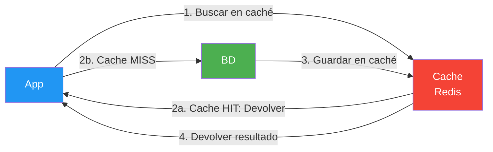

# Ejemplo 05: Redis con Cache-Aside

## Descripción

Este ejemplo muestra cómo usar **Redis** como caché distribuida con el patrón **Cache-Aside** usando el driver nativo `StackExchange.Redis`.

## Conceptos Clave

### ¿Qué es Redis?

Redis (Remote Dictionary Server) es una base de datos en memoria, ultra-rápida, que almacena datos como pares clave-valor. Es ideal para:

- **Caché**: Resultados de consultas frecuentes
- **Sesiones**: Estado de usuarios en_APPS web
- **Colas de mensajes**: Comunicación entre servicios
- **Contadores**: Conteos en tiempo real

### Patrón Cache-Aside

El patrón Cache-Aside (también llamado "Lazy Loading") es el patrón de caché más común:



| Paso | Acción | Descripción |
|------|--------|-------------|
| 1 | **Get** | La app busca la clave en Redis |
| 2a | **Cache Hit** | Si existe → devuelve el valor (rápido: ~1ms) |
| 2b | **Cache Miss** | Si no existe → consulta la BD |
| 3 | **Set** | Guarda el resultado en Redis con TTL |
| 4 | **Return** | Devuelve el dato a la app |

### ¿Por qué Cache-Aside?

- **Rendimiento**: Las consultas a Redis son ~100x más rápidas que a una BD
- **Reducción de carga**: La BD recibe menos peticiones
- **Control total**: La app decide qué cachear y cuándo invalidar
- **Tolerancia a fallos**: Si Redis cae, la app sigue funcionando (fallback a BD)

📌 Ejemplo real: **Netflix** usa Redis para cachear las listas de recomendaciones de cada usuario. Cuando abres Netflix, los títulos que ves primero vienen de Redis, no de la base de datos principal.

### StackExchange.Redis

`StackExchange.Redis` es el driver más popular para Redis en .NET:

| Característica | Descripción |
|----------------|-------------|
| **Pool de conexiones** | Reutiliza conexiones automáticamente |
| **Reconexión** | Se reconecta si Redis se cae |
| **Serialización** | Usa `System.Text.Json` internamente |
| **Async/Await** | API completamente asíncrona |
| **Pub/Sub** | Soporte para mensajería |

### Docker Compose

Levanta Redis 7 con Redis Commander (interfaz web):

```bash
docker-compose up -d
# o con Podman: podman-compose up -d
```

Acceso a Redis Commander: `http://localhost:8081`

## Prerrequisitos

1. Docker y Docker Compose (o Podman y Podman Compose) instalados
2. .NET 10 SDK

## Ejecución

```bash
# 1. Levantar Redis y Redis Commander
docker-compose up -d
# o con Podman: podman-compose up -d

# 2. Ejecutar el ejemplo
dotnet run

# 3. Parar Redis
docker-compose down
# o con Podman: podman-compose down
```

## Estructura

```
05-Redis-Cache/
├── 05-Redis-Cache.slnx
├── 05-Redis-Cache/
│   ├── 05-Redis-Cache.csproj
│   ├── Program.cs
│   ├── Models/
│   │   └── Producto.cs
│   ├── Services/
│   │   ├── ICacheService.cs
│   │   ├── RedisCacheService.cs
│   │   ├── IProductoService.cs
│   │   └── ProductoService.cs
│   └── docker-compose.yml
└── README.md
```

## Paquetes NuGet

| Paquete | Versión | Descripción |
|---------|---------|-------------|
| `StackExchange.Redis` | 2.8.24 | Driver nativo de Redis |
| `Microsoft.Extensions.DependencyInjection` | 9.0.0 | Inyección de dependencias |

## Caducidad (TTL)

El patrón Cache-Aside usa **TTL** (Time To Live) para expirar automáticamente las entradas:

```csharp
// Caducidad de 30 minutos
await cache.SetAsync(key, value, TimeSpan.FromMinutes(30));
```

| Estrategia | TTL | Cuándo usarla |
|------------|-----|---------------|
| **Corto** | 1-5 min | Datos que cambian frecuentemente |
| **Medio** | 10-60 min | Catálogos, listados |
| **Largo** | horas/días | Datos estáticos, configuración |

## Invalidación de Caché

Cuando los datos cambian en la BD, hay que invalidar la caché:

```csharp
// Opción 1: Eliminar la clave
await cache.RemoveAsync("producto:1");

// Opción 2: Actualizar el valor
await cache.SetAsync("producto:1", productoActualizado);
```

## Casos de Uso

- **APIs REST**: Cachear respuestas de consultas frecuentes
- **Sesiones de usuario**: Almacenar estado de sesión
- **Rate Limiting**: Controlar peticiones por IP
- **Distribución de carga**: Colas de tareas entre workers

## Referencias

- [StackExchange.Redis (GitHub)](https://github.com/StackExchange/StackExchange.Redis)
- [Documentación Redis](https://redis.io/docs/)
- [Patrón Cache-Aside (Microsoft)](https://learn.microsoft.com/es-es/azure/architecture/cache-patterns/cache-aside)
