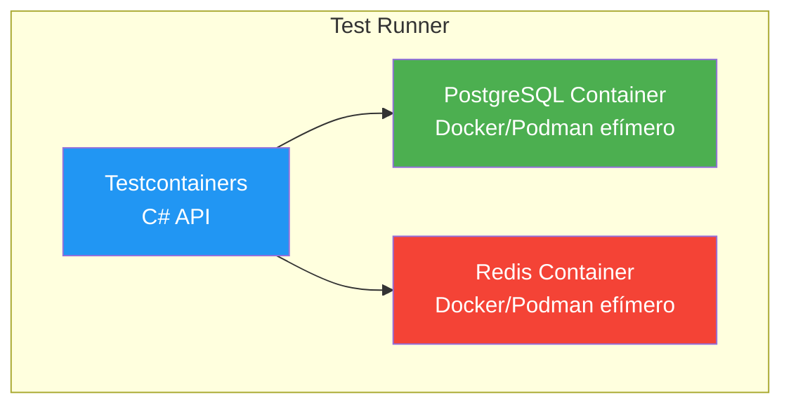

# Ejemplo 08: Tests de Integración con TestContainers

## Descripción

Este ejemplo muestra cómo escribir **tests de integración** usando **TestContainers** para levantar contenedores Docker (o Podman) efímeros (PostgreSQL y Redis) durante la ejecución de los tests.

## Conceptos Clave

### ¿Qué es TestContainers?

TestContainers es una librería que levanta contenedores Docker (o Podman) reales durante la ejecución de tests. Cada suite de tests crea sus propios contenedores, los usa y los destruye automáticamente.



📌 Ejemplo real: **Netflix** usa TestContainers para probar sus servicios que dependen de bases de datos y colas de mensajería. Cada ejecución de tests levanta un entorno completo y aislado.

### ¿Por qué TestContainers?

| Enfoque | Ventaja | Desventaja |
|---------|---------|------------|
| **SQLite en memoria** | Rápido | Diferente de PostgreSQL real |
| **BD externa fija** | Real | Dependencia, no aislado |
| **TestContainers** | Real + aislado | Requiere Docker/Podman |

### Patrón AAA (Arrange-Act-Assert)

Cada test sigue el patrón AAA:

```csharp
[Test]
public async Task Create_InsertsProduct()
{
    // Arrange: Preparar datos
    var producto = new Producto(0, "Teclado", 79.99m, "Periféricos");

    // Act: Ejecutar la operación
    var resultado = await _repository.CreateAsync(producto);

    // Assert: Verificar el resultado
    resultado.Id.Should().BeGreaterThan(0);
}
```

### Aislamiento de Tests

Cada test tiene su propia base de datos limpia:

```csharp
[SetUp]
public async Task SetUp()
{
    // Crear BD fresca para cada test
    await _context.Database.EnsureCreatedAsync();
}

[TearDown]
public async Task TearDown()
{
    // Destruir BD después de cada test
    await _context.Database.EnsureDeletedAsync();
}
```

## Prerrequisitos

1. **Docker Desktop** (o **Podman Desktop**) instalado y ejecutándose
2. .NET 10 SDK

> ⚠️ **Importante:** Sin Docker/Podman, los tests no pueden ejecutarse. TestContainers necesita un motor de contenedores para crear los contenedores.

## Ejecución

```bash
# 1. Asegurar que Docker/Podman está ejecutándose
docker ps
# o con Podman: podman ps

# 2. Ejecutar los tests
dotnet test

# 3. Ejecutar con verbosidad para ver detalles
dotnet test --verbosity normal

# 4. Ejecutar un test específico
dotnet test --filter "FullyQualifiedName~Create_InsertsProduct"
```

## Estructura

```
08-TestContainers/
├── 08-TestContainers.slnx
├── 08-TestContainers/                    # Proyecto principal
│   ├── 08-TestContainers.csproj
│   ├── Program.cs
│   ├── Models/
│   │   └── Producto.cs
│   ├── Entity/
│   │   └── ProductoEntity.cs
│   ├── Repositories/
│   │   ├── AppDbContext.cs
│   │   └── ProductoRepository.cs
│   └── docker-compose.yml
├── 08-TestContainers.Tests/              # Proyecto de tests
│   ├── 08-TestContainers.Tests.csproj
│   └── ProductoRepositoryTests.cs
└── README.md
```

## Paquetes NuGet

### Proyecto Principal

| Paquete | Versión | Descripción |
|---------|---------|-------------|
| `Microsoft.EntityFrameworkCore` | 9.0.2 | ORM para acceso a datos |
| `Npgsql.EntityFrameworkCore.PostgreSQL` | 9.0.2 | Provider EF Core para PostgreSQL |
| `Microsoft.Extensions.DependencyInjection` | 9.0.0 | Inyección de dependencias |

### Proyecto de Tests

| Paquete | Versión | Descripción |
|---------|---------|-------------|
| `Testcontainers` | 4.3.0 | Contenedores Docker para tests |
| `Testcontainers.PostgreSql` | 4.3.0 | Contenedor PostgreSQL |
| `NUnit` | 4.3.2 | Framework de tests |
| `NUnit3TestAdapter` | 5.0.0 | Integración con IDE |
| `FluentAssertions` | 6.12.2 | Aserciones fluidas |
| `Microsoft.NET.Test.Sdk` | 17.14.0 | Runtime de tests |
| `coverlet.collector` | 6.0.4 | Cobertura de código |

## Tests Incluidos

| Test | Descripción |
|------|-------------|
| `Create_InsertsProduct` | Verifica que un producto se inserta correctamente |
| `GetAll_ReturnsAllProducts` | Verifica que devuelve todos los productos |
| `GetById_ExistingProduct_ReturnsProduct` | Verifica búsqueda por ID existente |
| `GetById_NonExistingProduct_ReturnsNull` | Verifica que devuelve null si no existe |
| `Delete_ExistingProduct_RemovesProduct` | Verifica que elimina un producto |

## Casos de Uso

- **Tests de repositorio**: Verificar consultas correctas contra BD real
- **Tests de servicios**: Verificar lógica de negocio con datos reales
- **Tests de migraciones**: Verificar que EF Core crea las tablas correctamente
- **Tests de integración**: Verificar que componentes trabajan juntos

## Referencias

- [TestContainers for .NET (GitHub)](https://github.com/testcontainers/testcontainers-dotnet)
- [NUnit Documentation](https://docs.nunit.org/)
- [FluentAssertions](https://fluentassertions.com/)
- [Entity Framework Core Testing](https://learn.microsoft.com/es-es/ef/core/testing/)
