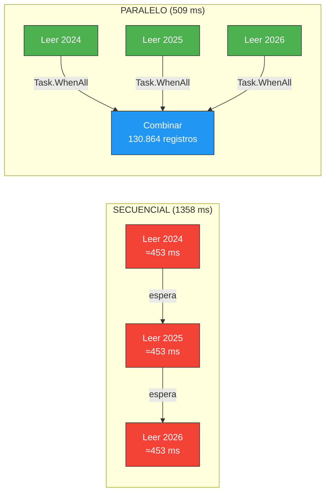
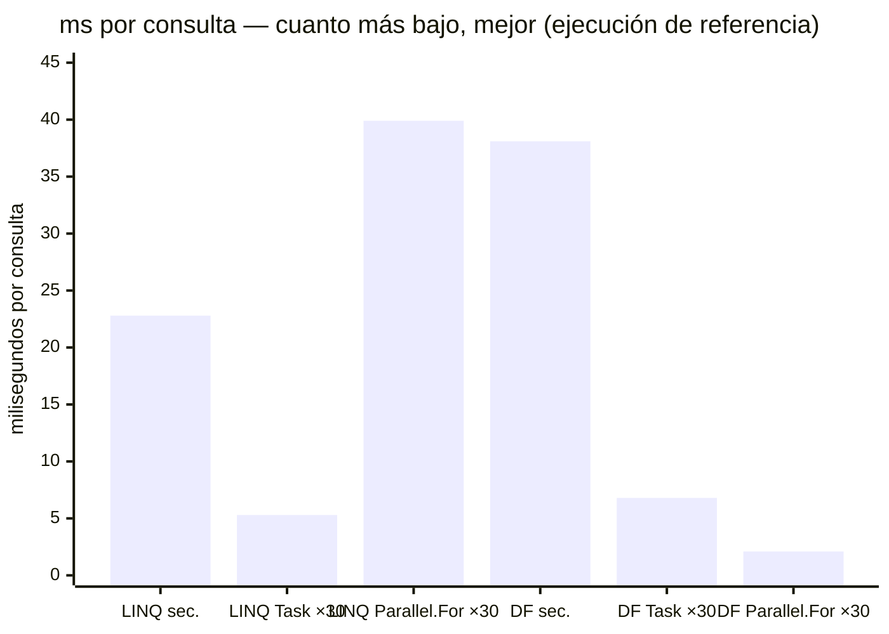
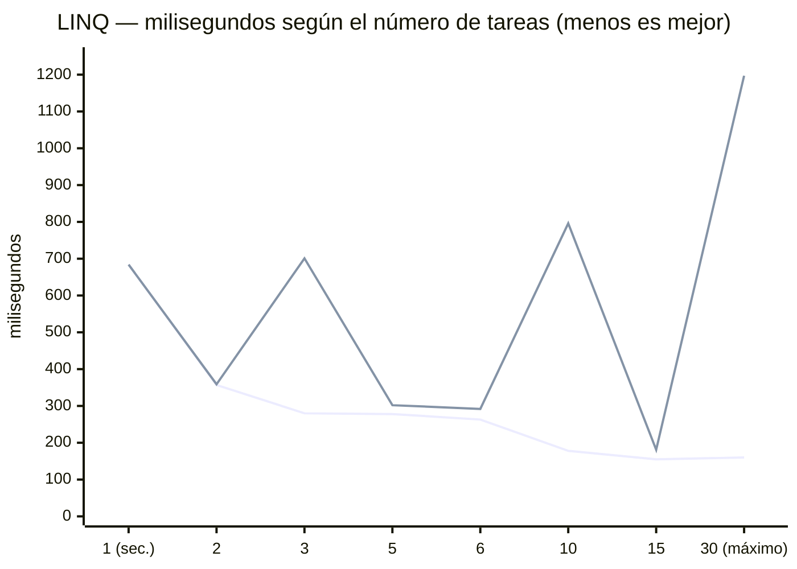
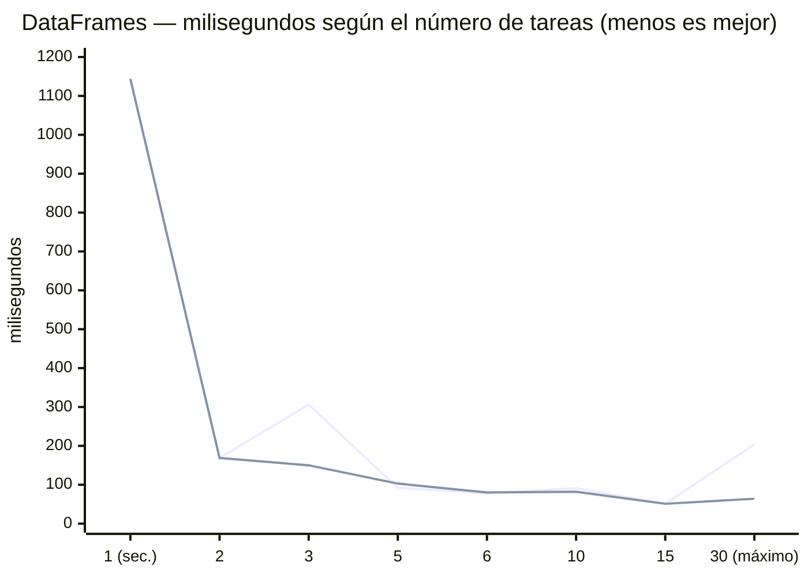
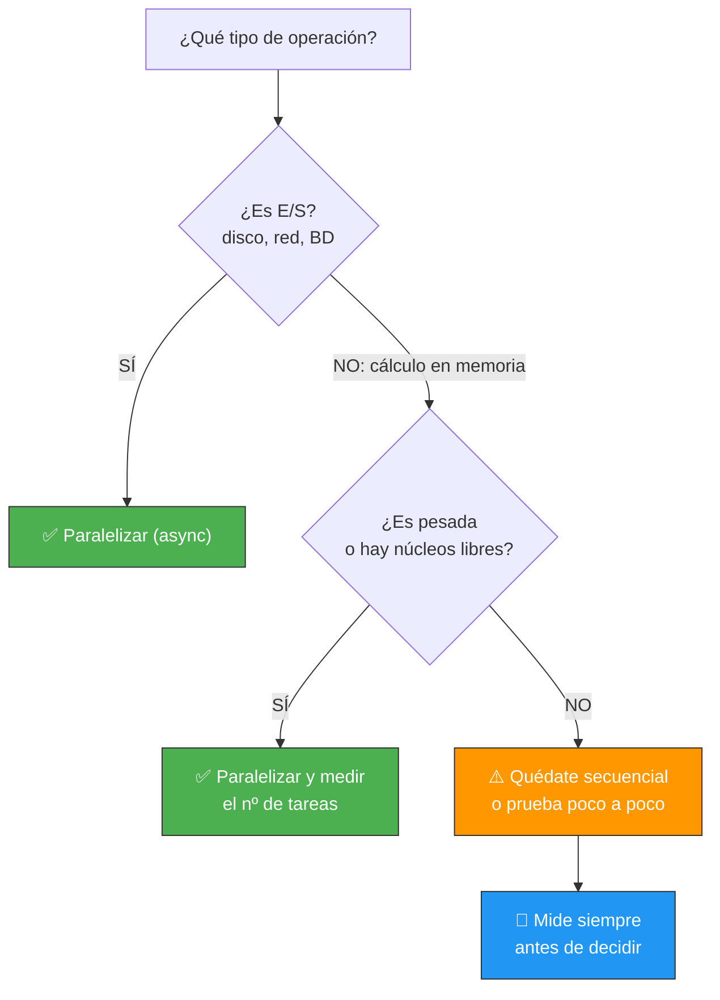

# 09-AccidentesMadrid — E/S paralela y cálculo paralelo (Task.WhenAll y Parallel.For)

Solución de la **práctica 05** de la UD01: analizamos **130.864 accidentes de Madrid** (2024, 2025 y 2026) con las **30 consultas del enunciado**, primero con **LINQ** y luego con **DataFrames**.

Pero esta solución va más allá de responder a las consultas: **mide**. Comparamos la lectura de ficheros (E/S) secuencial y paralela, y el cálculo en memoria con **dos motores de paralelismo** (`Task.WhenAll` y `Parallel.For`), cada uno con **8 variantes de granularidad** (de 1 sola tarea a 30). Al final tienes una pregunta contestada con datos: ***¿merece la pena paralelizar, con qué motor y con cuántas tareas?***

## Índice

- [1. Qué mide esta solución](#1-qué-mide-esta-solución)
- [2. Cómo ejecutarlo](#2-cómo-ejecutarlo)
- [3. La salida real, desde el principio](#3-la-salida-real-desde-el-principio)
- [4. Análisis de los cuatro experimentos](#4-análisis-de-los-cuatro-experimentos)
  - [4.1. E/S: paralelizar SÍ mejora (FASE 1)](#41-es-paralelizar-sí-mejora-fase-1)
  - [4.2. Task.WhenAll sobre cálculo (FASE 2 y 3)](#42-taskwhenall-sobre-cálculo-fase-2-y-3)
  - [4.3. Parallel.For sobre cálculo (FASE 4 y 5)](#43-parallelfor-sobre-cálculo-fase-4-y-5)
  - [4.4. Cara a cara: los dos motores en ×30](#44-cara-a-cara-los-dos-motores-en-30)
- [5. El precio de cada tarea (precio por hilo)](#5-el-precio-de-cada-tarea-precio-por-hilo)
- [6. Task para E/S, parallel para memoria](#6-task-para-es-parallel-para-memoria)
  - [6.1. La tabla de decisión](#61-la-tabla-de-decisión)
  - [6.2. Anti-patrones: lo que NO hay que hacer](#62-anti-patrones-lo-que-no-hay-que-hacer)
  - [6.3. La regla, en una frase](#63-la-regla-en-una-frase)
- [7. ¿Cuántas tareas? la forma de valle](#7-cuántas-tareas-la-forma-de-valle)
- [8. Parallel.For con paquetes exactos (los mismos casos)](#8-parallelfor-con-paquetes-exactos-los-mismos-casos)
- [9. Regla de oro y casuísticas](#9-regla-de-oro-y-casuísticas)
- [10. Los milisegundos importan](#10-los-milisegundos-importan)
- [11. Estructura y tests](#11-estructura-y-tests)

---

## 1. Qué mide esta solución

El programa ejecuta **5 fases** y las cronometra todas:

| Fase | Qué hace | Motor |
|------|----------|-------|
| **FASE 1** | Leer 3 CSV de disco (E/S): secuencial y en paralelo | `Task.WhenAll` (async) |
| **FASE 2** | 30 consultas LINQ: secuencial, ×30 y 6 variantes de lotes | `Task.WhenAll` |
| **FASE 3** | 30 consultas DataFrame: secuencial, ×30 y 6 variantes de lotes | `Task.WhenAll` |
| **FASE 4** | Las mismas 30 consultas LINQ, de 0 a 30 tareas | `Parallel.For` |
| **FASE 5** | Las mismas 30 consultas DataFrame, de 0 a 30 tareas | `Parallel.For` |

**Matriz completa de casos** (lo que se mide, 58 tiempos en total):

| | Secuencial (1 × 30) | ×30 (una tarea por consulta) | Lotes (2, 3, 5, 6, 10 y 15 tareas) |
|---|---|---|---|
| **E/S** — 3 ficheros | ✅ | ✅ (3 tareas) | — |
| **LINQ** + Task.WhenAll | ✅ | ✅ | ✅ 6 variantes |
| **LINQ** + Parallel.For | ✅ | ✅ | ✅ 6 variantes (paquetes) |
| **DataFrame** + Task.WhenAll | ✅ | ✅ | ✅ 6 variantes |
| **DataFrame** + Parallel.For | ✅ | ✅ | ✅ 6 variantes (paquetes) |

- Las **30 consultas** son exactamente las del [enunciado de la práctica 05](../../practicas/05-accidentes-madrid.md): totales, agrupaciones por distrito/tipo/año/sexo/día/mes, filtros de peatones y alcohol, hora punta, comparativas entre años, etc. Están implementadas **dos veces**: en `AccidentesLinqAnalyzer` (LINQ) y en `AccidentesDataFrameAnalyzer` (DataFrames).
- Las variantes de lote **dividen 30 en partes iguales**: 2×15, 3×10, 5×6, 6×5, 10×3 y 15×2 (ni 1 tarea, ni 30).
- **12 tests** (`dotnet test`) verifican las consultas LINQ: conteos, agrupaciones, filtros, PLINQ y casos límite.

> 💡 **Punto de partida:** si te dijera "paralelizar es más rápido", ¿lo creerías sin mirar un cronómetro? Esta solución hace justo eso: **mide antes de afirmar**.

## 2. Cómo ejecutarlo

Requiere los 3 CSV de [datos.madrid.es](https://datos.madrid.es) en `data/` (2024, 2025 y 2026).

```bash
# Ejecutar las 5 fases + resúmenes
dotnet run

# Tests de las consultas LINQ (12 tests: conteos, agrupaciones, filtros, PLINQ y casos límite)
dotnet test

# Con Docker o Podman
docker compose up --build
```

## 3. La salida real, desde el principio

> 📝 **Nota:** esta es la salida completa de **una ejecución real** (ejecución de referencia del profesor), **desde el banner hasta la lección final**. Las líneas de la salida de detalle de las consultas se abrevian con `...` (la salida completa tiene unas 7.400 líneas). En tu máquina los números **cambian**: dependen de los núcleos, de la CPU libre en ese momento y de la carga del sistema. No te aprendas las cifras — **ejecuta y mide**.

```
╔═══════════════════════════════════════════════════════════════╗
║  ANÁLISIS DE ACCIDENTES DE MADRID                            ║
║  E/S Paralela vs Cálculo Paralelo                           ║
╚═══════════════════════════════════════════════════════════════╝

[21:54:41.946] [INF] Thread: ═══ FASE 1: LECTURA DE FICHEROS (E/S) ═══

[21:54:41.957] [INF] Thread: Lectura SECUENCIAL (uno detrás de otro)...
[21:54:42.558] [INF] Thread:   2024: 49340 registros
[21:54:43.050] [INF] Thread:   2025: 51067 registros
[21:54:43.315] [INF] Thread:   2026: 30457 registros
[21:54:43.315] [INF] Thread:   ⏱ Secuencial: 1358 ms

[21:54:43.316] [INF] Thread: Lectura PARALELA (las 3 a la vez)...
[21:54:43.316] [INF] Thread:   3 tareas lanzadas, esperando con Task.WhenAll...
[21:54:43.825] [INF] Thread:   2024: 49340 registros
[21:54:43.825] [INF] Thread:   2025: 51067 registros
[21:54:43.825] [INF] Thread:   2026: 30457 registros
[21:54:43.825] [INF] Thread:   ⏱ Paralelo: 509 ms

[21:54:43.826] [INF] Thread:   TOTAL: 130864 registros combinados
[21:54:43.826] [INF] Thread:   Speedup E/S: 2.67x — "SÍ mejora (la E/S espera: mientras un hilo espera, otro trabaja)"

[21:54:43.827] [INF] Thread: ═══ FASE 2: CONSULTAS LINQ (CÁLCULO EN MEMORIA) ═══

[21:54:43.827] [INF] Thread: LINQ SECUENCIAL...
... (salida de las 30 consultas: total, por distrito, por tipo, por año, peatones, hora punta...) ...
[21:54:44.511] [INF] Thread:   ⏱ LINQ secuencial: 684 ms

[21:54:44.511] [INF] Thread: LINQ PARALELO (Task.WhenAll)...
... (las mismas 30 consultas, cada una en su propia tarea) ...
[21:54:44.672] [INF] Thread:   ⏱ LINQ paralelo: 160 ms

[21:54:44.672] [INF] Thread:   Speedup LINQ: 4.28x — "SÍ mejora en esta ejecución (núcleos libres + consultas con recorrido)"

[21:54:44.672] [INF] Thread: LINQ POR LOTES (3×10, 10×3, 5×6, 6×5, 2×15, 15×2)...
[21:54:44.953] [INF] Thread:   ⏱ 3 tareas × 10 consultas: 280 ms
[21:54:45.132] [INF] Thread:   ⏱ 10 tareas × 3 consultas: 178 ms
[21:54:45.411] [INF] Thread:   ⏱ 5 tareas × 6 consultas: 278 ms
[21:54:45.675] [INF] Thread:   ⏱ 6 tareas × 5 consultas: 263 ms
[21:54:46.032] [INF] Thread:   ⏱ 2 tareas × 15 consultas: 357 ms
[21:54:46.187] [INF] Thread:   ⏱ 15 tareas × 2 consultas: 155 ms

[21:54:46.187] [INF] Thread: ═══ FASE 3: CONSULTAS DATAFRAMES ═══

[21:54:46.188] [INF] Thread: DataFrames SECUENCIAL...
... (DataFrame de 130.864 filas + salida de las 30 consultas) ...
[21:54:47.332] [INF] Thread:   ⏱ DataFrames secuencial: 1144 ms

[21:54:47.332] [INF] Thread: DataFrames PARALELO...
... (las mismas 30 consultas, cada una en su propia tarea) ...
[21:54:47.537] [INF] Thread:   ⏱ DataFrames paralelo: 204 ms

[21:54:47.537] [INF] Thread:   Speedup DataFrames: 5.61x — "SÍ mejora en esta ejecución (consultas DataFrame pesadas > overhead)"

[21:54:47.537] [INF] Thread: DataFrames POR LOTES (3×10, 10×3, 5×6, 6×5, 2×15, 15×2)...
[21:54:47.844] [INF] Thread:   ⏱ 3 tareas × 10 consultas: 306 ms
[21:54:47.935] [INF] Thread:   ⏱ 10 tareas × 3 consultas: 91 ms
[21:54:48.028] [INF] Thread:   ⏱ 5 tareas × 6 consultas: 92 ms
[21:54:48.106] [INF] Thread:   ⏱ 6 tareas × 5 consultas: 78 ms
[21:54:48.275] [INF] Thread:   ⏱ 2 tareas × 15 consultas: 169 ms
[21:54:48.327] [INF] Thread:   ⏱ 15 tareas × 2 consultas: 51 ms

[21:54:48.327] [INF] Thread: ═══ FASE 4: CONSULTAS LINQ CON MOTOR PARALLEL.FOR ═══

[21:54:48.327] [INF] Thread: LINQ con Parallel.For (una iteración por consulta)...
... (las mismas 30 consultas, una por iteración del bucle) ...
[21:54:49.524] [INF] Thread:   ⏱ LINQ Parallel.For ×30: 1197 ms
[21:54:49.525] [INF] Thread:   Speedup LINQ Parallel.For: 0.57x

[21:54:49.525] [INF] Thread: LINQ Parallel.For POR LOTES (3×10, 10×3, 5×6, 6×5, 2×15, 15×2)...
[21:54:50.226] [INF] Thread:   ⏱ 3 paquetes × 10 consultas: 701 ms
[21:54:51.023] [INF] Thread:   ⏱ 10 paquetes × 3 consultas: 796 ms
[21:54:51.325] [INF] Thread:   ⏱ 5 paquetes × 6 consultas: 302 ms
[21:54:51.617] [INF] Thread:   ⏱ 6 paquetes × 5 consultas: 292 ms
[21:54:51.976] [INF] Thread:   ⏱ 2 paquetes × 15 consultas: 359 ms
[21:54:52.158] [INF] Thread:   ⏱ 15 paquetes × 2 consultas: 181 ms

[21:54:52.158] [INF] Thread: ═══ FASE 5: CONSULTAS DATAFRAMES CON MOTOR PARALLEL.FOR ═══

[21:54:52.158] [INF] Thread: DataFrames con Parallel.For (una iteración por consulta)...
... (las mismas 30 consultas, una por iteración del bucle) ...
[21:54:52.223] [INF] Thread:   ⏱ DataFrames Parallel.For ×30: 64 ms
[21:54:52.223] [INF] Thread:   Speedup DataFrames Parallel.For: 17.88x

[21:54:52.223] [INF] Thread: DataFrames Parallel.For POR LOTES (3×10, 10×3, 5×6, 6×5, 2×15, 15×2)...
[21:54:52.373] [INF] Thread:   ⏱ 3 paquetes × 10 consultas: 150 ms
[21:54:52.456] [INF] Thread:   ⏱ 10 paquetes × 3 consultas: 82 ms
[21:54:52.559] [INF] Thread:   ⏱ 5 paquetes × 6 consultas: 103 ms
[21:54:52.640] [INF] Thread:   ⏱ 6 paquetes × 5 consultas: 80 ms
[21:54:52.810] [INF] Thread:   ⏱ 2 paquetes × 15 consultas: 169 ms
[21:54:52.861] [INF] Thread:   ⏱ 15 paquetes × 2 consultas: 51 ms

═══════════════════════════════════════════════════════════════
  RESUMEN: E/S vs CÁLCULO (las 30 consultas, ×30)
═══════════════════════════════════════════════════════════════

  FASE 1 — E/S (lectura de ficheros):
    Secuencial:    1358 ms
    Paralelo:       509 ms
    Speedup:       2,67x  ← SÍ mejora (la E/S espera: mientras un hilo espera, otro trabaja)

  FASE 2/4 — LINQ (cálculo en memoria):
    Secuencial:          684 ms
    Task.WhenAll:        160 ms  ← 4,28x
    Parallel.For:       1197 ms  ← 0,57x

  FASE 3/5 — DataFrames (cálculo en memoria):
    Secuencial:         1144 ms
    Task.WhenAll:        204 ms  ← 5,61x
    Parallel.For:         64 ms  ← 17,88x

═══════════════════════════════════════════════════════════════
  RESUMEN: ¿CUÁNTAS TAREAS PARA LAS 30 CONSULTAS? (ms)
═══════════════════════════════════════════════════════════════

  FASE 2/4 — LINQ
    Variante                    Task.WhenAll    Parallel.For
    Secuencial:   1 × 30              684 ms               —
    Lotes:        2 × 15              357 ms          359 ms
    Lotes:        3 × 10              280 ms          701 ms
    Lotes:        5 × 6               278 ms          302 ms
    Lotes:        6 × 5               263 ms          292 ms
    Lotes:       10 × 3               178 ms          796 ms
    Lotes:       15 × 2               155 ms          181 ms
    Paralelo:    30 × 1               160 ms         1197 ms
    → Mejor con Task.WhenAll: Lotes:       15 × 2 (155 ms)
    → Mejor con Parallel.For: Lotes:       15 × 2 (181 ms)

  FASE 3/5 — DataFrames
    Variante                    Task.WhenAll    Parallel.For
    Secuencial:   1 × 30             1144 ms               —
    Lotes:        2 × 15              169 ms          169 ms
    Lotes:        3 × 10              306 ms          150 ms
    Lotes:        5 × 6                92 ms          103 ms
    Lotes:        6 × 5                78 ms           80 ms
    Lotes:       10 × 3                91 ms           82 ms
    Lotes:       15 × 2                51 ms           51 ms
    Paralelo:    30 × 1               204 ms           64 ms
    → Mejor con Task.WhenAll: Lotes:       15 × 2 (51 ms)
    → Mejor con Parallel.For: Lotes:       15 × 2 (51 ms)

    → Mejor LINQ global:      Task.WhenAll · Lotes:       15 × 2 (155 ms)
    → Mejor DataFrame global: Task.WhenAll · Lotes:       15 × 2 (51 ms)
    (En otra máquina con otros recursos puede ganar otra variante: MIDE).

═══════════════════════════════════════════════════════════════
  LECCIÓN:
  1. E/S → paralelizar SÍ casi siempre mejora (espera disco/red/BD).
  2. Cálculo en memoria → DEPENDE de los recursos libres:
     - Núcleos disponibles + consultas pesadas → SÍ mejora (DataFrames).
     - CPU ocupada o consultas muy baratas     → puede no mejorar (LINQ).
  3. La granularidad IMPORTA con CUALQUIER motor: ni 1 sola tarea
     (secuencial), ni 30 (máximo overhead). El óptimo se BUSCA midiendo.
  4. Task.WhenAll (async) y Parallel.For (bloqueante) comparten el
     ThreadPool y repiten la forma de valle. En ESTA ejecución ganó
     Task.WhenAll en LINQ y Task.WhenAll en DataFrames:
     el motor también se elige midiendo. En servidor con E/S → async;
     en consola con cálculo puro, los dos sirven.
  NO es siempre peor: MIDE en tu máquina antes de decidir.
═══════════════════════════════════════════════════════════════
```

**Cómo leer esta salida:**

1. **Cada FASE** imprime sus tiempos con la marca `⏱`, incluidos **los 6 tiempos de lote/paquete** (ese es el "tiempo por paquetes": `3 tareas × 10 consultas`, `15 paquetes × 2 consultas`...).
2. **El primer RESUMEN** compara los dos caminos (E/S y cálculo) en el caso ×30.
3. **El segundo RESUMEN** es la **tabla maestra**: las 8 variantes de granularidad con los dos motores en paralelo, y el mejor de cada motor.
4. **La LECCIÓN** resume las 4 conclusiones de la ejecución.

---

## 4. Análisis de los cuatro experimentos

### 4.1. E/S: paralelizar SÍ mejora (FASE 1)

| Método | Tiempo | Speedup |
|--------|--------|---------|
| Secuencial (uno detrás de otro) | 1358 ms | 1.00x |
| Paralelo (3 tareas + `Task.WhenAll`) | 509 ms | **2.67x** |

**Secuencial**: ≈453 + ≈453 + ≈453 = **1358 ms** (cada lectura espera a que termine la anterior)

**Paralelo**: max(≈453, ≈453, ≈453) = **509 ms** (los 3 ficheros se leen a la vez; los 509 ms es el más lento de los tres, más un pelín de coordinación)



📌 Ejemplo real: cuando abres Netflix y la app descarga el logo, el subtítulo y los miniaturas **a la vez**, en vez de uno tras otro: la red es E/S, y E/S esperando en paralelo es tiempo gratis.

**¿Por qué funciona aquí y casi siempre?** Porque la E/S **espera** (disco, red, base de datos). Mientras un hilo espera a que el disco responda, otro hilo puede estar leyendo otro fichero. No hay competencia por la CPU: hay hilos de sobra para esperar.

Y **asíncrono, no solo en paralelo**: la lectura usa `FileStream` con `useAsync` y `GetRecordsAsync()` de CsvHelper (mira `AccidentesRepository`), así que cada espera de disco **devuelve el hilo al ThreadPool**. Lanzar las 3 lecturas a la vez con `Task.WhenAll` sin `await` previo es lo que las hace concurrentes; el `await` es lo que evita que ocupen hilos mientras esperan. E/S + `async` + `WhenAll`: la combinación completa.

### 4.2. Task.WhenAll sobre cálculo (FASE 2 y 3)

Aquí ya no leemos de disco: las 130.864 filas están **en memoria** y calculamos. Misma técnica (`Task.Run` × 30 + `WhenAll`), dos tipos de consulta muy distintos:

| Cálculo | Secuencial | Task.WhenAll (×30) | Speedup |
|---------|-----------|--------------------|---------|
| **LINQ** (consultas cortas: `Count`, `Where`...) | 684 ms | 160 ms | **4,28x** ✅ |
| **DataFrames** (consultas más pesadas) | 1144 ms | 204 ms | **5,61x** ✅ |

- Con **LINQ**, en esta ejecución las 30 tareas ganaron **4,28x**: los núcleos estaban libres y cada consulta recorrió datos suficientes como para que el reparto saliera a cuenta.
- Con **DataFrames**, la misma técnica ganó **5,61x**: cada consulta pesa lo suficiente como para que el precio de las tareas pase desapercibido.

> ⚠️ **Matiz importante (y honesto):** esto es **una ejecución**. En la ejecución anterior de esta misma sesión, LINQ ×30 con `Task.WhenAll` dio **2841 ms (0,24x)** — ¡cuatro veces **peor** que el secuencial! —, en otra **908 ms (0,76x)** y en otra **5296 ms**. Misma máquina, mismo código: o gana mucho o pierde. El resultado de paralelizar cálculo **oscila muchísimo** con el estado de la máquina — por eso la conclusión nunca es "paralelizar está bien/mal", sino **"mide en tu máquina"**.

**¿Qué es "el overhead de Task.Run"?** Cuando lanzas `Task.Run(() => consulta())`, el runtime tiene que: crear la tarea, encolarla en el ThreadPool, asignarle un hilo, ejecutarla, cambiar de contexto cuando hay contención y, al final, coordinar las 30 con `WhenAll`. Todo eso **cuesta tiempo que el secuencial no paga**. Si el trabajo por tarea es grande (DataFrames), ese precio se amortiza; si es minúsculo y encima compites por los mismos núcleos, el precio se lleva por delante el resultado — como pasó en la ejecución de 2841 ms.

> 💡 **Analogía:** es como abrir 30 cajeras en un supermercado con unas pocas ventanillas: las 26 de más no atienden a nadie (no hay ventanillas), pero el supermercado les ha pagado el turno igualmente.

### 4.3. Parallel.For sobre cálculo (FASE 4 y 5)

Mismas consultas, otro motor: `Parallel.For(0, 30, i => consultas[i]())`.

| Cálculo | Secuencial | Task.WhenAll (×30) | Parallel.For (×30) |
|---------|-----------|--------------------|--------------------|
| **LINQ** | 684 ms | **160 ms (4,28x)** | 1197 ms (0,57x) ❌ |
| **DataFrames** | 1144 ms | 204 ms (5,61x) | **64 ms (17,88x)** ✅ |

**¿Cómo funciona por dentro?** `Parallel.For` no monta 30 objetos `Task` de uno en uno: su planificador **reparte las iteraciones en rangos** — hace *lotes implícitos*. Es la diferencia entre contratar 30 trabajadores de golpe (papeleo para cada uno) y darle a 8 trabajadores una lista de 30 tareas: cada uno coge la siguiente cuando se libera. Eso teóricamente le permite aguantar bien el ×30.

**¿Y qué pasó en esta ejecución?** Que en DataFrames salió excelente (**17,88x**) pero en LINQ salió **mal (0,57x, 1197 ms)**. Ojo: en la ejecución anterior de la misma sesión, esas mismas cifras fueron **108 ms (6,25x)** en LINQ y **51 ms (21,10x)** en DataFrames. Mismo código, opuestos en LINQ.

📌 Ejemplo real: es el motor que usarías en un juego o en un editor de vídeo procesando píxeles por cuadros: cálculo puro, en memoria, sin esperas — `Parallel.For` está pensado exactamente para eso. Pero "pensado para" no es "garantizado en": **la teoría explica el mecanismo; el cronómetro da el veredicto**.

> ⚠️ No hay una causa única que puedas memorizar para el mal resultado de LINQ ×30: contención del sistema, rampa del ThreadPool, carga de fondo... La respuesta honesta es la de siempre: **repite la medición y decide con datos**.

### 4.4. Cara a cara: los dos motores en ×30

| | LINQ ×30 | DataFrames ×30 |
|---|---|---|
| Secuencial | 684 ms | 1144 ms |
| **Task.WhenAll** | **160 ms ✅** (4,28x) | 204 ms ✅ (5,61x) |
| **Parallel.For** | 1197 ms ❌ (0,57x) | **64 ms ✅** (17,88x) |
| **Ganador** | **Task.WhenAll** | **Parallel.For** (17,88x) |

**Un ganador distinto en cada columna.** Y en la tabla maestra del RESUMEN aparece otro matiz: el **mejor global** de los dos cálculos fue `Task.WhenAll` con lote 15 × 2 (155 ms en LINQ, 51 ms en DataFrames), no el ×30.

Y para que veas la volatilidad en persona: **en la ejecución anterior los ganadores fueron otros** — `Parallel.For` ganó en las dos columnas (108 ms y 51 ms). **Cada caso tiene su ganador, y a veces ni eso es estable de una sesión para otra** → el motor se elige midiendo, igual que la granularidad.

---

## 5. El precio de cada tarea (precio por hilo)

Paralelizar no es gratis: **cada tarea que lanzas tiene un precio** — crear el objeto `Task`, encolarlo en el ThreadPool, asignarle hilo, posibles cambios de contexto y la coordinación final con `WhenAll` o con el reparto de `Parallel.For`.

Podemos **medir ese precio** dividiendo el tiempo total entre las 30 consultas — cuánto cuesta cada consulta en cada modo:

| Consulta de... | Secuencial | Task.WhenAll ×30 | Parallel.For ×30 |
|---|---|---|---|
| **LINQ** | 22,8 ms/consulta | **5,3 ms/consulta** ✅ | 39,9 ms/consulta (+17,1) |
| **DataFrames** | 38,1 ms/consulta | 6,8 ms/consulta | 2,1 ms/consulta |



**Cómo se lee la tabla:**

- **LINQ + Task ×30**: en secuencial cada consulta costaba 22,8 ms; con 30 tareas bajó a **5,3 ms**: aquí el paralelismo salió **barato** (el speedup fue 4,28x).
- **LINQ + Parallel.For ×30**: sube a **39,9 ms/consulta** (+17,1 ms sobre el secuencial). Ese es el peaje que pagó esta ejecución: el mismo trabajo, más caro de hacer, y por eso el speedup fue 0,57x.
- **DataFrames**: el trabajo por consulta (38,1 ms) es grande, así que el precio de las tareas (6,8 y 2,1 ms por consulta) se paga sin dolor — los dos motores quedan muy por debajo del secuencial.

> ⚠️ **El precio NO es una constante.** No hay un "cada tarea cuesta X ms" que puedas memorizar: depende de los núcleos libres, de la carga en ese momento y de la rampa del ThreadPool (el runtime va soltando hilos nuevos poco a poco). En la ejecución anterior de esta misma sesión, LINQ ×30 con `Task.WhenAll` costó **94,7 ms/consulta (2841 ms)** en vez de 5,3. **Misma máquina, mismo código, precio ~18 veces mayor** → la única forma de conocerlo es cronometrar tu propio caso.

> 💡 **Consejo:** cuando dudes si paralelizar, calcula tú mismo este número: `tiempo_total_paralelo ÷ número_de_tareas` y compáralo con `tiempo_total_secuencial ÷ número_de_tareas`. Si el paralelo no baja, el precio de las tareas se está comiendo el beneficio.

---

## 6. Task para E/S, parallel para memoria

Es una recomendación muy repetida — ***"async para E/S, Parallel para cálculo"*** — y aquí vemos **por qué** con datos.

### 6.1. La tabla de decisión

| Criterio | `Task.WhenAll` / `async` | `Parallel.For` |
|----------|--------------------------|----------------|
| **Naturaleza** | Asíncrono: **libera el hilo mientras espera** | Bloqueante: el hilo trabaja sin descanso hasta el final |
| **Ideal para** | E/S: disco, red, base de datos (esperas) | Cálculo CPU en memoria |
| **En servidor (API)** | ✅ Escala con muy pocos hilos | ❌ Bloquea hilos del pool mientras calcula/espera |
| **En consola / batch** | ✅ Sirve (medido: 204 ms en DataFrames) | ✅ Sirve (medido: 64 ms en DataFrames) |
| **Límite de trabajos** | Lo calculas tú (bucles de lotes) | `MaxDegreeOfParallelism` nativo |
| **Excepciones** | Las capturas tú (una por tarea) | `AggregateException` automática |
| **Por debajo** | **Lo mismo**: el ThreadPool de .NET | **Lo mismo**: el ThreadPool de .NET |

**La clave es una sola idea:**

- **`async` no gana por ser más rápido calculando — gana por no malgastar hilos esperando.** Si tu petición tarda 200 ms esperando a la base de datos, con código síncrono ese hilo está 200 ms tirado; con `async`, el hilo se va a atender otras peticiones y vuelve cuando hay respuesta. Por eso en servidor se usa `async` + `Task.WhenAll`: es la diferencia entre atender 4 peticiones (una por núcleo, bloqueado) y miles con el mismo equipo.
- **`Parallel.For` es bloqueante a propósito: está optimizado para que varios hilos *trabajen* (CPU), no para que esperen.** Te da reparto por particiones y límite de paralelismo sin montar bucles de tareas a mano.

📌 Ejemplo real: Glovo mostrando 50 restaurantes mientras descarga tus datos de sesión → E/S, `async`. Instagram recortando un millón de píxeles de una foto → cálculo CPU, `Parallel` o similares.

### 6.2. Anti-patrones: lo que NO hay que hacer

Cuando un programa mezcla E/S y cálculo, aparecen siempre los mismos errores. Aprende a reconocerlos:

| ❌ Anti-patrón | Por qué está mal | ✅ Qué hacer |
|----------------|------------------|--------------|
| **`async void`** | No se puede esperar (`await` imposible) y si lanza excepción, la app revienta sin nadie que la capture | `async Task` siempre |
| **`x.Result` / `x.Wait()` para ESPERAR** | Bloquea el hilo esperando: en servidor consumes un hilo del pool para *no* trabajar; en WPF/WinForms puede hasta provocar deadlock | `await x` |
| **`Task.Run(() => LecturaSincrona())`** | **Falso async**: el hilo sigue ocupado esperando al disco durante toda la lectura — paraleliza, pero no libera nada | Métodos `*Async` de verdad: `FileStream` con `useAsync`, `StreamReader.ReadToEndAsync`, `GetRecordsAsync`... |
| **`Parallel.For` sobre E/S** | Bloquea hilos del pool esperando respuestas: la receta exacta del cuello de botella en servidor | E/S → `async/await` + `Task.WhenAll` |
| **Lanzar 10.000 tareas de golpe sin límite** | Contra un recurso con cuota (API con *rate limit*, pool de conexiones) provocas 429s o agotas el ThreadPool | Lotes, `Parallel.ForEachAsync` con `MaxDegreeOfParallelism`, o `SemaphoreSlim` |

📌 Ejemplo real: un login que hace `usuarioRepo.Obtener().Result` dentro de un controlador ASP.NET — cada petición consume un hilo del pool esperando a la BD. Con 200 peticiones simultáneas, 200 hilos bloqueados y el servidor deja de responder. Con `await`, esos mismos 200 trabajos caben en 4 hilos.

> 📝 **Nota sobre este mismo ejemplo:** el `Program.cs` usa `.Result` en dos sitios (`tareaPar1.Result` tras las lecturas). ¿Es un anti-patrón ahí? **No**: justo antes hay un `await Task.WhenAll(...)`, así que las tareas **ya terminaron** y `.Result` no bloquea nadie. El anti-patrón es usarlo para *esperar* donde aún no ha terminado.

### 6.3. La regla, en una frase

> 💡 **Si la operación ESPERA (disco, red, BD) → `async`/`await`: libera el hilo. Si la operación CALCULA (CPU) → `Parallel.For`: usa los hilos. Y si no sabes de qué tipo es tu operación, no adivines: cronometra.**

> 📝 **Nota:** en **esta consola** los dos funcionan — la tabla maestra muestra 51 ms (Task) y 64 ms (Parallel.For) en DataFrames ×30. La recomendación "async para E/S" no es porque `Parallel.For` "no sirva para memoria" (sí sirve: fue el mejor de DataFrames con 17,88x), sino porque **en un servidor con peticiones esperando, un `Parallel.For` ocupando hilos es una invitación al cuello de botella**. La distinción importa sobre todo en el diseño de APIs web.

---

## 7. ¿Cuántas tareas? la forma de valle

No basta con decidir "paralelizar": hay que elegir **cuántas tareas** (o cuántos paquetes). Medimos las **8 variantes × 2 motores** para las mismas 30 consultas (ejecución de referencia; tus números dependerán de tu máquina y del momento):

| Variante | LINQ Task.WhenAll | LINQ Parallel.For | DataFrame Task.WhenAll | DataFrame Parallel.For |
|----------|-------------------|-------------------|------------------------|------------------------|
| Secuencial (1 × 30) | 684 ms | — | 1144 ms | — |
| 2 tareas × 15 consultas | 357 ms | 359 ms | 169 ms | 169 ms |
| 3 tareas × 10 consultas | 280 ms | 701 ms | 306 ms | 150 ms |
| 5 tareas × 6 consultas | 278 ms | 302 ms | 92 ms | 103 ms |
| 6 tareas × 5 consultas | 263 ms | 292 ms | 78 ms | 80 ms |
| 10 tareas × 3 consultas | 178 ms | 796 ms | 91 ms | 82 ms |
| **15 tareas × 2 consultas** | **155 ms** | **181 ms** | **51 ms** | **51 ms** |
| Paralelo total (30 × 1) | 160 ms | 1197 ms | 204 ms | 64 ms |

**La forma de valle** (eje X = número de tareas; cuanto más abajo, más rápido). Cada gráfica lleva **dos líneas: un motor cada una**:





> 📝 **Nota sobre el punto "1 (sec.)":** sin paralelismo no hay motor, así que ambas líneas parten del mismo valor: el tiempo secuencial.

**Cómo leer la gráfica (tres zonas):**

- **Izquierda — paralelismo insuficiente (1-3 tareas):** muy pocas tareas para 30 consultas; apenas se aprovechan los núcleos. Se nota enseguida: en LINQ con Task, pasar de 1 a 2 tareas bajó de 684 a 357 ms.
- **Valle — el equilibrio (5-15 tareas):** suficiente paralelismo con poco overhead. Aquí viven los mejores tiempos: **155 ms** en LINQ y **51 ms** en DataFrames, ambos con 15 × 2 — y en esta ejecución el 15 × 2 fue el mejor de las cuatro columnas.
- **Derecha — el extremo (30 tareas):** aquí es donde los motores se separan, y en esta ejecución la subida la hizo **`Parallel.For` en LINQ: 1197 ms** (0,57x), mientras `Task.WhenAll` se mantuvo en 160 ms. En DataFrames, `Task` sube a 204 ms y `Parallel.For` se queda en 64 ms. **Ojo:** en la ejecución anterior era justo al revés (Task subía a 2841 ms y Parallel se quedaba en 108 ms). El extremo es la zona más inestable de todas.

**Lectura detallada:**

- **La forma de valle es la norma... pero con excepciones reales:** las cuatro series parten del secuencial y mejoran al repartir; el extremo de 30 tareas es donde los motores se diferencian y donde más oscila. El "valle" clásico —mejor en el medio, peor en los extremos— aparece con claridad, pero **quién sube al final depende de la ejecución**.
- **El mejor punto no es universal:** 15 × 2 ganó en las 4 columnas de esta ejecución; en la anterior ganó el 30 × 1 en una de ellas. El óptimo depende de la técnica, del motor y de la máquina → **mide**.
- **Diferencias de 1-3 ms son ruido** (51 vs 51, 169 vs 169): no saques conclusiones de milisegundos sueltos; repite la ejecución.

> 💡 **Analogía:** es como montar una cinta de empaquetado: si una sola persona hace todo (secuencial) va lento; si lanzas 30 personas a la vez se estorban y encarecen el montaje; el mejor ritmo lo da el número justo de operarios, cada uno con su paquete de trabajo.

> ⚠️ **Advertencia:** "no paralelizar" no es una regla absoluta para el cálculo, y "paralelizar" no es una garantía: **depende de los recursos libres**. Los DataFrames de esta ejecución ganaron 5,61x y 17,88x con los mismos núcleos que dejaron el LINQ con `Parallel.For` ×30 en 0,57x. **Se decide midiendo, siempre.**

---

## 8. Parallel.For con paquetes exactos (los mismos casos)

La pregunta era: *¿se pueden resolver los mismos casos con `Parallel.For` y merece la pena?* — **sí a las dos cosas**, y ya está implementado en la solución (FASE 4 y FASE 5, mismas 30 consultas):

| Caso | Motor Task.WhenAll (FASE 2/3) | Motor Parallel.For (FASE 4/5) |
|------|-------------------------------|-------------------------------|
| Secuencial (1 × 30) | `for` normal | `for` normal (no aplica) |
| Paralelo (30 × 1) | 30 × `Task.Run` + `WhenAll` | `Parallel.For(0, 30, i => ...)` |
| Lotes (N × 30/N) | N × `Task.Run` con bloque `for` | `Parallel.ForEach(Partitioner.Create(...))` |

```csharp
// Lotes EXACTOS a lo Parallel: N paquetes de 30/N consultas
var opciones = new ParallelOptions { MaxDegreeOfParallelism = numeroTareas };
var paquetes = Partitioner.Create(0, 30, 30 / numeroTareas);
Parallel.ForEach(paquetes, opciones, rango =>
{
    for (var i = rango.Item1; i < rango.Item2; i++)
        consultas[i](accidentes);
});
```

> ⚠️ **Advertencia de examen:** `MaxDegreeOfParallelism = 10` **no** significa "10 grupos fijos de 3 consultas". Significa *como máximo 10 trabajando a la vez*; el resto espera a que alguien se libere (reparto dinámico). Los paquetes fijos los construyes tú con `Partitioner.Create`.

**¿Merece la pena? Los datos de la ejecución de referencia dicen que sí, como alternativa medida:**

- En ×30, **cada motor ganó en un cálculo**: `Task.WhenAll` en LINQ (**160 vs 1197 ms**) y `Parallel.For` en DataFrames (**64 vs 204 ms**). Ni siquiera el ×30 tiene un vencedor único.
- En los lotes de LINQ, `Task.WhenAll` fue mejor en las 6 variantes; en DataFrames las diferencias quedaron **repartidas y casi empatadas** (empate exacto en 15 × 2 con 51 ms y en 2 × 15 con 169 ms) — con las que no se puede sentenciar un vencedor universal.
- Ojo: **la ejecución anterior de esta misma sesión dio lo contrario en LINQ** (allí `Parallel.For` ×30 fue el mejor con 108 ms y `Task.WhenAll` se disparó a 2841 ms). La lección no cambia de motor: **la forma de valle se repite y el óptimo se busca midiendo**.

**¿Cuándo usar cada uno en producción?**

| Situación | Motor recomendado |
|-----------|-------------------|
| Servidor / API con E/S o BD | `async` + `Task.WhenAll` |
| Consola / batch con cálculo CPU puro | `Parallel.For` (cómodo y legítimo) |
| Dudas | Mide las dos variantes en tu caso |

> 💡 **Conclusión:** elegir motor es como elegir la granularidad: **mide en tu máquina**. Lo que sí es fijo: si hay E/S de por medio, usa `async`.

---

## 9. Regla de oro y casuísticas

| Tipo de operación | ¿Paralelizar? | Ejemplo |
|-------------------|----------------|---------|
| **E/S** (disco, red, BD) | **SÍ** (casi siempre) | Leer ficheros, llamadas HTTP |
| **Cálculo pequeño** (milisegundos por tarea) | **Ojo**: puede empeorar | `Count`, `Where`, `Take` en LINQ |
| **Cálculo grande** o con **núcleos libres** | **SÍ** | `GroupBy` con millones de registros, DataFrames |

**Casuísticas rápidas — ¿qué hago en mi caso?**

| Situación | Qué hacer |
|-----------|-----------|
| API web que consulta una base de datos | `async` + `await` + `Task.WhenAll` — nunca bloquees hilos esperando |
| Batch nocturno en consola, cálculo pesado | `Parallel.For` (o `Task` con lotes) y **busca el mejor nº de tareas midiendo** |
| Consultas muy cortas y nada que esperar | Empieza secuencial; paraleliza solo si las mediciones lo justifican |
| Ya paralelizas pero va peor de lo esperado | Baja el número de tareas (zona de valle) y comprueba el precio por tarea del punto 5 |
| Dudas entre motores o variantes | **Mide**: no adivines, cronometra |



> ⚠️ **Matiz:** tanto el "SÍ" como el "NO" son **puntos de partida**, no sentencias: la propia ejecución de referencia muestra cálculos ganando 17,88x y cálculos perdiendo hasta 0,57x (y la anterior de la sesión, 21,10x y 0,24x). **La respuesta correcta se obtiene cronometrando, no de memoria.**

## 10. Los milisegundos importan

¿1358 ms vs 509 ms parece poco? Pensemos en el ahorro de **849 ms por ejecución**:

| Escenario | Tiempo secuencial | Tiempo paralelo | Ahorro |
|-----------|-------------------|-----------------|--------|
| 1 ejecución/día | 1358 ms | 509 ms | ~5 minutos al año |
| 10 ejecuciones/día | 1358 ms | 509 ms | ~51 minutos al año |
| 100 ejecuciones/día | 1358 ms | 509 ms | ~8 horas y media al año |
| 1000 ejecuciones/día | 1358 ms | 509 ms | ~3 días y medio al año |

**Un ahorro de 849 ms por ejecución se convierte en horas y días si el proceso se repite.**

> 💡 **En producción:** si tu API lee 3 ficheros por petición y sirve 1000 peticiones por segundo, paralelizar la E/S ahorra unos **849 segundos de E/S por segundo** — es la diferencia entre necesitar más servidores o no.

## 11. Estructura y tests

```
09-AccidentesMadrid/
├── 09-AccidentesMadrid.slnx
├── 09-AccidentesMadrid/
│   ├── Program.cs                    # Fases 1-5 + resúmenes
│   ├── data/
│   │   ├── 2024_Accidentalidad.csv
│   │   ├── 2025_Accidentalidad.csv
│   │   └── 2026_Accidentalidad.csv
│   ├── Models/
│   │   ├── Accidente.cs
│   │   ├── Sexo.cs
│   │   └── TipoPersona.cs
│   ├── Mappers/
│   │   └── AccidenteMapper.cs
│   ├── Repositories/
│   │   ├── IAccidentesRepository.cs
│   │   └── AccidentesRepository.cs     # E/S async REAL (FileStream useAsync + CsvHelper GetRecordsAsync)
│   ├── Services/
│   │   ├── IAccidentesAnalyzer.cs    # Contrato: secuencial, tareas, lotes, Parallel.For
│   │   ├── AccidentesLinqAnalyzer.cs # 30 consultas LINQ/PLINQ
│   │   └── AccidentesDataFrameAnalyzer.cs
│   └── README.md
├── 09-AccidentesMadrid.Tests/
│   └── AccidenteLinqTests.cs         # 12 tests de las consultas LINQ
├── README.md
├── Dockerfile
├── docker-compose.yml
└── .dockerignore
```

**Tests** (NUnit + FluentAssertions):

```bash
dotnet test
```

- Cobertura: conteos totales, agrupaciones (distrito, tipo, sexo, día, mes), filtros (alcohol, peatones), hora punta, PLINQ (`AsParallel`) y casos límite (listas vacías).
