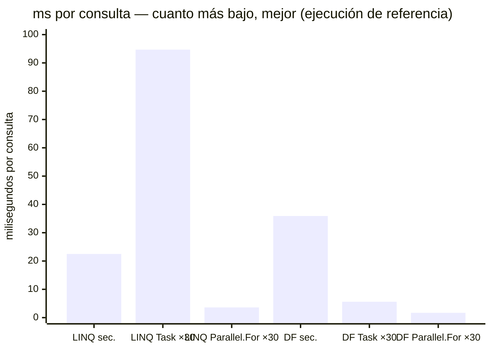
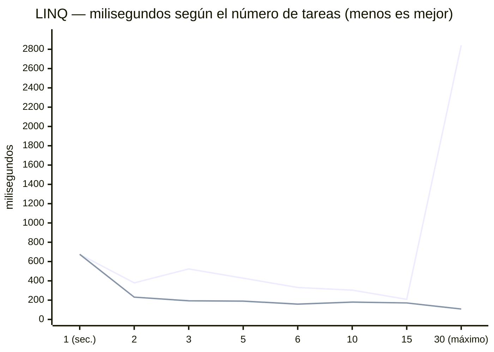
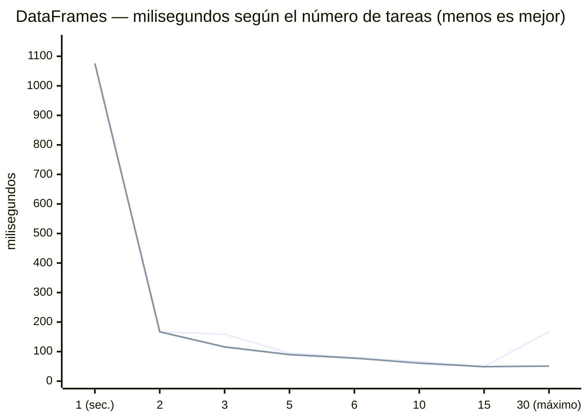
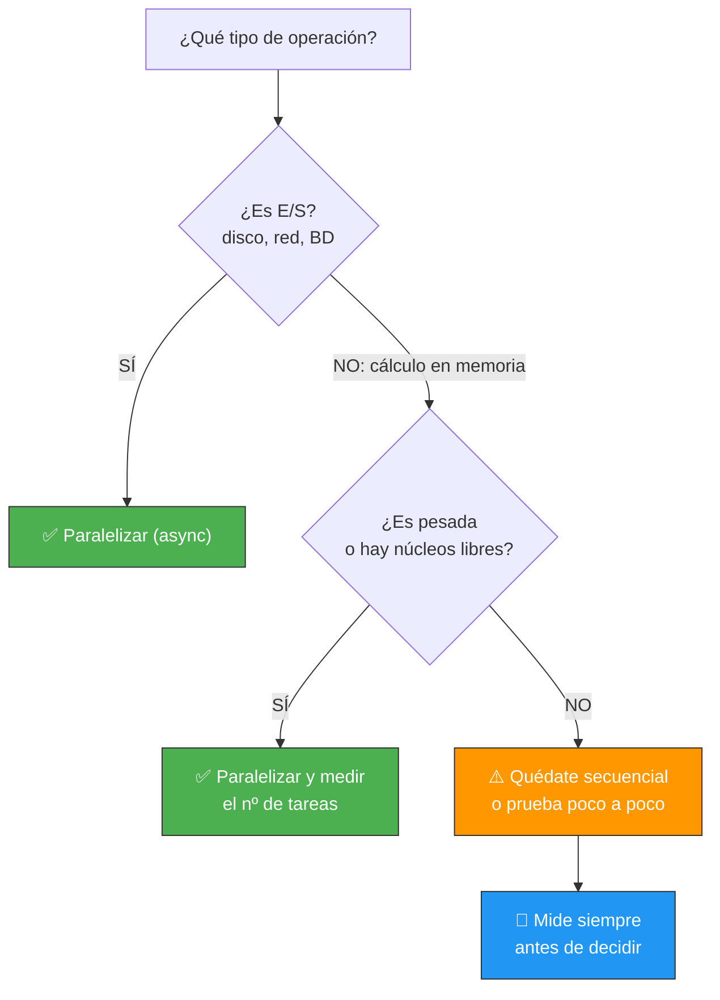

# 09-AccidentesMadrid — E/S paralela y cálculo paralelo (Task.WhenAll y Parallel.For)

Solución de la **práctica 05** de la UD01: analizamos **130.864 accidentes de Madrid** (2024, 2025 y 2026) con las **30 consultas del enunciado**, primero con **LINQ** y luego con **DataFrames**.

Pero esta solución va más allá de responder a las consultas: **mide**. Comparamos la lectura de ficheros (E/S) secuencial y paralela, y el cálculo en memoria con **dos motores de paralelismo** (`Task.WhenAll` y `Parallel.For`), cada uno con **8 variantes de granularidad** (de 1 sola tarea a 30). Al final tienes una pregunta contestada con datos: ***¿merece la pena paralelizar, con qué motor y con cuántas tareas?***

## Índice

- [1. Qué mide esta solución](#1-qué-mide-esta-solución)
- [2. Cómo ejecutarlo](#2-cómo-ejecutarlo)
- [3. La salida real, desde el principio](#3-la-salida-real-desde-el-principio)
- [4. Análisis de los cuatro experimentos](#4-análisis-de-los-cuatro-experimentos)
  - [4.1. E/S: paralelizar SÍ mejora (FASE 1)](#41-es-paralelizar-sí-mejora-fase-1)
  - [4.2. Task.WhenAll sobre cálculo (FASE 2 y 3)](#42-taskwhenall-sobre-cálculo-fase-2-y-3)
  - [4.3. Parallel.For sobre cálculo (FASE 4 y 5)](#43-parallelfor-sobre-cálculo-fase-4-y-5)
  - [4.4. Cara a cara: los dos motores en ×30](#44-cara-a-cara-los-dos-motores-en-30)
- [5. El precio de cada tarea (precio por hilo)](#5-el-precio-de-cada-tarea-precio-por-hilo)
- [6. Task para E/S, Parallel para memoria](#6-task-para-es-parallel-para-memoria)
- [7. ¿Cuántas tareas? La forma de valle](#7-cuántas-tareas-la-forma-de-valle)
- [8. Parallel.For con paquetes exactos (los mismos casos)](#8-parallelfor-con-paquetes-exactos-los-mismos-casos)
- [9. Regla de oro y casuísticas](#9-regla-de-oro-y-casuísticas)
- [10. Los milisegundos importan](#10-los-milisegundos-importan)
- [11. Estructura y tests](#11-estructura-y-tests)

---

## 1. Qué mide esta solución

El programa ejecuta **5 fases** y las cronometra todas:

| Fase | Qué hace | Motor |
|------|----------|-------|
| **FASE 1** | Leer 3 CSV de disco (E/S): secuencial y en paralelo | `Task.WhenAll` (async) |
| **FASE 2** | 30 consultas LINQ: secuencial, ×30 y 6 variantes de lotes | `Task.WhenAll` |
| **FASE 3** | 30 consultas DataFrame: secuencial, ×30 y 6 variantes de lotes | `Task.WhenAll` |
| **FASE 4** | Las mismas 30 consultas LINQ, de 0 a 30 tareas | `Parallel.For` |
| **FASE 5** | Las mismas 30 consultas DataFrame, de 0 a 30 tareas | `Parallel.For` |

**Matriz completa de casos** (lo que se mide, 58 tiempos en total):

| | Secuencial (1 × 30) | ×30 (una tarea por consulta) | Lotes (2, 3, 5, 6, 10 y 15 tareas) |
|---|---|---|---|
| **E/S** — 3 ficheros | ✅ | ✅ (3 tareas) | — |
| **LINQ** + Task.WhenAll | ✅ | ✅ | ✅ 6 variantes |
| **LINQ** + Parallel.For | ✅ | ✅ | ✅ 6 variantes (paquetes) |
| **DataFrame** + Task.WhenAll | ✅ | ✅ | ✅ 6 variantes |
| **DataFrame** + Parallel.For | ✅ | ✅ | ✅ 6 variantes (paquetes) |

- Las **30 consultas** son exactamente las del [enunciado de la práctica 05](../../practicas/05-accidentes-madrid.md): totales, agrupaciones por distrito/tipo/año/sexo/día/mes, filtros de peatones y alcohol, hora punta, comparativas entre años, etc. Están implementadas **dos veces**: en `AccidentesLinqAnalyzer` (LINQ) y en `AccidentesDataFrameAnalyzer` (DataFrames).
- Las variantes de lote **dividen 30 en partes iguales**: 2×15, 3×10, 5×6, 6×5, 10×3 y 15×2 (ni 1 tarea, ni 30).
- **12 tests** (`dotnet test`) verifican las consultas LINQ: conteos, agrupaciones, filtros, PLINQ y casos límite.

> 💡 **Punto de partida:** si te dijera "paralelizar es más rápido", ¿lo creerías sin mirar un cronómetro? Esta solución hace justo eso: **mide antes de afirmar**.

## 2. Cómo ejecutarlo

Requiere los 3 CSV de [datos.madrid.es](https://datos.madrid.es) en `data/` (2024, 2025 y 2026).

```bash
# Ejecutar las 5 fases + resúmenes
dotnet run

# Tests de las consultas LINQ (12 tests: conteos, agrupaciones, filtros, PLINQ y casos límite)
dotnet test

# Con Docker o Podman
docker compose up --build
```

## 3. La salida real, desde el principio

> 📝 **Nota:** esta es la salida completa de **una ejecución real** (ejecución de referencia del profesor), **desde el banner hasta la lección final**. Las líneas de la salida de detalle de las consultas se abrevian con `...` (la salida completa tiene unas 7.400 líneas). En tu máquina los números **cambian**: dependen de los núcleos, de la CPU libre en ese momento y de la carga del sistema. No te aprendas las cifras — **ejecuta y mide**.

```
╔═══════════════════════════════════════════════════════════════╗
║  ANÁLISIS DE ACCIDENTES DE MADRID                            ║
║  E/S Paralela vs Cálculo Paralelo                           ║
╚═══════════════════════════════════════════════════════════════╝

[21:31:09.316] [INF] Thread: ═══ FASE 1: LECTURA DE FICHEROS (E/S) ═══

[21:31:09.326] [INF] Thread: Lectura SECUENCIAL (uno detrás de otro)...
[21:31:09.828] [INF] Thread:   2024: 49340 registros
[21:31:10.357] [INF] Thread:   2025: 51067 registros
[21:31:10.631] [INF] Thread:   2026: 30457 registros
[21:31:10.631] [INF] Thread:   ⏱ Secuencial: 1304 ms

[21:31:10.631] [INF] Thread: Lectura PARALELA (las 3 a la vez)...
[21:31:10.631] [INF] Thread:   3 tareas lanzadas, esperando con Task.WhenAll...
[21:31:11.102] [INF] Thread:   2024: 49340 registros
[21:31:11.102] [INF] Thread:   2025: 51067 registros
[21:31:11.102] [INF] Thread:   2026: 30457 registros
[21:31:11.102] [INF] Thread:   ⏱ Paralelo: 470 ms

[21:31:11.102] [INF] Thread:   TOTAL: 130864 registros combinados
[21:31:11.103] [INF] Thread:   Speedup E/S: 2.77x — "SÍ mejora (la E/S espera: mientras un hilo espera, otro trabaja)"

[21:31:11.103] [INF] Thread: ═══ FASE 2: CONSULTAS LINQ (CÁLCULO EN MEMORIA) ═══

[21:31:11.104] [INF] Thread: LINQ SECUENCIAL...
... (salida de las 30 consultas: total, por distrito, por tipo, por año, peatones, hora punta...) ...
[21:31:11.779] [INF] Thread:   ⏱ LINQ secuencial: 675 ms

[21:31:11.779] [INF] Thread: LINQ PARALELO (Task.WhenAll)...
... (las mismas 30 consultas, cada una en su propia tarea) ...
[21:31:14.620] [INF] Thread:   ⏱ LINQ paralelo: 2841 ms

[21:31:14.621] [INF] Thread:   Speedup LINQ: 0.24x — "NO mejora en esta ejecución (overhead de Task.Run > beneficio)"

[21:31:14.621] [INF] Thread: LINQ POR LOTES (3×10, 10×3, 5×6, 6×5, 2×15, 15×2)...
[21:31:15.145] [INF] Thread:   ⏱ 3 tareas × 10 consultas: 523 ms
[21:31:15.450] [INF] Thread:   ⏱ 10 tareas × 3 consultas: 304 ms
[21:31:15.879] [INF] Thread:   ⏱ 5 tareas × 6 consultas: 428 ms
[21:31:16.212] [INF] Thread:   ⏱ 6 tareas × 5 consultas: 331 ms
[21:31:16.591] [INF] Thread:   ⏱ 2 tareas × 15 consultas: 379 ms
[21:31:16.800] [INF] Thread:   ⏱ 15 tareas × 2 consultas: 208 ms

[21:31:16.800] [INF] Thread: ═══ FASE 3: CONSULTAS DATAFRAMES ═══

[21:31:16.800] [INF] Thread: DataFrames SECUENCIAL...
... (DataFrame de 130.864 filas + salida de las 30 consultas) ...
[21:31:17.877] [INF] Thread:   ⏱ DataFrames secuencial: 1076 ms

[21:31:17.877] [INF] Thread: DataFrames PARALELO...
... (las mismas 30 consultas, cada una en su propia tarea) ...
[21:31:18.045] [INF] Thread:   ⏱ DataFrames paralelo: 168 ms

[21:31:18.045] [INF] Thread:   Speedup DataFrames: 6.40x — "SÍ mejora en esta ejecución (consultas DataFrame pesadas > overhead)"

[21:31:18.045] [INF] Thread: DataFrames POR LOTES (3×10, 10×3, 5×6, 6×5, 2×15, 15×2)...
[21:31:18.204] [INF] Thread:   ⏱ 3 tareas × 10 consultas: 159 ms
[21:31:18.270] [INF] Thread:   ⏱ 10 tareas × 3 consultas: 66 ms
[21:31:18.366] [INF] Thread:   ⏱ 5 tareas × 6 consultas: 95 ms
[21:31:18.446] [INF] Thread:   ⏱ 6 tareas × 5 consultas: 80 ms
[21:31:18.614] [INF] Thread:   ⏱ 2 tareas × 15 consultas: 167 ms
[21:31:18.664] [INF] Thread:   ⏱ 15 tareas × 2 consultas: 49 ms

[21:31:18.664] [INF] Thread: ═══ FASE 4: CONSULTAS LINQ CON MOTOR PARALLEL.FOR ═══

[21:31:18.664] [INF] Thread: LINQ con Parallel.For (una iteración por consulta)...
... (las mismas 30 consultas, una por iteración del bucle) ...
[21:31:18.772] [INF] Thread:   ⏱ LINQ Parallel.For ×30: 108 ms
[21:31:18.773] [INF] Thread:   Speedup LINQ Parallel.For: 6.25x

[21:31:18.773] [INF] Thread: LINQ Parallel.For POR LOTES (3×10, 10×3, 5×6, 6×5, 2×15, 15×2)...
[21:31:18.966] [INF] Thread:   ⏱ 3 paquetes × 10 consultas: 193 ms
[21:31:19.147] [INF] Thread:   ⏱ 10 paquetes × 3 consultas: 180 ms
[21:31:19.338] [INF] Thread:   ⏱ 5 paquetes × 6 consultas: 190 ms
[21:31:19.498] [INF] Thread:   ⏱ 6 paquetes × 5 consultas: 159 ms
[21:31:19.729] [INF] Thread:   ⏱ 2 paquetes × 15 consultas: 231 ms
[21:31:19.901] [INF] Thread:   ⏱ 15 paquetes × 2 consultas: 171 ms

[21:31:19.901] [INF] Thread: ═══ FASE 5: CONSULTAS DATAFRAMES CON MOTOR PARALLEL.FOR ═══

[21:31:19.901] [INF] Thread: DataFrames con Parallel.For (una iteración por consulta)...
... (las mismas 30 consultas, una por iteración del bucle) ...
[21:31:19.952] [INF] Thread:   ⏱ DataFrames Parallel.For ×30: 51 ms
[21:31:19.953] [INF] Thread:   Speedup DataFrames Parallel.For: 21.10x

[21:31:19.953] [INF] Thread: DataFrames Parallel.For POR LOTES (3×10, 10×3, 5×6, 6×5, 2×15, 15×2)...
[21:31:20.069] [INF] Thread:   ⏱ 3 paquetes × 10 consultas: 116 ms
[21:31:20.131] [INF] Thread:   ⏱ 10 paquetes × 3 consultas: 61 ms
[21:31:20.222] [INF] Thread:   ⏱ 5 paquetes × 6 consultas: 90 ms
[21:31:20.300] [INF] Thread:   ⏱ 6 paquetes × 5 consultas: 78 ms
[21:31:20.468] [INF] Thread:   ⏱ 2 paquetes × 15 consultas: 167 ms
[21:31:20.517] [INF] Thread:   ⏱ 15 paquetes × 2 consultas: 49 ms

═══════════════════════════════════════════════════════════════
  RESUMEN: E/S vs CÁLCULO (las 30 consultas, ×30)
═══════════════════════════════════════════════════════════════

  FASE 1 — E/S (lectura de ficheros):
    Secuencial:    1304 ms
    Paralelo:       470 ms
    Speedup:       2,77x  ← SÍ mejora (la E/S espera: mientras un hilo espera, otro trabaja)

  FASE 2/4 — LINQ (cálculo en memoria):
    Secuencial:          675 ms
    Task.WhenAll:       2841 ms  ← 0,24x
    Parallel.For:        108 ms  ← 6,25x

  FASE 3/5 — DataFrames (cálculo en memoria):
    Secuencial:         1076 ms
    Task.WhenAll:        168 ms  ← 6,40x
    Parallel.For:         51 ms  ← 21,10x

═══════════════════════════════════════════════════════════════
  RESUMEN: ¿CUÁNTAS TAREAS PARA LAS 30 CONSULTAS? (ms)
═══════════════════════════════════════════════════════════════

  FASE 2/4 — LINQ
    Variante                    Task.WhenAll    Parallel.For
    Secuencial:   1 × 30              675 ms               —
    Lotes:        2 × 15              379 ms          231 ms
    Lotes:        3 × 10              523 ms          193 ms
    Lotes:        5 × 6               428 ms          190 ms
    Lotes:        6 × 5               331 ms          159 ms
    Lotes:       10 × 3               304 ms          180 ms
    Lotes:       15 × 2               208 ms          171 ms
    Paralelo:    30 × 1              2841 ms          108 ms
    → Mejor con Task.WhenAll: Lotes:       15 × 2 (208 ms)
    → Mejor con Parallel.For: Paralelo:    30 × 1 (108 ms)

  FASE 3/5 — DataFrames
    Variante                    Task.WhenAll    Parallel.For
    Secuencial:   1 × 30             1076 ms               —
    Lotes:        2 × 15              167 ms          167 ms
    Lotes:        3 × 10              159 ms          116 ms
    Lotes:        5 × 6                95 ms           90 ms
    Lotes:        6 × 5                80 ms           78 ms
    Lotes:       10 × 3                66 ms           61 ms
    Lotes:       15 × 2                49 ms           49 ms
    Paralelo:    30 × 1               168 ms           51 ms
    → Mejor con Task.WhenAll: Lotes:       15 × 2 (49 ms)
    → Mejor con Parallel.For: Lotes:       15 × 2 (49 ms)

    → Mejor LINQ global:      Parallel.For · Paralelo:    30 × 1 (108 ms)
    → Mejor DataFrame global: Task.WhenAll · Lotes:       15 × 2 (49 ms)
    (En otra máquina con otros recursos puede ganar otra variante: MIDE).

═══════════════════════════════════════════════════════════════
  LECCIÓN:
  1. E/S → paralelizar SÍ casi siempre mejora (espera disco/red/BD).
  2. Cálculo en memoria → DEPENDE de los recursos libres:
     - Núcleos disponibles + consultas pesadas → SÍ mejora (DataFrames).
     - CPU ocupada o consultas muy baratas     → puede no mejorar (LINQ).
  3. La granularidad IMPORTA con CUALQUIER motor: ni 1 sola tarea
     (secuencial), ni 30 (máximo overhead). El óptimo se BUSCA midiendo.
  4. Task.WhenAll (async) y Parallel.For (bloqueante) comparten el
     ThreadPool y repiten la forma de valle. En ESTA ejecución ganó
     Parallel.For en LINQ y Task.WhenAll en DataFrames:
     el motor también se elige midiendo. En servidor con E/S → async;
     en consola con cálculo puro, los dos sirven.
  NO es siempre peor: MIDE en tu máquina antes de decidir.
═══════════════════════════════════════════════════════════════
```

**Cómo leer esta salida:**

1. **Cada FASE** imprime sus tiempos con la marca `⏱`, incluidos **los 6 tiempos de lote/paquete** (ese es el "tiempo por paquetes": `3 tareas × 10 consultas`, `15 paquetes × 2 consultas`...).
2. **El primer RESUMEN** compara los dos caminos (E/S y cálculo) en el caso ×30.
3. **El segundo RESUMEN** es la **tabla maestra**: las 8 variantes de granularidad con los dos motores en paralelo, y el mejor de cada motor.
4. **La LECCIÓN** resume las 4 conclusiones de la ejecución.

---

## 4. Análisis de los cuatro experimentos

### 4.1. E/S: paralelizar SÍ mejora (FASE 1)

| Método | Tiempo | Speedup |
|--------|--------|---------|
| Secuencial (uno detrás de otro) | 1304 ms | 1.00x |
| Paralelo (3 tareas + `Task.WhenAll`) | 470 ms | **2.77x** |

**Secuencial**: ≈435 + ≈435 + ≈435 = **1304 ms** (cada lectura espera a que termine la anterior)

**Paralelo**: max(≈435, ≈435, ≈435) = **470 ms** (los 3 ficheros se leen a la vez; los 470 ms es el más lento de los tres, más un pelín de coordinación)


📌 Ejemplo real: cuando abres Netflix y la app descarga el logo, el subtítulo y los miniaturas **a la vez**, en vez de uno tras otro: la red es E/S, y E/S esperando en paralelo es tiempo gratis.

**¿Por qué funciona aquí y casi siempre?** Porque la E/S **espera** (disco, red, base de datos). Mientras un hilo espera a que el disco responda, otro hilo puede estar leyendo otro fichero. No hay competencia por la CPU: hay hilos de sobra para esperar.

### 4.2. Task.WhenAll sobre cálculo (FASE 2 y 3)

Aquí ya no leemos de disco: las 130.864 filas están **en memoria** y calculamos. Misma técnica (`Task.Run` × 30 + `WhenAll`), dos tipos de consulta muy distintos:

| Cálculo | Secuencial | Task.WhenAll (×30) | Speedup |
|---------|-----------|--------------------|---------|
| **LINQ** (consultas cortas: `Count`, `Where`...) | 675 ms | 2841 ms | **0,24x** ❌ |
| **DataFrames** (consultas más pesadas) | 1076 ms | 168 ms | **6,40x** ✅ |

- Con **LINQ**, paralelizar con 30 tareas **empeoró el resultado 4 veces**: 675 → 2841 ms. Lanzar 30 tareas de golpe costó más que el trabajo en sí (lo desglosamos en el punto 5).
- Con **DataFrames**, la misma técnica ganó **6,40x**: cada consulta pesa lo suficiente como para que el precio de las tareas pase desapercibido.

> ⚠️ **Matiz importante (y honesto):** esto es **una ejecución**. En otras ejecuciones de esta misma sesión, LINQ ×30 con `Task.WhenAll` dio **908 ms** (0,76x) y en otra **5296 ms**. El resultado de paralelizar cálculo **oscila muchísimo** con el estado de la máquina — por eso la conclusión nunca es "paralelizar está bien/mal", sino **"mide en tu máquina"**.

**¿Qué es "el overhead de Task.Run"?** Cuando lanzas `Task.Run(() => consulta())`, el runtime tiene que: crear la tarea, encolarla en el ThreadPool, asignarle un hilo, ejecutarla, cambiar de contexto cuando hay contención y, al final, coordinar las 30 con `WhenAll`. Todo eso **cuesta tiempo que el secuencial no paga**. Si el trabajo por tarea es grande (DataFrames), ese precio se amortiza; si es minúsculo y encima compites por los mismos núcleos (LINQ ×30), el precio se lleva por delante el resultado.

> 💡 **Analogía:** es como abrir 30 cajeras en un supermercado con unas pocas ventanillas: las 26 de más no atienden a nadie (no hay ventanillas), pero el supermercado les ha pagado el turno igualmente.

### 4.3. Parallel.For sobre cálculo (FASE 4 y 5)

Mismas consultas, otro motor: `Parallel.For(0, 30, i => consultas[i]())`.

| Cálculo | Secuencial | Task.WhenAll (×30) | Parallel.For (×30) |
|---------|-----------|--------------------|--------------------|
| **LINQ** | 675 ms | 2841 ms (0,24x) | **108 ms (6,25x)** |
| **DataFrames** | 1076 ms | 168 ms (6,40x) | **51 ms (21,10x)** |

**¿Por qué Parallel.For aguanta el ×30 mejor que Task.WhenAll?** Porque no monta 30 objetos `Task` de uno en uno: su planificador **reparte las iteraciones en rangos** — hace *lotes implícitos*. Es la diferencia entre contratar 30 trabajadores de golpe (papeleo para cada uno) y darle a 8 trabajadores una lista de 30 tareas: cada uno coge la siguiente cuando se libera.

📌 Ejemplo real: es el motor que usarías en un juego o en un editor de vídeo procesando píxeles por cuadros: cálculo puro, en memoria, sin esperas — `Parallel.For` está pensado exactamente para eso.

### 4.4. Cara a cara: los dos motores en ×30

| | LINQ ×30 | DataFrames ×30 |
|---|---|---|
| Secuencial | 675 ms | 1076 ms |
| **Task.WhenAll** | 2841 ms ❌ | 168 ms ✅ |
| **Parallel.For** | **108 ms ✅** | **51 ms ✅** |
| **Ganador** | **Parallel.For** | **Parallel.For** (21,10x) |

Y en la tabla maestra del RESUMEN aparece además un matiz: el **mejor global de DataFrames** (49 ms) fue `Task.WhenAll` con lote 15 × 2... pero el de LINQ fue `Parallel.For` con 30 × 1. **Cada caso tiene su ganador** → el motor se elige midiendo, igual que la granularidad.

---

## 5. El precio de cada tarea (precio por hilo)

Paralelizar no es gratis: **cada tarea que lanzas tiene un precio** — crear el objeto `Task`, encolarlo en el ThreadPool, asignarle hilo, posibles cambios de contexto y la coordinación final con `WhenAll` o con el reparto de `Parallel.For`.

Podemos **medir ese precio** dividiendo el tiempo total entre las 30 consultas — cuánto cuesta cada consulta en cada modo:

| Consulta de... | Secuencial | Task.WhenAll ×30 | Parallel.For ×30 |
|---|---|---|---|
| **LINQ** | 22,5 ms/consulta | **94,7 ms/consulta** (+72,2) | 3,6 ms/consulta |
| **DataFrames** | 35,9 ms/consulta | 5,6 ms/consulta | 1,7 ms/consulta |



**Cómo se lee la tabla:**

- **LINQ + Task ×30**: en secuencial cada consulta costaba 22,5 ms; con 30 tareas encima **cuesta 94,7 ms**. Ese salto de **+72 ms por consulta** es el precio total de paralelizar mal: el trabajo es el mismo, pero el entorno se encarece (cola del ThreadPool, competencia por núcleos, coordinación). Por eso el speedup fue 0,24x.
- **Parallel.For ×30 sobre el mismo LINQ**: baja a 3,6 ms/consulta — su reparto en rangos evita gran parte de ese peaje.
- **DataFrames**: el trabajo por consulta (35,9 ms) es grande, así que el precio de las tareas (5,6 y 1,7 ms por consulta) se paga sin dolor.

> ⚠️ **El precio NO es una constante.** No hay un "cada tarea cuesta X ms" que puedas memorizar: depende de los núcleos libres, de la carga en ese momento y de la rampa del ThreadPool (el runtime va soltando hilos nuevos poco a poco). En otra ejecución de esta misma sesión, LINQ ×30 con `Task.WhenAll` costó 30,3 ms/consulta (908 ms) en vez de 94,7. **Misma máquina, mismo código, precio muy distinto** → la única forma de conocerlo es cronometrar tu propio caso.

> 💡 **Consejo:** cuando dudes si paralelizar, calcula tú mismo este número: `tiempo_total_paralelo ÷ número_de_tareas` y compáralo con `tiempo_total_secuencial ÷ número_de_tareas`. Si el paralelo no baja, el precio de las tareas se está comiendo el beneficio.

---

## 6. Task para E/S, Parallel para memoria

Es una recomendación muy repetida — ***"async para E/S, Parallel para cálculo"*** — y aquí vemos **por qué** con datos:

| Criterio | `Task.WhenAll` / `async` | `Parallel.For` |
|----------|--------------------------|----------------|
| **Naturaleza** | Asíncrono: **libera el hilo mientras espera** | Bloqueante: el hilo trabaja sin descanso hasta el final |
| **Ideal para** | E/S: disco, red, base de datos (esperas) | Cálculo CPU en memoria |
| **En servidor (API)** | ✅ Escala con muy pocos hilos | ❌ Bloquea hilos del pool mientras calcula |
| **En consola / batch** | ✅ Sirve (medido: 49 ms en DataFrames) | ✅ Sirve (medido: 51 ms en DataFrames) |
| **Límite de trabajos** | Lo calculas tú (bucles de lotes) | `MaxDegreeOfParallelism` nativo |
| **Excepciones** | Las capturas tú | `AggregateException` automática |
| **Por debajo** | **Lo mismo**: el ThreadPool de .NET | **Lo mismo**: el ThreadPool de .NET |

**La clave es una sola idea:**

- **`async` no gana por ser más rápido calculando — gana por no malgastar hilos esperando.** Si tu petición tarda 200 ms esperando a la base de datos, con código síncrono ese hilo está 200 ms tirado; con `async`, el hilo se va a atender otras peticiones y vuelve cuando hay respuesta. Por eso en servidor se usa `async` + `Task.WhenAll`: es la diferencia entre atender 4 peticiones (una por núcleo, bloqueado) y miles con el mismo equipo.
- **`Parallel.For` es bloqueante a propósito: está optimizado para que varios hilos *trabajen* (CPU), no para que esperen.** Te da reparto por particiones y límite de paralelismo sin montar bucles de tareas a mano.

📌 Ejemplo real: Glovo mostrando 50 restaurantes mientras descarga tus datos de sesión → E/S, `async`. Instagram recortando un millón de píxeles de una foto → cálculo CPU, `Parallel` o similares.

> 📝 **Nota:** en **esta consola** los dos funcionan — la tabla maestra muestra 49 ms (Task) y 51 ms (Parallel) en DataFrames. La recomendación "async para E/S" no es porque `Parallel.For` "no sirva para memoria" (sí sirve: fue el mejor de LINQ con 108 ms), sino porque **en un servidor con peticiones esperando, un `Parallel.For` bloqueando hilos es una invitación al cuello de botella**. La distinción importa sobre todo en el diseño de APIs web.

---

## 7. ¿Cuántas tareas? La forma de valle

No basta con decidir "paralelizar": hay que elegir **cuántas tareas** (o cuántos paquetes). Medimos las **8 variantes × 2 motores** para las mismas 30 consultas (ejecución de referencia; tus números dependerán de tu máquina y del momento):

| Variante | LINQ Task.WhenAll | LINQ Parallel.For | DataFrame Task.WhenAll | DataFrame Parallel.For |
|----------|-------------------|-------------------|------------------------|------------------------|
| Secuencial (1 × 30) | 675 ms | — | 1076 ms | — |
| 2 tareas × 15 consultas | 379 ms | 231 ms | 167 ms | 167 ms |
| 3 tareas × 10 consultas | 523 ms | 193 ms | 159 ms | 116 ms |
| 5 tareas × 6 consultas | 428 ms | 190 ms | 95 ms | 90 ms |
| 6 tareas × 5 consultas | 331 ms | 159 ms | 80 ms | 78 ms |
| 10 tareas × 3 consultas | 304 ms | 180 ms | 66 ms | 61 ms |
| **15 tareas × 2 consultas** | **208 ms** | 171 ms | **49 ms** | **49 ms** |
| Paralelo total (30 × 1) | 2841 ms | **108 ms** | 168 ms | 51 ms |

**La forma de valle** (eje X = número de tareas; cuanto más abajo, más rápido). Cada gráfica lleva **dos líneas: un motor cada una**:





> 📝 **Nota sobre el punto "1 (sec.)":** sin paralelismo no hay motor, así que ambas líneas parten del mismo valor: el tiempo secuencial.

**Cómo leer la gráfica (tres zonas):**

- **Izquierda — paralelismo insuficiente (1-3 tareas):** muy pocas tareas para 30 consultas; apenas se aprovechan los núcleos. Se nota enseguida: en LINQ con Task, pasar de 1 a 2 tareas bajó de 675 a 379 ms.
- **Valle — el equilibrio (5-15 tareas):** suficiente paralelismo con poco overhead. Aquí viven los mejores tiempos de Task.WhenAll: **208 ms** en LINQ (15 × 2) y **49 ms** en DataFrames (15 × 2).
- **Derecha — el extremo (30 tareas):** con `Task.WhenAll`, lanzar 30 tareas de golpe **dispara** el tiempo: LINQ subió a **2841 ms, cuatro veces peor que el secuencial (675 ms)**. Con `Parallel.For` la subida casi no se nota en DataFrames (51 ms) y en LINQ **ni siquiera hay subida**: su reparto en rangos hizo el trabajo de los lotes y ganó (108 ms).

**Lectura detallada:**

- **La forma de valle es la norma... pero con excepciones reales:** las cuatro series parten del secuencial y mejoran al repartir; el extremo de 30 tareas es donde los motores se diferencian (Task se dispara, Parallel aguanta). El "valle" clásico —mejor en el medio, peor en los extremos— aparece sobre todo en Task.WhenAll.
- **El mejor punto no es universal:** 15 × 2 ganó en 3 de las 4 columnas, pero en LINQ con Parallel.For ganó 30 × 1. El óptimo depende de la técnica, del motor y de la máquina → **mide**.
- **Diferencias de 1-3 ms son ruido** (49 vs 49, 167 vs 167): no saques conclusiones de milisegundos sueltos; repite la ejecución.

> 💡 **Analogía:** es como montar una cinta de empaquetado: si una sola persona hace todo (secuencial) va lento; si lanzas 30 personas a la vez se estorban y encarecen el montaje; el mejor ritmo lo da el número justo de operarios, cada uno con su paquete de trabajo.

> ⚠️ **Advertencia:** "no paralelizar" no es una regla absoluta para el cálculo, y "paralelizar" no es una garantía: **depende de los recursos libres**. Los DataFrames de esta ejecución ganaron 6,40x y 21,10x con los mismos núcleos que dejaron el LINQ ×30 en 0,24x. **Se decide midiendo, siempre.**

---

## 8. Parallel.For con paquetes exactos (los mismos casos)

La pregunta era: *¿se pueden resolver los mismos casos con `Parallel.For` y merece la pena?* — **sí a las dos cosas**, y ya está implementado en la solución (FASE 4 y FASE 5, mismas 30 consultas):

| Caso | Motor Task.WhenAll (FASE 2/3) | Motor Parallel.For (FASE 4/5) |
|------|-------------------------------|-------------------------------|
| Secuencial (1 × 30) | `for` normal | `for` normal (no aplica) |
| Paralelo (30 × 1) | 30 × `Task.Run` + `WhenAll` | `Parallel.For(0, 30, i => ...)` |
| Lotes (N × 30/N) | N × `Task.Run` con bloque `for` | `Parallel.ForEach(Partitioner.Create(...))` |

```csharp
// Lotes EXACTOS a lo Parallel: N paquetes de 30/N consultas
var opciones = new ParallelOptions { MaxDegreeOfParallelism = numeroTareas };
var paquetes = Partitioner.Create(0, 30, 30 / numeroTareas);
Parallel.ForEach(paquetes, opciones, rango =>
{
    for (var i = rango.Item1; i < rango.Item2; i++)
        consultas[i](accidentes);
});
```

> ⚠️ **Advertencia de examen:** `MaxDegreeOfParallelism = 10` **no** significa "10 grupos fijos de 3 consultas". Significa *como máximo 10 trabajando a la vez*; el resto espera a que alguien se libere (reparto dinámico). Los paquetes fijos los construyes tú con `Partitioner.Create`.

**¿Merece la pena? Los datos de la ejecución de referencia dicen que sí, como alternativa medida:**

- En ×30, `Parallel.For` ganó en **ambos** cálculos: **108 vs 2841 ms** en LINQ y **51 vs 168 ms** en DataFrames.
- En los lotes de LINQ fue mejor en las 6 variantes; en DataFrames los lotes quedaron **casi empatados** (49 vs 49 en 15 × 2, 61 vs 66 en 10 × 3) — diferencias pequeñas con las que no se puede sentenciar un vencedor universal.
- Ojo: **otra ejecución de esta misma sesión dio lo contrario en algún caso** (el mejor global de DataFrames fue `Task.WhenAll`). La lección no cambia de motor: **la forma de valle se repite y el óptimo se busca midiendo**.

**¿Cuándo usar cada uno en producción?**

| Situación | Motor recomendado |
|-----------|-------------------|
| Servidor / API con E-S o BD | `async` + `Task.WhenAll` |
| Consola / batch con cálculo CPU puro | `Parallel.For` (cómodo y legítimo) |
| Dudas | Mide las dos variantes en tu caso |

> 💡 **Conclusión:** elegir motor es como elegir la granularidad: **mide en tu máquina**. Lo que sí es fijo: si hay E/S de por medio, usa `async`.

---

## 9. Regla de oro y casuísticas

| Tipo de operación | ¿Paralelizar? | Ejemplo |
|-------------------|----------------|---------|
| **E/S** (disco, red, BD) | **SÍ** (casi siempre) | Leer ficheros, llamadas HTTP |
| **Cálculo pequeño** (milisegundos por tarea) | **Ojo**: puede empeorar | `Count`, `Where`, `Take` en LINQ |
| **Cálculo grande** o con **núcleos libres** | **SÍ** | `GroupBy` con millones de registros, DataFrames |

**Casuísticas rápidas — ¿qué hago en mi caso?**

| Situación | Qué hacer |
|-----------|-----------|
| API web que consulta una base de datos | `async` + `await` + `Task.WhenAll` — nunca bloquees hilos esperando |
| Batch nocturno en consola, cálculo pesado | `Parallel.For` (o `Task` con lotes) y **busca el mejor nº de tareas midiendo** |
| Consultas muy cortas y nada que esperar | Empieza secuencial; paraleliza solo si las mediciones lo justifican |
| Ya paralelizas pero va peor de lo esperado | Baja el número de tareas (zona de valle) y comprueba el precio por tarea del punto 5 |
| Dudas entre motores o variantes | **Mide**: no adivines, cronometra |



> ⚠️ **Matiz:** tanto el "SÍ" como el "NO" son **puntos de partida**, no sentencias: la propia ejecución de referencia muestra cálculos ganando 21,10x y cálculos perdiendo hasta 0,24x. **La respuesta correcta se obtiene cronometrando, no de memoria.**

## 10. Los milisegundos importan

¿1304 ms vs 470 ms parece poco? Pensemos en el ahorro de **834 ms por ejecución**:

| Escenario | Tiempo secuencial | Tiempo paralelo | Ahorro |
|-----------|-------------------|-----------------|--------|
| 1 ejecución/día | 1304 ms | 470 ms | ~5 minutos al año |
| 10 ejecuciones/día | 1304 ms | 470 ms | ~51 minutos al año |
| 100 ejecuciones/día | 1304 ms | 470 ms | ~8 horas y media al año |
| 1000 ejecuciones/día | 1304 ms | 470 ms | ~3 días y medio al año |

**Un ahorro de 834 ms por ejecución se convierte en horas y días si el proceso se repite.**

> 💡 **En producción:** si tu API lee 3 ficheros por petición y sirve 1000 peticiones por segundo, paralelizar la E/S ahorra unos **834 segundos de E/S por segundo** — es la diferencia entre necesitar más servidores o no.

## 11. Estructura y tests

```
09-AccidentesMadrid/
├── 09-AccidentesMadrid.slnx
├── 09-AccidentesMadrid/
│   ├── Program.cs                    # Fases 1-5 + resúmenes
│   ├── data/
│   │   ├── 2024_Accidentalidad.csv
│   │   ├── 2025_Accidentalidad.csv
│   │   └── 2026_Accidentalidad.csv
│   ├── Models/
│   │   ├── Accidente.cs
│   │   ├── Sexo.cs
│   │   └── TipoPersona.cs
│   ├── Mappers/
│   │   └── AccidenteMapper.cs
│   ├── Repositories/
│   │   ├── IAccidentesRepository.cs
│   │   └── AccidentesRepository.cs
│   ├── Services/
│   │   ├── IAccidentesAnalyzer.cs    # Contrato: secuencial, tareas, lotes, Parallel.For
│   │   ├── AccidentesLinqAnalyzer.cs # 30 consultas LINQ/PLINQ
│   │   └── AccidentesDataFrameAnalyzer.cs
│   └── README.md
├── 09-AccidentesMadrid.Tests/
│   └── AccidenteLinqTests.cs         # 12 tests de las consultas LINQ
├── README.md
├── Dockerfile
├── docker-compose.yml
└── .dockerignore
```

**Tests** (NUnit + FluentAssertions):

```bash
dotnet test
```

- Cobertura: conteos totales, agrupaciones (distrito, tipo, sexo, día, mes), filtros (alcohol, peatones), hora punta, PLINQ (`AsParallel`) y casos límite (listas vacías).
