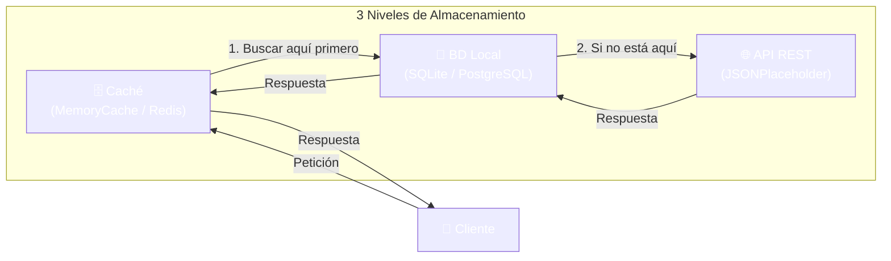
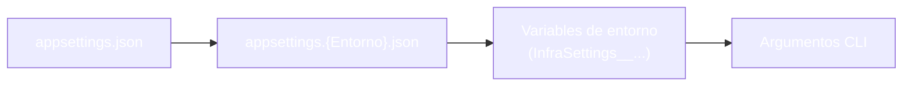
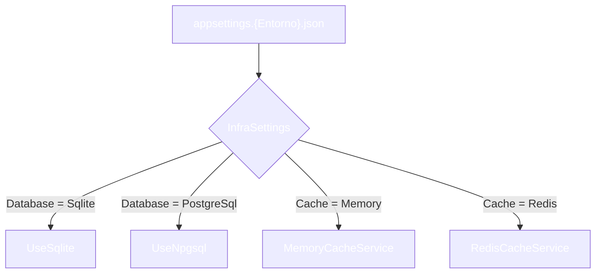

# Ejemplo 10: Repositorio Remoto

Servicio con 3 niveles de almacenamiento: caché, BD local y API remota.

**Novedades de esta versión:** configuración por entornos (Development/Production), Inyección de Dependencias opcional, tests de integración con Testcontainers y despliegue en Docker (app + PostgreSQL + Redis).

## Arquitectura 3 niveles



**Flujo de datos:**

- **Lectura:** caché → BD local → API REST
- **Escritura:** API REST → BD local → caché
- **Sincronización:** cada N segundos, BackgroundService limpia y recarga desde la API

## Configuración por entornos

El entorno se decide con la variable `DOTNET_ENVIRONMENT` y carga el fichero `appsettings.{Entorno}.json` correspondiente:

| Fichero | Entorno | Base de datos | Caché |
|---------|---------|---------------|-------|
| `appsettings.json` | (base) | Valores por defecto | Valores por defecto |
| `appsettings.Development.json` | `Development` | **SQLite** (`users.db`) | **MemoryCache** |
| `appsettings.Production.json` | `Production` | **PostgreSQL** | **Redis** |

**Orden de sobrescritura** (los últimos ganan):



La sección `InfraSettings` es la que decide la infraestructura:

```json
"InfraSettings": {
  "Database": "Sqlite",          // Sqlite | PostgreSql
  "Cache": "Memory",             // Memory | Redis
  "ConnectionStrings": {
    "Sqlite": "Data Source=users.db",
    "PostgreSql": "Host=localhost;...",
    "Redis": "localhost:6379"
  }
}
```

> 💡 **Consejo:** Si no se define `DOTNET_ENVIRONMENT`, la app asume `Development` para que `dotnet run` funcione en clase sin instalar nada. En Docker **siempre** se fuerza `Production`.

## Inyección de dependencias opcional

`Infrastructure/DependenciesProvider.cs` lee `InfraSettings` y registra **una implementación u otra**:



Un valor desconocido lanza `InvalidOperationException` con un mensaje claro: fallar rápido es mejor que fallar en oscuro.

### Ámbitos (scopes) en la DI

- `IUserService` y `IUserRepository` son **scoped** (arrastran un `AppDbContext`).
- `UserSyncBackgroundService` es **singleton**: por eso inyecta `IServiceScopeFactory` y crea un ámbito **en cada ciclo** de sincronización.
- `App` es **scoped** y se resuelve desde un ámbito en `Program.cs`.

> ⚠️ **Advertencia:** Inyectar un servicio scoped directamente en un singleton es un error clásico. En `Production` no salta (no valida scopes), pero en `Development` el contenedor lanza `InvalidOperationException` al arrancar.

## Ciclo de vida del host

Hay tres líneas del proyecto que llaman a código que no es nuestro: `AddHostedService<UserSyncBackgroundService>()`, `host.StartAsync()` y `host.WaitForShutdownAsync()`. Las tres vienen del paquete `Microsoft.Extensions.Hosting`. Lo que se escribe a mano es solo `ExecuteAsync`; el resto es la maquinaria que lo arranca y lo para.

| Parte | Quién la escribe |
|-------|------------------|
| `ExecuteAsync` y su bucle `while` | `Sync/UserSyncBackgroundService.cs` |
| `AddHostedService<UserSyncBackgroundService>()` | `Infrastructure/DependenciesProvider.cs` |
| `await host.StartAsync()` y `await host.WaitForShutdownAsync()` | `Program.cs` |
| Lanzar `ExecuteAsync` en un hilo aparte con `Task.Run` | `BackgroundService.StartAsync`, del framework |
| Escuchar el Ctrl+C y el SIGTERM | `ConsoleLifetime`, del framework |
| Cancelar el `stoppingToken` y esperar el `ExecuteTask` | `Host.StopAsync`, del framework |

**Por qué la demo va antes de `host.StartAsync()`:** `StartAsync` despierta el servicio de sincronización, que vacía y recarga la BD local cada `SyncIntervalSeconds`. Si el host arrancara antes, ese vaciado periódico se cruzaría con las 13 fases de la demostración.

**Por qué se sale con Ctrl+C:** `ConsoleLifetime` capta la señal y dispara `ApplicationStopping`, el token que hace despertar a `WaitForShutdownAsync()`. Este llama a `Host.StopAsync()`, que cancela el `stoppingToken` de cada servicio y espera a que termine su `ExecuteTask`. El `Task.Delay(interval, stoppingToken)` del bucle lanza entonces `OperationCanceledException` y el `while` sale limpio.

> 📝 **Nota:** `host.RunAsync()` es el atajo que hace `StartAsync` + `WaitForShutdownAsync` + `Dispose` en una sola llamada. Aquí van separadas para poder mostrar el mensaje de "Host arrancado" entre la demo y el arranque del servicio.

## Tests

```bash
# Todos (unitarios + integración)
dotnet test

# Solo unitarios (sin Docker)
dotnet test --filter "Category!=Integration"

# Solo integración (requiere Docker en marcha)
dotnet test --filter "Category=Integration"
```

| Carpeta | Tipo | Infraestructura |
|---------|------|-----------------|
| `Tests/Unit/` | Unitarios con **Moq** + FluentAssertions | Ninguna |
| `Tests/Integration/` | **Testcontainers**: PostgreSQL y Redis efímeros | Docker |

Los tests de integración levantan contenedores reales en `OneTimeSetUp` y los destruyen en `OneTimeTearDown`: no necesitas tener PostgreSQL ni Redis instalados.

## Ejecución

### Desarrollo (SQLite + MemoryCache)

```bash
# Opcional: explicitar el entorno (si no, se asume Development)
export DOTNET_ENVIRONMENT=Development   # PowerShell: $env:DOTNET_ENVIRONMENT="Development"

dotnet run
```

### Producción (PostgreSQL + Redis con Docker)

```bash
# Levanta app + PostgreSQL + Redis
docker compose up -d --build

# Ver logs de la app
docker compose logs -f repo-remoto

# Verificar infraestructura (5433 = puerto mapeado en el host)
docker exec -it repositorio-postgres psql -U postgres -d usuarios -c "SELECT COUNT(*) FROM \"Users\";"
docker exec -it repositorio-redis redis-cli ping   # → PONG

# Parar todo
docker compose down

# Parar y borrar también los datos (volumen)
docker compose down -v
```

> 🔧 **Truco:** Dentro de la red de Docker los hostnames son los nombres de los servicios (`postgres`, `redis`), no `localhost`. Por eso el compose inyecta `InfraSettings__ConnectionStrings__PostgreSql` y `...__Redis` como variables de entorno, que sobreescriben el `appsettings.Production.json`.

## Estructura

```
10-RepositorioRemoto/
├── Program.cs                  # Entorno + Top Level Statements
├── appsettings.json            # Config base
├── appsettings.Development.json# SQLite + MemoryCache
├── appsettings.Production.json # PostgreSQL + Redis
├── Models/User.cs              # Modelo de dominio
├── Entity/UserEntity.cs        # Entidad EF Core
├── Dto/                        # Data Transfer Objects
├── Repositories/               # Acceso a datos
├── Services/                   # Lógica de negocio
├── Cache/                      # ICacheService + Memory + Redis
├── Api/                        # Cliente API con Refit
├── Notifications/              # Servicio de notificaciones
├── Sync/                       # Sincronización background
├── Config/                     # AppConfig + InfraSettings
├── Infrastructure/             # DI Provider (opcional por entorno)
└── Errors/                     # Manejo de errores

10-RepositorioRemoto.Tests/
├── Unit/                       # Moq + FluentAssertions
└── Integration/                # Testcontainers (PostgreSQL + Redis)

Dockerfile                      # Multi-etapa (build + tests unitarios + publish)
docker-compose.yml              # app + PostgreSQL + Redis
```

## Tecnologías

| Tecnología | Para qué |
|------------|----------|
| **MemoryCache** | Caché en memoria (Development) |
| **StackExchange.Redis** | Caché Redis (Production) |
| **EF Core + SQLite** | BD local (Development) |
| **EF Core + Npgsql** | PostgreSQL (Production) |
| **Refit** | Cliente HTTP tipado |
| **CSharpFunctionalExtensions** | Manejo de errores con Result |
| **Serilog** | Logging con rolling files |
| **Testcontainers** | Tests de integración con contenedores efímeros |
| **Eventos C#** | Notificaciones de usuarios |

## Comportamiento

1. **Al arrancar:** Sincroniza todos los usuarios desde JSONPlaceholder
2. **Cada N segundos:** BackgroundService limpia y recarga datos (10s en Dev, 60s en Prod)
3. **Operaciones CRUD:** Primero busca en caché, luego BD, luego API
4. **Notificaciones:** Eventos al crear, actualizar o eliminar usuarios
5. **Exportación:** Genera JSON con todos los usuarios
6. **Tras la demo:** el host queda vivo atendiendo el BackgroundService (Ctrl+C para salir)

## Documentación

- `Config/AppConfig.cs`, `Config/InfraSettings.cs` e `Infrastructure/DependenciesProvider.cs` están documentados con XMLDoc
- Los servicios e interfaces tienen documentación en sus definiciones
