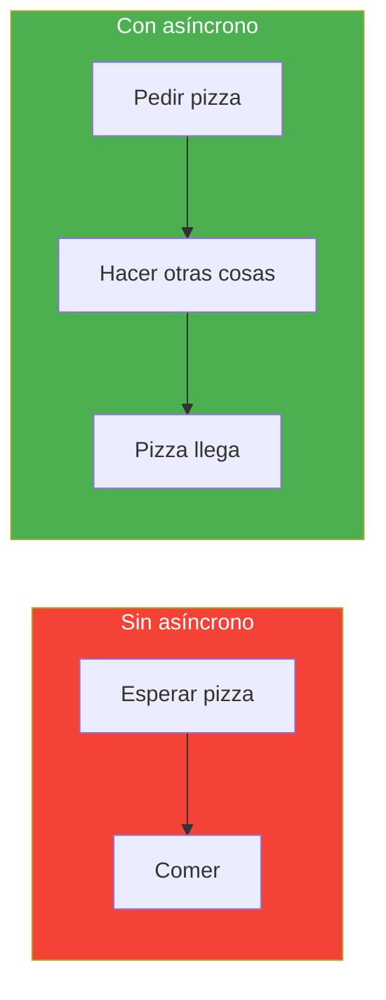
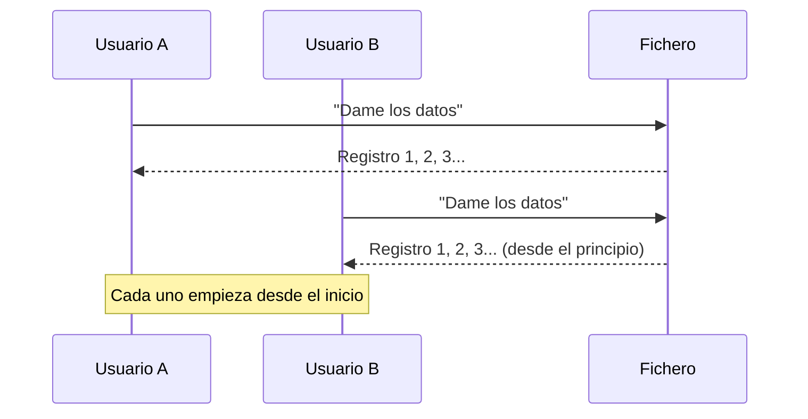
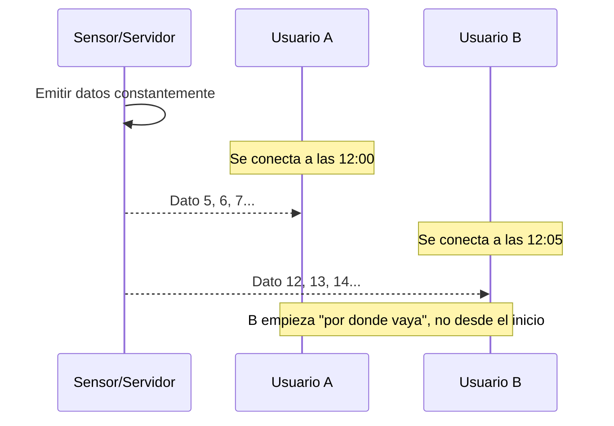
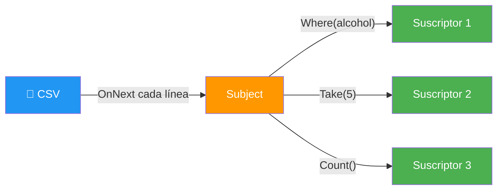

# Ejemplo 13: Programación Asíncrona

Async/Await vs IAsyncEnumerable vs Rx.NET — leyendo el mismo CSV de accidentes de Madrid.

## ¿Qué es la programación asíncrona?

La programación asíncrona permite que el programa **no se bloquee** mientras espera algo (un fichero, una petición HTTP, una consulta a BD). Mientras espera, el programa puede hacer otras cosas.

**Ejemplo cotidiano:** Cuando pides una pizza, no te quedas pegado en la puerta esperando. Haces otras cosas y la pizza llega cuando está lista. Eso es asíncrono.



---

## ¿Qué son los flujos de datos?

Cuando leemos datos (de un fichero, una BD, un sensor), los datos **fluyen** desde el origen hasta donde los procesamos. Hay dos tipos de flujos:

### Flujos Fríos (Cold Flows)

Los datos **no existen hasta que alguien los pide**. Si te conectas al principio, empiezan desde el inicio.

**Analogía:** Un vídeo en YouTube en pausa. Si le das a play, empieza desde el principio. Si hay 3 personas mirando, cada una tiene su propia reproducción.

**Ideal para:** Ficheros, bases de datos, consultas HTTP.



| Tecnología | Tipo | Ejemplo |
|------------|------|---------|
| `IEnumerable<T>` | Frío | `lista.Where(x => x.Activo)` |
| `IAsyncEnumerable<T>` | Frío | `lector.GetRecordsAsync()` con `yield` |
| `Task<T>` | Frío | `httpClient.GetAsync()` |

### Flujos Calientes (Hot Flows)

Los datos **fluyen aunque nadie escuche**. Si te conectas después, te llega **por donde vaya** (no desde el principio).

**Analogía:** Un canal de TV en directo. Si te conectas a las 12:00, ves lo que está emitiendo ahora, no lo que emitieron a las 9:00.

**Ideal para:** Sensores, logs en tiempo real, redes sociales, bolsa, IoT.



| Tecnología | Tipo | Ejemplo |
|------------|------|---------|
| `Subject<T>` | Caliente | `sensor.OnNext(temperatura)` |
| `Observable` | Caliente | `Observable.Interval(TimeSpan.FromSeconds(1))` |
| `IObservable<T>` | Caliente | `eventos.WhenAny()` |

### Diferencia clave

| | Flujos Fríos | Flujos Calientes |
|--|-------------|------------------|
| **¿Cuándo generan datos?** | Cuando alguien los pide | Siempre, tengan o no oyentes |
| **¿Desde dónde empiezan?** | Desde el principio | Desde donde vayas |
| **Ideal para** | Ficheros, BD, HTTP | Sensores, logs, stocks, IoT |
| **Tecnologías** | LINQ, IAsyncEnumerable | Rx.NET (Subject, Observable) |

---

## Las 3 opciones del ejemplo

### 1. Async/Await — `Task<List<T>>`

Lee **TODO** el CSV de golpe, guarda en una lista, y procesa.


**Ventajas:**
- Código simple y legible
- Fácil de entender

**Desventajas:**
- Carga TODO en memoria (si el CSV tiene 1M de registros, usa mucho RAM)

**Cuándo usar:** Datos pequeños/medianos, cuando necesitas toda la lista para procesar.

### 2. IAsyncEnumerable — `yield return`

Lee **línea a línea** con `yield`. Cada registro se devuelve cuando el consumidor lo pide (pull).


**Ventajas:**
- No carga todo en memoria (solo 1 registro a la vez)
- Puedes procesar millones de registros sin llenar RAM

**Desventajas:**
- Solo hay 1 consumidor a la vez (pull)
- Más complejo que Async/Await

**Cuándo usar:** CSV grandes, procesar bajo demanda, cuando no necesitas toda la lista.

> 💡 **Consejo:** IAsyncEnumerable es como leer un libro página a página. No cargas el libro entero en la cabeza — lees una página, la procesas, y pasas a la siguiente.

### 3. Rx.NET — `Observable`

Los datos **fluyen solos** (push). El observable emite datos aunque nadie escuche, y los suscriptores reciben lo que les toca.



**Ventajas:**
- Múltiples suscriptores (cada uno filtra lo que le interesa)
- Filtrado en tiempo real
- Composición de flujos (Where, Take, Merge, CombineLatest...)

**Desventajas:**
- Más complejo de entender
- Overhead de Rx

**Cuándo usar:** Datos en tiempo real (sensores, logs, stocks), cuando necesitas múltiples consumidores.

> 💡 **Consejo:** Rx.NET es como un canal de TV: tú decides qué canales mirar (suscriptores), y cada canal muestra lo que le interesa.

---

## Conceptos clave del código

### CancellationToken — Cancelar un flujo

```csharp
var cts = new CancellationTokenSource();
cts.Cancel(); // Cancelar inmediatamente

await foreach (var registro in repository.GetAllAsyncEnumerable(cts.Token))
{
    // Si se cancela, se lanza OperationCanceledException
}
```

> 💡 **Consejo:** CancellationToken permite detener un flujo largo. Útil cuando el usuario cancela una operación o cuando hay timeout.

### Observable.Create — Crear un observable

```csharp
public IObservable<Accidente> CrearObservable()
{
    return Observable.Create<Accidente>(observer =>
    {
        // Leer línea a línea y emitir
        foreach (var accidente in csv.GetRecords<Accidente>())
        {
            observer.OnNext(accidente); // Emitir registro
        }
        observer.OnCompleted(); // Avisar de que terminó
        return Disposable.Empty;
    });
}
```

### Dispose — Limpiar suscriptores

```csharp
var sub = observable.Subscribe(x => Console.WriteLine(x));

// Cuando ya no necesitas el suscriptor, liberar recursos
sub.Dispose();
```

> ⚠️ **Advertencia:** Si no haces `Dispose`, el suscriptor sigue vivo y puede causar memory leaks.

### TaskCompletionSource — Esperar un observable

```csharp
var tcs = new TaskCompletionSource();
observable.Subscribe(_ => { }, () => tcs.TrySetResult());
await tcs.Task; // Espera a que el observable termine
```

---

## Operadores Rx.NET

| Operador | Qué hace | Ejemplo |
|----------|----------|---------|
| `Where` | Filtra elementos | `.Where(a => a.PositivoAlcohol)` |
| `Take` | Solo los primeros N | `.Take(5)` |
| `Skip` | Salta los primeros N | `.Skip(100)` |
| `Buffer` | Agrupa en lotes de N | `.Buffer(1000)` |
| `Merge` | Mezcla dos observables | `obs1.Merge(obs2)` |
| `Distinct` | Elimina duplicados | `.Select(a => a.Distrito).Distinct()` |
| `OrderBy` | Ordena | `.OrderBy(a => a.Fecha)` |

---

## Comparativa

| | Async/Await | IAsyncEnumerable | Rx.NET |
|--|-------------|------------------|--------|
| **¿Qué hace?** | Carga todo de golpe | Línea a línea (pull) | Línea a línea (push) |
| **Memoria** | Todo en RAM | Solo 1 registro | Solo 1 registro |
| **Control** | Tú pides | Tú pides | Los datos fluyen |
| **Suscriptores** | 1 | 1 | Múltiples |
| **Ideal para** | Datos pequeños | CSV grandes | Tiempo real |
| **Ejemplo real** | Cargar usuarios de BD | Leer log de 1GB | Recibir tweets en directo |

---

## Fichero de Datos

El CSV se descarga de los **datos abiertos del Ayuntamiento de Madrid**:

📥 **URL:** https://datos.madrid.es/dataset/300228-0-accidentes-trafico-detalle/information

Descarga el fichero de 2025 y colócalo en `data/2025_Accidentalidad.csv`.

---

## Ejecución

```bash
dotnet run
```

## Ejemplo de salida

```
=== Ejemplo 13: Programación Asíncrona ===

═══════════════════════════════════════════════════
  1. ASYNC/AWAIT — List<T>
═══════════════════════════════════════════════════
  Lee TODO el CSV de golpe → List<T> → procesa

  Total registros: 46.596
  Con alcohol: 1.197
  Tiempo: 640 ms
  Memoria: toda la lista en RAM

═══════════════════════════════════════════════════
  2. IASYNCENUMERABLE — yield línea a línea
═══════════════════════════════════════════════════
  Lee línea a línea → yield → procesa uno a uno

    Procesadas: 10.000...
    Procesadas: 20.000...
  Total registros: 46.596
  Con alcohol: 1.197
  Tiempo: 340 ms
  Memoria: solo 1 registro a la vez

═══════════════════════════════════════════════════
  3. RX.NET — Observable
═══════════════════════════════════════════════════
  Lee línea a línea → OnNext → suscriptores filtran

    [PRIMERO #1] 2024S035504 — 29/10/2025
    [PRIMERO #2] 2025S000001 — 27/01/2025
    [ALCOHOL] 2025S000010 — Chamartín
    ...
  Total registros: 46.596
  Con alcohol: 1.197
  Tiempo: 421 ms
  Memoria: solo 1 registro a la vez

═══════════════════════════════════════════════════
  COMPARATIVA
═══════════════════════════════════════════════════
  Async/Await:           640 ms  (carga todo)
  IAsyncEnumerable:      340 ms  (línea a línea)
  Rx.NET:                421 ms  (observable)

  ¿Cuándo usar cada uno?
  • Async/Await: datos pequeños, necesitas toda la lista
  • IAsyncEnumerable: CSV grandes, procesar bajo demanda
  • Rx.NET: datos en tiempo real, múltiples consumidores
```

## Estructura

```
13-ProgramacionAsincrona/
├── Program.cs
├── Models/
│   └── Accidente.cs
├── Repositories/
│   ├── AccidentesCsvRepository.cs
│   └── AccidenteMapper.cs
├── Services/
│   ├── AsyncAwaitService.cs
│   ├── AsyncEnumerableService.cs
│   └── ReactiveService.cs
├── data/
│   └── 2025_Accidentalidad.csv
└── 13-ProgramacionAsincrona.csproj
```
