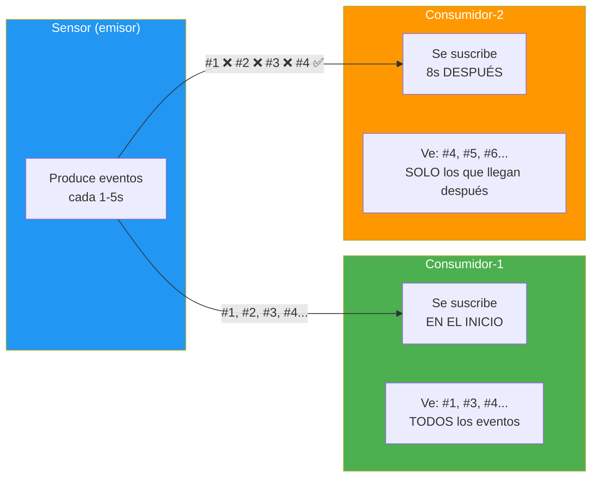

# Ejemplo 14: Programación Reactiva con Rx.NET — Flujo Caliente

Sistema de notificaciones con un sensor que produce eventos y dos consumidores con filtros y tiempos distintos.

## Tecnologías

- .NET 10, C# 14
- System.Reactive (Rx.NET)

## Ejecutar

```bash
dotnet run --project 14-ReactividadRxNet
```

## ¿Qué es un flujo caliente?

Un **flujo caliente** (hot observable) es un stream de datos que emite eventos **independientemente de si hay suscriptores**. Si un observador se conecta tarde, **se pierde lo que ya pasó**. Solo ve los eventos desde el momento en que se suscribe.

**Analogía:** Es como un partido de fútbol en directo. Si llegas a los 20 minutos, te perdiste los primeros 20. No puedes "rebobinar" el partido. Eso es un flujo caliente.

**Flujo frío** (cold observable) sería como ver un partido en diferido: puedes empezar desde el principio aunque lo pongas una hora después.



## Filtros de cada consumidor

| Consumidor | Muestra | Filtra |
|------------|---------|--------|
| **Consumidor-1** | CREATE 🟢, UPDATE 🟡 | ERROR 💥, DELETE 🔴 |
| **Consumidor-2** | CREATE 🟢, DELETE 🔴, ERROR 💥 | UPDATE 🟡 |

- Los errores se muestran en **rojo brillante** con `⚠️ ERROR`
- Cada consumidor cuenta sus propios mensajes (independientes)
- Cuando ambos llegan a 30, el programa termina

## Conceptos clave

- **Subject\<T\>**: Emisor que implementa `IObservable<T>` e `IObserver<T>`
- **Subscribe**: Conecta un observador al flujo
- **Where**: Filtra eventos según una condición
- **Select**: Transforma los elementos del flujo
- **Hot vs Cold**: Hot = emite sin suscriptores; Cold = empieza al suscribirse
