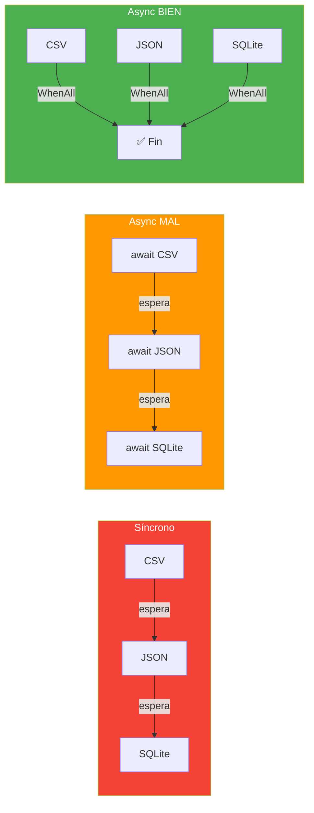
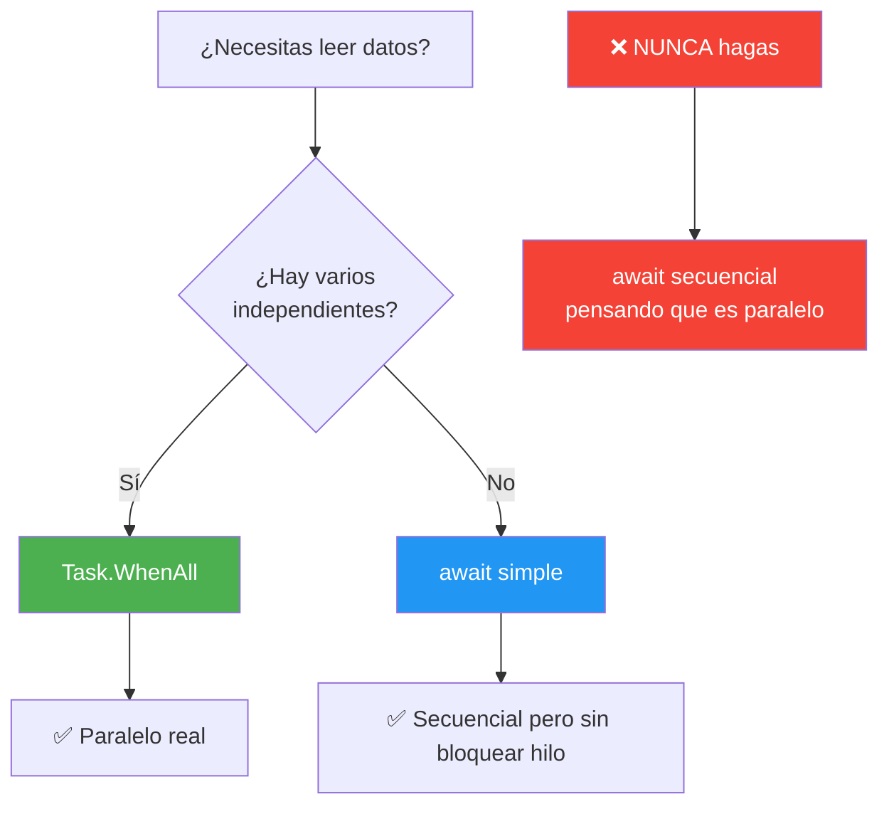

# Ejemplo 15: Sincronía vs Asíncronía — Tres enfoques para leer datos

Comparativa de rendimiento entre lectura síncrona, asíncrona mal usada y asíncrona bien usada.

## Tecnologías

- .NET 10, C# 14
- CsvHelper (lectura CSV)
- Microsoft.EntityFrameworkCore.Sqlite (SQLite con EF Core)
- System.Text.Json (JSON)
- Serilog + Microsoft.Extensions.Logging (logger con Thread ID)

## Ejecutar

```bash
dotnet run --project 15-SincroniaVsAsyncronia
```

## Fuentes de datos

| Fuente | Fichero | Registros | Tamaño aprox. |
|--------|---------|-----------|---------------|
| **CSV** | `productos.csv` | 1000 productos | ~100 KB |
| **JSON** | `productos.json` | 500 productos | ~80 KB |
| **SQLite** | `productos.db` | 100 productos | ~20 KB |

Los datos se generan automáticamente al ejecutar el programa.

## Por qué se ve el Thread ID

El ejemplo usa **Serilog** con `ILogger` para mostrar el **Thread ID** de cada operación. Esto permite ver visualmente cuándo las operaciones se ejecutan en el mismo hilo (secuencial) o en hilos distintos (paralelo).

```
[13:40:01.420] [DBG] Thread:2 📂 CSV Sync: leyendo...     ← Thread 2
[13:40:01.457] [DBG] Thread:2 📂 CSV Sync: fin...          ← Thread 2 (mismo)
[13:40:01.458] [DBG] Thread:2 📄 JSON Sync: leyendo...     ← Thread 2 (mismo)
```

Mismo thread = secuencial. Distintos threads = paralelo.

## Tres enfoques

### 1. Síncrono (secuencial)

```csharp
var csv = LeerCsvSync("productos.csv");       // Bloquea hasta terminar
var json = LeerJsonSync("productos.json");    // Bloquea hasta terminar
var sqlite = LeerSqliteSync("productos.db");  // Bloquea hasta terminar
// Total = tiempo CSV + tiempo JSON + tiempo SQLite
```

**Problema:** El hilo principal está bloqueado mientras espera cada lectura. No puede hacer nada más.

**Analogía:** Es como ir al supermercado: compras leche, esperas en cola. Luego compras pan, esperas en cola. Luego compras huevos, esperas en cola. Total = cola leche + cola pan + cola huevos.

### 2. Asíncrono MAL (await secuencial)

```csharp
var csv = await LeerCsvAsync("productos.csv");       // Espera...
var json = await LeerJsonAsync("productos.json");    // Espera...
var sqlite = await LeerSqliteAsync("productos.db");  // Espera...
// Total ≈ tiempo síncrono (¡NO hay paralelismo!)
```

**Error común:** La gente piensa que `async/await` automáticamente paralleliza. **NO.** Cada `await` pausa la ejecución hasta que termine esa tarea antes de pasar a la siguiente.

**Analogía:** Es como ir al supermercado pero diciendo "voy a buscar la leche... *espero a que vuelva*... ahora voy a buscar el pan... *espero a que vuelva*...". Sigue siendo secuencial.

### 3. Asíncrono BIEN (Task.WhenAll)

```csharp
var tareaCsv = LeerCsvAsync("productos.csv");         // Lanza (NO await)
var tareaJson = LeerJsonAsync("productos.json");       // Lanza (NO await)
var tareaSqlite = LeerSqliteAsync("productos.db");    // Lanza (NO await)

await Task.WhenAll(tareaCsv, tareaJson, tareaSqlite); // Espera las tres

// Total ≈ max(tiempo CSV, tiempo JSON, tiempo SQLite)
```

**Clave:** Lanzamos las tareas **sin await**. Se ejecutan en paralelo. Luego esperamos con `WhenAll`.

**Analogía:** Es como ir al supermercado con 3 amigos: uno va por leche, otro por pan, otro por huevos. Total = el que más tarda de los tres.



## ¿Cuándo usar cada uno?

| Escenario | Enfoque | ¿Por qué? |
|-----------|---------|------------|
| Script simple, pocos datos | Síncrono | Más fácil de leer y debuggear |
| Un solo proceso I/O | Async/await | Libera el hilo mientras espera |
| Varios procesos I/O independientes | Task.WhenAll | Paralelismo real, mucho más rápido |
| Procesos con dependencias | Async/await | Uno necesita el resultado del otro |

## Resumen


